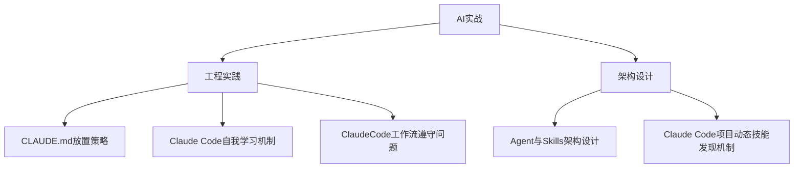

## 目录结构

## 笔记索引

### 工程实践
- [[CLAUDE.md放置策略]] #claude-code
- [[Claude Code自我学习机制]]
- [[ClaudeCode工作流遵守问题]]

### 架构设计
- [[Agent与Skills架构设计]] #Agent
- [[Claude Code项目动态技能发现机制]]

## 概览

- 📂 目录：`AI实战`
- 📝 笔记总数：5
- 📁 子目录数：2
- 📅 生成日期：2026-05-12
