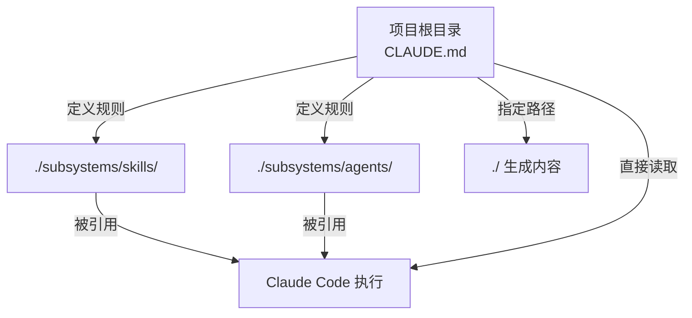
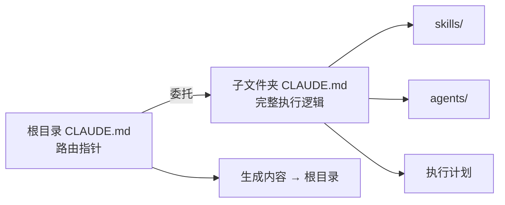
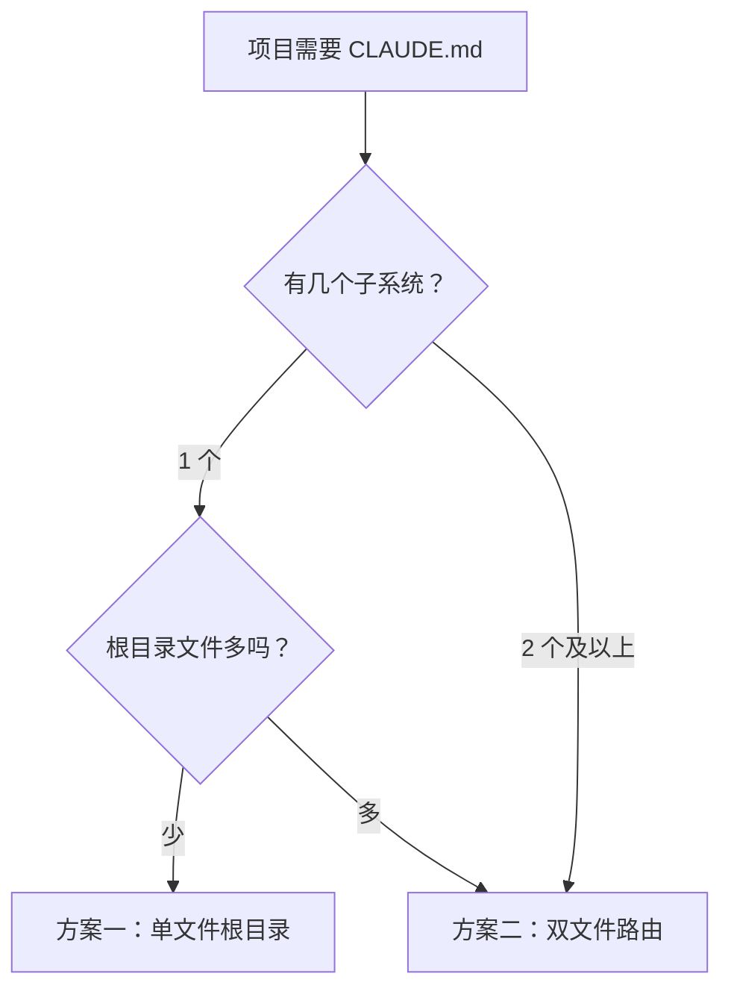

# CLAUDE.md 放置策略：根目录还是子文件夹？

## 背景

在使用 Claude Code 的项目中，经常会遇到这样的目录结构问题：

- 项目根目录下有一个**子文件夹**，里面放着核心逻辑——skills、agents、CLAUDE.md
- 但 Claude 生成的内容（笔记、代码、文档）要输出到**项目根目录**

> [!question] 核心问题
> **需要在项目根目录再放一个 CLAUDE.md 吗？**

[来源: 个人经验]

---

## 过程

### 关键认知

Claude Code 默认读取**当前终端所在目录**下的 `CLAUDE.md` 作为系统级指令。这意味着：

> [!tip] 黄金规则
> 你在哪个目录启动 `claude`，它就去找哪个目录下的 `CLAUDE.md`。

基于这个规则，演化出两种可行的方案。

### 方案一：单文件放根目录（推荐）

直接把 `CLAUDE.md` 放在项目根目录，子文件夹不放。

**运作方式**：
1. Claude 启动时读取根目录的 `CLAUDE.md`
2. 在根目录 `CLAUDE.md` 中定义所有 rules、phases 和路径配置
3. 在指令中注明：skills 和 agent 在 `./subsystems/` 目录下，生成内容输出到根目录

**改造建议**：把子文件夹里的 `CLAUDE.md` 移出来放到根目录，并补充一句：

> 本系统的底层 skill 和 agent 代码存放于 `[子文件夹名]/` 目录下，调用时请引用该目录。



[来源: 个人经验]

### 方案二：双文件路由策略

根目录放一个"入口点" `CLAUDE.md`，子文件夹放完整的执行逻辑。

**职责划分**：
- **子文件夹 CLAUDE.md** — 保持不变，写满具体执行逻辑（rules、phases、全部细节）
- **根目录 CLAUDE.md** — 只写几行作为路由指针

**根目录 CLAUDE.md 示例**：

```markdown
# 项目根指令

本项目包含一个子系统：Study System。
如果用户要求"学习某某知识"、"整理笔记"或执行工作流，
请务必首先读取并严格遵循 `./[子文件夹名]/CLAUDE.md`
中的所有指令和执行计划（Phases）。

生成的笔记内容请放置在根目录下的相应文件夹中。
```

**优势**：
- ==解耦良好==，子系统各自维护自己的规则
- 根目录的 Claude 知道去哪里找详细的"说明书"
- 不会把根目录的配置文件搞得太臃肿



[来源: 个人经验]

---

## 选择建议

### 选方案一（单文件，放根目录）

| 维度 | 说明 |
|------|------|
| 项目规模 | 小 — 中 |
| 子系统数量 | 1 个 |
| 根目录文件量 | 较少 |
| 维护复杂度 | 低 |
| 解耦程度 | 低 |

适合场景：
- **项目功能单一** — 整个项目围绕一个核心任务展开
- **团队规模小** — 1-2 人维护，不需要复杂的职责划分
- **核心逻辑自洽** — skill、agent、规则都属于同一套体系
- **习惯在根目录启动 Claude** — 终端默认打开项目根目录

典型例子：个人博客系统、简单的 CLI 工具项目。

### 选方案二（双文件路由）

| 维度 | 说明 |
|------|------|
| 项目规模 | 中 — 大 |
| 子系统数量 | 2 个及以上 |
| 根目录文件量 | 较多 |
| 维护复杂度 | 中 |
| 解耦程度 | 高 |

适合场景：
- **项目复杂、有多个子系统** — 每个子系统各有各的规则
- **多人/多角色协作** — 不同子系统由不同人维护
- **不想污染根目录** — 根目录已有 README、配置文件等大量文件
- **根目录同时是代码项目** — Claude 只是其中的一个工具

典型例子：Monorepo 项目、既有业务代码又有 AI 工作流的大型仓库。

### 决策流程



[来源: 个人经验]

---

## 踩坑

> [!warning] 坑点 1：两个地方放相同的 CLAUDE.md
> **现象**：在子文件夹和根目录放了内容相同的 CLAUDE.md，更新时总会忘记同步。
> **原因**：维护两份相同的内容，违反了 DRY 原则。
> **解决**：选一个方案并坚持——要么单文件（根目录），要么双文件（路由+详情，内容不重复）。

> [!warning] 坑点 2：没想清楚从哪启动 Claude
> **现象**：CLAUDE.md 放在子文件夹，但习惯在根目录打开终端并输入 `claude`。
> **原因**：Claude 只读取当前目录下的 CLAUDE.md，放错位置等于没放。
> **解决**：先确定自己习惯的启动目录，再决定 CLAUDE.md 放哪。

[来源: 个人经验]

---

## 示例

### 方案二的完整示例

```
my-project/
├── CLAUDE.md              # 路由指针（几行）
├── README.md
├── package.json
├── src/
└── subsystems/
    └── study-system/
        ├── CLAUDE.md       # 完整执行逻辑
        ├── skills/
        └── agents/
```

**根目录 `CLAUDE.md`**：

```markdown
# 项目根指令

本项目包含 Study System 子系统。
涉及学习笔记相关工作流时，请先读取 `./subsystems/study-system/CLAUDE.md`。
```

[来源: 个人经验]

---

## 延伸

### 核心原则

> [!note] 一句话总结
> **不需要两个完全相同的 CLAUDE.md。** 选择哪种方案，取决于你在哪个目录下运行 `claude` 命令。

### 思考题

1. 如果你的团队中，有人习惯在根目录启动 Claude，有人习惯在子文件夹启动，应该怎么做？
2. 方案一的"单文件"策略下，如何优雅地组织大量指令（比如超过 300 行）而不让 CLAUDE.md 变得臃肿？
3. 在 monorepo 中，多个子系统各自有独立的 CLAUDE.md 时，根目录的路由文件该如何设计才能避免冲突？

### 相关笔记

- [[ClaudeCode工作流遵守问题]]
- [[Agent与Skills架构设计]]
- [[Claude Code项目动态技能发现机制]]
- [[Claude Code自我学习机制]]
