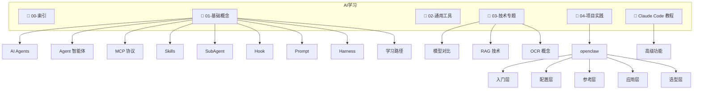

# AI学习 MOC

> [!info] 说明
> 本索引涵盖 AI 学习相关笔记，包括基础概念、通用工具、技术专题、项目实践和 Claude Code 教程。

---

## 目录结构

---

## 笔记索引

### 01-基础概念

- [[AI-Agents]]
- [[Agent智能体]]
- [[Agent Teams智能体团队]]
- [[AI学习路径与技能图谱]]
- [[AI工程师学习路线图]]
- [[2026-AI职业角色与路线图]]
- [[AI工程范式演进-Prompt到Harness]]
- [[AI缓存命中与未命中]]
- [[Harness-Engineering-系统治理工程]]
- [[Hook钩子]]
- [[MCP协议]]
- [[Prompt提示词]]
- [[Prompt-Engineering]]
- [[Skills 是什么]]
- [[SubAgent子代理]]
- [[人工智能重要的六大概念体系]]

#### 上下文工程

- [[AI上下文工程]]

### 02-通用工具

- [[Tailscale使用指南]]

### 03-技术专题

- [[GLM系列模型完整对比]]
- [[OCR概念笔记]]
- [[RAG技术入门指南]]

### 04-项目实践

#### openclaw

##### 入门层

- [[OpenClaw安装教程]]
- [[OpenClaw核心概念]]

##### 配置层

- [[OpenClaw Web控制台局域网访问配置]]
- [[OpenClaw安装后配置指南]]
- [[OpenClaw网关开机自启与HTTPS配置]]

##### 参考层

- [[OpenClaw常用命令速查]]

##### 应用层

- [[OpenClaw多智能体协作指南]]
- [[OpenClaw对接第三方软件指南]]
- [[OpenClaw数字人商业调查]]
- [[OpenClaw本地智能助手搭建指南]]

##### 选型层

- [[OpenClaw与国内仿制品对比]]

### Claude Code 教程

- [[Claude Code CLI 完整参考]]
- [[Claude Code Checkpoints 使用指南]]
- [[Claude Code Hooks 使用指南]]
- [[Claude Code Memory 完整指南]]
- [[Claude Code Slash Commands 完整参考]]
- [[Claude Code Subagents 完整指南]]
- [[Claude Code 会话管理]]
- [[Claude Code 定时任务自动化指南]]
- [[Claude Code 常用功能]]
- [[Claude Code 插件系统使用指南]]
- [[Claude Code 模型与推理设置]]
- [[Claude Code 高级功能]]
- [[Claude MCP 使用指南]]
- [[Claude-Code-多Agent流程设计]]
- [[Subagent 实战练习]]
- [[如何使用Claude code]]

#### 高级功能

- [[CLAUDE.md 使用指南]]
- [[如何编写Skills]]

---

## 概览

- 📂 目录：`AI学习`
- 📝 笔记总数：54
- 📁 子目录数：12
- 📅 生成日期：2026-05-14
- 📅 更新日期：2026-05-14
