# AI学习 MOC

> [!info] 说明
> 本索引涵盖 AI 学习相关笔记，包括基础概念、通用工具、技术专题、项目实践和 Claude Code 教程。

---

## 目录结构

```mermaid
graph TB
    subgraph AI学习
        Index[📁 00-索引]
        Basics[📁 01-基础概念]
        Tools[📁 02-通用工具]
        Topics[📁 03-技术专题]
        Projects[📁 04-项目实践]
        Claude[📁 Claude Code 教程]
    CodexNode[📁 Codex]
    DeepSeek[📁 DeepSeek-Reasonix 教程]
    DeepSeekHarness[📁 DeepSeek-Harness 教程]
    OpenCode[📁 OpenCode]
    end

    Basics --> A1[AI Agents]
    Basics --> A2[Agent 智能体]
    Basics --> A3[MCP 协议]
    Basics --> A4[Skills]
    Basics --> A5[SubAgent]
    Basics --> A6[Hook]
    Basics --> A7[Prompt]
    Basics --> A8[Harness]
    Basics --> A9[学习路径]

    Topics --> T1[模型对比]
    Topics --> T2[RAG 技术]
    Topics --> T3[OCR 概念]

    Projects --> OC[openclaw]
    OC --> OC1[入门层]
    OC --> OC2[配置层]
    OC --> OC3[参考层]
    OC --> OC4[应用层]
    OC --> OC5[选型层]

    Claude --> C1[高级功能]

    CodexNode --> CX1[配置哲学]
    CodexNode --> CX2[核心配置]
    CodexNode --> CX3[Skills 共享]
    CodexNode --> CX4[对照迁移]

    DeepSeek --> DR1[配置详解]

    DeepSeekHarness --> DH1[对照迁移]

    OpenCode --> Opn1[配置迁移实战]
```

---

## 笔记索引

### 01-基础概念

- [[AI-Agents]]
- [[AI-Agent-状态机工作流]]
- [[Agent智能体]]
- [[Agent Teams智能体团队]]
- [[AI学习路径与技能图谱]]
- [[AI工程师学习路线图]]
- [[2026-AI职业角色与路线图]]
- [[AI工程范式演进-Prompt到Harness]]
- [[AI缓存命中与未命中]]
- [[Harness-Engineering-系统治理工程]]
- [[Hook钩子]]
- [[MCP协议]]
- [[Prompt提示词]]
- [[Prompt-Engineering]]
- [[Skills 是什么]]
- [[SubAgent子代理]]
- [[人工智能重要的六大概念体系]]

#### 上下文工程

- [[AI上下文工程]]

### 02-通用工具

- [[Tailscale使用指南]]

### 03-技术专题

- [[Codex手动配置指南]]
- [[GLM系列模型完整对比]]
- [[ModelScope-Ollama-ClaudeCode部署指南]] - 从 ModelScope 拉取 GGUF 模型 → Ollama 本地部署 → Claude Code 免 Key 接入全流程实战指南 #LLM #本地模型 #实战指南
- [[ModelScope 模型文件类型]] - 看懂模型仓库四类文件、四种权重格式（safetensors/bin/GGUF/ONNX）与三条使用路径的概念指南 #LLM #ModelScope #模型文件
- [[OCR概念笔记]]
- [[Ollama 使用指南]] - Ollama 本地大模型入门到上手使用文档 #Ollama #本地LLM
- [[RAG技术入门指南]]

### 04-项目实践

#### openclaw

##### 入门层

- [[OpenClaw安装教程]]
- [[OpenClaw核心概念]]

##### 配置层

- [[OpenClaw Web控制台局域网访问配置]]
- [[OpenClaw安装后配置指南]]
- [[OpenClaw网关开机自启与HTTPS配置]]

##### 参考层

- [[OpenClaw常用命令速查]]

##### 应用层

- [[OpenClaw多智能体协作指南]]
- [[OpenClaw对接第三方软件指南]]
- [[OpenClaw数字人商业调查]]
- [[OpenClaw本地智能助手搭建指南]]

##### 选型层

- [[OpenClaw与国内仿制品对比]]

### Claude Code 教程

- [[Claude Code CLI 完整参考]]
- [[Claude Code Checkpoints 使用指南]]
- [[Claude Code Hooks 使用指南]]
- [[Claude Code Memory 完整指南]]
- [[Claude Code Slash Commands 完整参考]]
- [[Claude Code Subagents 完整指南]]
- [[Claude Code 会话管理]]
- [[Claude Code 定时任务自动化指南]]
- [[Claude Code 常用功能]]
- [[Claude Code 插件系统使用指南]]
- [[Claude Code 模型与推理设置]]
- [[Claude Code 高级功能]]
- [[Claude MCP 使用指南]]
- [[如何使用Claude code]]

#### 高级功能

- [[CLAUDE.md 使用指南]]
- [[Claude Code Dynamic Workflows 使用指南]]
- [[如何编写Skills]]

### Codex 配置体系

> [[Codex MOC]] — 完整目录与导航入口

- [[Codex 配置哲学概览]] — TOML vs JSON、目录结构、五层优先级
- [[config.toml 核心配置]] — sandbox、approval、permissions、profiles
- [[AGENTS.md 分层体系]] — 层级级联、CLAUDE.md fallback、Starlark 规则
- [[Skills 技能系统]] — 创建、注册、渐进加载、跨工具共享
- [[Agents 与 MCP]] — 子代理定义、MCP STDIO/HTTP、审批模式
- [[Hooks 与插件]] — 11 种生命周期事件、插件体系
- [[Codex CLI 与调试]] — 核心命令、环境变量、故障排查
- [[对照表与迁移实战]] — 21 维对照、四步迁移、陷阱与最佳实践
- [[快速参考卡片]] — 路径速查、命令速记、默认值

### OpenCode

> [[OpenCode MOC]] — 完整目录与导航入口

- [[配置和使用 opencode]] — 从 Claude Code 迁移到 opencode 的 9 章实战指南：定位对比、安装认证、配置迁移、命令对照、权限、Provider、MCP、Skills/Agent 与排错

### DeepSeek-Reasonix 教程

> [[DeepSeek-Reasonix MOC]] — 完整目录与导航入口

- [[DeepSeek-Reasonix 使用指南]] — 安装 4 路径、setup 向导、第一个会话
- [[DeepSeek-Reasonix 是什么]] — 定位、前缀缓存原理、与 Claude Code 关系

#### 基础功能

- [[DeepSeek-Reasonix CLI 完整参考]] — 命令全集、启动参数、结构化输出
- [[DeepSeek-Reasonix 会话与交互]] — 会话管理、斜杠命令、/init 记忆
- [[reasonix.toml 配置详解]] — 配置全字段、优先级、API Key 安全
- [[DeepSeek-Reasonix 权限模式指南]] — 6 种权限模式、YOLO、fail-closed

#### 进阶应用

- [[DeepSeek-Reasonix 模型与运行模式]] — profile 三档、effort、双模型协同
- [[DeepSeek-Reasonix MCP 使用指南]] — stdio/HTTP/SSE、CLI 管理
- [[DeepSeek-Reasonix 前缀缓存与成本优化]] — 缓存原理、命中率实测、预算控制
- [[DeepSeek-Reasonix 自动化与 CI]] — run 无头、json 输出、事件遥测

#### 高级功能

- [[DeepSeek-Reasonix ACP 协议指南]] — ACP v1、session 生命周期
- [[DeepSeek-Reasonix 插件与扩展开发]] — Extension Protocol Sidecar
- [[从 Claude Code 迁移到 DeepSeek-Reasonix]] — 命令/概念对照、迁移步骤
- [[DeepSeek-Reasonix 沙箱与安全]] — 沙箱、凭据保护、权限兜底

### DeepSeek-Harness 教程

> [[DeepSeek-Harness MOC]] — 完整目录与导航入口

- [[DeepSeek-Harness 是什么]] — 定位、一切皆插件、与 Claude Code 的关系
- [[DeepSeek-Harness 安装与快速上手]] — 安装三路径、Web UI 首次配置、headless 一次性任务
- [[DeepSeek-Harness 配置体系]] — 多层 YAML 补丁树、Profile/Agent Preset、权限安全、CLI 参考
- [[DeepSeek-Harness 与ClaudeCode对照迁移]] — 概念/成本/性能三表、三选迁移策略
- [[DeepSeek-Harness 常见坑与速查]] — 坑清单、命令速查、V4 协议坑

---

## 概览

- 📂 目录：`AI学习`
- 📝 笔记总数：152
- 📁 子目录数：72
- 📅 生成日期：2026-05-14
- 📅 更新日期：2026-08-13
