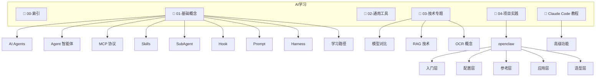

# AI学习 MOC

> [!info] 说明
> 本索引涵盖 AI 学习相关笔记，包括基础概念、通用工具、技术专题、项目实践和 Claude Code 教程。

---

## 目录结构

---

## 笔记索引

### 00-索引

- [[AI学习 MOC]]

### 01-基础概念

- [[AI-Agents]] #ai-agents #llm #autonomous-systems #智能体
- [[Agent智能体]] #ai #基础概念 #agent
- [[Agent Teams智能体团队]] #ai #基础概念 #agent-teams
- [[AI学习路径与技能图谱]] #ai #career #learning-path #skills #roadmap
- [[AI工程师学习路线图]] #ai-engineer #career #roadmap #llm #machine-learning
- [[2026-AI职业角色与路线图]] #ai #career #roadmap #2026
- [[AI工程范式演进-Prompt到Harness]] #ai-engineering #prompt-engineering #context-engineering #harness-engineering #paradigm-evolution
- [[AI缓存命中与未命中]]
- [[Harness-Engineering-系统治理工程]]
- [[Hook钩子]] #ai #基础概念 #hook #自动化
- [[MCP协议]] #ai #基础概念 #mcp
- [[Prompt提示词]] #ai #基础概念 #prompt
- [[Skills 是什么]] #ai #基础概念 #skills
- [[SubAgent子代理]] #ai #基础概念 #subagent
- [[人工智能重要的六大概念体系]] #ai #基础概念 #中级

### 02-通用工具

- [[Tailscale使用指南]] #tailscale #vpn #networking #wireguard

### 03-技术专题

#### AI模型对比

- [[GLM系列模型完整对比]] #glm #ai模型 #模型对比 #智谱AI

#### 根目录

- [[OCR概念笔记]]
- [[RAG技术入门指南]] #ai #RAG #检索增强生成 #知识库

### 04-项目实践

#### openclaw

##### 入门层

- [[OpenClaw安装教程]]
- [[OpenClaw核心概念]] #openclaw #gateway #架构 #概念

##### 配置层

- [[OpenClaw Web控制台局域网访问配置]] #openclaw #web #局域网 #control-ui #cors
- [[OpenClaw安装后配置指南]] #openclaw #配置 #终端 #安装
- [[OpenClaw网关开机自启与HTTPS配置]] #openclaw #daemon #systemd #tailscale #https #开机自启

##### 参考层

- [[OpenClaw常用命令速查]] #openclaw #命令 #速查 #cli

##### 应用层

- [[OpenClaw多智能体协作指南]] #openclaw #multi-agent #协作 #团队 #编排
- [[OpenClaw对接第三方软件指南]] #openclaw #集成 #plugins #skills #mcp
- [[OpenClaw本地智能助手搭建指南]] #openclaw #企业文档 #知识库 #RAG #智能助手 #飞书
- [[OpenClaw数字人商业调查]]

##### 选型层

- [[OpenClaw与国内仿制品对比]] #openclaw #企业选型 #工具对比 #ai-agent #国内替代品

### Claude Code 教程

- [[Claude Code Checkpoints 使用指南]] #ai #claude-code #checkpoints #session-management
- [[Claude Code CLI 完整参考]] #ai #工具使用 #cli #claude-code
- [[Claude Code Hooks 使用指南]] #claude #ai #工具使用 #hook #自动化
- [[Claude Code Memory 完整指南]] #claude #ai #工具使用 #memory #claude-md #持久化上下文
- [[Claude Code Slash Commands 完整参考]] #claude #ai #工具使用 #斜杠命令 #slash-commands
- [[Claude Code Subagents 完整指南]] #claude #ai #工具使用 #subagents #代理 #任务委托
- [[Claude Code 会话管理]] #claude #ai #工具使用
- [[Claude Code 定时任务自动化指南]] #claude-code #自动化 #定时任务 #launchd #hooks #调度 #macos #loop
- [[Claude Code 常用功能]] #claude #ai #工具使用
- [[Claude Code 插件系统使用指南]] #ai #进阶应用 #插件
- [[Claude Code 模型与推理设置]] #claude #ai #工具使用 #模型配置
- [[Claude Code 高级功能]] #claude #ai #进阶应用 #高级功能
- [[Claude MCP 使用指南]] #ai #进阶应用
- [[Claude-Code-多Agent流程设计]] #Claude-Code #多Agent #AI工作流 #Agent协作
- [[Subagent 实战练习]] #ai #高级应用 #练习
- [[如何使用Claude code]] #ai #工具使用
- [[OpenClaw MOC]]

#### 高级功能

- [[CLAUDE.md 使用指南]] #claude #ai #进阶应用 #配置
- [[如何编写Skills]] #ai #进阶应用

---

## 概览

- 📂 目录：`AI学习`
- 📝 笔记总数：50
- 📁 子目录数：12
- 📅 生成日期：2026-05-14
