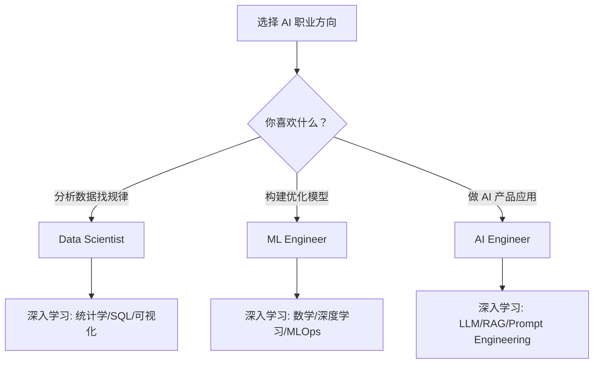
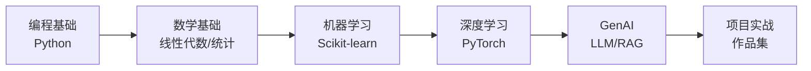

# 2026 AI职业角色与路线图

> [!info] 概述
> **一句话定义**：基于 CampusX 2026 AI Roadmap 的完整学习指南，帮助你理解 AI 领域的职业角色并规划学习路径。
> **通俗比喻**：就像导航软件规划路线一样，这个路线图帮你从 AI 小白到达 AI 工程师的终点，避开常见的弯路和坑。

## 核心概念

### 为什么大多数人学 AI 失败

> [!warning] 常见失败原因
> 1. **追求太多工具**：试图学习每一个新框架，却没有建立扎实基础
> 2. **缺乏清晰路径**：没有系统化的学学习计划，东学一点西学一点
> 3. **只看不练**：看了无数教程，动手写的代码却很少
> 4. **忽视基础**：跳过数学和编程基础，直接学深度学习

### 路线图核心理念

> [!tip] 学习原则
> - **聚焦基础**：与其追赶每个新工具，不如建立强大的基本功
> - **清晰路径**：循序渐进，每一步都有明确目标
> - **项目驱动**：边学边做，每个阶段都有可展示的作品

## AI 职业角色详解

### 三大核心角色

| 角色                 | 核心焦点  | 主要技能                           | 典型工作             |
| :----------------- | :---- | :----------------------------- | :--------------- |
| **Data Scientist** | 数据洞察  | SQL、统计、可视化、Pandas              | 数据分析、A/B 测试、报表   |
| **ML Engineer**    | 模型构建  | PyTorch、算法、MLOps               | 训练模型、优化性能、部署     |
| **AI Engineer**    | AI 应用 | LLM API、RAG、Prompt Engineering | 构建 AI 产品、集成预训练模型 |

### 角色选择指南

> [!info] 📚 来源
> - [roadmap.sh AI Data Scientist](https://roadmap.sh/ai-data-scientist)
> - [roadmap.sh AI Engineer](https://roadmap.sh/ai-engineer)

## 2026 AI 学习路线图

### 完整学习路径（3小时视频概要）

> [!abstract] CampusX 2026 AI Roadmap
> 来源：[YouTube - CampusX](https://www.youtube.com/watch?v=99KPe5hIfnE)

| 时间 | 章节 | 核心内容 |
|:-----|:-----|:--------|
| 00:00 | 介绍 | 路线图目标与学习方法 |
| 03:40 | 失败原因 | 为什么大多数人学 AI 失败 |
| 08:20 | 路线结构 | 端到端学习计划 |
| 15:10 | 编程基础 | AI 所需的编程技能 |
| 28:40 | Python 工具 | Python 和 AI 开发工具 |
| 45:30 | 数学基础 | 线性代数、统计、概率 |
| 1:05:20 | 机器学习 | ML 基础与算法 |
| 1:28:30 | 深度学习 | 神经网络概念 |
| 1:50:40 | NLP/Transformers | 自然语言处理 |
| 2:07:30 | GenAI/LLM | 生成式 AI 与大语言模型 |
| 2:27:00 | AI 工具框架 | 开发栈与工具链 |
| 2:46:30 | 项目实战 | 构建作品集 |
| 3:02:30 | 职业规划 | 成为 AI 工程师的路径 |

### 配套资源

> [!tip] 官方路线图
> [roadmap.sh AI Roadmap 2026](https://roadmap.sh/r/ai-roadmap-for-2026---final-draft)

## 2026 年核心 AI 技能

### 必备技能清单

| 技能 | 重要程度 | 说明 |
|:-----|:--------|:-----|
| **Prompt Engineering** | ⭐⭐⭐⭐⭐ | 与 LLM 高效沟通的能力 |
| **Python 编程** | ⭐⭐⭐⭐⭐ | AI 开发的核心语言 |
| **数据分析** | ⭐⭐⭐⭐ | 用 AI 加速数据处理 |
| **RAG 系统** | ⭐⭐⭐⭐ | 检索增强生成技术 |
| **AI 自动化** | ⭐⭐⭐ | 设计 AI 工作流 |
| **AI 伦理** | ⭐⭐⭐ | 负责任的 AI 使用 |

### 技能优先级

**P0 - 必须掌握**：
- Python（类型提示、异步编程）
- LLM API 调用（OpenAI、Anthropic）
- Prompt Engineering 基础
- RAG 系统构建

**P1 - 应该掌握**：
- LangChain / LlamaIndex
- 向量数据库（Pinecone、Chroma）
- MLOps 基础

**P2 - 加分项**：
- 模型微调（LoRA、QLoRA）
- AI Agent 开发
- 多模态应用

> [!info] 📚 来源
> - [MySkillMaps - AI Skills 2026](https://www.myskillmaps.com/top-ai-skills-to-learn-in-2026-to-stay-ahead-in-the-future-job-market/)

## 与其他概念的关系

| 概念 | 关系 | 说明 |
|:-----|:-----|:-----|
| [[AI工程师学习路线图]] | 详细版 | 8 个月完整学习计划 |
| [[AI学习路径与技能图谱]] | 实践版 | 14 周快速学习路径 |
| [[Prompt提示词]] | 基础技能 | AI 工程师核心能力 |
| [[RAG技术入门指南]] | 核心技术 | 检索增强生成 |
| [[AI-Agents]] | 进阶方向 | AI 智能体开发 |
| [[MCP协议]] | 工具集成 | 模型上下文协议 |

## 最佳实践

### 学习建议

1. **不要追新工具**：基础比框架更重要
2. **项目驱动学习**：每周完成一个小项目
3. **建立作品集**：GitHub 上展示你的代码
4. **加入社区**：Discord、Reddit 与同行交流

### 推荐学习顺序

## 常见问题

### Q1: Data Scientist vs ML Engineer vs AI Engineer 怎么选？

> [!note] 选择建议
> - **喜欢数据分析、找规律** → Data Scientist
> - **喜欢构建模型、优化算法** → ML Engineer
> - **喜欢做产品、用 AI 解决实际问题** → AI Engineer（2026 年最热门）

### Q2: 需要数学很好吗？

> [!note] 回答
> 基础数学即可。AI Engineer 更侧重应用，理解线性代数、概率统计的基本概念足够。

### Q3: 零基础需要多长时间？

> [!note] 时间参考
> - **全职学习**：3-6 个月入门
> - **兼职学习**：6-12 个月入门
> - 关键是持续投入，每周至少 10-15 小时

## 参考资料

### 官方路线图
- [roadmap.sh AI Roadmap 2026](https://roadmap.sh/r/ai-roadmap-for-2026---final-draft) - CampusX 推荐的交互式路线图
- [roadmap.sh AI Data Scientist](https://roadmap.sh/ai-data-scientist) - 数据科学家路线图
- [roadmap.sh AI Engineer](https://roadmap.sh/ai-engineer) - AI 工程师路线图

### 视频教程
- [CampusX - 2026 AI Career Roadmap](https://www.youtube.com/watch?v=99KPe5hIfnE) - 本笔记主要来源

### 框架文档
- [PyTorch Tutorials](https://pytorch.org/tutorials/) - PyTorch 官方教程
- [LangChain Tutorial 2026](https://blog.jetbrains.com/pycharm/2026/02/langchain-tutorial-2026/) - JetBrains 教程

### 进阶阅读
- [Towards Data Science - AI Career 2026](https://towardsdatascience.com/a-realistic-roadmap-to-start-an-ai-career-in-2026/) - 实用职业建议

## 个人笔记

> [!personal] 💡 我的理解与感悟
>
> ### 目标角色
> - [ ] Data Scientist
> - [ ] ML Engineer
> - [ ] AI Engineer
>
> ### 当前阶段
> - [ ] 编程基础
> - [ ] 数学基础
> - [ ] 机器学习
> - [ ] 深度学习
> - [ ] GenAI/LLM
>
> ### 学习计划
> - 目标完成时间：
> - 每周投入时间：
>
> ### 踩坑记录
> （此处记录学习过程中遇到的问题和解决方案）
