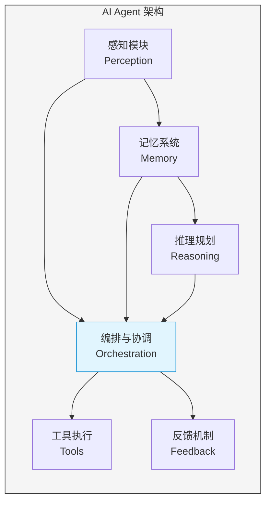
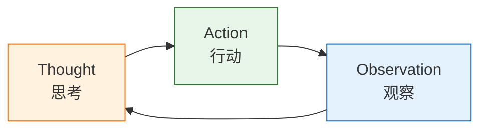

# AI Agents 详解

> [!info] 概述
> **一句话定义**：AI Agent 是能够自主感知��境、推理决策、执行任务并与环境交互的智能系统。
>
> **通俗比喻**：如果 LLM 是一个只会说话的顾问，那么 AI Agent 就是一个能帮你实际办事的助理——不仅会给出建议，还会拿起电话、打开电脑、操作软件，真正把事情做完。

## 核心概念

### 是什么

AI Agent（人工智能代理）是一种具有**自主性**的智能系统。它不仅仅是处理文本的工具，而是能够：

- **感知**环境中的信息（文本、图像、音频等）
- **推理**并做出决策
- **执行**具体任务
- **与环境交互**，获取反馈并调整行为

来源：[AI Agents, Clearly Explained](https://www.youtube.com/watch?v=czYH9kHKn0o)

### 为什么需要

传统的 AI 工具（如 LLM）是**被动**的——你问什么，它答什么。但在实际工作中，我们需要的不仅仅是答案，而是**结果**。

| 对比维度 | LLM | AI Agent |
|:---------|:-----|:----------|
| 核心能力 | 文本生成与理解 | 自主决策 + 工具使用 |
| 交互模式 | 被动响应 | 主动执行 |
| 输出形式 | 文字/代码 | 实际行动结果 |
| 适用场景 | 单一任务咨询 | 复杂项目全流程 |

> [!tip] 一句话总结
> LLM 会说话，AI Agent 会做事。

> [!success] 价值主张
> 传统 AI 让你在单个任务上更快，AI Agents 让你在整个项目上更快。

来源：[AI Agents, Clearly Explained](https://www.youtube.com/watch?v=czYH9kHKn0o), [知乎专栏](https://zhuanlan.zhihu.com/p/698141453)

### 通俗理解

> [!example] 比喻：装修房子
>
> - **LLM** 就像一个**装修顾问**——你可以问它"选什么颜色"、"怎么设计布局"，它会给你很多专业建议，但它不会拿起刷子帮你刷墙。
> - **AI Agent** 就像一个**装修队长**——它不仅能给建议，还会联系供应商买材料、安排工人施工、监督进度、处理突发问题，直到房子装修完成。

> [!example] 示例：竞品分析任务
>
> **用户需求**：帮我分析这周的竞品动态，并发送邮件给团队
>
> **LLM 模式**：
> 1. 用户需要手动收集竞品信息
> 2. 用户把信息发给 LLM
> 3. LLM 生成分析报告
> 4. 用户自己发送邮件
>
> **AI Agent 模式**：
> 1. Agent 自动搜索竞品最新动态
> 2. Agent 分析信息并生成报告
> 3. Agent 自动调用邮件 API 发送给团队
> 4. Agent 反馈执行结果

来源：[AI Agents, Clearly Explained](https://www.youtube.com/watch?v=czYH9kHKn0o)

---

## 技术细节

### 两大核心能力

AI Agent 区别于普通 AI 的两大核心能力：

1. **自主决策能力（Autonomous Decision-Making）**
   - 能够根据目标自主规划步骤
   - 在执行过程中动态调整策略
   - 具备自我反思和纠错能力

2. **自主工具使用能力（Autonomous Tool Utilization）**
   - 识别何时需要使用工具
   - 选择合适的工具
   - 正确调用并解析工具返回结果

来源：[AI Agents, Clearly Explained](https://www.youtube.com/watch?v=czYH9kHKn0o)

### 核心组件架构

AI Agent 由多个核心组件构成，协同完成复杂任务：



#### 1. 规划能力（Planning）

规划是 Agent 的"大脑"，负责将复杂目标分解为可执行步骤：

- **思维链推理（Chain-of-Thought）**：逐步推理，展示思考过程
- **任务分解（Task Decomposition）**：将大目标拆解为小任务
- **自我反思（Self-Reflection）**：评估执行结果，调整策略

来源：[Prompt Engineering Guide](https://www.promptingguide.ai/agents/components)

#### 2. 记忆系统（Memory）

记忆系统让 Agent 能够"记住"信息，实现连贯交互：

| 类型 | 描述 | 实现方式 |
|:------|:------|:---------|
| **短期记忆** | 当前对话上下文 | Context Window（上下文窗口） |
| **长期记忆** | 跨会话的持久化信息 | 向量数据库（Vector Store） |

来源：[Prompt Engineering Guide](https://www.promptingguide.ai/agents/components)

#### 3. 推理能力（Reasoning）

**ReAct 框架**（Reasoning + Acting）是 Agent 推理的核心范式：



这种循环让 Agent 能够边思考边行动，根据观察结果动态调整下一步。

来源：[Prompt Engineering Guide](https://www.promptingguide.ai/agents/components)

#### 4. 工具使用（Tool Utilization）

Agent 可以调用各种工具扩展能力边界：

| 工具类型 | 用途 | 示例 |
|:---------|:------|:------|
| 代码解释器 | 执行代码、数据分析 | Python REPL |
| 网络搜索 | 获取实时信息 | Google Search API |
| 计算器 | 精确数学运算 | Wolfram Alpha |
| API 调用 | 操作外部系统 | 邮件、数据库、CRM |

来源：[Prompt Engineering Guide](https://www.promptingguide.ai/agents/components)

#### 5. 感知模块（Perception）

处理多模态输入，让 Agent 能够"看"和"听"：

- 文本处理（自然语言理解）
- 图像理解（计算机视觉）
- 音频处理（语音识别）
- 结构化数据解析

来源：[IBM - Components of AI Agents](https://www.ibm.com/think/topics/components-of-ai-agents)

#### 6. 编排与协调（Orchestration）

协调多个组件和子任务，确保整体流程顺畅：

- 任务调度与优先级管理
- 资源分配
- 异常处理
- 多 Agent 协作

来源：[Glean - AI Agent Architecture](https://www.glean.com/blog/7-core-components-of-an-ai-agent-architecture-explained)

#### 7. 反馈与可观测性（Feedback）

建立人机协同机制，确保 Agent 行为可控：

- **人机协同（Human-in-the-Loop）**：关键决策需要人工确认
- **自我评估**：Agent 评估自身输出质量
- **可观测性**：日志、监控、决策追踪

来源：[Glean - AI Agent Architecture](https://www.glean.com/blog/7-core-components-of-an-ai-agent-architecture-explained)

### 企业级 Agent 架构

企业环境中的 Agent 需要额外的安全和可观测性保障：

> [!warning] 安全机制
>
> | 机制 | 说明 |
> |:------|:------|
> | **沙箱隔离** | Agent 在隔离环境中执行，防止影响生产系统 |
> | **最小权限原则** | 仅授予完成任务所需的最小权限 |
> | **人机协同确认** | 高风险操作需人工审批 |

> [!note] 可观测性
> - **日志记录**：记录所有操作和决策
> - **性能监控**：追踪响应时间、成功率
> - **决策追踪**：可追溯每一步决策的依据

来源：[Glean - AI Agent Architecture](https://www.glean.com/blog/7-core-components-of-an-ai-agent-architecture-explained)

### Agent 类型分类

根据能力复杂度，Agent 可分为多个层次：

| 类型 | 特点 | 能力层级 |
|:------|:------|:---------|
| **反应式 Agent（Reactive Agent）** | 最基础，直接根据输入反应 | 无记忆，即时响应 |
| **基于模型的反射 Agent（Model-Based Reflex Agent）** | 具有内部状态模型 | 能追踪环境状态 |
| **主动认知 Agent（Goal-Based Agent）** | 具备规划能力 | 主动采取行动达成目标 |
| **指挥 Agent（Coordinator Agent）** | 协调其他 Agent 和资源 | 多 Agent 协作 |

来源：[IBM - Components of AI Agents](https://www.ibm.com/think/topics/components-of-ai-agents)

---

## 主流框架与工具

### LangGraph

**LangChain 官方编排框架**，专为构建有状态、多角色应用设计：

- **人机协同**：支持人工介入关键决策点
- **持久化记忆**：跨会话保持状态
- **流式传输**：实时输出执行过程

```python
# LangGraph 示例概念
from langgraph import StateGraph

workflow = StateGraph(AgentState)
workflow.add_node("plan", plan_node)
workflow.add_node("execute", execute_node)
workflow.add_edge("plan", "execute")
```

来源：[LangGraph 官网](https://www.langchain.com/langgraph)

### CrewAI

**多 Agent 协作 Python 平台**，让多个 Agent 组成团队完成复杂任务：

- **角色定义**：每个 Agent 有明确的角色和职责
- **Crews 协作**：多个 Agent 组成团队协同工作
- **任务分配**：自动分配和协调任务

```python
# CrewAI 示例概念
from crewai import Agent, Task, Crew

researcher = Agent(role="研究员", goal="收集信息")
writer = Agent(role="撰写者", goal="撰写报告")

crew = Crew(agents=[researcher, writer], tasks=[...])
crew.kickoff()
```

来源：[CrewAI 官方文档](https://docs.crewai.com/)

### AutoGPT

**实验性自主 Agent 框架**，探索 Agent 的完全自主能力：

- **自主规划**：自己制定计划
- **自主执行**：无需人工干预
- **自我迭代**：根据结果自我改进

> [!warning] 注意
> AutoGPT 属于实验性项目，生产环境使用需谨慎评估。

来源：[AutoGPT GitHub](https://github.com/significant-gravitas/autogpt)

---

## 与其他概念的关系

| 概念 | 关系 |
|:------|:------|
| [[LLM]] | AI Agent 的"大脑"，提供推理和语言理解能力 |
| [[Prompt-Engineering]] | 设计 Agent 的指令和提示词 |
| [[RAG]] | 为 Agent 提供外部知识检索能力 |
| [[Function-Calling]] | Agent 调用工具的技术基础 |
| [[Vector-Database]] | Agent 长期记忆的存储方案 |
| [[Multi-Agent-System]] | 多个 Agent 协作的系统架构 |

---

## 最佳实践

> [!tip] 1. 明确目标边界
> - 为 Agent 设定清晰的任务范围
> - 避免过于宽泛的目标（如"帮我赚钱"）
> - 将大目标拆解为具体的子任务

> [!warning] 2. 设计安全机制
> - 高风险操作必须有人机协同确认
> - 实施最小权限原则
> - 保持完整的操作日志

> [!tip] 3. 优化工具选择
> - 只提供必要的工具，避免选择困难
> - 工具描述要清晰准确
> - 定期评估工具使用效果

> [!tip] 4. 建立反馈循环
> - 让 Agent 能够接收用户反馈
> - 设计自我评估机制
> - 根据反馈持续优化

---

## 常见问题

### Q1: AI Agent 和普通 AI 有什么区别？

> [!note] 答案
> 核心区别在于**自主性**。普通 AI（如 LLM）是被动工具，需要用户明确指令；AI Agent 能自主规划、决策和执行，具有主动完成任务的能力。

### Q2: 什么时候应该用 Agent 而不是直接用 LLM？

> [!note] 答案
> 当任务满足以下条件时，考虑使用 Agent：
> - 需要多步骤执行
> - 需要调用外部工具或 API
> - 需要根据中间结果动态调整策略
> - 需要保持长期记忆

### Q3: Agent 的主要风险是什么？

> [!warning] 答案
> 主要风险包括：
> - **不可预测性**：自主决策可能导致意外行为
> - **安全性**：错误操作可能影响真实系统
> - **成本**：多次 LLM 调用增加 token 消耗
> - **可解释性**：复杂决策链难以追溯

### Q4: 如何评估 Agent 的效果？

> [!tip] 答案
> 可从以下维度评估：
> - **任务完成率**：是否成功完成任务
> - **效率**：完成时间和资源消耗
> - **准确性**：输出结果的质量
> - **鲁棒性**：处理异常情况的能力

---

## 参考资料

### 官方文档

- [LangGraph](https://www.langchain.com/langgraph) - LangChain 官方 Agent 编排框架
- [CrewAI](https://docs.crewai.com/) - 多 Agent 协作平台
- [AutoGPT](https://github.com/significant-gravitas/autogpt) - 自主 Agent 实验框架

### 技术文章

- [Prompt Engineering Guide - AI Agents](https://www.promptingguide.ai/agents/components) - Agent 组件详解
- [Glean - 7 Core Components of AI Agent Architecture](https://www.glean.com/blog/7-core-components-of-an-ai-agent-architecture-explained) - 企业级架构
- [IBM - Components of AI Agents](https://www.ibm.com/think/topics/components-of-ai-agents) - Agent 类型分类

### 视频教程

- [AI Agents, Clearly Explained](https://www.youtube.com/watch?v=czYH9kHKn0o) - AI Agent 入门讲解

### 中文资源

- [知乎 - AI Agent 深度解析](https://zhuanlan.zhihu.com/p/698141453)

---

## 个人笔记

> [!personal] 我的学习心得
>
> （此处记录你对 AI Agent 的理解和感悟）
>
> **待探索**：
> - [ ] 实际搭建一个 LangGraph Agent
> - [ ] 尝试 CrewAI 多 Agent 协作
> - [ ] 研究 Agent 的成本优化策略

> [!personal] 实践记录
>
> （此处记录你的实践经验、踩坑记录）
