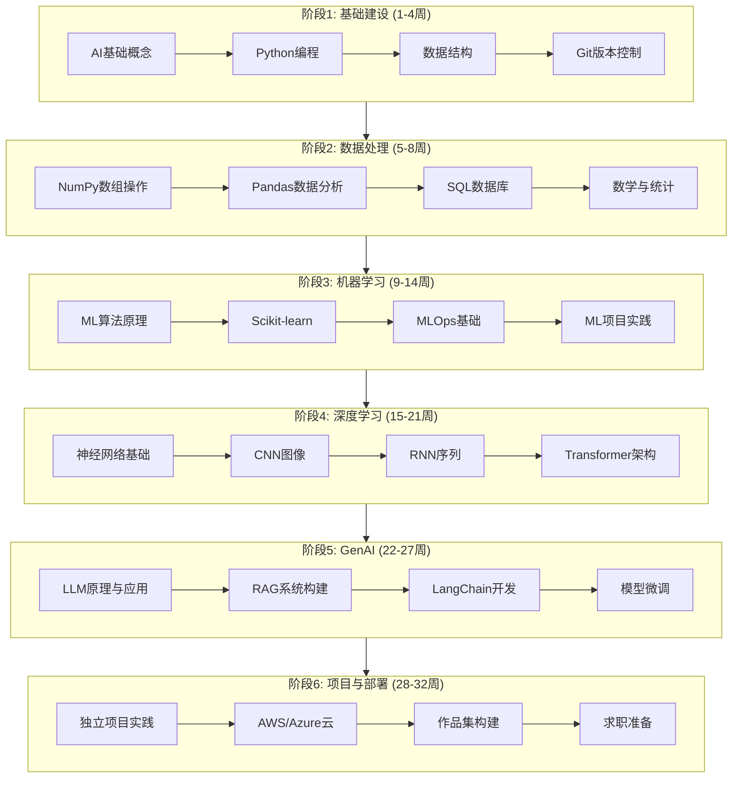
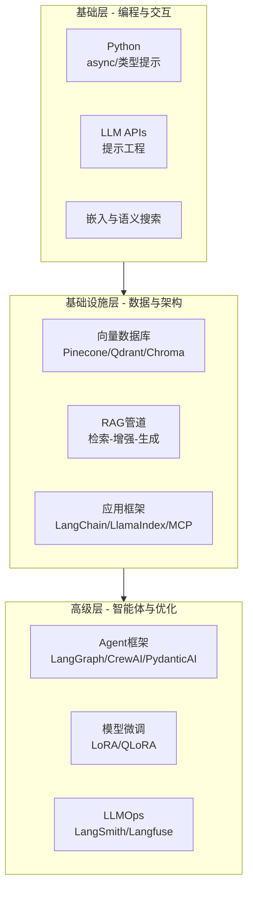
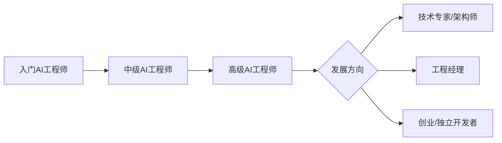

# AI工程师学习路线图

> [!info] 概述
> **一句话定义**：AI工程师是构建使用大语言模型��LLM）和基础模型作为核心组件的应用系统工程师，专注于将预训练模型转化为实际产品功能。
>
> **通俗比喻**：如果AI研究员是"设计发动机的科学家"，ML工程师是"制造发动机的技师"，那么AI工程师就是"把发动机装进汽车并让汽车跑起来的工程师"——他们不需要从头造轮子，而是懂得如何用好现成的强大引擎。

## 核心概念

### 是什么

AI工程师（AI Engineer）是一个专注于应用层的新兴技术角色，核心职责是：

- **构建LLM驱动系统**：使用大语言模型和基础模型作为系统组件
- **应用预训练模型**：利用现有模型改善用户体验和产品功能
- **端到端产品交付**：从原型到生产的完整AI应用开发

### 为什么需要

AI工程师角色的出现源于以下行业变化：

| 驱动因素 | 说明 |
|---------|------|
| 模型能力爆发 | GPT-4、Claude等模型已足够强大，无需从零训练 |
| 应用需求激增 | 企业需要快速将AI能力集成到产品中 |
| 技能缺口 | 传统软件工程师不懂AI，ML工程师不懂产品 |
| 成本效率 | 调用API比训练模型成本低几个数量级 |

### 角色定位对比

AI工程师与相关角色的核心区别：

| 角色 | 主要焦点 | 核心技能 | 2026薪资中位数 |
|------|---------|---------|--------------|
| 数据科学家 | 洞察分析 | 统计、SQL、可视化 | $130,000 |
| ML工程师 | 模型构建训练 | PyTorch、MLOps | $155,000 |
| AI工程师 | LLM产品功能 | 提示工程、RAG、agents | $175,000+ |

> [!tip] 关键区别
> - **AI研究员**：发明新算法，发表论文
> - **ML工程师**：训练和优化模型
> - **AI工程师**：把模型变成产品

### 通俗理解

**比喻**：想象你要开一家餐厅
- **AI研究员** = 发明新菜谱的厨师长
- **ML工程师** = 按菜谱做出美食的厨师
- **AI工程师** = 设计菜单、优化流程、让顾客满意的餐厅经理

AI工程师不需要知道如何从零训练一个模型（就像餐厅经理不需要会做每道菜），但必须知道如何选择合适的模型、如何设计提示词、如何构建检索增强生成（RAG）系统来满足用户需求。

**示例**：
```python
# AI工程师的日常工作
from openai import OpenAI
from langchain import LLMChain
from pinecone import Pinecone

# 1. 调用LLM API
client = OpenAI()
response = client.chat.completions.create(
    model="gpt-4",
    messages=[{"role": "user", "content": "分析这份报告..."}]
)

# 2. 构建RAG管道
pc = Pinecone(api_key="...")
index = pc.Index("knowledge-base")
# 检索相关文档 → 注入到提示词 → 生成回答

# 3. 设计Agent工作流
# 用户意图识别 → 任务分解 → 工具调用 → 结果整合
```

## 技术细节

### 薪资与职业前景

#### 整体薪资水平

美国AI工程师薪酬结构（2026年）：

| 经验水平 | 基本工资 | 总薪酬 |
|---------|---------|--------|
| 入门级(0-2年) | $90K-$135K | $110K-$160K |
| 中级(3-5年) | $140K-$210K | $170K-$260K |
| 高级(6-9年) | $180K-$280K | $220K-$350K+ |
| 主任/首席(10+) | $250K-$400K+ | $350K-$600K+ |

**中位数总薪酬**：约 $245,000

#### 专业化方向薪资

| 专精领域 | 薪资范围 |
|---------|---------|
| LLM/生成式AI | $165K-$350K+ (最高) |
| 计算机视觉 | $140K-$280K |
| NLP | $135K-$260K |
| 通用ML | $130K-$240K |

#### 高价值技能（薪资溢价）

- LLM微调（LoRA/QLoRA）
- RAG架构设计
- MLOps平台搭建
- Python + PyTorch + 云部署组合

> [!source] 来源
> 薪资数据基于2026年美国市场调研，来源于行业薪酬报告和招聘平台统计。

### 学习路线图

#### 学习周期规划

| 路线类型 | 周期 | 每日投入 | 适用人群 |
|---------|------|---------|---------|
| 完整路线 | 8个月 | 4小时 | 零基础转行者 |
| 加速路线 | 6个月 | 6-8小时 | 有编程基础者 |
| 快速通道 | 3个月 | 全职投入 | 软件工程师转岗 |

#### 8个月详细学习计划



#### 各阶段详细内容

**阶段1：基础建设（1-4周）**
- AI发展历史与核心概念
- Python编程：async/await、类型提示
- 数据结构与算法基础
- Git与GitHub工作流

**阶段2：数据处理（5-8周）**
- NumPy：向量化操作、广播机制
- Pandas：数据清洗、转换、聚合
- SQL：查询优化、JOIN操作
- 数学：线性代数、概率统计、微积分基础

**阶段3：机器学习（9-14周）**
- 监督学习：回归、分类
- 无监督学习：聚类、降维
- 模型评估与调参
- MLOps：MLflow、实验跟踪

**阶段4：深度学习（15-21周）**
- PyTorch框架深入
- CNN：图像识别、计算机视觉
- RNN/LSTM：序列建模
- [[Transformer]]：注意力机制详解

**阶段5：生成式AI（22-27周）**
- [[LLM]]原理与API调用
- [[RAG]]系统：向量数据库、检索优化
- LangChain/LlamaIndex框架
- 微调技术：LoRA、QLoRA

**阶段6：项目与部署（28-32周+）**
- 端到端项目开发
- 云平台：AWS/Azure/GCP
- 作品集网站搭建
- 面试准备与模拟

> [!source] 来源
> 学习路线参考 roadmap.sh AI Engineer Roadmap（352K GitHub Stars）及 DeepLearning.AI 课程体系。

### 核心技能体系

#### 三层技能架构



#### 2026年核心技能要求

| 技能类别 | 具体技能 | 职位要求占比 |
|---------|---------|-------------|
| 编程语言 | Python | 95% |
| 云平台 | AWS/Azure/GCP | 70% |
| ML/DL框架 | PyTorch/TensorFlow | 65% |
| MLOps | MLflow/Kubeflow | 55% |
| 提示工程 | Prompt Engineering | 50% |
| 分布式系统 | Spark/Ray | 40% |

#### 技能优先级排序

**必须掌握（P0）**：
- Python高级特性（类型提示、异步编程）
- LLM API调用与提示工程
- RAG系统设计与实现
- 向量数据库操作

**应该掌握（P1）**：
- LangChain/LlamaIndex框架
- Agent开发（LangGraph/CrewAI）
- 基础MLOps实践

**加分技能（P2）**：
- 模型微调（LoRA/QLoRA）
- LLMOps工具链
- 多模态AI应用

> [!source] 来源
> 技能要求基于2026年招聘市场分析，数据来源于LinkedIn、Indeed等招聘平台。

### 学习资源推荐

| 平台 | 特点 | 推荐课程 |
|------|------|---------|
| Coursera | 结构化学习路径、行业认可证书 | Andrew Ng ML系列 |
| edX | 大学合作课程、灵活自节奏 | MIT深度学习 |
| DeepLearning.AI | AI专业课程、实践项目 | LLM专项课程 |
| roadmap.sh | 互动式路线图、社区维护 | AI Engineer Roadmap |

**关键学习心态**：
1. **少消费多构建**：看10小时教程不如写1小时代码
2. **学习→实现→分享**：教是最好的学
3. **项目驱动**：每个阶段都要有可展示的作品

## 与其他概念的关系

| 概念 | 关系 |
|------|------|
| [[机器学习]] | AI工程师需要理解ML基础，但不需要深入训练细节 |
| [[深度学习]] | 理解神经网络原理，特别是Transformer架构 |
| [[LLM]] | AI工程师的核心工具，需要掌握API调用和提示工程 |
| [[RAG]] | 必备技能，用于构建知识增强的AI应用 |
| [[MLOps]] | 需要了解基础运维，但更侧重LLMOps |
| [[提示工程]] | AI工程师的日常核心技能 |
| [[LangChain]] | 主流LLM应用开发框架 |
| [[向量数据库]] | RAG系统的关键组件 |

## 最佳实践

### 学习策略

1. **项目驱动学习**：每周完成一个小项目，而不是只看教程
2. **建立作品集**：GitHub上保持活跃，展示项目代码
3. **社区参与**：加入Discord/Reddit社区，分享学习心得
4. **跟随前沿**：订阅AI Newsletter，了解最新技术动态

### 求职准备

1. **作品集网站**：展示3-5个高质量项目
2. **技术博客**：记录学习过程和技术思考
3. **开源贡献**：参与LangChain等开源项目
4. **面试准备**：
   - 系统设计：设计一个RAG系统
   - 代码能力：Python算法题
   - 项目深挖：详细介绍你的AI项目

### 职业发展路径



## 常见问题

### Q1: 需要数学很好吗？
**A**: 基础数学够用即可。AI工程师更侧重应用而非研究，理解线性代数、概率统计的基本概念就足够应对大部分工作。

### Q2: 需要从零训练模型吗？
**A**: 通常不需要。AI工程师的核心价值在于如何有效使用预训练模型，而不是训练模型。但在某些场景下，微调（Fine-tuning）是必要的。

### Q3: Python必须精通吗？
**A**: 是的，Python是AI工程师的必备技能。建议掌握：
- 类型提示（Type Hints）
- 异步编程（async/await）
- 常用库（NumPy、Pandas、Pydantic）

### Q4: 需要博士学历吗？
**A**: 不需要。AI工程师是应用导向的角色，企业更看重项目经验和工程能力。本科+扎实的技术栈就足够。

### Q5: 如何快速入门？
**A**: 推荐路径：
1. 先掌握Python和基础ML概念
2. 学习LLM API调用和提示工程
3. 构建一个简单的RAG项目
4. 逐步深入学习Agent和微调

## 参考资料

- [AI Engineer Roadmap - roadmap.sh](https://roadmap.sh/ai)
- [DeepLearning.AI Courses](https://www.deeplearning.ai/)
- [LangChain Documentation](https://python.langchain.com/)
- [OpenAI API Documentation](https://platform.openai.com/docs)
- [Attention Is All You Need (Transformer论文)](https://arxiv.org/abs/1706.03762)

## 个人笔记

> [!personal] 我的学习进度与心得
>
> **当前阶段**：（记录你当前的学习阶段）
>
> **已完成项目**：
> - （记录你完成的项目）
>
> **待解决问题**：
> - （记录学习过程中的疑问）
>
> **学习心得**：
> > （此处记录个人学习心得，更新笔记时此区域会被保留）
