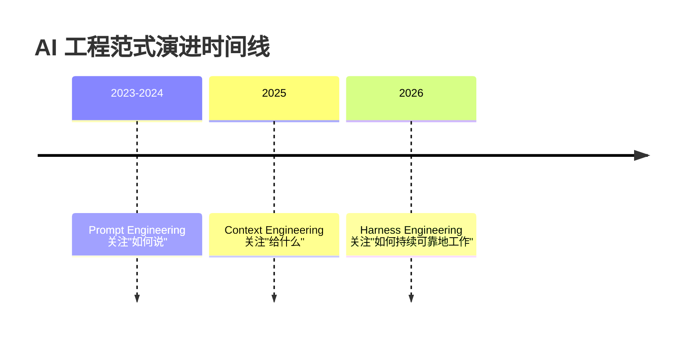
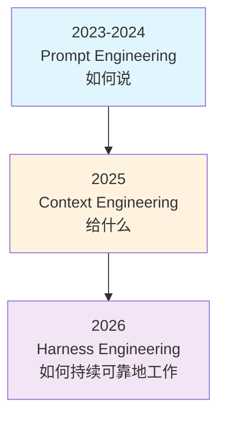
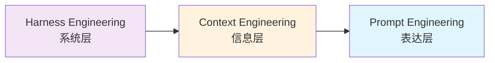

# AI 工程范式演进：从 Prompt 到 Harness

> [!info] 概述
> **一句话定义**：AI 工程范式经历了从"如何说"（Prompt Engineering）到"给什么"（Context Engineering）再到"如何持续可靠地工作"（Harness Engineering）的演进过程。
>
> 🎯 **通俗比喻**：
> - **Prompt Engineering** = 给马匹发出指令（"往前走"、"左转"）
> - **Context Engineering** = 为马匹准备地图和路线规划（决定它能看到什么信息）
> - **Harness Engineering** = 设计缰绳、马鞍和马厩系统（让马匹持续可靠地工作）

---

## 演进路径概览



> [!tip] 包含关系
> 三者不是替代关系，而是包含关系：**Harness Engineering ⊃ Context Engineering ⊃ Prompt Engineering**

---

## 第一层：Prompt Engineering（提示词工程）

### 是什么

**通过设计与优化输入指令来引导 AI 行为与输出的工程学科**，关注**"如何说"**的问题。

### 核心技术

#### 基础技术
- **零样本提示（Zero-shot Prompting）**：不提供示例，直接给出任务指令
- **单样本提示（One-shot Prompting）**：提供一个示例引导模型
- **少样本提示（Few-shot Prompting）**：提供少量示例引导模型理解任务模式
- **思维链（Chain of Thought, CoT）**：引导模型展示推理步骤
- **思维树（Tree of Thoughts, ToT）**：探索多条推理路径

#### 高级技术
- 提示链（Prompt Chaining）
- 元提示（Meta Prompting）
- 角色提示法（Role Prompting）
- 定向刺激提示法（Directed Stimulus Prompting）
- 智能体提示法（Agent Prompting）

### 应用场景

- 对话系统
- 代码生成
- 内容创作
- 数据分析
- 多模态交互

📦 **示例**：

````markdown
❌ 糟糕的提示词：
写一篇文章

✅ 好的提示词：
你是一位科技博客作者。请写一篇关于 Transformer 架构的文章，
要求：1) 面向初中级工程师 2) 包含代码示例 3) 使用通俗比喻
````

> [!info] 来源参考
> - [IBM 提示词工程指南（2026）](https://www.ibm.com/cn-zh/think/prompt-engineering)
> - [OpenAI 提示词工程指南](https://www.openaicto.com/guides/prompt-engineering)
> - [OpenAI 最佳实践](https://help.openai.com/zh-hans-cn/articles/10032626-prompt-engineering-best-practices-for-chatgpt)
> - [提示工程指南](https://www.promptingguide.ai/zh)

---

## 第二层：Context Engineering（上下文工程）

### 是什么

决定 AI 模型在关键时刻能看到什么信息、何时看到、如何组织这些信息，关注"给什么"**的问题。

### 为什么需要

Prompt Engineering 假设上下文窗口是无限的，但实际上：
1. 上下文窗口有限（必须选择性检索）
2. 不是所有信息都相关（噪声会降低性能）
3. 信息组织方式影响理解（需要优化布局）

### Microsoft ACE 框架（ICLR 2026）

Microsoft 提出的 **Agentic Context Engineering** 框架，将上下文视为动态演进的 Playbook。

#### 六大核心技术

| 技术 | 说明 |
|------|------|
| **选择性检索** | 根据当前任务动态选择最相关的信息 |
| **上下文压缩** | 在保持关键信息的前提下压缩上下文 |
| **分层布局** | 将信息按层次组织，优化模型理解 |
| **动态上下文选择** | 根据任务进展动态调整上下文 |
| **内存管理** | 智能管理长期记忆和短期记忆 |
| **注意力分配优化** | 引导模型关注关键信息 |

#### 性能提升

- 智能体基准测试：**+10.6%**
- 金融领域：**+8.6%**

### 应用场景

- **RAG 系统**：通过智能检索和上下文组织提升准确性
- **智能体系统**：动态管理智能体的记忆和上下文窗口
- **长文档处理**：分层布局和压缩技术处理超长文档
- **多轮对话**：动态选择历史对话中的关键信息

📦 **示例**：

```python
# 传统 RAG：直接返回检索结果
def naive_rag(query):
    return vector_db.search(query, top_k=5)

# Context Engineering：智能组织上下文
def ace_rag(query, conversation_history):
    # 1. 根据对话历史动态调整检索策略
    intent = detect_intent(conversation_history)

    # 2. 选择性检索（只检索相关信息）
    relevant_docs = selective_search(query, intent, top_k=3)

    # 3. 上下文压缩（去除冗余）
    compressed = compress_context(relevant_docs)

    # 4. 分层布局（按重要性排序）
    return hierarchical_layout(compressed)
```

> [!info] 来源参考
> - [Microsoft Research: Agentic Context Engineering](https://www.microsoft.com/en-us/research/publication/agentic-context-engineering-evolving-contexts-for-self-improving-language-models/)
> - [51CTO: ACE 框架解读](https://www.51cto.com/article/836977.html)
> - [华为开发者联盟](https://developer.huawei.com/consumer/cn/blog/topic/03210597079887261)
> - [GitHub: ACE Agent](https://github.com/ace-agent/ace)

---

## 第三层：Harness Engineering（系统治理工程）

### 是什么

设计环境、约束和反馈回路，使 AI 编码智能体能够**可靠、大规模**工作的工程学科，关注**"如何持续可靠地工作"**的问题。

### 术语来源

这个词最早来自 **Mitchell Hashimoto**（HashiCorp 联合创始人、Terraform 缔造者）。他于 2026 年 2 月写了篇博客，把自己使用 AI 编程的进化拆成了六个阶段，第五个阶段叫 **Engineer the Harness**。

> [!quote] 核心定义
> "每当你发现 Agent 犯了一个错误，你就花时间去工程化一个解决方案，让它再也不会犯同样的错。"
> — Mitchell Hashimoto

他在 Ghostty 项目里实践了这个理念：**AGENTS.md 文件里的每一行规则，背后都对应一个 Agent 曾经犯过的错**。

---

### OpenAI 实践案例（2026年2月）

- **代码规模**：100万行代码
- **人工代码**：0行
- **团队规模**：3 → 7 个工程师
- **开发周期**：5 个月
- **PR 数量**：约 1500 个
- **核心原则**：人类掌舵，智能体执行

> [!tip] 效率对比
> 平均每位工程师每天合并 3.5 个 PR。如果用传统方式手写，工期大概是现在的 10 倍。

### 六大组件（OpenAI Codex 团队总结）

| 组件 | 说明 |
|------|------|
| **1. 结构化文档系统** | AGENTS.md 作为地图，为 AI 智能体优化的文档 |
| **2. 架构约束与品味** | 严格分层架构 + 自定义 linter |
| **3. 可观测性与工具** | Chrome DevTools 协议、LogQL、PromQL |
| **4. 反馈回路** | 智能体对智能体的代码审查、自动测试 |
| **5. 渐进式披露** | 从小而稳定的切入点开始 |
| **6. 熵与垃圾收集** | 定期清理"AI 残渣" |

> [!info] 📚 来源
> - [OpenAI: Harness Engineering](https://openai.com/index/harness-engineering)
> - [code秘密花园 - YouTube 视频](https://www.youtube.com/watch?v=3DlXq9nsQOE)

### 架构模式

```text
┌─────────────────────────────────────────────┐
│ 严格分层架构（从下到上）                      │
├─────────────────────────────────────────────┤
│ UI（最上层，最容易变更）                      │
├─────────────────────────────────────────────┤
│ Runtime                                      │
├─────────────────────────────────────────────┤
│ Service                                      │
├─────────────────────────────────────────────┤
│ Repo（数据仓库，稳定性高）                    │
├─────────────────────────────────────────────┤
│ Config（配置，低变更频率）                    │
├─────────────────────────────────────────────┤
│ Types（最底层，几乎不变）                     │
└─────────────────────────────────────────────┘
```

### 应用场景

- **AI 编程**：让 AI 编写百万级代码
- **智能体系统**：构建可控、可观测的 AI 智能体工作流
- **自动化工作流**：大规模自动化软件工程
- **企业级 AI 部署**：在生产环境中可靠部署 AI 系统

> [!info] 来源参考
> - [OpenAI: Harness Engineering（中文）](https://openai.com/zh-Hans-CN/index/harness-engineering)
> - [OpenAI: Harness Engineering（英文）](https://openai.com/index/harness-engineering)
> - [InfoQ: OpenAI 实践解析](https://www.infoq.com/news/2026/02/openai-harness-engineering-codex)
> - [Martin Fowler: Harness Engineering 深度分析](https://martinfowler.com/articles/harness-engineering.html)

---

## 三者对比与关系

### 层次关系对比

| 层次 | 概念 | 关注点 | 解决问题 | 比喻 |
|------|------|--------|----------|------|
| **表达层** | Prompt Engineering | 如何发出任务 | 任务表述的精确性 | 指令 |
| **信息层** | Context Engineering | 模型能看到什么 | 信息的相关性和组织 | 地图 |
| **系统层** | Harness Engineering | 环境和约束 | 可靠性、可扩展性、可控性 | 缰绳 |

### 演进逻辑



### 包含关系可视化



> [!info] 来源参考
> - [知乎: AI 工程范式演进](https://zhuanlan.zhihu.com/p/2015142041282163260)
> - [博客园: 三层工程范式对比](https://www.cnblogs.com/itech/p/19823069)
> - [腾讯云: AI 工程实践](https://cloud.tencent.com/developer/article/2631915)

---

## 最佳实践

### 何时使用哪一层？

| 场景 | 推荐范式 |
|------|----------|
| 简单问答、一次性任务 | Prompt Engineering |
| RAG 系统、多轮对话 | Context Engineering |
| 大规模智能体系统、生产环境 | Harness Engineering |

### 实践建议

1. **从 Prompt 开始**：先解决"如何说"的问题
2. **逐步加入 Context**：当上下文窗口和信息质量成为瓶颈时
3. **最终构建 Harness**：当需要大规模、高可靠性时

> [!warning] 常见误区
> - ❌ 认为 Context Engineering 会取代 Prompt Engineering
> - ❌ 跳过基础直接上 Harness Engineering
> - ❌ 忽视渐进式披露原则

---

## 常见问题

### Q1: 我应该从哪一层开始？

**A**: 从 Prompt Engineering 开始。它是基础，其他两层都建立在有效的提示词设计之上。

### Q2: Context Engineering 和 RAG 有什么区别？

**A**: RAG 是一种技术，Context Engineering 是一种工程范式。ACE 框架将 RAG 作为上下文工程的一部分。

### Q3: Harness Engineering 只适用于编程场景吗？

**A**: 不是。虽然 OpenAI 的案例是编程，但 Harness Engineering 的原则（结构化文档、反馈回路、熵控制）适用于任何需要大规模、高可靠性的 AI 系统。

> [!tip] 延伸阅读
> 想深入了解 Harness Engineering 的核心概念、实践路径和进阶内容？详见 [[Harness-Engineering-系统治理工程]]（姐妹篇，深度展开第三层）

---

## 参考资料

### 官方资源
- [OpenAI: Harness Engineering](https://openai.com/zh-Hans-CN/index/harness-engineering)
- [OpenAI: Prompt Engineering Best Practices](https://help.openai.com/zh-hans-cn/articles/10032626-prompt-engineering-best-practices-for-chatgpt)
- [Microsoft Research: ACE Framework](https://www.microsoft.com/en-us/research/publication/agentic-context-engineering-evolving-contexts-for-self-improving-language-models/)

### 技术社区
- [提示工程指南](https://www.promptingguide.ai/zh)
- [GitHub: ACE Agent](https://github.com/ace-agent/ace)

### 深度分析
- [Martin Fowler: Harness Engineering](https://martinfowler.com/articles/harness-engineering.html)
- [InfoQ: OpenAI 实践解析](https://www.infoq.com/news/2026/02/openai-harness-engineering-codex)

### 中文资源
- [51CTO: ACE 框架解读](https://www.51cto.com/article/836977.html)
- [华为开发者联盟](https://developer.huawei.com/consumer/cn/blog/topic/03210597079887261)
- [腾讯云: AI 工程实践](https://cloud.tencent.com/developer/article/2631915)

---

## 个人笔记

> [!personal] 💡 我的理解与感悟
> （此处记录个人学习心得，更新时会被保留）
>
> -
> -
> -
