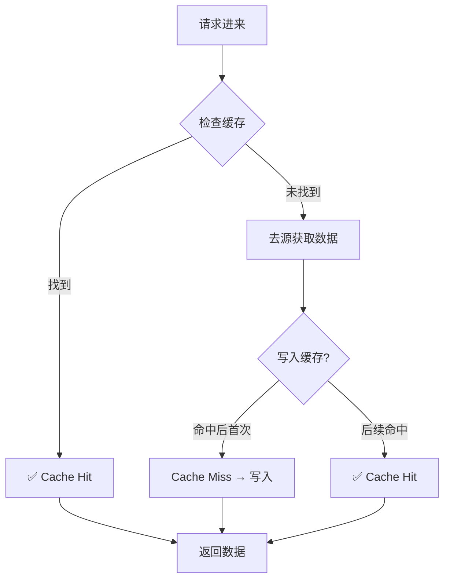
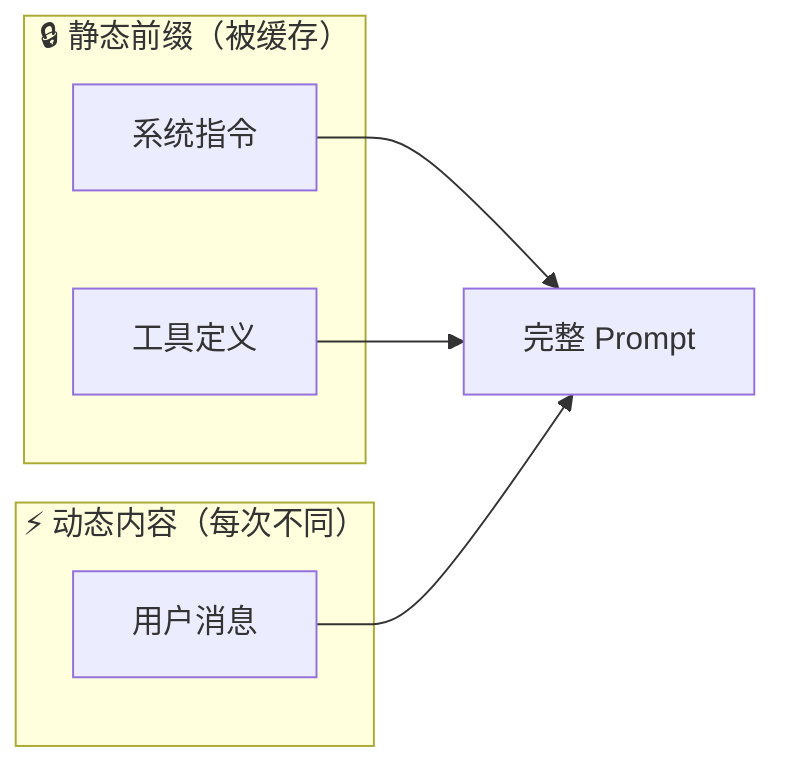

# AI缓存命中与未命中

## 一句话解释

> [!info] 定义
> **缓存命中 (Cache Hit)**：请求的数据已在缓存中，可直接读取。
> **缓存未命中 (Cache Miss)**：请求的数据不在缓存中，需重新计算或访问慢速存储。

---

## 为什么存在？（解决什么问题）

### 没有缓存之前

每次向 LLM 发送请求，都需要：

1. 重新处理完整的输入 Prompt
2. 重新计算所有 Token 的注意力向量
3. 付出完整的计算成本

> [!warning] 问题
> 重复处理相同内容（如系统指令、工具定义）造成 ==巨大浪费==。

### 有缓存之后

| 状态 | 行为 | 结果 |
|------|------|------|
| **命中** | 直接复用已有结果 | ⚡ 速度快 + 💰 成本低 |
| **未命中** | 正常计算后写入缓存 | 首次慢，后续命中 |

---

## 核心原理

### 什么是缓存？

把缓存想象成**图书馆的借阅柜台**：

- 要借的书前台有 → 直接拿走 ==快==
- 要借的书前台没有 → 去书库找 ==慢==，但会留一本在前台供下次使用

### 缓存的工作流程



### AI 中的 KV Cache

LLM 的核心是 Transformer 注意力机制。对于每个 Token，会计算：

| 向量 | 作用 | 比喻 |
|------|------|------|
| **Query (Q)** | 当前 token "问"的问题 | 查找请求 |
| **Key (K)** | 每个 token 的"钥匙" | 索引标签 |
| **Value (V)** | 每个 token 的"内容" | 实际数据 |

> [!tip] KV Cache 的作用
> - 把 K 和 V 向量缓存起来
> - 下次请求时直接复用，不用重新计算
> - 复杂度从 ==O(n²)== 降到 ==O(n)==
>
> **来源**: [Daily Dose of DS](https://blog.dailydoseofds.com/p/prompt-caching-in-llms)

### Prompt Caching

Claude 等 API 支持**提示词前缀缓存**：

- 系统指令、工具定义等**静态内容**只计算一次
- 后续请求复用，只处理**动态内容**



### 命中 vs 未命中的代价

| 状态 | 延迟 | Token 成本 | 10K Tokens 费用 |
|------|------|------------|-----------------|
| **命中** | ⚡ 快 | $0.50/MTok | **$0.005** |
| **未命中** | 🐢 正常 | $5.00/MTok | $0.050 |
| **写缓存** | 🐢 正常 | $6.25/MTok | $0.0625 |

> [!success] 关键发现
> 命中可节省 **90% 成本**！
>
> **来源**: [Claude API Docs](https://platform.claude.com/docs/en/build-with-claude/prompt-caching)

---

## 关键要点

### 1. 命中率的计算

```text
命中率 = 命中次数 / 总请求次数 × 100%
```

> [!example] 实际案例
> Claude Code 在 30 分钟编码会话中：
> - **命中率**: 92%
> - **成本降低**: 81%
>
> **来源**: [Daily Dose of DS](https://blog.dailydoseofds.com/p/prompt-caching-in-llms)

### 2. 哈希敏感性

缓存通过**加密哈希**索引前缀。

> [!warning] 重要约束
> "序列中任何改变——甚至只是两个元素的顺序——都会改变哈希。"
>
> **来源**: [Daily Dose of DS](https://blog.dailydoseofds.com/p/prompt-caching-in-llms)

### 3. 最小 Token 阈值

| 模型 | 最小缓存 Token |
|------|----------------|
| Claude Opus 4.7/4.6 | 4,096 |
| Claude Sonnet 4.6/4.5 | 1,024 |
| Claude Haiku 4.5 | 4,096 |

> [!note]
> 低于阈值的内容 ==不会被缓存==。

---

## 常见误区

### ❌ 误区1：包含相同内容就会命中

**正解**：必须是 ==完全相同的前缀==。Token 顺序不同、间隔符不同都会导致未命中。

### ❌ 误区2：缓存越大越好

**正解**：缓存有容量限制。超出容量时，LRU 等替换策略会淘汰旧数据。

### ❌ 误区3：修改工具定义后只需重新发一次

**正解**：任何工具变更都会使 ==整个缓存失效==。建议提前规划好工具集。

---

## 与其他概念的关系

| 概念 | 关系 |
|------|------|
| [[Token]] | 缓存的最小单位 |
| [[Transformer]] | KV Cache 的底层机制 |
| [[注意力机制]] | Q/K/V 向量的来源 |
| [[提示词工程]] | 合理设计 Prompt 以提高命中率 |

> [!note] 待补充笔记
> 上述双链部分为占位符，后续创建相关笔记后可补全链接。

---

## 代码示例

### 基础使用（自动缓存）

```python
from anthropic import Anthropic
client = Anthropic()

response = client.messages.create(
    model="claude-opus-4-7",
    max_tokens=1024,
    cache_control={"type": "ephemeral"},  # 自动缓存
    system="You are a helpful assistant.",
    messages=[
        {"role": "user", "content": "Analyze this document."}
    ]
)
```

> [!info] 来源
> 以上代码来自 [Claude API Docs](https://platform.claude.com/docs/en/build-with-claude/prompt-caching)

### 追踪缓存效果

```python
# 查看缓存指标
cache_read = response.usage.cache_read_input_tokens      # 从缓存读取
cache_write = response.usage.cache_creation_input_tokens # 写入缓存
input_tokens = response.usage.input_tokens               # 实际新处理

print(f"命中节省: {cache_read} tokens")
print(f"实际新处理: {input_tokens} tokens")
```

### 缓存预热（消除首次延迟）

```python
# 用 max_tokens=0 预热
prewarm = client.messages.create(
    model="claude-opus-4-7",
    max_tokens=0,
    system=[{
        "type": "text",
        "text": "You are an expert software engineer...",
        "cache_control": {"type": "ephemeral"},
    }],
    messages=[{"role": "user", "content": "warmup"}]
)
# 返回空的 content 和填充的 usage
```

---

## 一句话总结

> [!tip] 记忆口诀
> **命中 = 复用已有计算 = 快 + 便宜**  
> **未命中 = 从头计算 = 慢 + 贵**

---

## 思考题

1. **为什么在多轮对话中，使用相同的系统指令能提高缓存命中率？**

2. **如果你的 Prompt 结构是 "指令A + 用户问题1" 和 "指令B + 用户问题1"，这两种情况能命中缓存吗？为什么？**

3. **假设你的应用场景是客服机器人，每位用户问的问题都不同但系统指令相同，如何设计 Prompt 以最大化缓存效果？**

4. **为什么说首次请求（写缓存）比未命中（完全不复用）更划算？什么情况下这个结论不成立？**

---

%% 
## 元信息

- **学习难度**: 入门
- **笔记类型**: 概念笔记
- **创建日期**: 2026-05-14
- **最后更新**: 2026-05-14
%%
