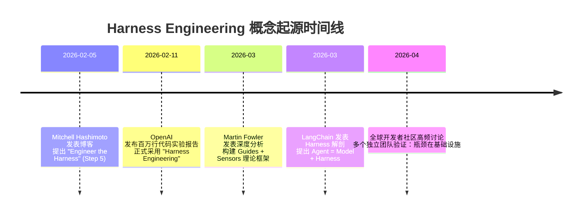
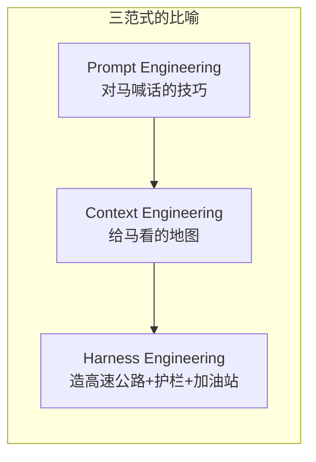
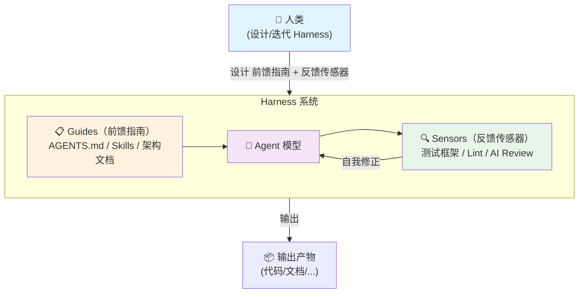
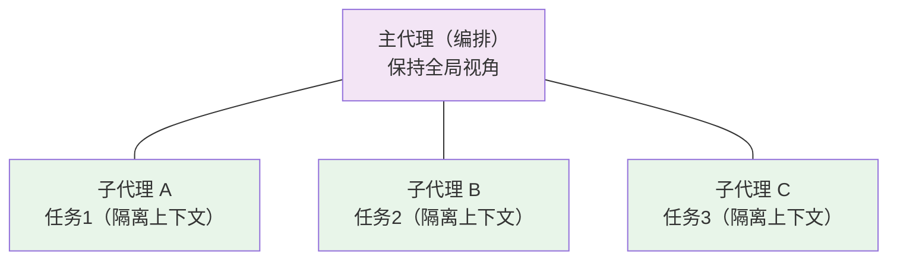
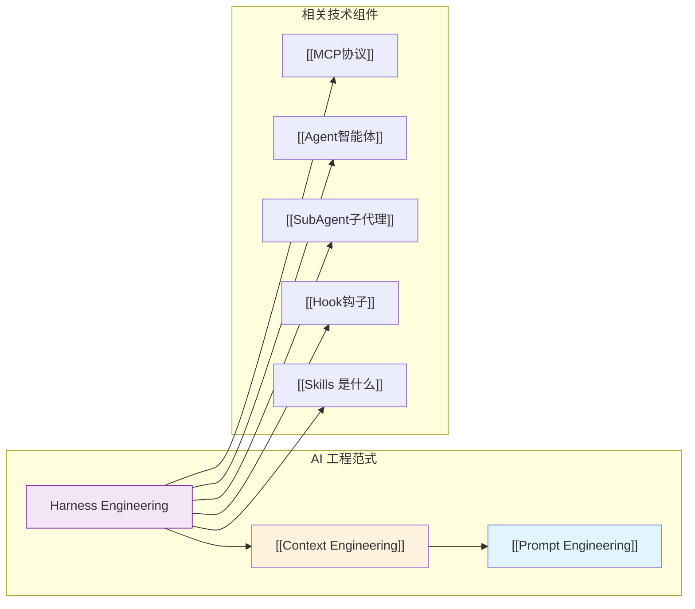

# Harness Engineering（系统治理工程）

> [!info] 一句话解释
> **Harness Engineering** 是围绕 AI Agent 设计和构建约束、反馈与控制系统的工程学科——不再优化模型"聪不聪明"，而是优化模型"在什么环境里工作"。核心哲学：**人类掌舵，智能体执行**。
>
> 传统工程：人类写代码 → 机器执行代码
> Harness Engineering：人类设计约束 → 智能体写代码 → 机器执行代码

---

## 为什么存在？

### 以前的问题

2023~2025 年，使用 AI 编码的主要方式经历了两次范式演进：

1. **[[Prompt Engineering]]（提示词工程）**：纠结于怎么把指令写清楚
2. **[[Context Engineering]]（上下文工程）**：纠结于给模型喂什么信息

这两层都假设"模型变强，问题自然消失"。但现实并非如此：

> [!warning] 核心洞察
> **模型越强，我们交给它的任务越大、越复杂，它失败的新方式就越多。**
>
> 一个典型故事：5 人团队用 AI 写了百万行代码。但如果 AI 每天提交 10 个 PR 中有 3 个有严重 bug，人工审核就成了瓶颈——而你没法靠换 GPT-6 来解决"Agent 复制了代码库里的坏模式"的问题。

### Harness Engineering 解决的六大问题

| 问题 | Harness 对策 |
|------|-------------|
| Agent 重复犯同样的错误 | AGENTS.md 记录规则 + 自动化验证 |
| Agent "过早宣布胜利" | 反馈回路让 Agent 自我检查 |
| Agent 复制并放大坏模式 | 熵管理 + 定期垃圾回收 |
| 上下文窗口膨胀 | 渐进式披露 + 分层文档 |
| 人工审核成为瓶颈 | Agent-to-Agent 审查流程 |
| 模型越强，任务越复杂 | 环境设计（而非换模型） |

> [!quote] Mitchell Hashimoto（HashiCorp 联合创始人）
> "每当你发现 Agent 犯了一个错误，你就花时间去工程化一个解决方案，让它再也不会犯同样的错。"

**核心信念**：Agent 的每一次失败，都是环境设计不完善的信号。正确的回应不是换模型，而是重新设计它运行的环境。

---

## 核心原理

### 术语起源



### 核心公式

```
AI Agent = Model（模型） + Harness（缰绳）
```

> [!tip] 关键认识
> 决定 Agent 好坏的，**50% 靠模型，50% 靠 Harness**。当底层模型越来越趋同（GPT-5.4 vs Claude Opus 4.6 vs Gemini 3.1 Pro），产品差距的拉大就取决于 Harness 的设计质量。

### 一个直观的比喻



或者换个角度：
- **裸 LLM** = 没有操作系统的 CPU——它能计算，但做不了任何有用的事
- **Harness** = 操作系统——让 CPU 能干实活的完整环境

### 前馈 + 反馈：Martin Fowler 的核心框架

这是目前最完整的 Harness 理论框架，将 Harness 功能拆成两大部分：



**Guides（前馈指南）** — Agent 行动前给出的方向
- AGENTS.md、Skills、架构文档、How-to 指南
- 作用：提高第一次就做对的概率

**Sensors（反馈传感器）** — Agent 行动后进行的检查
- 测试框架、Lint、类型检查、AI Code Review
- 作用：在问题到达人类之前自我修正

> [!note]
> 前馈和反馈的目标不是"替代人"，而是**把人类的注意力引导到最需要判断力的地方**。

### 前馈和反馈的两种执行体

| | Computational（计算型） | Inferential（推理型） |
|---|---|---|
| **运行在** | CPU | GPU / NPU |
| **速度** | 毫秒~秒级 | 几秒~几分钟 |
| **确定性** | 确定性强 | 概率性 |
| **成本** | 低 | 高 |
| **典型示例** | ESLint, TypeScript, ArchUnit | AI Code Review, "LLM as Judge" |

> [!tip] 最佳实践
> 应该把快速、便宜的计算型传感器放在**每个变更上**，把昂贵的推理型传感器放在**合入后**。

### 三种调控类型

Martin Fowler 把 Harness 按照"管什么"分成三类：

| 类型 | 管什么 | 成熟度 |
|------|--------|--------|
| **Maintainability Harness** | 内部代码质量（重复代码、复杂度、架构漂移） | 最成熟 |
| **Architecture Fitness Harness** | 架构特性（性能、可观测性、模块边界） | 发展中 |
| **Behaviour Harness** | 功能行为正确性（"这个功能对吗？"） | 最不成熟 |

> [!warning] 注意缺口
> 前两类已经有成熟的工具支撑。**第三类（行为正确性）是最棘手的**——目前主要依赖 AI 生成的测试来验证 AI 生成的代码，这显然还不够。

---

## 关键要点

> [!abstract] 六大核心要点

### 1. Agent = Model + Harness
决定 Agent 产出质量的两个因素，不能只盯着模型。LangChain 的案例证明：仅改 Harness（底层模型不变），Terminal Bench 得分从 52.8% 跃升至 66.5%，排名从 30 提升到 5。

### 2. 纪律没有消失，只是转移了
以前纪律体现在"好好写代码"，现在体现在"构建好让 Agent 工作的环境"——文档、约束、反馈回路都是工程产出。

### 3. 反馈回路是核心杠杆
Agent 能**自我检查**比 Agent **第一次做对**更重要。Martin Fowler 称之为 **"keep quality left"（质量左移）**——把检查尽可能提前。

### 4. 仓库即记录系统
> 不在仓库里的东西，对 AI 智能体不存在。
Slack 讨论、Google Docs、人脑中的知识 → 对 Agent 不可见。一切决策、规范、计划都必须版本化提交到仓库。

### 5. 渐进式披露
给 Agent 的是**一张地图**，不是一本 1000 页的说明书。AGENTS.md 应该只有 ~100 行，作为入口文件指向更深层的文档。巨型指令文件的三个死因：
- 挤占上下文窗口
- 无法维护（"陈规的坟场"）
- 无法机械验证

### 6. Harnessability（可驾驭性）
同样代码库的"可驾驭性"天差地别：
- 强类型语言 → 天然有类型检查作为传感器
- 框架化项目 → 隐式提高 Agent 成功率
- 遗留系统 → **最需要 Harness 的地方最难构建**

---

## OpenAI 实战案例：百万行代码实验

> [!example] 实验数据
> | 指标 | 数值 |
> |------|------|
> | 代码规模 | ~100 万行 |
> | 人工代码 | **0 行**（全部由 Codex 生成） |
> | 团队规模 | 3 → 7 人 |
> | 开发周期 | 5 个月 |
> | PR 数量 | ~1500 个 |
> | 人均 PR/天 | 3.5 |
> | 效率对比 | 约传统方式的 1/10 时间 |

### 六大组件

| 组件 | 说明 | 落地方式 |
|------|------|---------|
| **结构化文档系统** | AGENTS.md 作为地图 | ~100 行 AGENTS.md → 指向深层 docs/ |
| **架构约束** | 严格分层 + 自定义 linter | CI 强制，错误信息内嵌修复指令 |
| **可观测性** | Agent 直接接入运行时信号 | Chrome DevTools, LogQL, PromQL |
| **反馈回路** | 多个专门 Agent 相互审查 PR | Agent-to-Agent 审查 |
| **渐进式披露** | 从小入口点开始，逐步深入 | Agent 被告知"下一步看哪里" |
| **熵管理** | 定期扫描过时文档、架构偏差 | doc-gardening Agent 自动发起修复 PR |

### 文档结构

```
AGENTS.md（~100行，作为地图）
ARCHITECTURE.md
docs/
├── design-docs/      # 设计文档（含验证状态）
├── exec-plans/       # 执行计划（活跃/已完成/技术债）
├── generated/        # 自动生成（如 db-schema）
├── product-specs/    # 产品规格
├── references/       # 技术参考 LLM 文本
├── DESIGN.md
├── QUALITY_SCORE.md
└── SECURITY.md
```

> [!tip] 机械化执行
> 文档会腐烂，lint 规则不会。专职 linter 和 CI 会验证知识库的更新状况、交叉链接和结构正确性。一个定期运行的 "doc-gardening" Agent 扫描过时文档并自动发起修复 PR。

### 开发流程

```
人类描述任务 → 智能体运行 → 打开 PR
  → 智能体自我审核（本地）
  → 额外智能体审查（云端）
  → 响应反馈 → 循环直到所有审查通过
  → 人类可审核，但非必须
```

> [!quote] Ryan Lopopolo（OpenAI Codex 团队）
> "人类几乎完全通过提示与系统交互：工程师描述任务，运行智能体，并允许其打开一个 Pull Request。"

---

## 进阶：Agent Harness 组件架构

LangChain 的 Vivek Trivedy 从**模型做不到的事**反向推导出 Harness 组件：

| 模型做不到... | Harness 组件解决 | 类比 |
|-----------|-------------|------|
| 模型没有循环控制 | **Orchestration Loop** | 操作系统的进程调度 |
| 模型不会自己找工具 | **Tool Management** | 驱动程序 |
| 模型分不清信息优先级 | **Context Engineering** | 内存管理（MMU） |
| 模型不记得上次会话 | **State Persistence** | 硬盘 / 文件系统 |
| 模型不会自动重试 | **Error Recovery** | 异常处理机制 |
| 模型没有行为边界 | **Safety Guardrails** | 防火墙 / 权限管理 |
| 模型不会自我验证 | **Verification Loops** | 单元测试框架 |

### 子代理 = 上下文防火墙

> [!tip] HumanLayer 的关键发现
> 当任务需要多个会话解决时，**子代理是保持一致性的关键**。



**工作原理**：子任务在隔离的上下文窗口中运行，中间噪声不会积累到主线程，从而在超长 session 中保持一致性。

---

## 进阶：CDD vs Harness Engineering

> [!question] 常见疑问
> 我已经在用 **Spec-Driven Development（SDD）** 了，Harness 还有必要吗？

**答案**：这不是二选一，而是**放大器与被放大的内容**。

| | SDD（规范驱动开发） | Harness Engineering |
|---|---|---|
| **角色** | 内容是规范本身 | 内容是执行规范的机制 |
| **类比** | 乐谱 | 乐队的排练流程、反馈系统、指挥 |
| **关系** | Spec 决定"要做什么" | Harness 确保"做对做稳" |
| **互相影响** | Harness 越强，Spec 的质量对结果的影响越大 | Spec 越清晰，Harness 的反馈越精准 |

> [!quote] 腾讯云开发者社区的分析
> "Harness 是放大器，Spec 是被放大的内容。两者互补。"

---

## 常见误区

> [!danger] 这些误区要避免

| 误区 | 正解 |
|------|------|
| Harness Engineering 会取代 Prompt Engineering | Harness ⊃ Context ⊃ Prompt，三层是**包含关系** |
| 模型够强就不需要 Harness | 模型越强，任务越大，越需要 Harness 确保可靠 |
| Harness = 写一堆 Markdown 规则 | OpenAI 花了大量精力构建**工具化**部分（linter、测试、可观测性） |
| 跳过基础直接上 Harness Engineering | 从 Prompt 开始 → 逐步加入 Context → 最终构建 Harness |
| Harness 只适用于编程场景 | 原则（结构化文档、反馈回路、熵控制）适用于**任何 AI 系统** |
| AGENTS.md 越大越好 | 巨型文件是"陈规的坟场"，应该只做地图，指向深层文档 |

---

## 与其他概念的关系



| 概念 | 关系 |
|------|------|
| [[Prompt Engineering]] | Harness 的最内层。解决"如何说"。三者中最基础。 |
| [[Context Engineering]] | Harness 的中间层。解决"给什么"。2025 年的主流范式。 |
| [[AI工程范式演进-Prompt到Harness]] | 本文是对该笔记中"第三层"的深度展开。 |
| [[MCP协议]] | MCP 是 Agent Tool Management（Harness 组件之一）的具体协议实现。 |
| [[Agent智能体]] | Harness Engineering 的服务对象。Agent = Model + Harness。 |
| [[SubAgent子代理]] | SubAgent 充当"上下文防火墙"，是 Harness 的关键杠杆。 |
| [[Hook钩子]] | Hook 提供确定性控制流，是 Harness 中反馈回路的技术实现。 |
| [[Skills 是什么]] | Skills 是实现 Feedforward Guides 的一种形式（渐进式知识披露）。 |

---

## 最小可行实践路径

> [!example]- 点击展开：从今天开始的四步路线图

### Step 1: Start
- 在项目根目录放一个 AGENTS.md，记录 Agent 曾犯过的错误
- 添加一个 pre-commit hook（ESLint、类型检查等）
- 确保 CI 上跑测试

### Step 2: 结构化
- 建立 `docs/` 目录，把决策、计划、设计文档版本化
- AGENTS.md 只做地图（~100 行），指向深层文档
- 加入自定义 linter / 结构测试

### Step 3: 自动化
- Agent-to-Agent 代码审查
- 可观测性工具接入 Agent 运行时
- 定期运行"垃圾回收"Agent 扫描架构漂移

### Step 4: 规模化
- Harness 模板化，团队共享
- 按 Maintainability → Architecture Fitness → Behaviour 逐步扩展
- 评估和改进代码库的 Harnessability

---

## 一句话总结

> [!quote] 一句话总结
> **Harness Engineering 就是设计一套环境，让 AI Agent 在给定的约束和反馈回路中，第一次就尽量做对，错了能自己改，改了不再犯。**

---

## 思考题

> [!question]- 第 1 题：概念检查
> Harness Engineering 和传统的 CI/CD 的核心区别是什么？Harness 增加了哪些新要素（如推理型反馈、熵管理）是传统 CI/CD 没有的？

> [!question]- 第 2 题：应用思考
> 如果你要在自己的项目里实践 Harness Engineering，第一步可以做什么？你目前最头疼的 Agent 错误类型是什么，如何通过 AGENTS.md + 机械化传感器来消除它？

> [!question]- 第 3 题：边界判断
> Martin Fowler 说 Behaviour Harness（行为正确性）是最不成熟的类型。AI 生成的测试能否验证 AI 生成的代码？如果不能，替代方案是什么？

> [!question]- 第 4 题：体系思考
> Harness 的三个调控类型（可维护性、架构适应性、行为正确性），如果按优先级排序，你的项目应该先管哪个？为什么？

> [!question]- 第 5 题：前瞻问题
> 如果 Harness 模板成为主流，技术栈选择会因此发生变化吗？你会倾向选择一个"Harness 现成"但自己不偏好的技术栈，还是选自己喜欢的技术栈但自建 Harness？

---

## 参考资料

### 官方源
- [OpenAI: Harness engineering（英文）](https://openai.com/index/harness-engineering/)
- [Mitchell Hashimoto: My AI Adoption Journey](https://mitchellh.com/writing/my-ai-adoption-journey)

### 深度分析
- [Martin Fowler: Harness engineering for coding agent users](https://martinfowler.com/articles/harness-engineering.html)
- [Martin Fowler: Harness Engineering - first thoughts](https://martinfowler.com/articles/exploring-gen-ai/harness-engineering-memo.html)
- [LangChain: The Anatomy of an Agent Harness](https://www.langchain.com/blog/the-anatomy-of-an-agent-harness)
- [SIG: What is harness engineering?](https://www.softwareimprovementgroup.com/blog/what-is-harness-engineering/)

### 实战指南
- [HumanLayer: Skill Issue - Harness Engineering for Coding Agents](https://www.humanlayer.dev/blog/skill-issue-harness-engineering-for-coding-agents)
- [GitHub: Harness Engineering 学习指南](https://github.com/deusyu/harness-engineering)

### 中文资源
- [菜鸟教程: Harness Engineering（驾驭工程）](https://www.runoob.com/ai-agent/harness-engineering.html)
- [腾讯云: Harness Engineering 来了，SDD 还有意义吗？](https://cloud.tencent.com/developer/article/2647987)
- [ABMedia: Harness Engineering 是什麼？](https://abmedia.io/harness-engineering-ai-agent-framework-explained)
