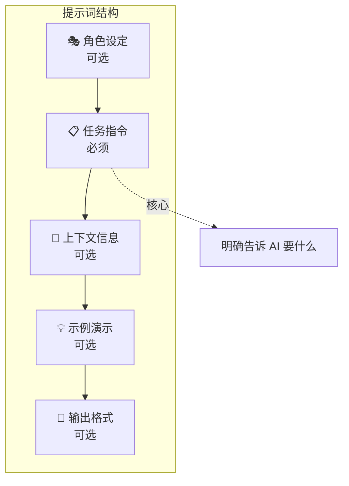
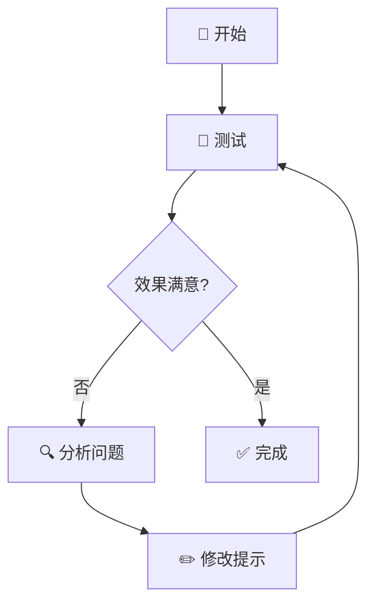

# 提示词工程（Prompt Engineering）

## 一句话解释

> [!tip] 一句话理解
> 提示词工程是**与 AI 对话的艺术**——通过精心设计输入，让大语言模型（LLM）准确理解你的意图，输出你想要的结果。

**牛津词典定义**：为人工智能程序制定和优化提示的动作和过程，以优化其输出或实现预期结果。

---

## 为什么存在？（解决什么问题）

> [!info] 背景
> 大语言模型（LLM）很强，但需要正确的"打开方式"。提示词工程就是那把钥匙。

### 没有提示词工程之前

- 同一个问题问 AI，答案时好时坏
- 想要特定格式的输出却总是"跑偏"
- 复杂任务 AI 总是答非所问

### 有了提示词工程之后

- 输出稳定可控，结果可预期
- 能精准控制输出格式和风格
- 复杂任务也能拆解完成

---

## 核心原理

### 理解 AI 的工作方式

> [!note] 类比
> 想象 AI 是一个**博览群书但不善言辞的天才**：
> - 它知道很多（训练数据）
> - 但需要你**明确引导**才能给出你想要的内容
> - 模糊的请求 = 模糊的回答

### 提示词的基本构成



**各部分说明：**

| 组成部分 | 说明 | 示例 |
|-----------|------|------|
| 角色设定 | 给 AI 分配身份 | "你是一位资深 Python 开发者" |
| 任务指令 | 明确要做什么 | "帮我写一个求斐波那契数列的函数" |
| 上下文信息 | 补充约束条件 | "用递归方式，代码要简洁" |
| 示例演示 | 展示期望格式 | "比如 fib(5) 应该返回 8" |
| 输出格式 | 指定输出样式 | "只返回代码，不要解释" |

---

## 关键要点

### 1. 三大核心技巧

| 技巧 | 英文 | 适用场景 | 难度 |
|------|------|----------|------|
| **零样本提示** | Zero-shot | 简单任务、模型能力强 | ⭐ |
| **少样本提示** | Few-shot | 需要特定格式、学习模式 | ⭐⭐ |
| **链式思考** | CoT | 复杂推理、多步骤任务 | ⭐⭐⭐ |

#### 零样本提示（Zero-shot）

> [!example] 示例
> 把这段文字翻译成英文：
> [文本...]

**原理**：不需要任何示例，直接下指令。模型根据预训练知识理解任务。

#### 少样本提示（Few-shot）

> [!example] 示例
> "farduddle"的意思是快速上下跳动。
> 用它造句："我们都开始庆祝并 farduddling。"
>
> 现在用 [新词] 造句：

**原理**：提供 1-3 个示例，让 AI 学习模式后输出。

> [!warning] 注意事项
> 示例格式要一致，2-3 个高质量示例 > 10 个低质量示例。

#### 链式思考（CoT）

> [!example] 示例
> 问题：小明有5个苹果，小红给了他3个，小明吃掉了2个，还剩多少？
> **让我们一步一步思考。**

**效果**：在数学推理、多步骤问题上有显著提升。

> [!tip] Zero-shot CoT
> 即使不提供示例，只需添加"让我们一步一步思考"也能激活推理能力。

---

### 2. 五大设计原则


1. **从简单开始**：先写一版看效果，再逐步添加细节
2. **使用清晰指令**：用动词开头（总结、翻译、分类、解释）
3. **保持具体性**：越具体，结果越准确
4. **避免不明确**：直接说"要什么"，别说"不要什么"
5. **正面表述**：说"做什么"比说"不做什么"更有效

---

### 3. 迭代优化方法

> [!tip] 核心理念
> 改进提示词显然有助于在不同任务上获得更好的结果。



**优化维度检查清单：**

- [ ] **清晰性**：任务目标明确吗？
- [ ] **完整性**：上下文够用吗？
- [ ] **准确性**：表述有没有歧义？

> [!note] 测试建议
> 固定模型参数（如 temperature=0）进行对比测试，记录每次修改的效果。

---

## 常见误区

| 误区 | 正解 |
|------|------|
| 提示词越长越好 | 关键信息清晰即可，冗余内容会分散注意力 |
| 模型会"读心术" | 模型不会猜你心思，必须明确表达 |
| 一次就写完美 | 迭代优化才是常态，测试-调整-再测试 |
| 只说"不要..." | 应该明确说"要什么"，正面表述更有效 |
| 示例越多越好 | 2-3 个高质量示例 > 10 个低质量示例 |

---

## 与其他概念的关系

- **大语言模型** — 提示词工程的操作对象
- **RAG** — 提示词工程的进阶应用（见 [[RAG技术入门指南]]）
- **AI Agent** — 结合工具使用的提示词工程

---

## 模型差异简述

> [!info] 主流模型对比
> 不同大语言模型（LLM）有不同的特点和使用技巧。

| 模型 | 开发者 | 上下文窗口 | 特点 | 提示建议 |
|------|--------|------------|------|----------|
| **GPT-4** | OpenAI | 128K | 多模态、推理强 | 善用系统消息，支持链式思考 |
| **Claude** | Anthropic | 200K | 写作好、代码强 | 推荐 XML 标签分隔内容 |
| **Gemini** | Google | 100万+ | 超长上下文 | 可一次输入大量信息 |
| **Llama** | Meta | 128K | 开源可本地部署 | 效果依赖具体版本和微调 |

> [!tip] Claude 技巧
> Anthropic 推荐使用 XML 标签分隔内容，如 `<topic>闭包</topic>`。

---

## 代码示例

### 基础提示词结构

```python
# 清晰的提示词 = 角色 + 指令 + 上下文 + 格式
prompt = """
你是一位资深产品经理。

任务：为一个待办事项 App 写用户故事。

要求：
1. 包含标题、描述、验收标准
2. 使用 Markdown 格式
3. 每个故事不超过 3 句话

示例格式：
## 用户故事标题
作为 [用户类型]，我希望 [功能]，以便 [收益]。
验收标准：...
"""
```

### 链式思考示例

```python
# 添加"让我们一步一步思考"激活推理能力
cot_prompt = """
问题：一个餐厅有 25 张桌子，每张桌子坐 4 人，今天坐满了 20 张，
另外 3 张各有 2 人，还剩多少空位？

让我们一步一步思考。
"""
```

---

## 一句话总结

> [!quote] 核心要义
> 像对待一个聪明但不善解人意的同事——**越清楚地说你要什么，越能得到你想要的**。

---

## 思考题

1. **什么时候用零样本提示，什么时候用少样本提示？** 考虑任务复杂度和模型能力。

2. **为什么"让我们一步一步思考"能提升推理效果？** 这和人类的什么认知习惯相似？

3. **你遇到过 AI 输出"跑偏"的情况吗？** 用本文学到的原则分析，可能是什么原因？

4. **如何为一个新领域设计提示词模板？** 假设你需要批量处理某种文档。

5. **提示词工程会被 AI 自己取代吗？** 思考"自动提示工程师"（APE）的发展。

---

%% 编辑备注 %%
- 来源：[R1-R5] dair-ai / Wikipedia
- 创建日期：2026-05-14
- 相关笔记：大语言模型 / [[RAG技术入门指南]] / AI Agent
