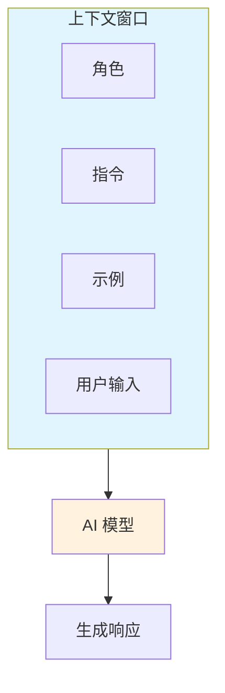
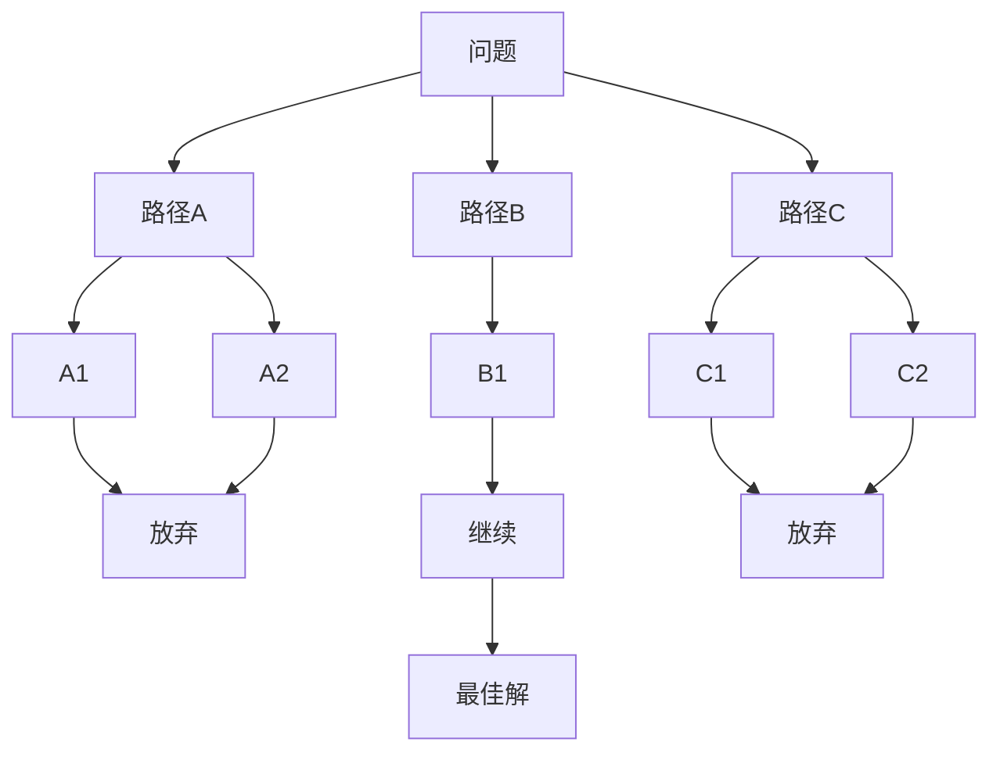
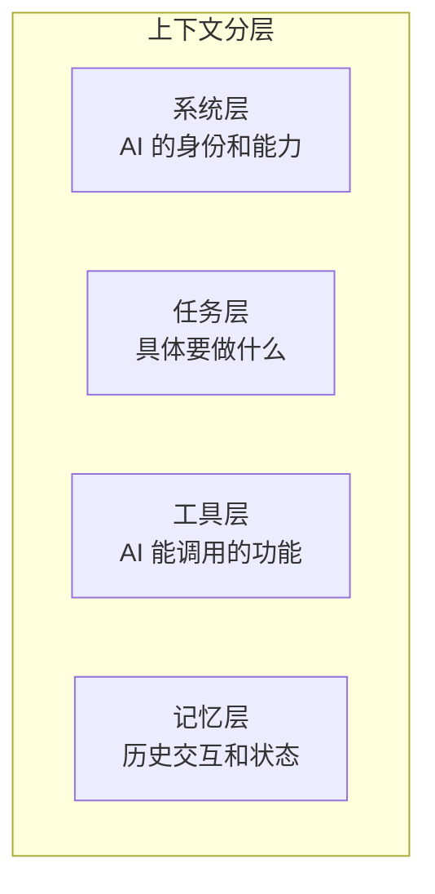

# AI 上下文工程

> [!abstract] 一句话解释
> 上下文工程是**设计和优化与 AI 对话时提供的所有信息**（指令、示例、角色、工具描述等），让 AI 更准确地完成任务的系统化方法。

---

## 为什么存在？（解决什么问题）

**没有上下文工程之前**：

- 你对 AI 说 "帮我写篇文章"，AI 给你一篇完全不符合预期的文章
- 你想让 AI 用专业术语，它却用大白话
- 同样的问题，今天回答 A，明天回答 B，不稳定

**有了上下文工程之后**：

- 通过精心设计的提示词，AI 的输出更可预测、更符合需求
- 从 ==「碰运气」== 变成 ==「可控对话」==

---

## 核心原理

可以把 AI 看作一个**非常聪明但健忘的助手**：



> [!tip] 核心原理
> 上下文窗口的大小是有限的，上下文工程就是在 ==有限的空间里，放置最有价值的信息==。

---

## 关键要点

### 1. 提示工程 vs 上下文工程

| 对比维度 | 提示工程 | 上下文工程 |
|----------|----------|------------|
| **范围** | 只优化「提示」本身 | 优化所有提供的上下文 |
| **包括** | 措辞、格式 | 系统提示、工具描述、记忆管理、RAG |
| **适用** | 简单对话 | 复杂 Agent 系统 |

> [!info] 来源
> 上下文工程是提示工程的进化版。

---

### 2. 零样本提示 (Zero-shot)

不提供任何示例，直接下达指令。

```
示例："把这段文字翻译成英文：今天天气真好"
模型：Today is a really nice day.
```

**适用场景**：

- 任务简单明了
- 你不确定该提供什么示例
- 现代大模型（GPT-4、Claude 3）本身就很强

> [!tip] 最佳实践
> 从零样本开始尝试，如果效果不佳再升级到少样本或思维链。

---

### 3. 少样本提示 (Few-shot)

在提示中加入 1-3-5 个示例，让 AI「模仿」。

```
示例：
苹果 -> 水果
香蕉 -> 水果
胡萝卜 -> [AI回答：蔬菜]
```

**关键发现**：

- 示例的 ==格式== 比正确答案更重要
- 即使随机标签也比没有示例好
- 格式一致性是关键

> [!warning] 局限
> 复杂推理任务（如多步算术）效果差，建议使用思维链。

---

### 4. 思维链提示 (Chain-of-Thought, CoT)

通过展示 ==推理过程== 而不是直接给答案，显著提升复杂任务的准确性。

```
普通方式：
问：买2本书，每本15元，一共多少元？
答：30元

思维链方式：
问：买2本书，每本15元，一共多少元？
答：先算一本书15元，买2本就是2×15=30元。所以答案是30元。
```

**零样本 CoT**：只需加一句 `"Let's think step by step"`（让我们一步步思考）

---

### 5. 思维树 (Tree of Thoughts, ToT)

思维链的升级版——不只有一条推理路径，而是 ==同时探索多条路径==，然后选择最优解。



**适用**：需要战略规划的复杂问题（如 24 点游戏）

---

### 6. 角色提示 (Role Prompting)

告诉 AI「你是谁」，影响它的回答风格和专业度。

```
你是一位有10年经验的高级软件工程师，用简洁专业的语言回答问题。
```

**效果对比**：

| 角色 | 同一问题「什么是递归？」 |
|------|-------------------------|
| 无角色 | "递归就是自己调用自己" |
| 小学教师 | "递归就像俄罗斯套娃，打开一个里面还有一个..." |
| 计算机教授 | "递归是函数调用自身的计算范式，包含基准情况和递归情况..." |

---

### 7. 上下文工程分层架构



**各层职责**：

| 层级 | 职责 | 示例 |
|------|------|------|
| 系统层 | 定义 AI 身份 | "你是一位资深律师" |
| 任务层 | 具体任务指令 | "总结这篇文档的要点" |
| 工具层 | 可调用功能 | 代码执行、搜索 API |
| 记忆层 | 历史状态 | 对话摘要、用户偏好 |

---

## 常见误区

| 误区 | 正解 |
|------|------|
| "提示词越长越好" | 简洁精准更好，过长反而稀释关键信息 |
| "多加示例总没错" | 示例过多会占用上下文空间，且可能造成混淆 |
| "模型会理解我的言外之意" | 模型只看字面意思，==有话直说== |
| "一次调教终身有效" | 每次对话都是独立的，需要重复关键上下文 |

---

## 与其他概念的关系

- **大语言模型 (LLM)** — 上下文工程作用于 LLM 的上下文窗口
- **检索增强生成 (RAG)** — 上下文工程的重要组成部分 [[RAG技术入门指南]]
- **AI Agent** — 深度依赖上下文工程来管理状态和工具 [[Agent智能体]]

---

## 提示词示例

### 零样本情感分类

```
请将以下文本分类为正面、负面或中性：

文本：我觉得这个产品还行，但有些地方需要改进。

分类：
```

> [!example]- 输出
> `中性`

---

### 角色 + 约束的完整示例

```
你是一位资深技术面试官，负责考察候选人的算法能力。

要求：
1. 只考察 LeetCode 中等难度题目
2. 先让候选人分析思路，再让对方写代码
3. 代码写完后，给出 2-3 个优化方向的问题
4. 保持专业但不刻薄的语气

候选问题：两数之和
```

---

### 结构化输出

```
请以 JSON 格式返回结果，字段如下：
{
  "title": "文章标题",
  "summary": "50字以内的摘要",
  "tags": ["标签1", "标签2"],
  "word_count": 字数
}
```

---

## 一句话总结

> [!quote] 核心
> **把正确的信息，在正确的位置，以正确的方式传递给 AI。**

---

## 思考题

1. **对比思考**：为什么同样的提示词在不同模型（GPT-3.5 vs GPT-4）上效果差异很大？这对上下文工程意味着什么？

2. **应用场景**：如果你要开发一个 AI 客服系统，你会如何设计它的上下文？（提示：考虑系统层和工具层）

3. **边界情况**：假设你的提示词非常长，超过了模型的上下文窗口限制，你会怎么处理？

4. **实际练习**：用「思维链」和不用「思维链」分别测试一个数学推理问题，记录结果差异。

5. **进阶思考**：上下文工程和传统的软件配置有何异同？为什么说它是一门「工程」学科？

---

%% 待补充：更多实战案例、不同模型的提示词差异 %%

---

> [!meta] 元信息
> - **创建日期**：2026-05-14
> - **学习方向**：概念理解
> - **目标读者**：AI 初学者
