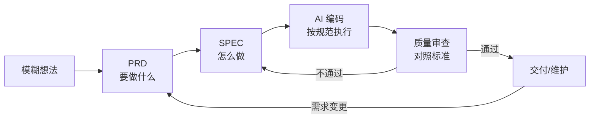

# 规范驱动开发 SDD

> Specification-Driven Development —— 通过规范文档驱动 AI 精准编程的开发方法论。

## 为什么 AI 编程需要"规范"

你有没有过这种经历：在淘宝买衣服时，你描述"我要一件好看的衣服"，结果收到的和你想的完全不一样？这就是**沟通不精准**导致的。

AI 编程也是一样。如果你告诉 AI"帮我做一个网站"，它可能做出一个和你期望完全不同的东西。"垃圾进，垃圾出"——模糊的需求必然导致不准确的结果。

> [!note] 规范即合同
> **规范（Specification）就是你和 AI 之间的"合同"**，它明确地写清楚：
> - 要做什么（功能需求）
> - 怎么做（技术方案）
> - 做到什么程度（质量标准）
>
> 有了这份"合同"，AI 才能精准地理解你的意图。

## SDD 的定位：与其他 XDD 方法论的关系

SDD 不是凭空创造的概念，它处在已有方法论谱系中，解决的是 AI 编程时代的独特问题：

| 方法论 | 核心驱动 | 驱动者 | 适用时代 |
|-------|---------|--------|---------|
| **TDD** (Test-Driven Dev) | 测试用例 | 开发者 | 传统编程 |
| **BDD** (Behavior-Driven Dev) | 行为场景 | 产品 + 开发者 | 协作开发 |
| **DDD** (Domain-Driven Dev) | 领域模型 | 领域专家 + 开发者 | 复杂业务 |
| **SDD** (Spec-Driven Dev) | 规范文档 | **人 + AI** | AI 编程 |

> [!note] SDD 的独特价值
> TDD/BDD/DDD 的"驱动者"都是人，规范写在开发者脑中或团队文档中。而 **SDD 的规范是写给 AI 看的**——它是你与 AI 之间的共享上下文，确保 AI 在长对话中不跑偏、不遗忘。

SDD 可以和 TDD 共存：先用 PRD/SPEC 让 AI 理解全局，再用 TDD 保证代码质量。它们是互补关系，不是替代关系。

## SDD 完整工作流

PRD、SPEC、质量标准三份文档不是孤立的，它们构成一条完整的开发流水线：



### 各阶段的检查点

| 阶段 | 产出 | 检查标准 |
|------|------|---------|
| 1. PRD | `specs/PRD.md` | 用户故事覆盖所有核心场景 |
| 2. SPEC | `specs/SPEC.md` | 技术方案可实现 PRD 所有需求 |
| 3. 编码 | 源代码 | 代码符合 SPEC 设计、遵循质量规范 |
| 4. 审查 | 审查报告 | 满足验收标准，无安全/性能问题 |
| 5. 维护 | 变更记录 | 需求变更同步更新 PRD → SPEC → 代码 |

> [!tip] 迭代而非一次性
> 不要试图一开始就写出完美的规范。PRD 可以先写核心功能，SPEC 可以先做粗略设计，在编码和审查中逐步完善。规范本身也是迭代的。

## 需求规范：PRD 文档

**PRD（Product Requirements Document，产品需求文档）** 描述的是"要做什么"。

### 用户故事格式

```
作为一个 [角色]，
我希望 [功能]，
以便 [价值/目的]。
```

**示例：**
```
作为一个博客读者，
我希望能按标签筛选文章，
以便快速找到我感兴趣的内容。
```

### 验收标准格式

```
Given（前提条件）：系统中有20篇文章，其中5篇标记了"Python"标签
When（操作）：用户点击"Python"标签
Then（预期结果）：页面只显示这5篇标记了"Python"标签的文章
```

### 用 AI 辅助生成 PRD

这是一个非常实用的技巧——你可以让 AI 帮你把模糊的想法变成结构化的需求文档：

```text
我想做一个个人书签管理工具。

请帮我生成一份完整的PRD文档，包含：
1. 项目概述（一句话描述）
2. 目标用户
3. 核心功能列表（按优先级排列：Must Have / Should Have / Nice to Have）
4. 每个功能的用户故事和验收标准
5. 非功能需求（性能、安全、兼容性）

请用Markdown格式输出。
```

> [!tip] 项目实操
> 在完整项目实操中，会完整演示如何用这个方法生成 PRD 文档。

## 技术规范：SPEC 文档

**SPEC（Technical Specification，技术规范文档）** 描述的是"怎么做"。

### SPEC 文档结构

| 模块 | 内容 | 说明 |
|------|------|------|
| 系统架构 | 整体架构设计图 | 前后端如何交互 |
| 技术选型 | 使用什么技术和框架 | 比如 Next.js + Prisma + SQLite |
| 数据模型 | 数据库表结构设计 | 有哪些表、每个表有哪些字段 |
| API 接口 | 接口定义 | 每个 API 的 URL、请求参数、返回格式 |
| 目录结构 | 项目文件组织 | 代码放在哪个文件夹 |

### 从 PRD 自动生成 SPEC

```text
基于以下PRD文档，请生成对应的技术规范文档（SPEC）：

[粘贴你的PRD内容]

要求：
1. 推荐技术选型并说明理由
2. 设计完整的数据模型（包含字段类型和关系）
3. 列出所有API接口（RESTful风格）
4. 给出建议的项目目录结构
```

## 质量规范

质量规范定义了"做到什么程度算合格"：

- **编码规范**：代码风格统一、命名规则、注释要求
- **测试规范**：需要覆盖哪些测试场景
- **安全规范**：输入验证、认证授权、数据保护

> [!tip] 循序渐进
> 对于初学者来说，不需要一开始就写完美的规范文档。从简单的 PRD 开始，随着项目变复杂再逐步完善。规范的核心价值在于——**让你和 AI 的沟通更精准**。

## 质量规范的落地

> [!warning] 质量规范不是空话
> 质量规范必须**可检查、可自动化**，否则就是一纸空文。

### 质量规范的三个层次

| 层次 | 检查方式 | 示例 |
|------|---------|------|
| **自动检查** | linter / 类型系统 / 测试 | ESLint、TypeScript、Jest |
| **AI 审查** | 给 AI 的审查 prompt | "检查代码是否有安全漏洞" |
| **人工审查** | Code Review checklist | "是否覆盖了边界情况" |

### 让 AI 自检质量的 Prompt

```text
请对以下代码进行质量审查，按维度打分（1-5分）：
1. 正确性：逻辑是否有缺陷？
2. 安全性：是否存在注入或泄露风险？
3. 可读性：命名是否清晰？是否需要注释？
4. 性能：有无明显低效操作？

代码：
[粘贴代码]
```

### 质量分级标准

| 级别 | 适用场景 | 要求 |
|------|---------|------|
| MVP 级 | 原型验证、个人工具 | 核心功能可用，无阻断 Bug |
| 生产级 | 对外服务、团队项目 | 完善错误处理、日志、安全防护 |
| 关键级 | 金融、医疗、安全 | 全面测试覆盖、审计日志、容灾 |

## 规范文件的组织与管理

建议在项目根目录下创建一个 `specs/` 文件夹，统一管理规范文件：

```
my-project/
├── specs/
│   ├── PRD.md           # 产品需求文档
│   ├── SPEC.md           # 技术规范
│   ├── ARCHITECTURE.md   # 架构设计
│   └── API.md           # API 接口文档
├── src/                 # 源代码
├── CLAUDE.md            # 给 Claude Code 的项目说明
└── package.json
```

规范文件最大的价值之一是——**可以直接作为 AI 工具的上下文输入**。当你把 SPEC.md 的内容提供给 Claude Code 时，它就能精准地按照你的技术方案来写代码。

## 完整案例：个人书签管理工具

下面用一个微型项目把 PRD → SPEC → 编码串起来。

### PRD（要做什么）

```markdown
# 书签管理工具 PRD

## 用户故事
作为一个经常上网看文章的用户，
我希望能快速保存和分类书签，
以便日后轻松找到之前看过的内容。

## 验收标准
- Given 用户在浏览器中浏览任意网页
  When 用户点击浏览器扩展图标
  Then 弹出保存窗口，自动填入当前页面标题和 URL

- Given 用户已保存 50+ 个书签
  When 用户按标签筛选
  Then 只显示匹配标签的书签，1 秒内返回结果
```

### SPEC（怎么做）

基于 PRD，让 AI 生成 SPEC：

```text
基于以下PRD，生成技术规范：
[粘贴 PRD]

请用 Next.js + TailwindCSS + SQLite 技术栈。
```

**生成的 SPEC 关键内容：**

| 模块 | 设计 |
|------|------|
| 数据模型 | Bookmark { id, title, url, tags[], createdAt } |
| API 接口 | POST /api/bookmarks、GET /api/bookmarks?tag=xxx、DELETE /api/bookmarks/:id |
| 前端页面 | 书签列表页、添加书签弹窗、标签筛选栏 |
| 目录结构 | `app/` `components/` `lib/` `prisma/` `types/` |

### 编码（AI 执行）

将 SPEC 提供给 Claude Code，它就能：
1. 理解完整的数据模型和 API 设计
2. 按目录结构创建文件
3. 实现 GIVEN/WHEN/THEN 定义的验收标准
4. 遵循质量规范中的编码风格

> [!example] SDD 的核心价值
> 没有 PRD 和 SPEC，你需要分段描述需求，AI 可能在第 3 步就忘了第 1 步的约定。
> 有了规范文档，AI 一开始就拥有全局视野，所有决策都基于同一份"合同"。

---

## 在本项目中的实践

这套 SDD 方法论与当前 vault 的运作方式高度对应：

| SDD 概念 | 本 vault 中的对应物 |
|---------|-------------------|
| PRD（要做什么） | 学习笔记的 `00_intent.md` — 明确学习目标和范围 |
| SPEC（怎么做） | `CLAUDE.md` — 定义项目架构、文件规范、技能路由 |
| 质量标准 | `.claude/rules/` 下的各规则文件 — 编码、提交、安全检查 |
| 目录结构规范 | `specs/` 对应本 vault 的 `docs/` 和 `templates/` |
| 给 AI 的上下文 | `CLAUDE.md` + `.claude/rules/` 就是 AI 的 SPEC |

当你在这个 vault 中创建新笔记时，实际上就在执行 SDD 流程：
1. 明确要写什么（PRD）→ 确定笔记主题和范围
2. 按模板组织（SPEC）→ 遵循 `01-基础概念/` 等目录约定
3. 质量检查（质量标准）→ 确保 frontmatter、双链、Callout 完整

---

## 相关笔记

- [[Claude Code 教程/高级功能/CLAUDE.md 使用指南]] - 给 AI 的项目级规范文档
- [[提示词工程]] - 精准表达需求的底层能力（待创建）
