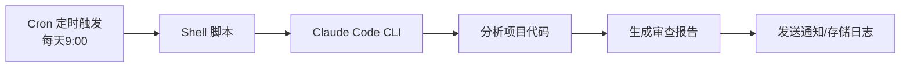

# Claude Code 定时任务自动化指南

> [!info] 概述
> **一句话定义**：通过结合操作系统级定时任务（Cron）和 Claude Code 的命令行能力，实现代码审查、依赖监控、自动重构等任务的定时自动化执行。
>
> **通俗比喻**：就像给 Claude Code 配了一个"智能闹钟"，每天固定时间自动醒来干活——晚上帮你检查代码、周末生成报告、周一早上推送分析结果。

## 核心概念

### 是什么

**Claude Code 定时任务自动化** 是一种将 Claude Code CLI 与操作系统调度工具（如 Cron）结合的方案，实现：
- **定时执行**：每天、每周、每月自动运行任务
- **无人值守**：夜间自动处理代码分析、备份等工作
- **持续改进**：定期代码审查、依赖更新检查

### 为什么需要

| 问题 | 手动方式 | 自动化方式 |
|------|----------|------------|
| 代码审查 | 每次手动运行命令 | 每天早上自动执行并生成报告 |
| 依赖监控 | 定期手动检查 npm/pip | 自动检测安全漏洞并通知 |
| 报告生成 | 周末手动汇总 | 周一早上自动推送到邮箱 |
| 备份验证 | 手动执行备份脚本 | 每晚自动备份+分析变更 |

### 通俗理解

**🎯 比喻**：Claude Code + Cron 就像一个"夜间值守的程序员"

```
[你的工作日]          [夜间的 Claude Code]
    ↓                      ↓
下班回家休息  →  自动检查代码质量
                      自动分析依赖安全
                      自动生成报告
                      第二天早上推送结果
```

**📦 示例**：每日代码审查自动化流程



## 技术细节

### 1. 前置准备

> [!info] 📚 来源
> - [Claude Code + Cron Automation Complete Guide](https://smartscope.blog/en/generative-ai/claude/claude-code-cron-schedule-automation-complete-guide-2025/) - SmartScope

**环境检查**：
```bash
# 检查 Cron 是否可用
crontab -l

# 验证 Claude Code 安装
claude --version

# 创建工作目录
mkdir -p ~/claude-automation/{scripts,logs,config,reports}
cd ~/claude-automation
```

### 2. 基础定时脚本

**daily-code-review.sh**：
```bash
#!/bin/bash

# Claude Code 定时代理脚本
LOG_FILE="$HOME/claude-automation/logs/daily-$(date +%Y%m%d).log"
PROJECT_PATH="$HOME/projects/my-app"

echo "=== Claude Code Daily Review: $(date) ===" >> "$LOG_FILE"

cd "$PROJECT_PATH" || exit 1

# 执行代码审查
claude code . --prompt "检查项目整体代码质量，输出改进建议：
1. 代码规范问题
2. 潜在的安全风险
3. 性能优化建议
4. 测试覆盖率评估" \
  --output "$HOME/claude-automation/reports/review-$(date +%Y%m%d).md" \
  >> "$LOG_FILE" 2>&1

echo "=== Review Completed: $(date) ===" >> "$LOG_FILE"
```

### 3. Crontab 配置

```bash
# 编辑 crontab
crontab -e

# 配置示例
# 每天 9:00 执行代码审查
0 9 * * * /home/user/claude-automation/scripts/daily-code-review.sh

# 每周一 10:00 执行全面扫描
0 10 * * 1 /home/user/claude-automation/scripts/weekly-scan.sh

# 每月 1 号 8:00 生成月度报告
0 8 1 * * /home/user/claude-automation/scripts/monthly-report.sh

# 每小时执行轻量检查
0 * * * * /home/user/claude-automation/scripts/hourly-check.sh
```

### 4. 实用自动化模式

> [!info] 📚 来源
> - [GitHub Issue #30649 - Scheduled/Cron Support](https://github.com/anthropics/claude-code/issues/30649) - 功能请求
> - [Scheduled Tasks: How to Put Claude on Autopilot](https://atalupadhyay.wordpress.com/2026/03/02/scheduled-tasks-how-to-put-claude-on-autopilot/) - 教程

#### 模式一：自动备份 + 代码分析

```bash
#!/bin/bash

BACKUP_DIR="$HOME/backups/$(date +%Y%m%d)"
PROJECT_DIR="$HOME/projects/webapp"
LOG_FILE="$HOME/claude-automation/logs/backup-$(date +%Y%m%d).log"

# 创建备份
mkdir -p "$BACKUP_DIR"
rsync -av "$PROJECT_DIR/" "$BACKUP_DIR/" >> "$LOG_FILE"

# 用 Claude Code 分析变更
cd "$PROJECT_DIR" || exit 1

claude code . --prompt "
分析自昨天的变更：
1. 新增功能概述
2. 潜在安全风险
3. 性能改进建议
4. 测试覆盖建议

用中文输出报告。" \
  --output "$HOME/claude-automation/reports/daily-analysis-$(date +%Y%m%d).md" \
  >> "$LOG_FILE" 2>&1
```

#### 模式二：依赖监控与更新

```bash
#!/bin/bash

PROJECT_DIR="$HOME/projects/webapp"
ALERT_WEBHOOK="https://hooks.slack.com/services/YOUR/WEBHOOK"

cd "$PROJECT_DIR" || exit 1

# 检查依赖安全性
ANALYSIS_RESULT=$(claude code . --prompt "
分析 package.json 中的依赖：
1. 有安全漏洞的包
2. 有重大更新的包
3. 已废弃的包
4. 推荐的安全更新列表

用 JSON 格式输出结果。" --format json)

# 高危漏洞告警
if echo "$ANALYSIS_RESULT" | jq -r '.security_issues[]' | grep -q "critical"; then
    curl -X POST -H 'Content-type: application/json' \
      --data '{"text":"🚨 检测到严重安全漏洞！"}' \
      "$ALERT_WEBHOOK"
fi

# 保存报告
echo "$ANALYSIS_RESULT" > "$HOME/claude-automation/reports/dependency-$(date +%Y%m%d).json"
```

#### 模式三：自动重构

```bash
#!/bin/bash

PROJECT_DIR="$HOME/projects/api-server"
BRANCH_NAME="auto-refactor-$(date +%Y%m%d)"

cd "$PROJECT_DIR" || exit 1

# 创建新分支
git checkout -b "$BRANCH_NAME"

# 执行重构
claude code . --prompt "
按以下标准重构代码：
1. 消除重复代码
2. 拆分过长函数（超过100行）
3. 改善变量命名
4. 添加必要注释
5. 优化 TypeScript 类型定义

输出变更文件列表和变更原因。" \
  --execute \
  --output "$HOME/claude-automation/reports/refactor-log-$(date +%Y%m%d).md"

# 如果有变更则提交
if git diff --quiet; then
    echo "无变更需要提交"
    git checkout main
    git branch -d "$BRANCH_NAME"
else
    git add .
    git commit -m "🤖 自动重构: $(date +%Y-%m-%d)

    Claude Code 自动重构：
    - 代码重复消除
    - 函数分解
    - 变量命名改进
    - 类型定义优化"

    git push origin "$BRANCH_NAME"

    # 创建 PR（使用 GitHub CLI）
    gh pr create --title "🤖 自动重构 $(date +%Y-%m-%d)" \
      --body "Claude Code + Cron 自动代码改进" \
      --base main --head "$BRANCH_NAME"
fi
```

### 5. 高级技巧

#### 条件执行

```bash
#!/bin/bash

PROJECT_DIR="$HOME/projects/webapp"
CONFIG_FILE="$HOME/claude-automation/config/settings.json"

# 读取上次处理的 commit
LAST_COMMIT=$(jq -r '.last_processed_commit' "$CONFIG_FILE")
CURRENT_COMMIT=$(cd "$PROJECT_DIR" && git rev-parse HEAD)

# 仅在有新提交时执行
if [ "$LAST_COMMIT" != "$CURRENT_COMMIT" ]; then
    echo "检测到新提交，开始分析..."

    cd "$PROJECT_DIR" || exit 1

    CHANGED_FILES=$(git diff --name-only "$LAST_COMMIT" HEAD)

    claude code . --prompt "
    以下文件发生变更：
    $CHANGED_FILES

    分析变更：
    1. 影响范围评估
    2. 需要的测试
    3. 部署前检查清单
    4. 潜在风险评估
    " --output "$HOME/claude-automation/reports/change-analysis-$(date +%Y%m%d-%H%M).md"

    # 更新配置
    jq --arg commit "$CURRENT_COMMIT" '.last_processed_commit = $commit' \
      "$CONFIG_FILE" > tmp.json && mv tmp.json "$CONFIG_FILE"
else
    echo "无新提交，跳过分析"
fi
```

#### 并行执行与锁机制

```bash
#!/bin/bash

LOCK_FILE="/tmp/claude-automation.lock"
MAX_PARALLEL=3

# 获取锁
exec 200>"$LOCK_FILE"
if ! flock -n 200; then
    echo "另一个实例正在运行，退出..."
    exit 1
fi

# 并行处理多个项目
PROJECTS=(
    "$HOME/projects/frontend"
    "$HOME/projects/backend"
    "$HOME/projects/mobile-app"
)

for project in "${PROJECTS[@]}"; do
    claude code "$project" --prompt "安全分析" \
      --output "$HOME/claude-automation/reports/security-$(basename "$project")-$(date +%Y%m%d).md" &

    # 限制并行数
    job_count=$(jobs -r | wc -l)
    if [ "$job_count" -ge $MAX_PARALLEL ]; then
        wait -n
    fi
done

wait
flock -u 200
```

### 6. 错误处理与通知

```bash
#!/bin/bash

set -euo pipefail

LOG_FILE="$HOME/claude-automation/logs/main-$(date +%Y%m%d).log"
ERROR_LOG="$HOME/claude-automation/logs/error-$(date +%Y%m%d).log"
WEBHOOK_URL="https://hooks.slack.com/services/YOUR/SLACK/WEBHOOK"

# 错误处理器
error_handler() {
    local line_no=$1
    local error_code=$2

    echo "第 $line_no 行出错，退出码: $error_code" | tee -a "$ERROR_LOG"

    # Slack 通知
    curl -X POST -H 'Content-type: application/json' \
      --data "{\"text\":\"Claude Code 自动化失败：第 $line_no 行，错误码 $error_code\"}" \
      "$WEBHOOK_URL"

    exit "$error_code"
}

trap 'error_handler ${LINENO} $?' ERR

# 主流程
{
    echo "=== 开始执行: $(date) ==="

    # 执行各项检查
    # run_security_scan
    # run_performance_analysis
    # run_code_quality_check

    echo "=== 执行完成: $(date) ==="

    # 成功通知
    curl -X POST -H 'Content-type: application/json' \
      --data '{"text":"✅ Claude Code 自动化执行成功"}' \
      "$WEBHOOK_URL"

} 2>&1 | tee -a "$LOG_FILE"
```

### 7. Claude Code Hooks 集成

> [!info] 📚 来源
> - [Hooks reference - Claude Code Docs](https://code.claude.com/docs/en/hooks) - 官方文档
> - [Get started with Claude Code hooks](https://code.claude.com/docs/en/hooks-guide) - 入门指南

Claude Code 的 Hooks 功能可以在特定生命周期事件触发时执行自定义操作，与定时任务结合使用更强大。

**常用 Hook 事件**：
| 事件 | 触发时机 |
|------|----------|
| `SessionStart` | 会话开始时 |
| `PostToolUse` | 工具调用成功后 |
| `PostToolUseFailure` | 工具调用失败后 |
| `Stop` | 会话结束时 |

**配置示例** (`.claude/settings.json`)：
```json
{
  "hooks": {
    "PostToolUse": [
      {
        "matcher": "Bash",
        "hooks": [
          {
            "type": "command",
            "command": "echo '任务完成: $(date)' >> $HOME/claude-automation/logs/hooks.log"
          }
        ]
      }
    ]
  }
}
```

## 与其他概念的关系

| 概念 | 关系 |
|------|------|
| [[N8N定时抓取热点资讯指南]] | N8N 是可视化工作流工具，Claude Code + Cron 是命令行自动化方案，两者可互补 |
| [[Claude Code 自定义斜杠命令教程]] | 斜杠命令可封装常用 prompt，在定时脚本中调用 |
| [[Claude MCP 使用指南]] | MCP 扩展可增强 Claude Code 能力，在定时任务中使用 |
| [[../01-基础概念/Agent智能体]] | 定时自动化可视为"固定逻辑的智能体" |

## 最佳实践

### 1. 渐进式引入
- 从轻量任务开始（如日志分析）
- 验证稳定后再增加复杂任务
- 先手动测试脚本，再配置 Cron

### 2. 环境变量处理
```bash
#!/bin/bash
# Cron 环境变量有限，需显式设置
export PATH="/usr/local/bin:/usr/bin:/bin:$HOME/.local/bin"
export NODE_PATH="/usr/local/lib/node_modules"

# 执行前验证环境
which claude || exit 1
```

### 3. 日志管理
```bash
# 日志轮转脚本
LOG_DIR="$HOME/claude-automation/logs"
RETENTION_DAYS=30

# 归档 30 天前的日志
find "$LOG_DIR" -name "*.log" -mtime +$RETENTION_DAYS -exec gzip {} \;
```

### 4. 安全建议
- 敏感信息使用环境变量存储
- 定期轮换 API Key
- 限制脚本执行权限 (`chmod +x`)
- 使用文件锁防止重复执行

### 5. 监控与告警
- 配置 Slack/邮件通知
- 记录执行指标（成功率、耗时）
- 定期审查日志

## 常见问题

**Q: Cron 任务执行失败，提示找不到 claude 命令？**
A: Cron 环境变量有限，需在脚本开头显式设置 `PATH`，或使用完整路径 `/usr/local/bin/claude`

**Q: 如何调试 Cron 脚本？**
A:
```bash
# 添加调试信息
DEBUG_LOG="$HOME/claude-automation/debug-$(date +%Y%m%d-%H%M).log"
{
    echo "=== Debug Info: $(date) ==="
    echo "User: $(whoami)"
    echo "PATH: $PATH"
    which claude || echo "Claude not found"
} >> "$DEBUG_LOG" 2>&1
```

**Q: 定时任务执行时间过长怎么办？**
A: 使用 `timeout` 限制执行时间，或拆分为多个小任务
```bash
timeout 3600 claude code . --prompt "分析代码"  # 最多1小时
```

**Q: 如何避免重复执行？**
A: 使用文件锁
```bash
LOCK_FILE="/tmp/claude-task.lock"
[ -f "$LOCK_FILE" ] && exit 0
touch "$LOCK_FILE"
# ... 执行任务 ...
rm "$LOCK_FILE"
```

**Q: Claude Code 有原生定时任务支持吗？**
A: 目前没有。根据 [GitHub Issue #30649](https://github.com/anthropics/claude-code/issues/30649)，需要结合系统级 Cron 实现。

## 相关文档
- [[AI学习/00-索引/MOC|AI学习索引]]
- [[如何使用Claude code|Claude Code 使用指南]]
- [[Claude Code 自定义斜杠命令教程]]

## 参考资料

### 官方资源
- [Claude Code Hooks 官方文档](https://code.claude.com/docs/en/hooks) - Hooks 参考文档
- [Claude Code Hooks 入门指南](https://code.claude.com/docs/en/hooks-guide) - 入门教程
- [GitHub Issue #30649 - Scheduled/Cron Support](https://github.com/anthropics/claude-code/issues/30649) - 功能请求

### 社区资源
- [Claude Code + Cron Automation Complete Guide](https://smartscope.blog/en/generative-ai/claude/claude-code-cron-schedule-automation-complete-guide-2025/) - SmartScope 完整教程
- [Scheduled Tasks: How to Put Claude on Autopilot](https://atalupadhyay.wordpress.com/2026/03/02/scheduled-tasks-how-to-put-claude-on-autopilot/) - 自动化教程
- [Reddit: Claude now works my night shift](https://www.reddit.com/r/ClaudeAI/comments/1qflv3y/claude_now_works_my_night_shift_heres_how_i_set/) - 用户实践经验
- [TheNeuron: Automate Recurring Tasks](https://www.theneuron.ai/explainer-articles/claude-code-recurring-automations-tutorial/) - 非技术用户教程

### 视频教程
- [The AI Agent Cron Job Inception Strategy](https://www.youtube.com/watch?v=0Y0jbaoREHc) - YouTube
- [Claude Code Commands & Cron Jobs Tutorial](https://www.youtube.com/watch?v=l6V0u3ZIgDI) - YouTube
