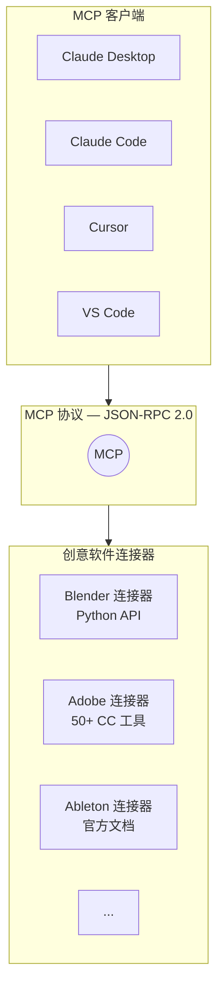
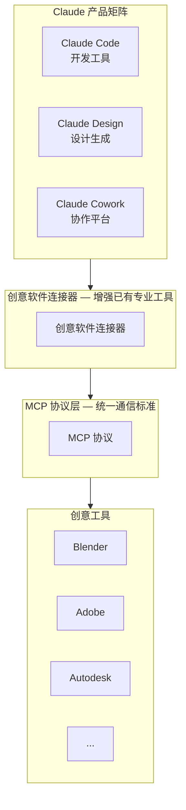

# Claude 创意软件连接器（Creative Software Connectors）

> [!info] 概述
> **一句话定义**：Claude 创意连接器是基于 [[01-基础概念/MCP协议]] 开放标准构建的一组集成，让 Claude 能直接"进入"专业创意软件内部，用自然语言操控工具、分析项目、执行批量操作。
>
> **通俗比喻**：想象你是一位乐队指挥。以前你只能对着乐手喊"把那个音调高一点"，现在你直接坐在每个���手旁边，手把手帮他调整琴弦。连接器就是让 Claude 坐到 Blender、Adobe、Ableton 这些"乐手"旁边的那个座位。

---

## 核心概念

### 是什么

Claude 创意软件连接器（Creative Software Connectors）是 Anthropic 于 **2026 年 4 月 28 日**正式发布的一组 MCP 集成，共覆盖 9 个创意工具连接器。它们让 Claude 通过 [[01-基础概念/MCP协议]] 协议直接与专业创意软件交互，而非在聊天窗口中"从零生成"创意内容。

**关键定位**：
- 连接器 **不同于** Claude Code（开发者工具）、Claude Cowork（协作平台）、Claude Design（设计生成）
- 面向**已掌握专业工具**的创意专业人士，而非替代工具本身
- 兼容所有主流 MCP 客户端：Claude Desktop、Claude Code、Cursor、VS Code、Windsurf 等
- 对**所有 Claude 计划开放**，包括免费计划

> [!info] 来源
> - [Anthropic 官方公告](https://www.anthropic.com/news/claude-for-creative-work)
> - [9to5Mac 报道](https://9to5mac.com/2026/04/28/anthropic-releases-9-new-claude-connectors-for-creative-tools-including-blender-and-adobe/)

### 为什么需要

传统 AI 创意工具的思路是"在聊天界面内生成内容"（如 DALL-E、Midjourney）。但专业创意工作者的实际痛点不是"不会创作"，而是：

1. **工具学习曲线陡峭** —— Blender 有上千个功能，Adobe 全家桶的学习周期以月计
2. **重复操作耗时** —— 批量重命名图层、导出多种格式、统一调整参数
3. **跨工具协作困难** —— 设计稿到 3D 模型、音频到视频的数据流转需要手动搬运
4. **脚本门槛高** —— Python 脚本能自动化，但不是每个设计师都会写代码

连接器的核心价值：**不替换你的工具，而是让你用自然语言"驾驭"你的工具**。

### 通俗理解

**类比**：连接器就像一个精通各行业的"高级翻译官"。你用中文说"帮我把这个场景的光照调暖一点"，翻译官立刻用 Blender 的 Python API 精确执行。你不需要学 Python，不需要记 API，只需要知道自己想要什么。

**与竞品的根本区别**：
- OpenAI（ChatGPT Images 2.0）：在聊天窗口里直接画图 → **从零生成**
- Google（Gemini + Workspace）：在日常应用中嵌入 AI 创意能力 → **分发给普通用户**
- Anthropic（Claude 连接器）：进入你已有的专业工具中辅助操作 → **增强专业人士**

> [!info] 来源
> - [The Verge 报道](https://www.theverge.com/ai-artificial-intelligence/919648/anthropic-claude-creative-connectors-adobe-blender)
> - [Implicator.ai 分析](https://www.implicator.ai/anthropic-brings-claude-into-9-creative-tools-as-openai-and-gemini-push-images/)

---

## 技术细节

### 技术架构：基于 MCP 协议

所有创意连接器均基于 **Model Context Protocol (MCP)** 开放标准构建。MCP 由 Anthropic 于 2024 年开发，定位为连接 AI 模型与外部工具、数据源和工作流的"通用适配器"。关于 MCP 的完整技术细节，参见 [[01-基础概念/MCP协议]]。

**架构示意**：



**关键特性**：
- 基于 MCP 开放标准，**其他 LLM 同样可以使用这些连接器**（不绑定 Claude）
- Claude 连接器目录已超过 200 个集成（自 2025 年 7 月以来持续增长）

> [!info] 来源
> - [Anthropic 官方公告](https://www.anthropic.com/news/claude-for-creative-work)

### 9 个创意连接器一览

2026 年 4 月 28 日发布，所有连接器对所有 Claude 计划开放（含免费计划）：

| 连接器 | 核心功能 | 使用要求 |
|--------|----------|----------|
| **Blender** | Python API 自然语言接口；场景分析/调试；批量修改；添加新工具 | Claude Desktop + Blender 4.2+ |
| **Adobe for creativity** | 50+ Creative Cloud 工具；访客模式约 40 个工具无需账号 | Adobe 账号（可选，部分功能免登录） |
| **Ableton** | 官方文档 Q&A（Live & Push）；仅文档助手，非生成式音乐 | Claude 账号 |
| **Autodesk Fusion** | 自然语言创建/修改 3D 模型 | Fusion 订阅 |
| **Affinity by Canva** | 批量图像调整、图层重命名、文件导出、自定义功能 | Affinity 许可 |
| **Resolume Arena & Wire** | 实时自然语言控制现场视觉 | Resolume 许可 |
| **SketchUp** | 描述概念生成 3D 建模起点 | SketchUp 账号 |
| **Splice** | 搜索免版税采样目录 | Splice 账号 |

> [!note] 连接器数量说明
> 官方公告列出 8 个条目，但统一使用"9 个连接器"表述。原因是 Resolume 连接器覆盖 Arena、Avenue、Wire 三个产品线，因此计为多个连接器。

> [!info] 来源
> - [Anthropic 官方公告](https://www.anthropic.com/news/claude-for-creative-work)
> - [9to5Mac 报道](https://9to5mac.com/2026/04/28/anthropic-releases-9-new-claude-connectors-for-creative-tools-including-blender-and-adobe/)
> - [Build Fast with AI](https://www.buildfastwithai.com/blogs/claude-connectors-creative-tools-2026)（Adobe 访客模式信息来源）

#### 重点连接器详解

##### Blender 连接器

Blender 连接器是此次发布中最具代表性的合作案例。

**合作特点**：
- 连接器由 **Blender 开发者自行创建**（非 Anthropic 或第三方开发）
- Anthropic 以 **Corporate Patron** 身份加入 Blender Development Fund
- 基于 MCP 开放标准，其他 LLM 也可使用
- 体现了 MCP 生态"工具方自主开发连接器"的理念

**功能范围**��
- 通过 Python API 提供自然语言接口
- 场景分析与调试
- 批量修改操作
- 添加新的自定义工具

**设置步骤**：

```text
1. 在 Claude Desktop 中添加 Blender 连接器
2. 在 Blender 中安装 MCP 插件
3. 每次新会话需要重新建立连接
```

> [!warning] 安全注意事项
> Blender 连接器可执行任意 Python 代码。建议：
> - 每次交互前手动保存当前工作文件
> - 在重要项目上使用前先在测试场景中验证操作
> - 对自动生成的代码进行审查后再执行

> [!info] 来源
> - [Anthropic 官方公告](https://www.anthropic.com/news/claude-for-creative-work)
> - [The Verge 报道](https://www.theverge.com/ai-artificial-intelligence/919648/anthropic-claude-creative-connectors-adobe-blender)

##### Adobe 连接器

**功能范围**：
- 覆盖 50+ Creative Cloud 工具
- 支持访客模式：约 40 个工具无需 Adobe 账号即可使用
- 深度集成需要 Adobe 账号登录

**访客模式**（Guest Mode）是 Adobe 连接器的亮点之一：用户无需注册或登录 Adobe 账号即可使用大部分功能，降低了尝试门槛。

> [!info] 来源
> - [Build Fast with AI](https://www.buildfastwithai.com/blogs/claude-connectors-creative-tools-2026)（访客模式信息来自实测确认，官方公告未提及）

##### Ableton 连接器

**功能范围**：
- 提供 Ableton Live 和 Push 的官方文档 Q&A
- **定位为文档助手**，不是生成式音乐创作工具
- 帮助用户快速查阅和理解 Ableton 的功能与操作

**与其他连接器的区别**：Ableton 连接器更偏向"智能说明书"而非"操作遥控器"，这体现了 Anthropic 根据各工具特性采用不同集成策略的思路。

### 五大创意使用场景

根据 Anthropic 官方总结，创意连接器覆盖以下五大场景：

| 场景 | 说明 | 典型用例 |
|------|------|----------|
| **学习与掌握复杂软件** | 按需导师，针对当前项目实时教学 | "这个 Blender 功能怎么用？" |
| **用代码扩展工具** | 脚本、插件、生成系统 | "帮我写一个 Blender 批量渲染脚本" |
| **在管道中桥接工具** | 格式翻译、数据重构、资产同步 | "把 SketchUp 模型转到 Fusion 格式" |
| **快速探索与交付** | 结合 Claude Design 快速迭代 | "先生成概念草图，再导入 Adobe 精修" |
| **处理重复性生产工作** | 批量处理、项目脚手架 | "把这 200 个图层重命名并分组" |

> [!info] 来源
> - [Anthropic 官方公告](https://www.anthropic.com/news/claude-for-creative-work)

---

## 竞争格局分析

2026 年 4 月，AI 创意工具赛道进入白热化阶段。三大厂商采取了截然不同的策略：

| 厂商 | 策略 | 代表产品 | 发布时间 |
|------|------|----------|----------|
| **Anthropic** | 嵌入已有专业工具 | Claude 创意连接器 | 2026-04-28 |
| **OpenAI** | 聊天界面内生成创意内容 | ChatGPT Images 2.0 | 2026-04-21 |
| **Google** | 将 AI 创意分发到日常应用 | Gemini + Search/Photos/Workspace | 持续更新 |

**策略差异的核心**：
- Anthropic 的逻辑是"工作从已有工具开始" → 用户的资产和工作流在专业软件中，Claude 进入这些软件辅助
- OpenAI 的逻辑是"在聊天中直接创作" → 用户在 ChatGPT 中完成创意工作
- Google 的逻辑是"AI 无处不在" → 在用户日常使用的各种应用中嵌入 AI 创意能力

**市场影响**：
- Claude Design（4 月 17 日发布）据 Build Fast with AI 报道导致 Figma 股价下跌 7%。但此信息为单一来源的因果推断，需交叉验证。
- OpenAI Sora API 计划于 2026-09-24 关闭。

> [!caution] 信息可靠性提示
> 关于"Figma 股价因 Claude Design 下跌 7%"的说法，目前仅来自 Build Fast with AI 的单一来源报道，属于因果推断而非确��事实。建议读者交叉验证此信息。

> [!info] 来源
> - [Build Fast with AI](https://www.buildfastwithai.com/blogs/claude-connectors-creative-tools-2026)（竞争格局分析与 Figma 股价信息）
> - [Implicator.ai 分析](https://www.implicator.ai/anthropic-brings-claude-into-9-creative-tools-as-openai-and-gemini-push-images/)（三大厂商策略对比）
> - [The Verge 报道](https://www.theverge.com/ai-artificial-intelligence/919648/anthropic-claude-creative-connectors-adobe-blender)

---

## 学术合作

Anthropic 同步推进与艺术院校的合作项目，在技能形成阶段培养使用习惯：

| 院校 | 合作项目 |
|------|----------|
| **RISD**（罗德岛设计学院） | Art and Computation |
| **Ringling College** | Fundamentals of AI for Creatives |
| **Goldsmiths, University of London** | MA/MFA Computational Arts |

**战略意图**：通过与顶级艺术院校合作，在创意人才的技能形成阶段就建立对 Claude 创意工作流的熟悉度和依赖度，属于长期生态布局。

> [!info] 来源
> - [Anthropic 官方公告](https://www.anthropic.com/news/claude-for-creative-work)

---

## 社区反应与实际评估

### 正面评价
- **方向正确**：嵌入已有工具而非试图替代，符合专业工作者的实际需求
- **降低门槛**：让不擅长编程的创意人员也能通过自然语言使用脚本能力
- **开放标准**：基于 MCP 构建，不锁定特定 AI 模型

### 质疑与担忧
- **效率质疑**：对熟练用户而言，快捷键可能比自然语言交互更快
- **技能萎缩风险**：过度依赖 AI 辅助可能导致基础操作能力退化
- **未解决问题**：价格敏感度、响应延迟、安全审计等实际问题尚未有明确方案

### 综合评估

当前阶段的创意连接器**更接近一个强大的 Beta 功能**，尚未达到生产就绪（Production-Ready）状态。但它代表了一个明确的方向：AI 不是来替换创意工具的，而是来降低这些工具的使用门槛和重复劳动的。

**建议**：
- 早期采用者将在 6 个月后工具成熟时拥有先发优势
- 适合在非关键项目中先行试用，积累经验
- 关注 Blender 连接器（由工具方自主开发，可能成为标杆案例）

> [!info] 来源
> - [Build Fast with AI](https://www.buildfastwithai.com/blogs/claude-connectors-creative-tools-2026)（社区反应综合评估）
> - [Implicator.ai 分析](https://www.implicator.ai/anthropic-brings-claude-into-9-creative-tools-as-openai-and-gemini-push-images/)

---

## 与其他概念的关系

| 概念 | 关系 |
|------|------|
| [[01-基础概念/MCP协议]] | 创意连接器的技术基础，所有连接器基于 MCP 开放标准构建 |
| [[03-进阶应用/Claude MCP 使用指南]] | MCP 配置与管理的实践指南，适用于配置创意连接器 |
| [[02-工具使用/Claude Code 插件系统使用指南]] | 插件系统可捆绑 MCP 服务器，与连接器机制互补 |
| [[01-基础概念/Agent智能体]] | Agent 通过 MCP 调用外部工具，连接器是具体实现之一 |

**知识网络**：



---

## 最佳实践

### 快速上手建议

1. **从低风险场景开始**：先用文档查询类功能（如 Ableton 文档助手），熟悉交互模式
2. **始终保存工作**：在让连接器执行修改操作前，手动保存当前文件
3. **小步验证**：先在测试项目中验证 AI 的操作结果，再应用到正式项目
4. **善用自然语言描述**：越具体越好，例如"把所有红色材质改为蓝色，粗糙度保持在 0.5"

### Blender 连接器配置步骤

```text
步骤 1：在 Claude Desktop 设置中添加 Blender 连接器
步骤 2：打开 Blender（4.2+），在偏好设置中安装 MCP 插件
步骤 3：在 Claude Desktop 中开启新会话，连接器会自动建立连接
步骤 4：用自然语言描述你想要的操作
注意：每次新会话需要重新连接
```

### Adobe 连接器使用建议

- 免登录即可体验约 40 个工具（访客模式），适合初次尝试
- 深度功能（如云端同步、团队协作）需要 Adobe 账号
- 批量操作（图层重命名、批量导出）是最能体现效率提升的场景

---

## 常见问题

### Q1：创意连接器和 MCP Server 有什么区别？

创意连接器**就是** MCP Server 的一种。它们是 Anthropic 及合作伙伴针对创意软件专门开发的 MCP 集成，遵循 [[01-基础概念/MCP协议]] 标准规范。区别在于，通用 MCP Server（如文件系统、数据库）面向开发者，而创意连接器面向创意专业人士。

### Q2：必须用 Claude Desktop 吗？

不是。所有兼容 MCP 的客户端都可以使用这些连接器，包括 Claude Desktop、Claude Code、Cursor、VS Code、Windsurf 等。但部分连接器（如 Blender）目前仅支持 Claude Desktop。

### Q3：连接器会替代创意软件本身吗？

不会。连接器的定位是**增强而非替代**。它们让用户通过自然语言更高效地使用已有工具，而不是在聊天窗口中从零生成创意内容。这与其他厂商的策略（如 OpenAI 的 ChatGPT Images）形成鲜明对比。

### Q4：免费用户可以用吗？

可以。所有 9 个创意连接器对**所有 Claude 计划开放**，包括免费计划。但部分工具本身可能需要付费许可（如 Fusion 订阅、Resolume 许可）。

### Q5：连接器安全吗？

安全性与具体连接器相关。例如：
- Blender 连接器可执行任意 Python 代码，需要格外谨慎
- Adobe 连接器访客模式不涉及账号信息，风险较低
- 通用建议：操作前保存文件，在测试环境中先行验证

---

## 参考资料

- [Anthropic 官方公告 - Claude for Creative Work](https://www.anthropic.com/news/claude-for-creative-work)
- [9to5Mac - Anthropic releases 9 new Claude connectors for creative tools](https://9to5mac.com/2026/04/28/anthropic-releases-9-new-claude-connectors-for-creative-tools-including-blender-and-adobe/)
- [The Verge - Anthropic Claude creative connectors](https://www.theverge.com/ai-artificial-intelligence/919648/anthropic-claude-creative-connectors-adobe-blender)
- [Build Fast with AI - Claude Connectors Creative Tools 2026](https://www.buildfastwithai.com/blogs/claude-connectors-creative-tools-2026)
- [Implicator.ai - Anthropic brings Claude into 9 creative tools](https://www.implicator.ai/anthropic-brings-claude-into-9-creative-tools-as-openai-and-gemini-push-images/)

---

## 个人笔记

> [!personal] 我的理解与感悟
> （此处记录个人学习心得，更新时会被保留）
