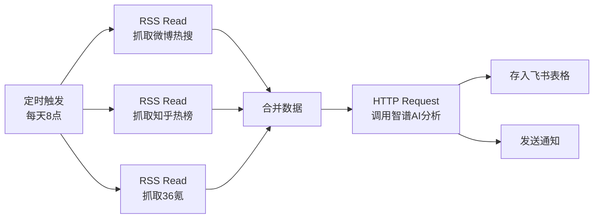
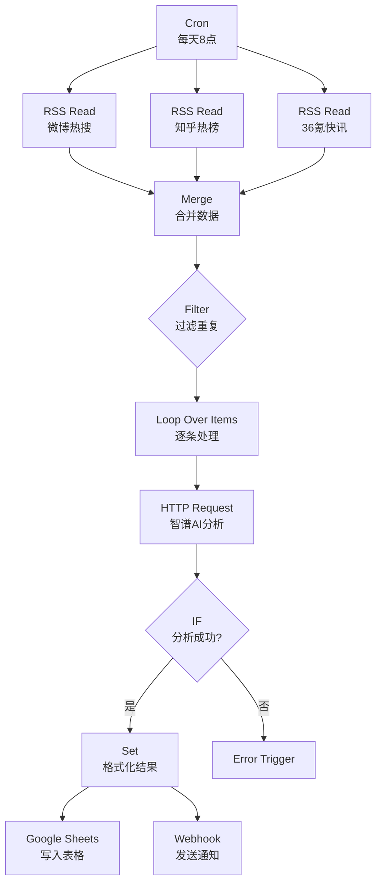

# N8N定时抓取热点资讯指南

> [!info] 概述
> **一句话定义**：N8N 是一款开源的工作流自动化工具，通过可视化节点连接实现定时抓取热点资讯并调用智谱AI进行分析处理。
>
> **通俗比喻**：想象一个"数字搬运工"，每天定时去各大网站收集新闻，然后请"AI分析师"（智谱）帮你总结重点，最后整理成报告发给你。

## 核心概念

### 是什么
N8N（发音 "n-eight-en"）是一款基于节点的开源工作流自动化工具，支持：
- **400+ 官方集成节点**：覆盖主流 SaaS 应用、数据库及消息队列
- **多种触发方式**：定时触发、Webhook 触发、手动触发
- **自托管部署**：数据安全，完全可控
- **可视化编辑**：无需编程，拖拽式构建工作流

### 为什么需要
- **信息过载问题**：每天需要查看多个平台的热点资讯，耗时费力
- **重复性工作**：手动收集、整理、分析新闻内容
- **AI赋能需求**：希望用AI自动总结、分类、提取关键信息

### 通俗理解

**🎯 比喻**：N8N 就像一个"智能管家生产线"
```
[Cron闹钟] → [RSS收集员] → [AI分析师(智谱)] → [整理归档]
   每天早上        收集新闻         总结重点        存入表格
```

**📦 示例**：每日热点资讯自动流水线


## 技术细节

### 1. N8N 部署方式

> [!info] 来源
> - [n8n实战营：高频节点解析](https://m.blog.csdn.net/kenter1983/article/details/155388629) - CSDN
> - [AI自动化神器N8N保姆级安装教程](https://post.m.smzdm.com/zz/p/a65v778z/) - 什么值得买

**推荐方式：Docker 部署**
```bash
docker run -d \
  --name n8n \
  -p 5678:5678 \
  -v ~/.n8n:/home/node/.n8n \
  n8nio/n8n
```

**其他部署方式**：
- npm 安装：`npm install n8n -g`
- Docker Compose（适合生产环境）
- 官方云托管（付费）

### 2. Cron 定时触发器

> [!info] 来源
> - [n8n Cron Node超详细教程](https://m.blog.csdn.net/m0_74822402/article/details/155609244) - CSDN
> - [n8n触发节点完全指南](https://m.blog.csdn.net/bennny/article/details/156871532) - CSDN

**Cron 节点配置**：

| 参数 | 说明 | 示例 |
|------|------|------|
| 触发模式 | Cron 表达式 | `0 8 * * *` (每天8点) |
| 时区 | 选择本地时区 | Asia/Shanghai |
| 执行时间 | 支持多种预设 | 每小时/每天/每周 |

**常用 Cron 表达式**：
```cron
# 每天 8:00 执行
0 8 * * *

# 每 2 小时执行一次
0 */2 * * *

# 每周一 9:00 执行
0 9 * * 1

# 工作日 9:00 执行
0 9 * * 1-5
```

### 3. 抓取热点资讯

> [!info] 来源
> - [n8n定时获取RSS数据详细教程](https://m.blog.csdn.net/2408_89348881/article/details/151754291) - CSDN
> - [手把手教学：用n8n+RSS+飞书实现多平台热点自动抓取](https://cloud.tencent.com/developer/article/2574814) - 腾讯云开发者

**方案一：RSS Read 节点（推荐）**

常用 RSS 源：
```javascript
// 微博热搜
https://weibo.com/ajax/side/hotSearch

// 知乎热榜（需第三方RSS服务）
https://rsshub.app/zhihu/hotlist

// 36氪快讯
https://36kr.com/feed

// 百度热点
https://top.baidu.com/api/rss

// 今日头条热榜（需第三方RSS服务）
https://rsshub.app/toutiao/hot-news
```

**RSS Read 节点配置**：
```json
{
  "url": "https://rsshub.app/zhihu/hotlist",
  "itemLimit": 20
}
```

**方案二：HTTP Request 节点**

适用于无 RSS 的网站：
```json
{
  "method": "GET",
  "url": "https://api.example.com/news",
  "headers": {
    "User-Agent": "Mozilla/5.0..."
  }
}
```

### 4. 集成智谱AI API

> [!info] 来源
> - [智谱AI HTTP API调用官方文档](https://docs.bigmodel.cn/cn/guide/develop/http/introduction)
> - [n8n大模型集成完全指南](https://m.blog.csdn.net/bennny/article/details/156952682) - CSDN

**智谱AI API 信息**：
```yaml
端点: https://open.bigmodel.cn/api/paas/v4/chat/completions
认证方式: Bearer Token
请求头:
  Content-Type: application/json
  Authorization: Bearer YOUR_API_KEY
```

**N8N HTTP Request 节点配置**：

```json
{
  "method": "POST",
  "url": "https://open.bigmodel.cn/api/paas/v4/chat/completions",
  "authentication": "genericCredentialType",
  "genericAuthType": "httpBearerAuth",
  "headerParameters": {
    "parameters": [
      {
        "name": "Content-Type",
        "value": "application/json"
      }
    ]
  },
  "bodyParameters": {
    "parameters": [
      {
        "name": "model",
        "value": "glm-4.7"
      },
      {
        "name": "messages",
        "value": "={{JSON.stringify([{\"role\": \"system\", \"content\": \"你是新闻分析助手，请总结以下热点资讯的关键信息\"}, {\"role\": \"user\", \"content\": $json.title + \"\\n\" + $json.content}])}}"
      },
      {
        "name": "temperature",
        "value": "0.7"
      },
      {
        "name": "max_tokens",
        "value": "1024"
      }
    ]
  }
}
```

**在 N8N 中配置凭证**：
1. 进入 `Credentials` → `New` → `Header Auth`
2. Name: `智谱AI API`
3. Name: `Authorization`
4. Value: `Bearer YOUR_API_KEY`

### 5. 完整工作流示例



**节点配置详情**：

**1. Cron 节点**
```json
{
  "triggerTimes": {
    "item": [
      {
        "mode": "everyX",
        "value": 12,
        "unit": "hours"
      }
    ]
  }
}
```

**2. RSS Read 节点（多个源）**
```json
// 知乎热榜
{
  "url": "https://rsshub.app/zhihu/hotlist"
}

// 微博热搜
{
  "url": "https://rsshub.app/weibo/search/hot"
}
```

**3. Merge 节点**
```json
{
  "mode": "combine",
  "combineBy": "combineAll"
}
```

**4. Code 节点（数据处理）**
```javascript
// 提取关键信息
const items = $input.all();
const processed = items.map(item => ({
  json: {
    title: item.json.title || item.json.question,
    link: item.json.link || item.json.url,
    pubDate: item.json.pubDate || item.json.created,
    source: item.json.source || '未知来源',
    summary: item.json.description || ''
  }
}));
return processed;
```

**5. HTTP Request 节点（智谱AI）**
```javascript
// 动态构建请求体
{
  "method": "POST",
  "url": "https://open.bigmodel.cn/api/paas/v4/chat/completions",
  "body": {
    "model": "glm-4.7",
    "messages": [
      {
        "role": "system",
        "content": "你是新闻分析专家，请对以下热点资讯进行分析：\n1. 提取核心事件\n2. 分析影响和意义\n3. 给出简短评论\n\n请用JSON格式返回：{\"核心事件\":\"\",\"意义\":\"\",\"评论\":\"\"}"
      },
      {
        "role": "user",
        "content": "标题：{{ $json.title }}\n内容：{{ $json.summary }}"
      }
    ],
    "temperature": 0.7,
    "max_tokens": 1024
  }
}
```

### 6. 数据存储与通知

> [!info] 来源
> - [n8n实战：批量获取多平台热点资讯](https://m.blog.csdn.net/igtea/article/details/155129117) - CSDN

**存储到飞书多维表格**：
```json
{
  "operation": "append",
  "tableId": "你的表格ID",
  "app_token": "你的应用Token",
  "records": [
    {
      "fields": {
        "标题": "{{ $json.title }}",
        "来源": "{{ $json.source }}",
        "AI分析": "{{ $json.analysis }}",
        "链接": "{{ $json.link }}",
        "抓取时间": "{{ $now.toISO() }}"
      }
    }
  ]
}
```

**发送 Webhook 通知**：
```json
{
  "method": "POST",
  "url": "你的webhook地址",
  "body": {
    "msg_type": "interactive",
    "card": {
      "header": {
        "title": {
          "content": "📰 每日热点资讯汇总",
          "tag": "plain_text"
        }
      },
      "elements": [
        {
          "tag": "div",
          "text": {
            "content": "{{ $json.summary }}",
            "tag": "lark_md"
          }
        }
      ]
    }
  }
}
```

## 与其他概念的关系

| 概念 | 关系 |
|------|------|
| [[MCP协议]] | N8N 的节点集成类似于 MCP 的工具概念，都是服务间的连接 |
| [[Agent智能体]] | N8N 工作流可以视为一种"固定逻辑的智能体" |
| [[Prompt提示词]] | 在智谱AI节点中需要良好的 Prompt 设计 |

## 最佳实践

### 1. API 凭证管理
```bash
# 在环境变量中存储 API Key
export ZHIPU_API_KEY="your-api-key"

# 在 N8N 中使用凭证管理器
Credentials → New → Header Auth
```

### 2. 错误处理
- 添加 `Error Trigger` 节点捕获异常
- 设置重试机制（HTTP Request 节点支持）
- 使用 `IF` 节点进行条件判断

### 3. 性能优化
- 使用 `Split In Batches` 节点批量处理
- 设置合理的 `itemLimit` 限制数据量
- 启用工作流执行历史记录清理

### 4. 数据去重
```javascript
// 在 Code 节点中实现去重
const seen = new Set();
return items.filter(item => {
  const key = item.json.link;
  if (seen.has(key)) return false;
  seen.add(key);
  return true;
});
```

## 常见问题

**Q: 智谱AI 调用返回 401 错误？**
A: 检查 API Key 是否正确，确认 `Authorization` 头格式为 `Bearer YOUR_API_KEY`

**Q: RSS 源无法访问？**
A: 部分网站需要使用第三方 RSS 服务（如 RSSHub），或使用 HTTP Request 模拟浏览器请求

**Q: 工作流执行超时？**
A: 增加执行超时时间设置，或使用 `Split In Batches` 分批处理大量数据

**Q: 如何调试工作流？**
A: 使用 `Manual Trigger` 手动执行，查看每个节点的输出结果

## 相关文档
- [[AI学习/00-索引/MOC|AI学习索引]]

## 参考资料

### 官方资源
- [N8N 官方文档](https://docs.n8n.io/) - 完整技术文档
- [N8N GitHub](https://github.com/n8n-io/n8n) - 源代码
- [智谱AI 开放平台](https://docs.bigmodel.cn/cn/api/introduction) - API 文档
- [智谱AI HTTP调用指南](https://docs.bigmodel.cn/cn/guide/develop/http/introduction) - 完整调用说明

### 社区资源
- [n8n Cron Node 超详细教程](https://m.blog.csdn.net/m0_74822402/article/details/155609244) - CSDN
- [n8n 大模型集成完全指南](https://m.blog.csdn.net/bennny/article/details/156952682) - CSDN
- [手把手教学：n8n+RSS+飞书热点抓取](https://cloud.tencent.com/developer/article/2574814) - 腾讯云
- [热点捕手：用n8n打造智能资讯流水线](https://juejin.cn/post/7564051354244497427) - 掘金
- [保姆级教程：n8n私人新闻秘书](https://m.blog.csdn.net/m0_65555479/article/details/150448752) - CSDN

### 第三方服务
- [RSSHub](https://docs.rsshub.app/) - 开源 RSS 生成服务
- [飞书开放平台](https://open.feishu.cn/) - 消息推送和表格存储
