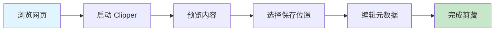

# Obsidian Web Clipper 使用教程

> [!info] 概述
> **一句话定义**：Obsidian Web Clipper 是 Obsidian 官方推出的浏览器扩展，让你一键将网页内容剪藏为 Markdown 笔记保存到本地 vault。
>
> **通俗比喻**：就像给 Obsidian 装了一个"智能复印机"，浏览网页时遇到有价值的内容，点一下就能把内容"复印"进你的知识库，而且是纯文本 Markdown 格式，完全属于你自己。

## 安装与设置

### 支持的浏览器

| 浏览器 | 安装来源 |
|:------:|:--------:|
| Chrome | Chrome Web Store |
| Firefox | Firefox Add-ons |
| Safari | App Store (macOS / iOS) |

### 分步安装指南

#### Chrome 用户

1. 打开 Chrome Web Store，搜索 "Obsidian Web Clipper"
2. 点击"添加至 Chrome"按钮
3. 安装完成后，浏览器工具栏会出现 Obsidian 图标

#### Firefox 用户

1. 访问 Firefox Add-ons 网站
2. 搜索 "Obsidian Web Clipper"
3. 点击"添加到 Firefox"

#### Safari 用户（macOS / iOS）

1. 从 App Store 下载 Obsidian Web Clipper
2. 在系统设置中启用扩展
3. iOS 用户需在分享菜单中找到 Clipper 选项

### 连接 Vault

安装扩展后，需要连接到你的 Obsidian vault：

1. 点击浏览器工具栏的 Clipper 图标
2. 在设置面板中指定 vault 名称或路径
3. 确保 Obsidian 桌面端已开启 URI 支持（见下方配置）

> [!tip] 重要前提
> 确保 Obsidian 在剪藏时处于运行状态，否则连接会失败。

### 开启 Obsidian URI 支持

Clipper 通过 `obsidian://` 协议与 vault 通信，需要在 Obsidian 中开启：

1. 打开 Obsidian 设置
2. 进入 **核心插件** (Core Plugins)
3. 找到 **URI 支持** (URI Support) 并启用
4. 移动端同样支持此功能

## 基本使用流程

### 标准剪藏步骤



**详细步骤：**

1. **浏览网页** - 打开任意你想保存的网页
2. **启动 Clipper** - 点击浏览器工具栏的 Obsidian 图标，或使用快捷键 `Ctrl/Cmd + Shift + C`
3. **预览内容** - 弹出面板会显示提取的内容预览
4. **选择保存位置** - 选择 vault 中的目标文件夹
5. **编辑元数据** - 可编辑标题、添加标签、选择模板
6. **完成剪藏** - 点击 "Save to Obsidian" 按钮

### 快捷键

| 操作 | 快捷键 |
|:----:|:------:|
| 快速打开 Clipper | `Ctrl/Cmd + Shift + C` |

## 模板系统详解

### 什么是模板

模板是预设的格式规则，控制剪藏后的 Markdown 结构。通过模板，你可以自定义保存内容的格式，让剪藏的笔记符合你的知识库规范。

### 内置变量

Clipper 支持丰富的变量占位符：

| 变量 | 说明 |
|:----:|:------|
| `{{title}}` | 网页标题 |
| `{{url}}` | 网页链接 |
| `{{content}}` | 网页正文内容 |
| `{{date}}` | 剪藏日期 |
| `{{author}}` | 文章作者 |
| `{{description}}` | 网页描述/摘要 |
| `{{published}}` | 发布日期 |
| `{{highlights}}` | 网页高亮标注 |
| `{{selection}}` | 当前选中的文本 |

### 基础模板示例

```markdown
---
title: {{title}}
source: {{url}}
author: {{author}}
date: {{date}}
tags: [网页剪藏]
---

# {{title}}

> 来源：[{{title}}]({{url}})
> 作者：{{author}}
> 剪藏时间：{{date}}

## 摘要
{{description}}

## 正文
{{content}}
```

### 为不同网站设置不同模板

你可以针对特定网站使用专门的模板：

**YouTube 视频模板示例：**

```markdown
---
title: {{title}}
source: {{url}}
date: {{date}}
tags: [视频, YouTube]
type: video
---

# {{title}}

## 视频信息
- 链接：{{url}}
- 剪藏时间：{{date}}

## 视频摘要
{{description}}

## 我的笔记
<!-- 在此添加观看笔记 -->

## 时间戳笔记
<!-- 记录关键时间点 -->
```

**GitHub 项目模板示例：**

```markdown
---
title: {{title}}
source: {{url}}
date: {{date}}
tags: [GitHub, 代码, 开源项目]
type: repository
---

# {{title}}

## 项目信息
- 仓库地址：{{url}}
- 描述：{{description}}

## 简介
{{content}}

## 使用场景
<!-- 记录为什么保存这个项目 -->
```

### 条件逻辑模板

模板使用 Handlebars 语法，支持条件逻辑：

```markdown
---
title: {{title}}
source: {{url}}
{{#if author}}author: {{author}}{{/if}}
{{#if published}}published: {{published}}{{/if}}
date: {{date}}
tags: [网页剪藏]
---

# {{title}}

> 来源：[{{title}}]({{url}})
{{#if author}}> 作者：{{author}}{{/if}}
> 剪藏时间：{{date}}

{{#if description}}
## 摘要
{{description}}
{{/if}}

## 正文
{{content}}
```

## 高级技巧

### Highlight 高亮功能

在网页上高亮标注后，Clipper 可以自动捕获高亮内容：

1. **选中文本** - 在网页上选中想要高亮的文字
2. **打开 Clipper** - 高亮内容会自动捕获
3. **使用模板** - 通过 `{{highlights}}` 变量插入高亮内容

**高亮模板示例：**

```markdown
---
title: {{title}}
source: {{url}}
date: {{date}}
tags: [网页剪藏, 高亮]
---

# {{title}}

## 我的高亮
{{highlights}}

## 原文
{{content}}
```

> [!note] 高亮特性
> - 支持多种颜色标记
> - 高亮位置信息可保留
> - 适合做读书笔记和研究摘录

### 自定义 Frontmatter 属性

在扩展设置中可以配置：

- **默认保存文件夹**：设置常用保存路径
- **默认标签**：自动添加的标签
- **文件命名规则**：自定义文件名格式
- **自定义 frontmatter 属性**：添加额外的 YAML 字段

### 配置示例

```yaml
默认文件夹：05-其他主题/网页剪藏
默认标签：clipping, web
文件命名：{{date}}-{{title}}
```

## 实用场景示例

### 学术研究

保存论文和学术文章，保留完整的元数据：

```markdown
---
title: {{title}}
source: {{url}}
author: {{author}}
published: {{published}}
date: {{date}}
tags: [学术, 论文, 研究]
---

# {{title}}

## 元数据
- 作者：{{author}}
- 发表时间：{{published}}
- 来源：{{url}}

## 摘要
{{description}}

## 核心观点
{{highlights}}

## 全文
{{content}}

## 我的思考
<!-- 添加阅读笔记 -->
```

### 读书笔记

保存书籍摘要和书评：

```markdown
---
title: {{title}}
source: {{url}}
date: {{date}}
tags: [读书, 书评]
---

# {{title}}

## 书籍信息
- 来源：{{url}}

## 精彩摘录
{{highlights}}

## 书评摘要
{{content}}

## 阅读计划
- [ ] 购买/借阅
- [ ] 开始阅读
- [ ] 完成阅读
```

### 学习资源收集

收集教程和文档片段：

```markdown
---
title: {{title}}
source: {{url}}
date: {{date}}
tags: [学习资源, 教程]
---

# {{title}}

## 资源信息
- 链接：{{url}}

## 核心内容
{{highlights}}

## 完整教程
{{content}}

## 学习进度
- [ ] 开始学习
- [ ] 完成实践
- [ ] 整理笔记
```

### 新闻追踪

保存新闻报道原文，便于后续查阅：

```markdown
---
title: {{title}}
source: {{url}}
author: {{author}}
published: {{published}}
date: {{date}}
tags: [新闻, 时事]
---

# {{title}}

## 新闻信息
- 来源：{{url}}
- 记者：{{author}}
- 发布时间：{{published}}

## 新闻摘要
{{description}}

## 全文存档
{{content}}
```

## 常见问题与解决方案

### 连接失败

> [!warning] 症状
> 点击保存后提示无法连接到 Obsidian

**解决方案：**

1. 检查 Obsidian 是否正在运行
2. 确认 URI 支持已开启（设置 → 核心插件 → URI 支持）
3. 检查 vault 名称或路径是否正确
4. 尝试重启 Obsidian 和浏览器

### 内容提取不完整

> [!warning] 症状
> 剪藏的内容缺少部分文字或图片

> [!info] 原因
> 某些网站有反爬虫措施或动态加载内容

**解决方案：**

1. 等待页面完全加载后再剪藏
2. 尝试使用 `{{selection}}` 手动选中需要的内容
3. 部分网站可能需要使用 [[Defuddle]] 等工具辅助提取

### 编码问题

> [!warning] 症状
> 特殊字符显示为乱码

**解决方案：**

1. 在模板中添加字符处理逻辑
2. 检查源网页的编码格式
3. 必要时手动编辑修正

### 权限问题

> [!warning] 症状
> 扩展无法读取网页内容

**解决方案：**

1. 检查浏览器扩展权限设置
2. 确保 Clipper 有访问网页内容的权限
3. 某些内部网页（如 `chrome://`）无法被剪藏

### 移动端限制

> [!warning] 症状
> iOS Safari 上操作不便

**解决方案：**

1. Safari 移动端需通过分享菜单操作
2. 确保已在系统设置中启用扩展
3. 操作路径：分享按钮 → 更多 → 开启 Obsidian Web Clipper

## 与其他工具对比

| 特性 | Obsidian Web Clipper | 简单书签 | Evernote Clipper | Notion Clipper | Readwise Reader |
|:----:|:--------------------:|:--------:|:----------------:|:--------------:|:---------------:|
| 数据存储 | 完全本地 | 依赖云端 | 云端 | 云端 | 云端 |
| 格式 | Markdown | 链接 | 富文本 | 富文本 | Markdown |
| 费用 | 免费 | 免费 | 订阅制 | 免费/付费 | 订阅制 |
| 离线访问 | 完全支持 | 不支持 | 部分支持 | 部分支持 | 部分支持 |
| 模板自定义 | 高度灵活 | 无 | 有限 | 有限 | 有限 |
| 第三方依赖 | 无 | 无 | 有 | 有 | 有 |

**核心优势：**

- Markdown 原生输出，与 Obsidian 生态完美整合
- 数据完全自主，不依赖任何第三方服务
- 模板系统灵活强大，可高度自定义
- 开源免费，社区活跃

## 参考资料

- [Obsidian Web Clipper GitHub](https://github.com/obsidianmd/obsidian-clipper)
- [Chrome Web Store - Obsidian Web Clipper](https://chrome.google.com/webstore)
- [Firefox Add-ons - Obsidian Web Clipper](https://addons.mozilla.org)
- [App Store - Obsidian Web Clipper](https://apps.apple.com)
- [[Obsidian]] - Obsidian 核心功能介绍
- [[Obsidian URI]] - URI 协议详解

## 相关概念

| 概念 | 关系 |
|:----:|:------|
| [[Obsidian]] | Clipper 是 Obsidian 官方的浏览器扩展 |
| [[Obsidian URI]] | Clipper 通过 URI 协议与 Obsidian 通信 |
| [[Markdown]] | 剪藏内容以 Markdown 格式保存 |
| [[Defuddle]] | 可辅助提取网页内容的工具 |

## 个人笔记

> [!personal] 我的使用心得
> （此处记录你的使用体验、技巧发现、踩坑记录等）
