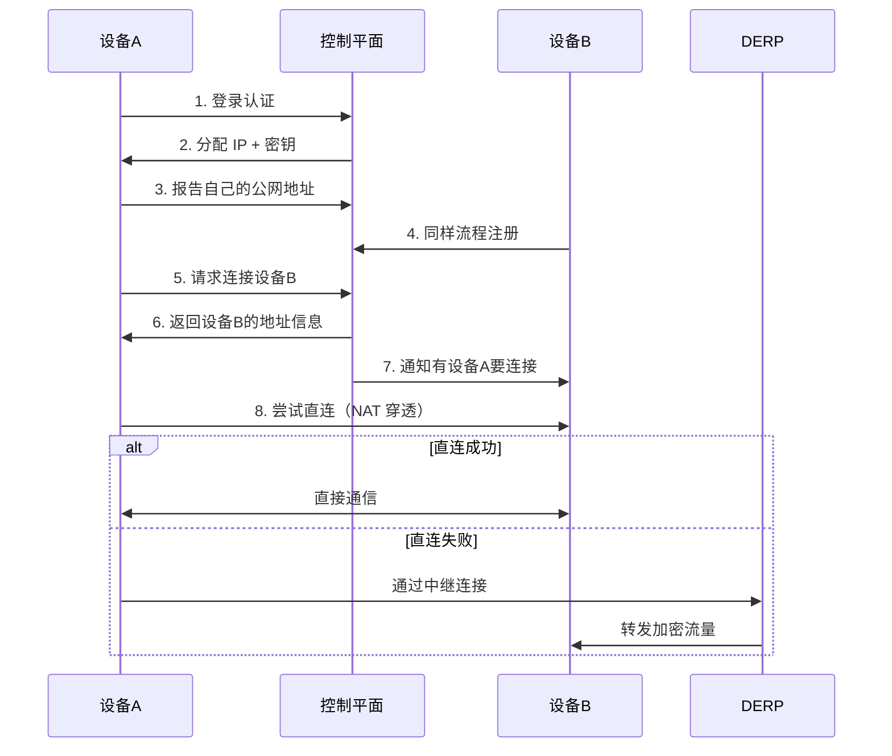

# Tailscale使用指南

> [!info] 概述
> **一句话定义**：基于 WireGuard 协议的零配置 VPN 组网工具，让你的所有设备安全地互联。
> **通俗比喻**：就像给你的所有设备装上了"专属电话线"，不管它们在哪里（家里、公司、云端），都能像在同一局域网一样直接互访。

## 核心概念

### 是什么
Tailscale 是一种 VPN 服务，使用开源的 WireGuard 协议在设备之间建立加密的点对点连接。与需要中央网关的传统 VPN 不同，Tailscale 创建了一个**去中心化的网状网络（tailnet）**。

### 为什么需要
- 访问家里的 NAS/服务器，无需公网 IP
- 远程办公安全访问公司内网
- 跨云平台（AWS、GCP、阿里云）互联
- 与团队成员安全共享开发环境
- 替代复杂的端口转发配置

### 通俗理解

**🎯 比喻**：传统 VPN 就像所有车都必须经过同一个收费站（中央网关），容易拥堵。Tailscale 则像是给每辆车都装了 GPS，让它们能直接找到彼此并建立专属通道，不需要绕路。

```
传统 VPN（中央网关模式）：
用户 ──────► 网关服务器 ──────► 目标设备
              ↑
         可能成为瓶颈

Tailscale（点对点网状网络）：
用户 ◄────────────────────► 目标设备
     直连，低延迟，高吞吐
```

**📦 示例**：
```bash
# 一行命令安装
curl -fsSL https://tailscale.com/install.sh | sh

# 连接到你的网络
sudo tailscale up

# 查看分配的 IP
tailscale ip -4
# 输出类似：100.64.1.2

# 现在可以从任何地方通过这个 IP 访问此设备
```

---

## 1. 如何安装

### 各平台安装指南

#### Windows / macOS / iOS / Android
1. 访问 [tailscale.com/download](https://tailscale.com/download)
2. 下载对应平台的客户端
3. 安装并登录（支持 Google、Microsoft、GitHub 等）

#### Linux（一行命令）
```bash
curl -fsSL https://tailscale.com/install.sh | sh
```

#### Ubuntu/Debian（手动安装）
```bash
# 1. 添加 Tailscale 软件源
curl -fsSL https://pkgs.tailscale.com/stable/ubuntu/noble.noarmor.gpg | sudo tee /usr/share/keyrings/tailscale-archive-keyring.gpg >/dev/null

curl -fsSL https://pkgs.tailscale.com/stable/ubuntu/noble.tailscale-keyring.list | sudo tee /etc/apt/sources.list.d/tailscale.list

# 2. 安装
sudo apt-get update
sudo apt-get install tailscale

# 3. 连接网络
sudo tailscale up

# 4. 查看分配的 IP
tailscale ip -4
```

#### Docker
```bash
docker run -d --name=tailscale \
  -v /var/lib/tailscale:/var/lib/tailscale \
  -v /dev/net/tun:/dev/net/tun \
  --network=host \
  --cap-add=NET_ADMIN \
  --cap-add=SYS_MODULE \
  tailscale/tailscale
```

> [!tip] 服务器设备
> 如果是服务器或远程设备，建议禁用密钥过期，避免定期重新认证：
> ```bash
> # 在管理后台禁用该设备的密钥过期
> ```

---

## 2. 工作原理

### 架构图

```
┌─────────────────────────────────────────────────────────────────┐
│                        Tailscale 控制平面                        │
│  (协调服务、认证、密钥分发、ACL)                                   │
└───────────────────────────┬─────────────────────────────────────┘
                            │
        ┌───────────────────┼───────────────────┐
        │                   │                   │
        ▼                   ▼                   ▼
   ┌─────────┐         ┌─────────┐         ┌─────────┐
   │ 设备 A  │◄───────►│ 设备 B  │◄───────►│ 设备 C  │
   │ (家里)  │  直连   │ (公司)  │  直连   │ (云端)  │
   └─────────┘         └─────────┘         └─────────┘
        │
        │ 如果无法直连（NAT/防火墙）
        ▼
   ┌─────────────────────────────────────────┐
   │         DERP 中继服务器（备用）          │
   │   (全球分布，流量加密，无明文访问)       │
   └─────────────────────────────────────────┘
```

### 核心组件

| 组件 | 功能 |
|------|------|
| **WireGuard** | 底层加密协议，提供安全的点对点连接 |
| **Tailnet** | 你的私有网络，每个设备分配 100.x.x.x IP |
| **DERP** | 中继服务器，当 NAT 穿透失败时作为备用 |
| **MagicDNS** | 自动分配易记主机名，无需记 IP |
| **控制平面** | 管理设备认证、密钥分发、ACL 规则 |

### 连接建立过程



### NAT 穿透技术

Tailscale 使用多种技术尝试建立直连：
1. **STUN** - 检测 NAT 类型和公网地址
2. **UPnP/NAT-PMP** - 自动配置端口映射
3. **ICE** - 综合各种方法尝试直连
4. **DERP 中继** - 最后的备用方案

> [!info] 来源
> - [What is Tailscale?](https://tailscale.com/kb/1151/what-is-tailscale/) - Tailscale 官方文档
> - [Subnet routers](https://tailscale.com/kb/1019/subnets/) - Tailscale 官方文档

---

## 3. 如何使用

### 基础使用

#### 连接两台设备
```bash
# 在设备 1 上
sudo tailscale up

# 在设备 2 上
sudo tailscale up

# 查看设备 1 的 IP
tailscale ip -4  # 假设是 100.64.1.2

# 在设备 2 上直接 SSH
ssh user@100.64.1.2
# 或者使用 MagicDNS 主机名
ssh user@device1.tailnet-name.ts.net
```

#### 常用命令
```bash
# 查看状态
tailscale status

# 查看 IP 地址
tailscale ip        # 显示所有 IP
tailscale ip -4     # 只显示 IPv4
tailscale ip -6     # 只显示 IPv6

# ping 其他设备
tailscale ping 100.64.1.2

# 查看当前连接状态
tailscale status --verbose

# 退出网络
tailscale down

# 重新连接
tailscale up
```

### 进阶功能

#### 1. 子网路由器（Subnet Router）
让 Tailscale 网络访问本地局域网设备（如打印机、NAS）

```bash
# 在网关设备上（假设局域网是 192.168.1.0/24）

# 1. 开启 IP 转发
echo 'net.ipv4.ip_forward = 1' | sudo tee /etc/sysctl.d/99-tailscale.conf
sudo sysctl -p /etc/sysctl.d/99-tailscale.conf

# 2. 广告子网路由
sudo tailscale up --advertise-routes=192.168.1.0/24

# 3. 在管理后台启用该子网路由
#    Machines → 找到设备 → Edit route settings → 启用子网
```

**子网路由器 vs Exit Node**：
| 功能 | 子网路由器 | Exit Node |
|------|-----------|-----------|
| 用途 | 访问特定私有子网 | 所有流量通过该节点出网 |
| 场景 | 访问内网 NAS/打印机 | 隐藏真实 IP、访问地区限制内容 |

#### 2. Exit Node（出口节点）
将 Exit Node 作为 VPN 服务器使用

```bash
# 在出口节点设备上
sudo tailscale up --advertise-exit-node

# 在其他设备上使用该出口
sudo tailscale up --exit-node=<exit-node-ip>
```

#### 3. 访问控制（ACL）
在管理后台配置 JSON 格式的 ACL 规则：

```json
{
  "acls": [
    // 开发组可以访问服务器
    {"action": "accept", "src": ["group:dev"], "dst": ["tag:servers:*"]},
    // 所有人可以访问彼此
    {"action": "accept", "src": ["*"], "dst": ["*:*"]}
  ]
}
```

#### 4. MagicDNS
自动为主机分配易记名称：
- 原始：`100.64.1.2`
- MagicDNS：`myserver.tailnet-name.ts.net`

在管理后台 DNS 设置中启用即可。

#### 5. 启用 HTTPS（TLS 证书）

Tailscale 可以为你的设备自动 provision TLS 证书，让你通过 HTTPS 访问服务。

##### 5.1 在管理后台启用 HTTPS

1. 打开管理后台的 **DNS** 页面
2. 启用 **MagicDNS**（如果尚未启用）
3. 在 **HTTPS Certificates** 下，选择 **Enable HTTPS**
4. 确认机器名称将发布到公开账本（Certificate Transparency）
5. 在每台需要证书的机器上运行 `tailscale cert`

> [!warning] 注意
> - TLS 证书会被记录在公开的 Certificate Transparency (CT) 账本中
> - **不要在机器名中包含敏感信息**（如公司名、邮箱等）
> - 证书有效期为 90 天，需要定期续期

##### 5.2 生成 TLS 证书

```bash
# 在设备上生成证书
tailscale cert hostname.tailnet-name.ts.net

# 保存到指定文件
tailscale cert --cert-file=cert.pem --key-file=key.pem hostname.tailnet-name.ts.net

# 查看证书信息
tailscale cert --help
```

**证书特点**：
- 由 Let's Encrypt 自动签发
- 私钥存储在本地，Tailscale 无法访问
- 需要手动续期（使用文件方式时）

> [!info] 来源
> - [Enabling HTTPS](https://tailscale.com/kb/1153/enabling-https) - Tailscale 官方文档

#### 6. Tailscale Serve（内网服务分享）

`tailscale serve` 命令可以在 tailnet 内安全分享本地服务。

##### 6.1 反向代理模式

```bash
# 将本地 3000 端口的服务通过 HTTPS 暴露
tailscale serve localhost:3000

# 使用 HTTP（不需要证书）
tailscale serve --http=80 localhost:3000

# 后台运行
tailscale serve --bg localhost:3000
```

##### 6.2 文件服务器模式

```bash
# 分享单个文件
tailscale serve /home/user/blog/index.html

# 分享整个目录（会显示目录列表）
tailscale serve /home/user/files
```

##### 6.3 静态文本模式

```bash
# 用于调试
tailscale serve text:"Hello, world!"
```

##### 6.4 TCP 转发

```bash
# 转发原始 TCP 流量
tailscale serve --tcp=2222 tcp://localhost:22

# TLS 终止的 TCP 转发
tailscale serve --tls-terminated-tcp=443 tcp://localhost:8443
```

##### 6.5 管理命令

```bash
# 查看状态
tailscale serve status

# JSON 格式输出
tailscale serve status --json

# 重置配置
tailscale serve reset

# 关闭服务
tailscale serve --https=443 off
```

#### 7. Tailscale Funnel（公网暴露）

Funnel 可以将本地服务暴露到**公网**，即使对方没有 Tailscale 也能访问。

##### 7.1 工作原理

```
公网用户 → Funnel 中继服务器 → 加密隧道 → 你的设备
              ↑
        隐藏真实 IP
```

- 流量通过 Funnel 中继服务器转发
- 中继服务器无法解密数据（端到端加密）
- 你的真实 IP 地址被隐藏

##### 7.2 使用方法

```bash
# 将本地 3000 端口暴露到公网
tailscale funnel localhost:3000

# 后台运行
tailscale funnel --bg localhost:3000

# 暴露目录
tailscale funnel /home/user/public
```

##### 7.3 访问地址

启用后，服务可通过以下地址访问：
```
https://machine-name.tailnet-name.ts.net
```

> [!warning] 安全警告
> - 任何拥有 URL 的人都可以访问
> - 不要暴露敏感服务，或添加认证层
> - 官方文档警告："Never expose the Gateway"

##### 7.4 Serve vs Funnel 对比

| 功能 | Serve | Funnel |
|------|-------|--------|
| 访问范围 | 仅 tailnet 内 | 公网 |
| 需要认证 | 需要 Tailscale 账号 | 无需认证 |
| 安全性 | 高 | 需自行保护 |
| 用途 | 团队内部访问 | 公开演示、分享 |

> [!info] 来源
> - [tailscale serve command](https://tailscale.com/kb/1242/tailscale-serve) - Tailscale 官方文档
> - [Tailscale Funnel](https://tailscale.com/docs/features/tailscale-funnel) - Funnel 功能介绍

---

## 与其他概念的关系

| 概念 | 关系 |
|------|------|
| [[WireGuard]] | Tailscale 基于 WireGuard 协议构建 |
| [[ZeroTier]] | 类似的组网工具，技术路线不同 |
| [[frp/ngrok]] | 内网穿透工具，侧重端口映射而非组网 |
| [[OpenVPN]] | 传统 VPN，需要中央服务器 |
| [[NAT 穿透]] | Tailscale 核心技术之一 |

---

## 最佳实践

1. **安全设置**
   - 启用 ACL 限制设备间访问
   - 定期审查已授权设备
   - 服务器设备禁用密钥过期

2. **性能优化**
   - 优先使用子网路由器而非 Exit Node
   - 检查连接是否为直连（`tailscale status`）
   - 如频繁使用 DERP，考虑部署自定义 DERP 或 Peer Relay

3. **团队使用**
   - 使用标签（tags）管理服务器权限
   - 配置 OAuth/SSO 集成
   - 设置管理员审核流程

---

## 常见问题

### Q: 连接状态显示 "derp" 而非 "direct"
A: 说明未能建立直连，流量通过中继服务器。检查：
- 双方 NAT 类型是否为对称 NAT
- 是否有防火墙阻止 UDP 端口 41641

### Q: 子网路由不生效
A: 确保：
1. 已在管理后台启用子网路由
2. 客户端使用 `--accept-routes` 参数（Linux）
3. ACL 规则允许访问该子网

### Q: 免费版有什么限制？
A: 免费版支持：
- 最多 100 台设备
- 1 个用户
- 子网路由功能
- 基础 ACL

---

## 个人笔记

> [!personal] 💡 我的理解与感悟
> （此处记录个人学习心得，更新时会被保留）

---

## 相关文档

- [[网络协议详解-WebDAV_Samba_FTP_iSCSI]]

---

## 参考资料

### 官方资源
- [Tailscale 官网](https://tailscale.com/)
- [官方文档](https://tailscale.com/kb) - 完整技术文档
- [下载页面](https://tailscale.com/download) - 各平台客户端
- [GitHub 仓库](https://github.com/tailscale/tailscale) - 开源源码

### 文档文章
- [What is Tailscale?](https://tailscale.com/kb/1151/what-is-tailscale/) - 核心概念介绍
- [Subnet routers](https://tailscale.com/kb/1019/subnets/) - 子网路由配置
- [Custom DERP servers](https://tailscale.com/kb/1118/how-tailscale-works) - 工作原理详解
- [Enabling HTTPS](https://tailscale.com/kb/1153/enabling-https) - HTTPS/TLS 证书配置
- [tailscale serve command](https://tailscale.com/kb/1242/tailscale-serve) - Serve 命令详解
- [Tailscale Funnel](https://tailscale.com/docs/features/tailscale-funnel) - Funnel 公网暴露功能

### 社区资源
- [Tailscale 安装教程](https://wenku.csdn.net/answer/1mzgs9vikx) - CSDN 中文教程
- [OpenWrt Tailscale 配置](https://blog.csdn.net/qq_40686435/article/details/147072422) - 路由器部署
- [Tailscale 使用指南](https://tendcode.com/subject/article/TailScale/) - 终端代码博客
