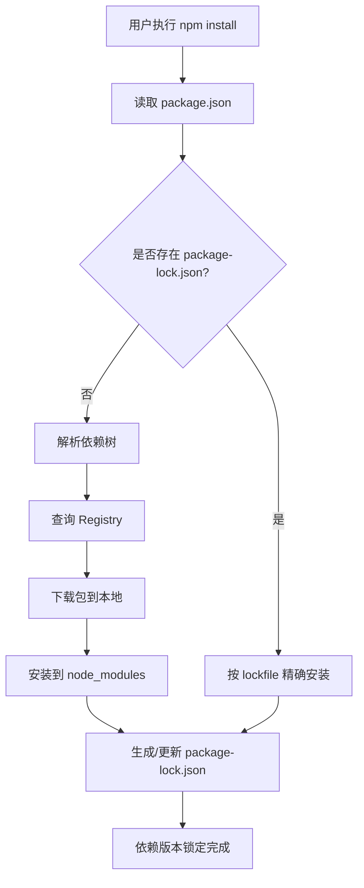
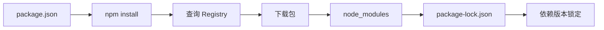

# npm (Node Package Manager)

> [!info] 概述
> **npm 是 Node.js 平台的 JavaScript 包管理器，负责模块安装、依赖管理和版本控制。**
>
> 如果把 Node.js 项目比作一间房子，npm 就是负责采购和整理家具家电的「家居管家」。它会根据你的需求清单（package.json）从商店（Registry）采购所需物品，并妥善安置到合适的位置（node_modules），确保每件物品都能在需要时找到。

## 核心概念

### 是什么

npm (Node Package Manager) 是 Node.js 官方内置的包管理工具，也是全球最大的 JavaScript 软件注册表。它承担着三大核心职责：

- **安装**：从 Registry 下载并安装 JavaScript 包
- **管理**：追踪和管理项目依赖关系
- **分发**：允许开发者发布自己的包供他人使用

npm 默认使用公共注册表 [https://registry.npmjs.org](https://registry.npmjs.org)，存储着超过 100 万个开源包。

### 为什么需要

在 npm 出现之前，JavaScript 项目面临诸多困境：

1. **依赖地狱**：手动下载和管理第三方库极其繁琐
2. **版本冲突**：不同项目依赖同一库的不同版本会导致冲突
3. **复用困难**：分享代码缺乏统一规范，难以复用他人代码
4. **构建复杂**：缺乏自动化脚本工具

npm 通过统一的包管理规范和工具链，彻底解决了这些问题，让 JavaScript 生态得以蓬勃发展。

### 通俗理解

> **比喻**：npm 就像一个大型超市的会员系统

- **package.json** 是你的购物清单，列明需要买什么
- **Registry** 是货架，存放着所有商品（包）
- **node_modules** 是你家的储物间，存放买回来的东西
- **package-lock.json** 是收据小票，记录每件商品的确切位置和版本

> **类比**：当你想做一道菜时，不需要自己去种菜、养鸡，超市（Registry）已经帮你准备好了所有食材，你只需按照菜谱（package.json）采购即可。

### 示例

```bash
# 初始化一个新项目（创建 package.json）
npm init -y

# 安装一个包（默认保存到 node_modules）
npm install express

# 安装开发依赖
npm install jest -D

# 全局安装 CLI 工具
npm install -g typescript

# 搜索包
npm search express

# 列出已安装的包
npm ls

# 安全审计
npm audit
```

## 技术细节

### npm 工作原理



> [!info] 说明
> npm 会自动分析依赖关系，解决版本冲突，并将所有包下载到 `node_modules` 目录中。

### 本地模式 vs 全局模式

npm 有两种安装模式，理解它们的区别很重要：

| 模式 | 命令 | 安装位置 | 适用场景 |
|:---|:---|:---|:---|
| **本地模式**（默认） | `npm install <package>` | `./node_modules` | 项目依赖 |
| **全局模式** | `npm install -g <package>` | 系统目录（如 `/usr/local/lib/node_modules`） | CLI 工具 |

> [!note] 快速区分
> - 本地安装：项目专用，通过 `require()` 或 `import` 使用
> - 全局安装：系统通用，通过命令行直接使用

**保存依赖的方式**：

| 标志 | 保存位置 | 说明 |
|:---|:---|:---|
| `-P` / `--save-prod` | dependencies | 生产依赖 |
| `-D` / `--save-dev` | devDependencies | 开发依赖 |
| `-O` / `--save-optional` | optionalDependencies | 可选依赖 |
| 默认 | dependencies | 不带标志时默认保存到 dependencies |

```bash
# 本地安装（项目依赖）
npm install lodash
npm install express

# 全局安装（CLI 工具）
npm install -g create-react-app
npm install -g typescript
```

### package.json 详解

package.json 是 npm 项目的核心配置文件，必须是合法的 JSON 格式。

#### 必要字段

```json
{
  "name": "my-package",
  "version": "1.0.0"
}
```

- **name**：包名，最多 214 字符，不能有大写和非 URL 安全字符
- **version**：版本号，必须符合 SemVer 规范

#### SemVer 语义化版本

版本号格式：`主版本.次版本.修订号`

- **主版本 (Major)**：不兼容的 API 变更
- **次版本 (Minor)**：向后兼容的功能新增
- **修订号 (Patch)**：向后兼容的问题修复

版本范围指定：
- `^1.2.3`：允许次版本和修订号更新（>=1.2.3 <2.0.0）
- `~1.2.3`：允许修订号更新（>=1.2.3 <1.3.0）
- `1.2.3`：精确版本

#### 常用字段

```json
{
  "name": "my-project",
  "version": "1.0.0",
  "description": "我的项目描述",
  "main": "index.js",
  "scripts": {
    "start": "node index.js",
    "test": "jest",
    "dev": "nodemon app.js"
  },
  "keywords": ["node", "express", "api"],
  "author": "张三",
  "license": "MIT",
  "dependencies": {
    "express": "^4.18.0",
    "lodash": "~4.17.21"
  },
  "devDependencies": {
    "jest": "^29.0.0",
    "nodemon": "^2.0.0"
  }
}
```

**字段说明**：

| 字段 | 说明 |
|:---|:---|
| main | 程序的入口文件，默认 index.js |
| scripts | 生命周期脚本命令 |
| dependencies | 运行时依赖（生产环境必需） |
| devDependencies | 开发依赖（仅开发时使用） |

#### 依赖类型详解

| 类型 | 说明 | 何时使用 |
|:---|:---|:---|
| dependencies | 生产依赖 | 运行时代码需要的包 |
| devDependencies | 开发依赖 | 构建、测试、格式化等工具 |
| peerDependencies | 同伴依赖 | 需要宿主提供的依赖 |
| optionalDependencies | 可选依赖 | 可选功能，缺失不影响运行 |

> [!warning] 警告
> `optionalDependencies` 中的包安装失败不会影响整体安装，但代码中应做好存在性检查。

### npm Registry

npm Registry 是存储和分发 JavaScript 包的服务。

**常用命令**：

```bash
# 查看当前 Registry
npm config get registry

# 设置为国内镜像（如淘宝镜像）
npm config set registry https://registry.npmmirror.com

# 恢复官方 Registry
npm config set registry https://registry.npmjs.org
```

### 常用 npm 命令一览

| 命令 | 说明 |
|:---|:---|
| `npm install <package>` | 安装包 |
| `npm uninstall <package>` | 卸载包 |
| `npm update <package>` | 更新包 |
| `npm search <keyword>` | 搜索包 |
| `npm publish` | 发布包 |
| `npm ls` | 列出已安装包 |
| `npm audit` | 安全审计 |
| `npm ci` | 干净安装（CI 环境推荐） |
| `npm run <script>` | 运行脚本 |

> [!tip] 推荐
> CI/CD 环境中推荐使用 `npm ci`，它更快速且确定性更强。

**npm install vs npm ci 对比**：

| 特性 | `npm install` | `npm ci` |
|:---|:---|:---|
| 安装方式 | 增量安装 | 干净安装 |
| lockfile | 智能更新 | 必须存在，精确安装 |
| node_modules | 保留现有 | 强制删除后重装 |
| 速度 | 较慢 | 更快 |
| 适用场景 | 开发环境 | CI/CD 环境 |

**核心区别**：
- `npm install`：增量安装，智能更新 package-lock.json
- `npm ci`：干净安装，删除 node_modules，根据 package-lock.json 安装精确版本

### Lockfile 优先级

当存在 lockfile 时，npm 优先使用：

```text
npm-shrinkwrap.json > package-lock.json
```

Lockfile 确保团队成员和 CI 环境安装完全一致的依赖版本。

### npm 工作流程



> [!tip] 提示
> `package-lock.json` 由 npm 自动生成，记录完整的依赖树和精确版本，应提交到版本控制。

## 与其他概念的关系

| 概念 | 关系 |
|:---|:---|
| [[Node.js]] | npm 是 Node.js 的官方包管理器 |
| [[package.json]] | npm 项目的核心配置文件 |
| [[SemVer]] | npm 使用的版本规范 |
| [[Registry]] | npm 的包存储和分发服务 |
| [[Dependencies]] | npm 管理的核心对象 |

## 最佳实践

### 1. 使用有意义的包名和版本控制

```json
{
  "name": "my-awesome-project",
  "version": "1.0.0"
}
```

### 2. 合理区分依赖类型

```json
{
  "dependencies": {
    "express": "^4.18.0"
  },
  "devDependencies": {
    "jest": "^29.0.0",
    "eslint": "^8.0.0"
  }
}
```

### 3. 在生产环境使用 npm ci

CI/CD 流水线中应使用 `npm ci` 而不是 `npm install`：

```bash
npm ci
```

### 4. 定期运行安全审计

```bash
npm audit
npm audit fix
```

### 5. 提交 package-lock.json

确保 lockfile 提交到版本控制，保证团队成员安装完全一致的依赖。

### 6. 使用 .npmrc 配置

在项目根目录创建 `.npmrc` 文件：

```ini
registry=https://registry.npmmirror.com
save-exact=true
```

## 常见问题

### Q: npm install 和 npm ci 有什么区别？

**A**：`npm install` 是增量安装，会智能更新 package-lock.json；`npm ci` 是干净安装，需要 package-lock.json 存在，删除 node_modules 后完全按 lockfile 安装，适合 CI/CD 环境。

### Q: dependencies 和 devDependencies 的区别？

**A**：`dependencies` 是生产依赖，运行时代码必需；`devDependencies` 是开发依赖，仅构建、测试时使用。生产环境部署时 `npm install --production` 只会安装 dependencies。

### Q: 全局安装和本地安装如何选择？

**A**：CLI 工具（如 webpack、typescript、create-react-app）全局安装；项目依赖（如 express、lodash、axios）本地安装。全局安装后可在任意目录使用命令，本地安装的包只能在安装位置使用。

### Q: 如何解决 npm 安装慢的问题？

**A**：可以使用国内镜像：
```bash
npm config set registry https://registry.npmmirror.com
```
或使用 nrm 管理多个 Registry。

### Q: package-lock.json 和 package.json 的区别？

**A**：package.json 记录依赖的**范围**（如 ^4.18.0），package-lock.json 记录依赖的**精确版本**和完整的依赖树。package-lock.json 由 npm 自动生成，不应手动编辑。

### Q: 出现 "ERESOLVE overriding peer dependency" 警告怎么办？

**A**：这是依赖版本冲突警告，通常可以使用 `--legacy-peer-deps` 解决：
```bash
npm install --legacy-peer-deps
```

## 参考资料

- [npm 官方文档](https://docs.npmjs.com/)
- [npm Registry](https://registry.npmjs.org/)
- [SemVer 规范](https://semver.org/)
- [Node.js 官方网站](https://nodejs.org/)

## 个人笔记

> [!personal] 💡 我的理解与感悟
> （此处记录个人学习心得）
