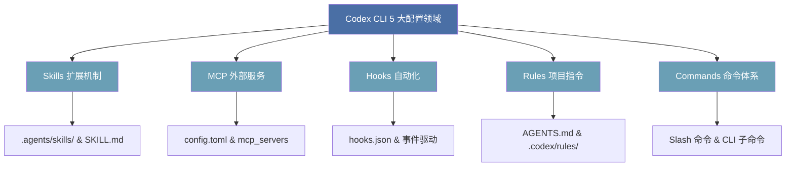

# Codex 手动配置指南

## 概述

本文面向已有 [[Claude Code Slash Commands 完整参考|Claude Code]] 使用经验的开发者，系统讲解 Codex CLI 的 5 大配置领域。每个领域包含：**配置步骤**（如何在 Codex 中操作）和 **与 Claude Code 的对比**（利用你的已有认知加速迁移）。



> [!important] 核心前提
> Codex 使用 TOML 配置格式（`~/.codex/config.toml`），Claude Code 使用 JSON。两者都支持 Agent Skills 开放标准（SKILL.md 格式互通），但在 config 组织方式上有本质差异。[来源: R8]

## 目录

- [1. Skills 配置](#1-skills-配置)
- [2. MCP 配置](#2-mcp-配置)
- [3. Hooks 配置](#3-hooks-配置)
- [4. Rules 配置（项目指令）](#4-rules-配置项目指令)
- [5. Commands 配置](#5-commands-配置)
- [综合对比速查表](#综合对比速查表)
- [迁移建议路线图](#迁移建议路线图)
- [思考题](#思考题)

---

## 1. Skills 配置

### 什么是 Skills

[[Skills 是什么|Skills]] 是 Codex 的扩展机制，包装指令、资源和可选脚本，让 Codex 可按可靠的工作流执行任务。它们遵循 Agent Skills 开放标准（`agentskills.io`），与 Claude Code 的 Skills 格式兼容。[来源: R2]

### 目录结构

每个 Skill 是一个目录，包含以下内容：

```
my-skill/
├── SKILL.md              # 必需：指令 + 元数据
├── scripts/              # 可选：可执行代码
├── references/           # 可选：参考文档
├── assets/               # 可选：模板、资源
└── agents/
    └── openai.yaml       # 可选：外观和依赖配置
```

[来源: R2]

### SKILL.md 格式

```markdown
---
name: skill-name
description: 精确描述此技能何时应该/不应该触发。
---

# Skill 名称

给 Codex 的详细指令。
```

必需字段：`name` 和 `description`。Codex 通过 `description` 自动匹配技能，因此描述要写清楚触发条件。[来源: R2]

### 创建 Skill 的三种方式

| 方式 | 命令/操作 | 适用场景 |
|------|----------|---------|
| Record & Replay | 让 Codex 录制工作流，自动生成 Skill | 从已有操作中提取模式 |
| Skill Creator | 在 CLI 中执行 `$skill-creator` | 快速交互式创建 |
| 手动创建 | 创建文件夹 + SKILL.md | 精确控制内容 |

Codex 自动检测 SKILL.md 的变化，无需手动加载。[来源: R2]

### Skill 作用域（存放位置）

| 作用域 | 路径 | 说明 |
|--------|------|------|
| REPO | `$CWD/.agents/skills` | 团队共享，某个模块 |
| REPO | `$REPO_ROOT/.agents/skills` | 仓库根目录，子文件夹共享 |
| USER | `$HOME/.agents/skills` | 个人技能，跨仓库可用 |
| ADMIN | `/etc/codex/skills` | 系统级，所有用户 |
| SYSTEM | OpenAI 内置 | 内置技能（skill-creator, plan） |

Codex 支持 symlinked skill 文件夹。[来源: R2]

### 启用/禁用 Skill

```toml
# ~/.codex/config.toml 或 .codex/config.toml
[[skills.config]]
path = "/path/to/skill/SKILL.md"
enabled = false
```

修改后重启 Codex。[来源: R2]

### 调用方式

1. **显式调用**：在 CLI/IDE 中运行 `/skills` 或输入 `$skill-name [prompt]`
2. **隐式调用**：Codex 根据任务与 `description` 的匹配度自动选择技能

### 对比：Codex Skills vs Claude Code Skills

| 维度 | Codex CLI | Claude Code |
|------|-----------|-------------|
| 配置格式 | TOML (`config.toml`, `[[skills.config]]`) | JSON (`claude_settings.json`) |
| SKILL.md 格式 | 兼容 Agent Skills 标准 | 兼容 Agent Skills 标准 |
| 跨工具兼容 | 是，同一份 SKILL.md 可复用 | 是，同一份 SKILL.md 可复用 |
| 目录规范 | `.agents/skills/<name>/SKILL.md` | 类似，路径可配置 |
| 隐式触发 | 通过 YAML frontmatter 的 `description` 字段 | 通过 YAML frontmatter 的 `description` 字段 |
| 禁用方式 | `[[skills.config]]` + `enabled = false` | 配置中移除路径 |
| 内置创建工具 | `$skill-creator` | 无内置创建器 |
| 录制工作流 | 支持 Record & Replay | 不支持 |
| 社区工作流框架 | Superpowers, Spec Kit, gstack 等 | 社区也有类似工具 |

[来源: R2][来源: R8]

### 技巧与坑点

> [!tip] Description 是触发器，不是摘要
> 写 description 时要面向模型写，明确触发词。示例：`"Trigger when user asks about deployment, CI/CD, or pipeline setup"` 比 `"Handles deployment"` 好用得多。[来源: R2]

> [!tip] 在技能中包含 Gotchas 章节
> 经验表明这是技能中最高信号密度的部分。[来源: R10]

> [!tip] 优先用指令而非脚本
> 除非需要确定性的行为，否则 Markdown 指令更灵活。[来源: R2]

> [!tip] 每个技能聚焦一个任务
> 不要在一个 SKILL.md 里塞多个不相关的工作流。[来源: R2]

---

## 2. MCP 配置

### 什么是 MCP

[[MCP协议|MCP]] (Model Context Protocol) 允许 Codex 连接外部服务和工具。支持 stdio 进程和 HTTP 端点两种传输方式。[来源: R5]

### 配置方式

#### 在 config.toml 中配置

```toml
# Stdio 服务器
[mcp_servers.calculator]
command = "python"
args = ["/path/to/server.py"]

# HTTP 服务器
[mcp_servers.my-api]
url = "https://api.example.com/mcp"

# 带环境变量
[mcp_servers.github]
command = "npx"
args = ["-y", "@modelcontextprotocol/server-github"]
[mcp_servers.github.env]
GITHUB_TOKEN = "ghp_xxxxx"

# 指定传输方式和超时
[mcp_servers.subagents]
transport = "stdio"
command = "uvx"
args = ["codex-as-mcp@latest"]
tool_timeout_sec = 600
```

[来源: R5]

#### 通过 CLI 管理

```bash
# 添加 MCP 服务器
codex mcp add <name> --env VAR=VALUE -- <command> [args]

# 列出已配置的 MCP
codex mcp list

# 移除 MCP
codex mcp remove <name>

# OAuth 登录
codex mcp login <name>

# 查看 MCP 详情
codex mcp get <name>
```

[来源: R5]

#### 并行工具调用（v0.121.0+）

```toml
[mcp_servers.my-server]
supports_parallel_tool_calls = true
```

[来源: R5]

### 配置作用域

- **全局**：`~/.codex/config.toml`
- **项目**：`.codex/config.toml`（仅信任的项目生效）[来源: R5]

### 将 Codex 作为 MCP 服务器运行

```bash
codex mcp-server
```

这暴露 `codex()` 和 `codex-reply()` 工具供其他 agent 消费。若要被 Claude Code 使用：

```json
{
  "mcpServers": {
    "codex": {
      "type": "stdio",
      "command": "codex",
      "args": ["mcp-server"]
    }
  }
}
```

[来源: R5]

### 上下文窗口管理（重要）

MCP 太多会严重消耗上下文窗口：

| 建议 | 说明 |
|------|------|
| 配置 20-30 个 MCP | 但保持启用不超过 10 个 |
| 总活跃工具数 | 保持在 80 个以下 |
| 禁用用不到的 MCP | `[mcp_servers.context7] enabled = false` |

> [!quote] 经验之谈
> "200k 的上下文窗口，如果工具太多，压缩前可能只剩 70k。" [来源: R5]

用 `/mcp` 或 `/plugins` 检查已启用的 MCP 服务器。[来源: R9]

### 对比：Codex MCP vs Claude Code MCP

| 维度 | Codex CLI | Claude Code |
|------|-----------|-------------|
| 配置位置 | `config.toml` (`[mcp_servers.*]`) | `claude_settings.json` (`mcpServers`) |
| CLI 管理 | `codex mcp add/list/remove` | `claude mcp add/list/remove` |
| OAuth 支持 | `codex mcp login <name>` | 类似支持 |
| 并行工具调用 | v0.121.0+ 支持 | 支持 |
| 作为 MCP Server | `codex mcp-server` | 不支持（Claude Code 不可作为 MCP Server 运行） |
| MCP Apps 功能 | v0.119.0+ 支持 resource reads | 类似功能 |
| 上下文消耗警告 | 文档明确提醒工具太多的上下文开销 | 也有类似机制 |

[来源: R5][来源: R8]

### 常用社区 MCP 服务器

| MCP | 启动方式 |
|-----|---------|
| GitHub | `npx -y @modelcontextprotocol/server-github` |
| Firecrawl | `npx -y firecrawl-mcp` |
| Supabase | `npx -y @supabase/mcp-server-supabase@latest --project-ref=YOUR_REF` |
| Memory | `npx -y @modelcontextprotocol/server-memory` |
| Sequential Thinking | `npx -y @modelcontextprotocol/server-sequential-thinking` |
| Vercel | HTTP — `https://mcp.vercel.com` |
| Railway | `npx -y @railway/mcp-server` |
| Cloudflare Docs | HTTP — `https://docs.mcp.cloudflare.com/mcp` |

[来源: R5]

### 技巧与坑点

> [!tip] 配置多但启用少
> 在 config 里配置 20-30 个 MCP server，但每个项目只启用 5-6 个，避免上下文浪费。[来源: R9]

> [!tip] 禁用不用的 MCP 用 `enabled = false`
> 而不是从 config 中删除，方便以后复用。[来源: R5]

> [!tip] 优先使用 `codex mcp add`
> 而非手动编辑 config.toml，CLI 命令会帮你确保格式正确。[来源: R5]

---

## 3. Hooks 配置

### 什么是 Hooks

[[Claude Code Hooks 使用指南|Hooks]] 是基于事件的自动化机制，在 Codex 生命周期的特定时刻触发。让用户定义的 shell 脚本注入到 agent 循环中，用于日志记录、安全扫描、验证和自定义自动化。[来源: R4]

### 启用 Hooks

在 `~/.codex/config.toml` 中启用：

```toml
[features]
hooks = true
# 或
codex_hooks = true
```

> [!warning] 手动审查
> 自 Codex 0.129 起，hooks 需要手动审查和激活后才能运行。[来源: R4]

### Hook 发现位置（按优先级）

Codex 从以下位置按顺序加载 hooks：

1. `~/.codex/hooks.json`（用户全局）
2. `~/.codex/config.toml`（用户全局内联 hooks）
3. `<project-root>/.codex/hooks.json`（项目级）
4. `<project-root>/.codex/config.toml`（项目级内联 hooks）

> [!important] 项目级 hooks 需信任
> 项目级 hooks 仅当项目 `.codex/` 层被信任时才加载。来自多个文件的匹配 hooks 全部运行。[来源: R4][来源: R11]

> [!warning] 要么用 hooks.json，要么用内联 `[hooks]`
> 同一层同时使用两种方式会导致警告，Codex 会加载两种并发出警告。[来源: R4]

### 支持的 Hook 事件

| 事件 | 触发时机 | 典型用途 |
|------|---------|---------|
| `SessionStart` | 会话开始时 | 注入上下文，环境设置 |
| `SessionEnd` | 会话结束时 | 清理工作 |
| `UserPromptSubmit` | 用户发送消息时 | 注入项目上下文，密钥检测 |
| `PreToolUse` | 工具执行前 | 验证、护栏、阻止危险命令 |
| `PostToolUse` | 工具执行后 | 格式化、类型检查、日志记录 |
| `PostToolUseFailure` | 工具执行失败后 | 错误处理 |
| `Stop` | Codex 完成响应时 | 保存会话记忆，检查遗留问题 |
| `Notification` | 权限请求时 | 自动审批策略 |
| `PreCompact` | 上下文压缩前 | 保留优先级 |
| `SubagentStart` / `SubagentStop` | 子 agent 生命周期 | 子 agent 监控 |

[来源: R4]

### hooks.json 完整格式

```json
{
  "hooks": {
    "PreToolUse": [
      {
        "matcher": "^Bash$",
        "hooks": [
          {
            "type": "command",
            "command": "/usr/bin/env bash \"/path/to/hooks/guard.sh\"",
            "timeout": 5,
            "statusMessage": "检查 Bash 命令"
          }
        ]
      }
    ],
    "PostToolUse": [
      {
        "matcher": "Edit && .ts/.tsx",
        "hooks": [
          {
            "type": "command",
            "command": "npx prettier --write",
            "timeout": 30,
            "statusMessage": "格式化代码..."
          }
        ]
      }
    ],
    "Stop": [
      {
        "matcher": "*",
        "hooks": [
          {
            "type": "command",
            "command": "grep -rn 'console.log' --include='*.ts' ."
          }
        ]
      }
    ]
  }
}
```

[来源: R4]

### 内联 TOML 格式（与 hooks.json 等价）

```toml
[[hooks.PreToolUse]]
matcher = "^Bash$"

[[hooks.PreToolUse.hooks]]
type = "command"
command = '/usr/bin/python3 "$(git rev-parse --show-toplevel)/.codex/hooks/pre_tool_use_policy.py"'
timeout = 30
statusMessage = "检查 Bash 命令"
```

[来源: R4]

### Hook 脚本合约

| 方面 | 要求 |
|------|------|
| 输入 | 从 stdin 读取 JSON |
| 输出 | 输出 JSON 到 stdout |
| 退出码 0 | 允许操作继续 |
| 退出码 2 | 阻止操作（仅 `PreToolUse` 护栏有效） |

#### 阻止脚本示例

```bash
#!/bin/bash
input=$(cat)
# 用 jq 解析并检查条件
# 阻止：
echo '{
  "hookSpecificOutput": {
    "hookEventName": "PreToolUse",
    "permissionDecision": "deny",
    "permissionDecisionReason": "拒绝原因"
  }
}'
# 不输出 = 允许
```

[来源: R4]

### 对比：Codex Hooks vs Claude Code Hooks

| 维度 | Codex CLI | Claude Code |
|------|-----------|-------------|
| 配置格式 | `hooks.json` 或 `config.toml` 内联 TOML | `hooks.json` 或 `claude_settings.json` |
| 事件数量 | 10 个事件 | 更多事件（包括 summary hooks） |
| Summary Hook | ❌ 不支持 | ✅ 支持 (PreCompact summary) |
| 脚本协议 | stdin/stdout JSON, exit code 0/2 | stdin/stdout JSON, exit code |
| 项目级 hooks | 需要项目信任 | 类似机制 |
| 成熟度 | 较新，仍在实验阶段 | 更成熟 |
| 自动格式化 | 可以通过 PostToolUse 实现 | 类似支持 |
| 安全边界 | ⚠️ 不要将 hooks 作为唯一安全边界 | 类似警告 |

[来源: R4][来源: R8][来源: R11]

### 常见 Hook 用例

**安全护栏**：
- 阻止 `git push --force`
- 阻止 `rm -rf /`、`git reset --hard`
- 推送到 main/master 时告警
- 提交前密钥扫描

**代码质量**：
- Auto-format（prettier）
- TypeScript 编译检查（`tsc --noEmit`）
- 检查残留 `console.log`
- 运行 linter

**工作流自动化**：
- 长时间运行命令需在 tmux 内执行
- git push 前打开编辑器审查
- SessionStart 根据 `source`（`startup \| resume \| clear`）分支行为，避免 clear 时加载重上下文

[来源: R4][来源: R10]

### 技巧与坑点

> [!warning] Hooks 不是安全边界
> Hooks 以你的用户权限执行任意命令，不要作为唯一的安全防线。应与 sandbox 和 approval policy 结合使用。[来源: R4]

> [!warning] Sandbox 可能干扰 Hooks
> Codex 默认在 sandbox 中运行，某些需要文件系统访问的 hooks 可能受影响。[来源: R4]

> [!note] `notify` vs `tui.notifications`
> `notify` 运行外部程序（如 `["python3", "/path/to/notify.py"]`），适合自定义通知；`tui.notifications` 是 TUI 内置功能。[来源: R2]

> [!warning] 官方 hooks 文档有限
> 截至撰写时，OpenAI 没有提供完整的 hooks 官方文档页面，主要依赖社区资料。[来源: R4]

---

## 4. Rules 配置（项目指令）

### 什么是 Rules / AGENTS.md

Codex 使用 `AGENTS.md` 作为主要项目指令文件（相当于 Claude Code 的 `CLAUDE.md`）。也支持通过配置让 Codex 读取 `CLAUDE.md` 等其他文件。[来源: R6]

### AGENTS.md 基本配置

在项目根目录创建：

```markdown
# 项目指南
- 使用 TypeScript strict 模式
- 遵循 /src/api 中现有的 API 模式
- 在 /tests 目录编写测试
```

在 Codex 内运行 `/init` 可自动生成 AGENTS.md。[来源: R6]

### 文件发现优先级（从高到低）

1. `.codex/AGENTS.override.md`（项目级覆盖）
2. `.codex/AGENTS.md`（项目级）
3. `~/.codex/AGENTS.override.md`（全局覆盖）
4. `~/.codex/AGENTS.md`（全局默认）
5. 子目录 `AGENTS.md`（从根向下合并）

**合并规则**：每个目录最多一个文件，从根目录向下拼接。[来源: R6]

### 让 Codex 读取 CLAUDE.md（迁移关键）

如果你已有的项目使用 CLAUDE.md，无需重写所有内容：

```toml
# ~/.codex/config.toml
project_doc_fallback_filenames = ["CLAUDE.md", "AGENTS.md", "COPILOT.md"]
```

这个配置让 Codex 按顺序搜索：`AGENTS.override.md` → `AGENTS.md` → `CLAUDE.md` → ... [来源: R6]

### 文件大小限制

```toml
project_doc_max_bytes = 32000   # 默认 32 KiB
project_doc_max_bytes = 65536   # 自定义上限
```

默认上限 ==32 KiB==，约 ==150 行==。超过此长度会被截断。[来源: R6]

### Rules 目录（`.codex/rules/`）

除了 AGENTS.md，Codex 还支持 `.codex/rules/` 目录，存放 Codex 应始终遵循的最佳实践。两种风格：

1. **单文件**：CODEX.md（用户或项目级）
2. **模块化**：多文件按关注点分组

```
~/.codex/rules/
├── security.md           # 强制安全检
├── coding-style.md       # 不可变性、文件大小限制
├── testing.md            # TDD, 80% 覆盖率
├── git-workflow.md       # Conventional Commits
├── agents.md             # 子 agent 委托规则
├── patterns.md           # API 响应格式
└── hooks.md              # Hook 文档
```

#### 示例规则内容

- "代码库中禁止使用 emoji"
- "前端避免使用紫色调"
- "部署前始终运行测试"
- "优先模块化代码而非大文件"
- "绝不允许提交 console.log"

[来源: R6][来源: R9]

### 执行策略规则（Starlark，实验性）

Codex 支持基于 Starlark 的命令执行策略（类似 Bazel 的 Starlark 语言）：

```python
# 决策: allow, prompt, forbidden
prefix_rule("npm install", "allow", "npm install 是安全的")
prefix_rule("git push --force", "prompt", "强制推送需要确认")
```

用 `codex execpolicy check` 测试策略。[来源: R6]

### 对比：Codex Rules vs Claude Code CLAUDE.md

| 维度 | Codex CLI | Claude Code |
|------|-----------|-------------|
| 主项目指令文件 | `AGENTS.md` | `CLAUDE.md` |
| 默认探索顺序 | AGENTS.override.md > AGENTS.md > 子目录 AGENTS.md | CLAUDE.md（根目录 + 子目录拼接） |
| 全局指令文件 | `~/.codex/AGENTS.md` 和 `~/.codex/AGENTS.override.md` | 类似但文件名不同 |
| 覆盖机制 | `.codex/AGENTS.override.md` > 项目级 > 全局级 | 项目级 > 全局级 |
| 规则目录 | `~/.codex/rules/`（或 `.codex/rules/`，社区实践） | `.claude/rules/`（社区实践） |
| 执行策略语言 | Starlark（实验性） | 不支持 |
| 文件大小上限 | 32 KiB 默认，可配置 | 类似限制 |
| 备选文件名 | `project_doc_fallback_filenames` 可配置 | 读 CLAUDE.md 原生 |
| 跨工具共享 | AGENTS.md 作为统一来源 + 符号链接 | CLAUDE.md 通过 @AGENTS.md 引用 |

[来源: R6][来源: R8]

### 跨工具规则共享策略

如果你同时在用 Codex 和 Claude Code，有三种维护策略：

| 策略 | 做法 | 适用场景 |
|------|------|---------|
| **符号链接** | `ln -s AGENTS.md CLAUDE.md` | 简单但丢失工具特定指令 |
| **共享核心 + 工具特定** | AGENTS.md 放通用指令；CLAUDE.md 引用 AGENTS.md（`@AGENTS.md`）再加 Claude 特有内容 | 推荐 |
| **单一事实来源** | 全部放 AGENTS.md（Codex 原生），CLAUDE.md 用 `@AGENTS.md` 引用 | Codex 优先的团队 |

**推荐方式**：将通用指令放在 `AGENTS.md` 中，`CLAUDE.md` 通过 `@AGENTS.md` 引用并附加 Claude 特有的配置。[来源: R8]

### 技巧与坑点

> [!tip] 150 行是实用启发
> 但实际限制是基于字节（32 KiB）。长本文档注意控制大小。[来源: R6]

> [!tip] AGENTS.override.md 用于个人偏好
> 不影响团队共享的 AGENTS.md。[来源: R6]

> [!tip] 用 config.toml 强制执行行为
> 审批策略、sandbox 模式等应该用 config.toml 而非写在 AGENTS.md 中。config.toml 的设置是确定性的，AGENTS.md 中的指令模型可能不遵循。[来源: R6]

> [!warning] .codex/rules/ 约定是社区驱动
> 截至撰写时，OpenAI 官方文档并未正式定义 `.codex/rules/` 目录，该约定主要由社区推广。[来源: R6]

---

## 5. Commands 配置

### Codex 的命令体系

Codex 支持两类命令：

1. **Slash 命令**（`/` 前缀）：内置于 TUI 的交互命令
2. **CLI 子命令**（`codex <subcommand>`）：终端级别的非交互命令

### 内置 Slash 命令

#### 会话管理

| 命令 | 功能 |
|------|------|
| `/compact` | 压缩上下文节省 token |
| `/diff` | 查看当前 Git diff |
| `/review` | 让另一个 Codex agent 审查代码 |
| `/resume` | 恢复之前的会话 |
| `/fork` | 克隆当前会话到新线程 |
| `/plan` | 计划模式 — 只计划不执行 |
| `/quit` / `/exit` | 退出 Codex |
| `/clear` | 清除会话 |
| `/rewind` | 回退到之前的状态 |
| `/checkpoints` | 文件级撤销点 |

#### 配置/模型管理

| 命令 | 功能 |
|------|------|
| `/model` | 切换模型或调整推理级别 |
| `/personality` | 切换个性：`friendly`, `pragmatic`, `none` |
| `/permissions` | 调整权限 |
| `/status` | 显示工作目录、模型、token 用量 |
| `/agent` | 管理 agent（子线程） |
| `/experimental` | 切换实验功能（如 Multi-agents） |
| `/fast` | 切换快速模式（1.5x 速度） |
| `/goal` | 设置/暂停/恢复/清除持久任务目标 |

#### 开发/工具命令

| 命令 | 功能 |
|------|------|
| `/init` | 创建 AGENTS.md |
| `/skills` | 浏览和插入 skills |
| `/mcp` | 列出已连接的 MCP 工具 |
| `/plugins` | 插件管理界面 |
| `/theme` | 更改主题/颜色 |
| `/statusline` | 自定义底部状态栏 |
| `/debug-config` | 调试配置加载顺序 |
| `/hookify` | 对话式 hook 创建 |
| `/apps` | 应用集成 |
| `/memories` | 跨会话记忆管理 |
| `/archive` | 会话归档 |

#### 持久化命令

| 命令 | 功能 |
|------|------|
| `/export session.json` | 导出当前会话 |
| `/load session.json` | 加载之前会话 |
| `/feedback` | 提交反馈 |

[来源: R3]

### 关键 CLI 子命令

```bash
codex exec           # 非交互式执行
codex resume         # 恢复之前会话
codex fork           # 分支之前会话
codex review         # 非交互式代码审查
codex mcp            # 管理 MCP 服务器
codex mcp-server     # 以 MCP 服务器运行 Codex
codex plugin         # 插件管理
codex plugin marketplace  # 管理插件市场
codex doct           # 诊断报告
codex features       # 特性标志管理
codex sandbox        # 在 sandbox 内运行命令
codex app            # 启动桌面应用
```

[来源: R3]

### 自定义命令：为什么不支持

> [!warning] Codex 不支持自定义 slash 命令
> `/` 前缀完全预留给内置命令。[来源: R7]

这是与 Claude Code 的一个重要差异。如果需要自定义工作流，Codex 提供了三个替代方案：

| 需求 | 替代方案 |
|------|---------|
| 固定工作流模板 | 使用 **Skills**（官方推荐） |
| 生命周期自动操作 | 使用 **Hooks** |
| 任务委派 | 使用 **Subagents** |
| 提示模板 | 使用 ~~Custom Prompts~~（已弃用） |

[来源: R7]

### Custom Prompts（已弃用）

Custom prompts 是旧方案，OpenAI 已将其标记为 **deprecated**，推荐使用 skills 替代：

```markdown
# ~/.codex/prompts/draftpr.md
---
description: 从变更文件起草 PR 描述
argument-hint: FILES=<paths> PR_TITLE=<title>
---

为 $FILES 编写 PR 描述，标题为 $PR_TITLE。
```

使用方式：`/prompts:draftpr FILES="src/index.astro" PR_TITLE="Add hero animation"`

| 维度 | Skills | Custom Prompts |
|------|--------|---------------|
| 状态 | 当前 | 已弃用 |
| 调用方式 | `$skill-name` 或隐式 | `/prompts:name` |
| 共享性 | 通过插件、Git | 仅本地 |
| 自动触发 | 是（通过 description） | 否 |
| 子目录支持 | 是（scripts, references, assets） | 否 |
| 必需 frontmatter | name + description | description（可选） |

[来源: R7]

### Subagents 命令（`/agent`）

Codex 的 `/agent` 命令用于管理子 agent 线程。子 agent 的配置以 TOML 文件形式放在 `.codex/agents/<name>.toml`：

```toml
# .codex/agents/qa-agent.toml
[agents.qa-agent]
role = "QA Engineer"
allowed_tools = ["Bash", "Edit", "Read"]
max_threads = 2
```

内置 agent：`default`, `worker`, `explorer`。[来源: R10]

### 对比：Codex Commands vs Claude Code Commands

| 维度 | Codex CLI | Claude Code |
|------|-----------|-------------|
| slash 命令数量 | ~25 个内置命令 | ~20 个内置命令 |
| 自定义 slash 命令 | ❌ 不支持 | ✅ 支持（通过 `commands` 配置） |
| 自定义命令配置 | 不适用 | JSON 配置，可绑定 shell 命令 |
| 自定义命令参数 | 不适用 | 支持 `$1-$9` 位置参数 |
| CLI 子命令 | 丰富（30+ 子命令） | 较少 |
| Custom Prompts | 已弃用，用 Skills 替代 | 有类似但非弃用 |
| 个性切换 | `/personality` (friendly/pragmatic/none) | 不支持 |
| 快速模式 | `/fast` (1.5x) | 不支持 |
| 状态栏自定义 | `/statusline` | 不支持 |
| 模型切换 | `/model` | `/model` |
| MCP 管理 | `/mcp` + `codex mcp` CLI | `/mcp` + `claude mcp` CLI |
| /plan 模式 | 支持（只计划不执行） | 支持 |
| /review | 支持 | 支持 |
| /compact | 支持 | 支持（`/compact`） |

[来源: R3][来源: R7][来源: R8]

> [!important] 关键差异
> 如果你依赖 Claude Code 的自定义 slash 命令做工作流自动化，迁移到 Codex 后需要用 Skills 或 Hooks 重新实现。Codex 的设计哲学是将扩展能力集中在 Skills 系统上，而不是开放 slash 命令的注册。[来源: R7]

### 技巧与坑点

> [!tip] 不要写下 `/plan` 到你的笔记里
> Codex 的 `/plan` 在计划模式下会输出 `plan.sh` 文件，要运行的话用 `source plan.sh`。[来源: R9]

> [!tip] Feature flags 持久化
> `codex features enable/disable` 的设置在 `$CODEX_HOME/config.toml` 中持久化。[来源: R3]

> [!tip] Shell 补全
> 用 `codex completion zsh` > 生成补全配置文件，体验更流畅。[来源: R3]

> [!note] 社区 prompt 集合
> `brucehart/codex-prompts`（API 文档、commit、PR、重构、测试）和 `feiskyer/codex-settings`（40+ 精选 prompts 和 skills）可以作为参考，但注意 Custom Prompts 已弃用。[来源: R7][来源: R12]

---

## 综合对比速查表

| 配置领域 | Codex 配置文件 | Claude Code 配置文件 | 核心差异 |
|---------|---------------|---------------------|---------|
| Skills | `.agents/skills/<name>/SKILL.md` | 同类路径 | 格式兼容，Codex 有 `$skill-creator` |
| MCP | `config.toml` `[mcp_servers.*]` | `claude_settings.json` `mcpServers` | Codex 用 TOML，CC 用 JSON |
| Hooks | `hooks.json` 或 `config.toml` 内联 | `hooks.json` 或 `claude_settings.json` | Codex 不支持 summary hook |
| Rules | `AGENTS.md` + `.codex/rules/` | `CLAUDE.md` + `.claude/rules/` | Codex 原生 AGENTS.md，CC 原生 CLAUDE.md |
| Commands | 仅内置 slash 命令 | 内置 + 自定义 slash 命令 | Codex 不支持自定义命令 |
| 全局配置 | `~/.codex/config.toml` | `claude_settings.json` | TOML vs JSON |
| 项目配置 | `.codex/config.toml` | `.claude/settings.json` | 路径不同 |
| Sandbox | 内置 OS 级 sandbox | 无内置 sandbox | Codex 独有优势 |

[来源: R1][来源: R8]

---

## 迁移建议路线图

1. **第一步**：在 `~/.codex/config.toml` 设置 `project_doc_fallback_filenames = ["CLAUDE.md"]`，原有 CLAUDE.md 直接可用
2. **第二步**：将 Claude Code 的 `claude_settings.json` 转换为 TOML 格式，主要配置 approval policy、sandbox 等
3. **第三步**：原有 SKILL.md 无缝迁移（格式兼容）
4. **第四步**：hooks.json 基本兼容，但检查是否有使用 summary hook（Codex 不支持）
5. **第五步**：将自定义 slash 命令的工作流改用 Skills 或 Hooks 实现

---

## 思考题

1. **迁移兼容性**：你有一个项目，团队在同时使用 Claude Code 和 Codex。你会怎么设计 AGENTS.md 和 CLAUDE.md 的关系，使得指令维护成本最低？

2. **上下文管理**：你在代码库中配置了 15 个 MCP 服务器和 8 个 Skills。Codex 的上下文窗口出现了严重的 "被工具吃掉" 的情况。你会如何诊断和解决这个问题？具体怎么配置？

3. **安全策略设计**：Codex 有三层安全机制（Sandbox、Approval Policy、Hooks）。如果团队中有人习惯使用 `--yolo` 模式，你觉得在哪一层设防最有效？各层的优劣是什么？

4. **工作流迁移**：你在 Claude Code 中配置了一个自定义 slash 命令 `/deploy` 来执行部署流程。迁移到 Codex 后，你打算用哪种机制替代？给出具体的实现方案（SKILL.md 或 hooks 配置）。

5. **异常场景**：你发现项目级 `.codex/hooks.json` 没有生效，`PreToolUse` 的 guard script 完全没有触发。按你的理解，可能的原因有哪些？你会按什么顺序排查？
