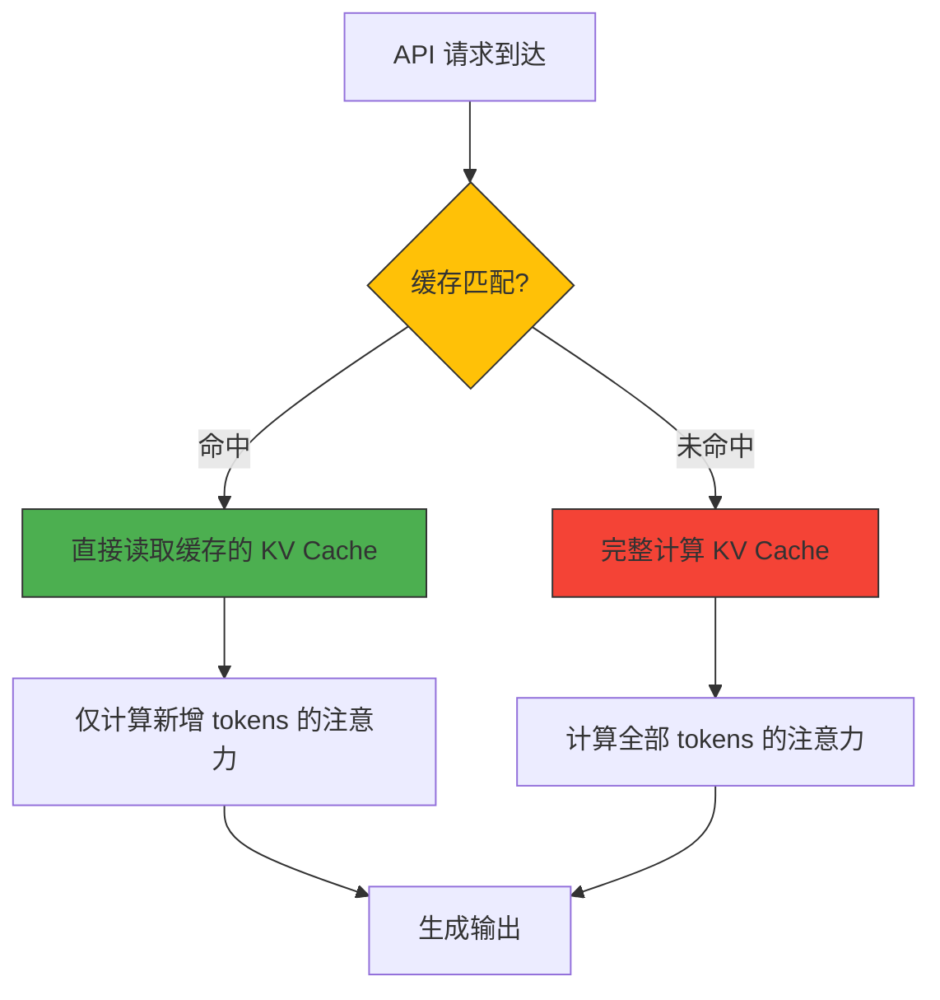
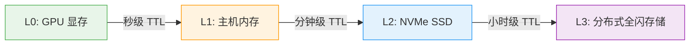
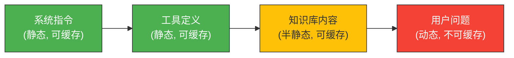
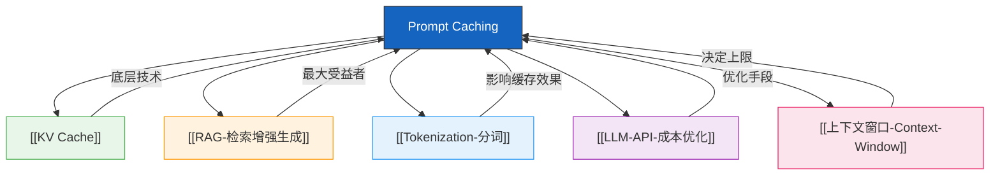

# LLM API Prompt Caching（提示缓存）

> [!info] 概述
> **Prompt Caching（提示缓存）** 是一种跨 API 请求复用 KV Cache 的技术。当多个请求共享相同的 Prompt 前缀时，服务商缓存该前缀的键值对，后续相同前缀的请求直接复用缓存结果，从而大幅降低延迟和成本。缓存命中的价格通常仅为缓存未命中的 **1/10 到 1/120**。

## 核心概念

### 是什么

Prompt Caching 是大模型 API 服务商提供的一项成本优化机制。其核心原理是：Transformer 模型在处理 Prompt 时需要计算每个 token 的 Key 和 Value 向量（KV Cache），如果多个请求共享相同的前缀内容，服务商可以将这些计算结果缓存起来，后续请求直接读取缓存而无需重复计算。

### 为什么需要

大模型 API 按 tokens 计费，但不同 tokens 的实际计算成本并不相同：

- **Prefill 阶段**：处理所有输入 tokens，计算注意力键值对，是推理过程中最计算密集的环节，需要大量 GPU 算力
- **Decoding 阶段**：逐 token 生成输出，计算量相对较小

当缓存命中时，服务商只需从高速存储中读取预先计算好的 KV Cache，算力成本几乎为零。这就是为什么缓存命中的价格可以比未命中低 **10-120 倍**。

### 通俗理解

**🎯 比喻**：就像做菜——
- **缓存命中** = 从冰箱拿出提前煮好的菜（几秒钟，极低成本）
- **缓存未命中** = 从洗菜切菜开始重新做一遍（半小时，高成本）

如果你每天都要做番茄炒蛋，提前准备好一大盆番茄炒蛋备用（缓存），比每次从洗番茄、打鸡蛋开始做要便宜得多。

**📦 示例**：

```python
# 缓存不友好的写法 —— 动态内容污染了前缀
system_prompt = f"""
你是客服助手，今天是 {datetime.now().strftime('%Y-%m-%d %H:%M:%S')}。
你正在帮助用户处理以下知识库的内容。
请基于以下知识库回答问题。

知识库内容：
{knowledge_base_text}

用户的问题是：
"""

# 缓存友好的写法 —— 静态内容在前，动态内容置后
system_prompt = """
你是客服助手。
你正在帮助用户处理以下知识库的内容。
请基于以下知识库回答问题。

知识库内容：
{knowledge_base_text}
"""

# 将动态内容（时间戳、用户 ID 等）放在最后
user_message = f"""
当前时间：{datetime.now().strftime('%Y-%m-%d %H:%M:%S')}
用户ID：{user_id}

用户的问题是：{user_question}
"""
```

> 关键区别：第一个写法中，每次请求的时间戳不同，导致**整个 Prompt 无法命中缓存**。第二个写法将静态部分前置（可命中缓存），动态部分后置（仅末尾少量 tokens 需要计算）。

## 技术细节

### 工作原理

Transformer 的自注意力机制中，每个 token 都需要计算 Query、Key、Value 三个向量。标准 Scaled Dot-Product Attention 公式为：

$$
\text{Attention}(Q, K, V) = \text{softmax}\left(\frac{QK^T}{\sqrt{d_k}}\right)V
$$

KV Cache 的核心思想是：对于已经计算过的 tokens $t_1, t_2, \ldots, t_n$，将其 Key 和 Value 向量缓存为 $(K_{1:n}, V_{1:n})$。后续新 token $t_{n+1}$ 只需计算自己的 Query $q_{n+1}$，然后与缓存的 $(K_{1:n}, V_{1:n})$ 做注意力计算即可。



从理论上看，KV Cache 将单次推理中注意力计算的复杂度从 $O(n^2)$ 降为 $O(n)$。Prompt Caching 在此基础上更进一步：如果多个请求之间共享相同的 Prompt 前缀，则跨请求共享同一份 KV Cache，从而大幅降低重复计算成本。

### 缓存系统架构

大型 API 服务商通常采用分层缓存架构：



| 层级 | 存储介质 | 特点 | 典型 TTL |
|:-----|:---------|:-----|:---------|
| L0 | GPU 显存 | 极速访问，容量有限 | 秒级 |
| L1 | 主机内存 | 快速，中等容量 | 分钟级 |
| L2 | 本地磁盘（NVMe SSD） | 较慢，大容量 | 小时级 |
| L3 | 分布式全闪存储 | 最慢，近乎无限 | 数小时到数天 |

### 各厂商实现对比

| 厂商 | 机制类型 | 最小缓存粒度 | 缓存方式 | TTL | 特殊规则 |
|:-----|:---------|:------------|:---------|:----|:---------|
| DeepSeek | 自动隐式 | 64 tokens | 零代码改动，自动匹配 | 数小时到数天 | 无额外配置成本 |
| OpenAI | 自动隐式 | 1024 tokens | 可选参数控制 | 5-10 分钟 | 无需手动管理 |
| Anthropic | 显式标记 | 1024 tokens | 通过 `cache_control` 标记手动设断点 | 5 分钟（重置）/ 1 小时（不重置） | 每次写入缓存收取 1.25x 费用 |
| 阿里云 | 显式创建 | 未公开 | 先手动创建缓存，再使用 | 按配置 | 创建时支付 125% 费用 |
| Google | 显式创建 | 未公开 | 手动创建 + 存储费 | 按配置 | 额外支付存储费用 |

### DeepSeek 的独特创新

DeepSeek 在 Prompt Caching 领域的核心竞争力在于其**架构级优化**。他们将 KV Cache 卸载到廉价分布式磁盘阵列上，存储成本比传统 GPU 显存方案低 **1-2 个数量级**。这意味着：

1. DeepSeek 可以提供更激进的缓存定价 —— 缓存命中低至 0.02元/百万tokens
2. DeepSeek 的缓存 TTL 更长（数小时到数天），远高于 OpenAI 的 5-10 分钟
3. 缓存机制完全隐式，开发者无需任何代码改动即可受益

代价是缓存未命中时的价格较高（V4-Pro 达 3元/百万tokens），形成了 **120 倍的价差**，远高于行业平均的 10 倍。

## 各厂商定价对比

### 中国大陆厂商

| 厂商 | 模型 | 缓存命中 | 缓存未命中 | 价差倍数 |
|:-----|:-----|:---------|:----------|:---------|
| DeepSeek | V4-Flash | **0.02元**/百万tokens | 1元/百万tokens | **50x** |
| DeepSeek | V4-Pro | **0.025元**/百万tokens | 3元/百万tokens | **120x** |
| 阿里云 | Qwen3-Max | 0.25元/百万tokens | 2.5元/百万tokens | 10x |
| 阿里云 | Qwen3.5-Plus | 0.08元/百万tokens | 未公开 | - |

### 国际厂商

| 厂商 | 模型 | 缓存命中（输入） | 缓存未命中（输入） | 价差倍数 |
|:-----|:-----|:----------------|:------------------|:---------|
| OpenAI | GPT-5.4 | $0.25/百万tokens | $2.50/百万tokens | 10x |
| Anthropic | Claude Sonnet 4.6 | $0.30/百万tokens | $3.00/百万tokens | 10x |
| Google | Gemini 2.5 Pro | $0.125/百万tokens | $1.25/百万tokens | 10x |

> **关于 DeepSeek 定价的说明**：DeepSeek 官方定价页面显示 V4-Flash 缓存未命中为 1元/百万tokens，V4-Pro 为 3元/百万tokens。本文引用的 0.1元 价格系用户笔记中的记录，与官方当前数据存在出入，建议以 [[DeepSeek 官方定价页|官方定价页面]] 为准。0.025元的缓存命中价格是否属于"限时 2.5 折"折扣，也请以官网最新公告核实。

### 成本对比场景

假设一个典型的 RAG 应用：每次请求包含 5000 tokens 的知识库上下文 + 200 tokens 的用户问题。

| 方案 | 场景 | 每次调用成本 |
|:-----|:-----|:------------|
| DeepSeek V4-Pro 缓存命中 | 知识库前缀命中缓存 | 5000 x 0.025/100万 = **0.000125元** |
| DeepSeek V4-Pro 缓存未命中 | 前缀均不命中 | 5000 x 3/100万 = **0.015元** |
| OpenAI GPT-5.4 缓存命中 | 知识库前缀命中缓存 | 5000 x $0.25/100万 = **$0.00125** |
| OpenAI GPT-5.4 缓存未命中 | 前缀均不命中 | 5000 x $2.50/100万 = **$0.0125** |

> 在同样的用量下，DeepSeek V4-Pro 缓存命中的成本仅为未命中的 **1/120**。一天的请求量（比如 10 万次），缓存命中仅需 12.5 元，未命中则需要 1500 元——差距极其显著。

## 如何提高缓存命中率

以下是 8 个经过验证的最佳实践：

### 1. 静态优先，动态置后

将 Prompt 按"静态 -> 动态"的顺序组织。把系统指令、工具定义、知识库内容这些**固定不变**的部分放在最前面，用户问题、时间戳等**变化**的内容放在最后。



```python
# 正确的 Prompt 结构
prompt = f"""
[系统指令 - 静态，可缓存]
你是专业的编程助手...

[工具定义 - 静态，可缓存]
你有以下工具可用：get_weather, search_web...

[知识库内容 - 半静态，可缓存]
相关文档：{document_context}

[用户问题 - 动态，不可缓存]
当前是{timestamp}，用户问：{user_query}
"""
```

### 2. 避免动态内容污染前缀

不要在 System Prompt 开头嵌入：
- 时间戳或日期
- 随机 ID 或 UUID
- Session ID 或 request ID
- 任何每次调用都会变化的参数

```python
# ❌ 错误：每次请求前缀不同
prompt = f"[{uuid.uuid4()}] 你是一个客服助手..."

# ✅ 正确：前缀完全固定
prompt = "你是一个客服助手...\n\n本次请求ID：" + request_id
```

### 3. 确保超出最小缓存粒度

不同厂商的最小缓存粒度不同：

| 厂商 | 最小粒度 | 建议公共前缀长度 |
|:-----|:---------|:----------------|
| DeepSeek | 64 tokens | > 100 tokens |
| OpenAI | 1024 tokens | > 1500 tokens |
| Anthropic | 1024 tokens | > 1500 tokens |

如果公共前缀太短（少于最小缓存粒度），缓存根本无法被匹配。

### 4. 确定性 JSON 序列化

构造结构化 Prompt（如工具调用参数）时，确保 JSON 的 key 顺序固定：

```python
import json

# ❌ 错误：Python dict 默认不保证 key 顺序
# （Python 3.7+ 虽保留插入顺序，但跨语言序列化可能不同）

# ✅ 正确：强制排序
json.dumps(data, sort_keys=True, ensure_ascii=False)

# ✅ 也正确：使用有序 dict
from collections import OrderedDict
json.dumps(OrderedDict(sorted(data.items())), ensure_ascii=False)
```

### 5. 追加而非编辑历史消息

多轮对话中，始终**追加**新消息，不要修改历史消息。

```python
messages = [
    {"role": "system", "content": SYSTEM_PROMPT},
    {"role": "user", "content": "第一轮问题"},
    {"role": "assistant", "content": "第一轮回答"},
    {"role": "user", "content": "第二轮问题"},  # ✅ 追加新消息
]

# ❌ 错误：编辑历史消息会使缓存无效
# messages[1]["content"] = "修改后的问题"
```

### 6. 批量共享前缀

适用于 RAG、知识库问答、文档处理等场景。将共享知识库内容放在前，个性化问题放在后。

```python
# 共享的知识库前缀
shared_knowledge_base = """
公司 2025 年度财报显示：
- 营收：15.2 亿元，同比增长 23%
- 净利润：3.1 亿元，同比增长 18%
- 研发投入：2.8 亿元，占总营收 18.4%
"""

# 多个用户可以在共享前缀上命中缓存
prompts = [
    shared_knowledge_base + "2025年营收是多少？",
    shared_knowledge_base + "净利润增长了多少？",
    shared_knowledge_base + "研发投入占比如何？",
]
```

### 7. 使用固定长度填充

对于需要对齐到缓存边界的场景，可以使用固定长度的占位符：

```python
# 某些缓存系统按固定大小分块（如 64 tokens）
# 可以通过 padding 来对齐缓存边界
PADDING_TOKEN = " " * 256  # 约 64 tokens 的占位

prompt = f"{shared_prefix}{PADDING_TOKEN}\n{user_question}"
```

### 8. 监控缓存命中率

几乎所有主流 API 都会在响应中返回缓存命中信息。

```python
import requests

response = requests.post(
    "https://api.deepseek.com/v1/chat/completions",
    headers={"Authorization": "Bearer YOUR_API_KEY"},
    json={...}
)

data = response.json()

# DeepSeek 返回的缓存命中 tokens 数
cache_hit_tokens = data["usage"].get("prompt_cache_hit_tokens", 0)
cache_miss_tokens = data["usage"].get("prompt_cache_miss_tokens", 0)

total_prompt = cache_hit_tokens + cache_miss_tokens
hit_rate = cache_hit_tokens / total_prompt * 100 if total_prompt > 0 else 0

print(f"缓存命中率: {hit_rate:.1f}%")
print(f"消费金额: 缓存命中 {cache_hit_tokens} tokens × 命中单价 + "
      f"缓存未命中 {cache_miss_tokens} tokens × 未命中单价")
```

## 常见陷阱和痛点

### 1. 动态内容污染前缀（最常见）

在 System Prompt 开头嵌入 `{datetime.now()}`、`{uuid.uuid4()}` 或任何 session ID，会导致**整个 Prompt 前缀**每次都不同，缓存命中率瞬间归零。

### 2. 微小的字符串差异

缓存匹配要求**精确的字符串匹配**。下面两个看似相同的字符串会被视为不同：

```
"你是一个助手"  # 末尾有空格
"你是一个助手"  # 末尾无空格
```

空格、标点符号、大小写的细微差异都会导致缓存失效。

### 3. 非确定性 JSON 序列化

不同语言或不同版本的 JSON 序列化库可能产生不同的 key 顺序。Python 3.5 及更早版本中，dict 的 key 顺序就是不固定的。

### 4. 编辑历史消息

在多轮对话中，一旦修改了某条历史消息的内容，**该消息之前的所有缓存都会失效**。永远不要编辑历史消息，只能追加。

### 5. TTL 过期

| 厂商 | TTL | 风险 |
|:-----|:----|:-----|
| OpenAI | 5-10 分钟 | 低频请求几乎无法命中 |
| Anthropic | 5 分钟（重置）/ 1 小时（不重置） | Claude Code TTL 变更曾导致部分用户账单增加 30-60% |
| DeepSeek | 数小时到数天 | 对低频请求友好 |

### 6. 跨厂商策略误用

将 Anthropic 的显式缓存策略（`cache_control` 标记）直接套用到 DeepSeek 或 OpenAI 的隐式缓存上，可能导致预期之外的缓存行为。

## 与其他概念的关系



| 概念 | 关系 |
|:-----|:-----|
| [[KV Cache]] | Prompt Caching 的核心底层技术，复用 KV Cache 实现跨请求缓存 |
| [[RAG-检索增强生成]] | RAG 应用是 Prompt Caching 的最大受益者之一，知识库内容天然适合作为共享前缀 |
| [[Tokenization-分词]] | 缓存匹配基于 tokens 而非字符，token 边界对齐影响缓存效果 |
| [[LLM-API-成本优化]] | Prompt Caching 是最有效的 API 成本优化手段之一 |
| [[上下文窗口-Context-Window]] | 上下文窗口大小决定了可缓存的前缀长度上限 |

## 参考资料

- [DeepSeek 官方定价页面](https://api-docs.deepseek.com/quick_start/pricing)
- [DeepSeek API 文档 - Prompt Caching](https://api-docs.deepseek.com/guides/kv_cache)
- [OpenAI 官方文档 - Prompt Caching](https://platform.openai.com/docs/guides/prompt-caching)
- [Anthropic 官方文档 - Prompt Caching](https://docs.anthropic.com/en/docs/build-with-claude/prompt-caching)
- [Google AI 官方文档 - Context Caching](https://ai.google.dev/gemini-api/docs/caching)
- [阿里云 Qwen 官方定价](https://help.aliyun.com/zh/model-studio/getting-started/models)
- [vLLM 官方文档 - Automatic Prefix Caching](https://docs.vllm.ai/en/latest/features/automatic_prefix_caching.html)
- [SGLang 官方文档 - RadixAttention Prefix Caching](https://lmsysorg.github.io/sglang/)

## 个人笔记

> [!personal] 我的理解与感悟
> - DeepSeek 的 120 倍价差在行业内是极其激进的存在。这意味着对缓存友好的场景（如 RAG、系统指令固定的应用），DeepSeek 的成本优势远超其他厂商。
> - 核心策略：**让 80% 以上的 Prompt tokens 命中缓存**。如果做不到，缓存非但无法省钱，反而可能因为未命中时的高单价而付出更高成本。
> - Anthropic 的显式缓存策略是一把双刃剑——控制更精细，但如果不小心（比如 TTL 变更、缓存写入次数过多），账单可能不降反增。
> - 缓存友好设计应该成为 LLM 应用架构设计的第一优先级，其 ROI 远高于其他优化手段。
> - 关于定价的冲突说明：用户笔记中提到的 0.1元 缓存未命中价格与官方 1-3元 价格存在差异，建议使用时以官方定价页面为准，避免成本预估偏差。
>
> （此处记录个人学习心得，更新时会被保留）
