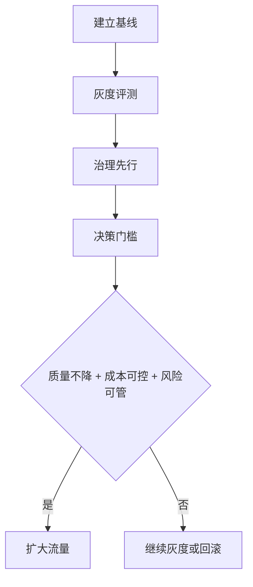

# DeepSeek-V4

> [!info] 概述
> **一句话定义**：DeepSeek-V4 是 DeepSeek 在 2026-04-24 对外出现的 **Preview 版本模型条目**，当前可确认信息以官方发布状态为主。
> **通俗比喻**：它像一辆“已开放预约试驾的新车型”——可以确认已发布预览，但性能极限和内部参数仍需等待完整实测与官方技术文档。

## 核心概念

### 是什么
DeepSeek-V4（当前语境下）可视为 DeepSeek 新一代模型的预览节点。

- **Verified**：官方 API 文档新闻出现 “DeepSeek V4 Preview Release”，时间为 2026-04-24。
- **Uncertain**：完整架构、训练规模、对齐流程、详细 benchmark 明细，尚未在可引用的一手公开材料中完整披露。
- **Inferred**：外部报道将其定位为“高性价比且接近 SOTA 的模型候选”，但该结论仍需官方可复现实验或第三方标准化评测交叉验证。

> [!info] 就近来源
> - [DeepSeek API Docs News: DeepSeek V4 Preview Release](https://api-docs.deepseek.com/news/news260424)（S1，verified）
> - [AP News 报道](https://apnews.com/article/d2ed33f2521917193616e061674d5f92)（S2，inferred）
> - [VentureBeat 报道](https://venturebeat.com/technology/deepseek-v4-arrives-with-near-state-of-the-art-intelligence-at-1-6th-the-cost-of-opus-4-7-gpt-5-5)（S3，inferred）

### 为什么需要
在团队选型中，“是否采用新模型”通常不只看能力上限，而是看 **能力-成本-可运维性-合规性** 的综合平衡。DeepSeek-V4 的潜在价值在于：

1. 提供新的供应商/模型选择，降低单一模型依赖风险。
2. 可能在推理成本与效果之间提供更优折中（**inferred，需实测**）。
3. 与现有工作流（Agent、RAG、工具调用）组合时，可能改善整体系统效率，而不是只追求单项榜单成绩。

> [!info] 就近来源
> - [DeepSeek 官网](https://www.deepseek.com/en)（S4，verified：官方入口）
> - [VentureBeat 报道](https://venturebeat.com/technology/deepseek-v4-arrives-with-near-state-of-the-art-intelligence-at-1-6th-the-cost-of-opus-4-7-gpt-5-5)（S3，inferred）
> - [AP News 报道](https://apnews.com/article/d2ed33f2521917193616e061674d5f92)（S2，inferred）

### 通俗理解
把 DeepSeek-V4 放进模型选型流程时，不建议当作“立刻替换一切的终极模型”，更适合当作“候选引擎”：先小流量试跑，再看任务集表现、稳定性与治理成本，再决定是否扩容。

**示例（团队评测思路，非官方固定流程）**：
```text
1. 建立任务清单：问答、代码、总结、长上下文、多轮工具调用
2. 对比候选模型：DeepSeek-V4 vs 现用主力模型
3. 统一指标：成功率、人工返工率、拒答/幻觉风险、单位任务成本
4. 加入治理项：敏感信息过滤、日志审计、Prompt 注入防护
5. 结论分级：可上线 / 灰度 / 仅限内测
```

> [!info] 就近来源
> - [DeepSeek 官网](https://www.deepseek.com/en)（S4，verified）
> - [DeepSeek-R1 GitHub](https://github.com/deepseek-ai/DeepSeek-R1)（S5，verified：生态与工程实践入口）
> - [DeepSeek-R1 论文](https://arxiv.org/abs/2501.12948)（S7，verified：既有技术路线参考，非 V4 直接披露）

## 技术细节

### 已验证 / 推断 / 不确定：分层说明

| 维度 | 当前状态 | 说明 |
|:---|:---:|:---|
| 发布状态 | **Verified** | 官方新闻出现 “DeepSeek V4 Preview Release”（2026-04-24）。 |
| 成本与能力定位 | **Inferred** | 媒体称其“低成本接近 SOTA”，但缺乏官方完整评测与统一复现细节。 |
| 模型架构细节 | **Uncertain** | 尚未见到 V4 完整一手架构披露，不宜下结论。 |
| 训练与对齐策略 | **Uncertain / Inferred** | 可参考 V3/R1 公开路线理解可能方向，但不能等同于 V4 实际实现。 |

### 与其他模型的对比（以“可确认边界”为核心）

> [!note] 说明
> 下表强调“如何比较”，而非给出硬性胜负结论。

| 对比项 | DeepSeek-V4（当前） | 其他主流模型（泛指） | 结论状态 |
|:---|:---|:---|:---:|
| 官方发布明确信号 | 有预览发布信号（S1） | 多数有正式版本页与文档 | **Verified（仅发布层）** |
| 公开评测完整度 | 待补齐 | 通常较完整或有第三方覆盖 | **Uncertain** |
| 成本优势叙事 | 媒体有积极描述（S2/S3） | 各家宣传口径差异大 | **Inferred** |
| 企业可落地性 | 可接入评测与治理流程 | 取决于 API、合规、支持能力 | **Inferred** |

### 创新点（当前“可讨论”而非“已盖棺定论”）

1. **产品节奏上的创新（verified + inferred）**：以 Preview 形式快速进入开发者视野，使团队可尽早进行任务级评测。
2. **性价比叙事（inferred）**：外部报道强调“能力接近前沿、成本更友好”；若后续被标准化评测验证，将是关键差异化。
3. **生态衔接潜力（inferred）**：若延续 DeepSeek 既有开源/技术路线沟通方式，团队迁移学习成本可能较低（需后续文档验证）。

> [!info] 就近来源
> - [DeepSeek API Docs News](https://api-docs.deepseek.com/news/news260424)（S1，verified）
> - [AP News](https://apnews.com/article/d2ed33f2521917193616e061674d5f92)（S2，inferred）
> - [VentureBeat](https://venturebeat.com/technology/deepseek-v4-arrives-with-near-state-of-the-art-intelligence-at-1-6th-the-cost-of-opus-4-7-gpt-5-5)（S3，inferred）
> - [DeepSeek-R1 GitHub](https://github.com/deepseek-ai/DeepSeek-R1)（S5，reference）
> - [arXiv: 2412.19437](https://arxiv.org/abs/2412.19437)（S6，reference）
> - [DeepSeek-R1 论文](https://arxiv.org/abs/2501.12948)（S7，reference）

## 如何在团队中使用（落地路径）

### 建议的四步法（先验证，再扩展）



1. **建立基线**：选定当前生产模型作为对照组，定义统一任务集。
2. **灰度评测**：让 DeepSeek-V4 仅进入低风险场景，观察输出质量和稳定性。
3. **治理先行**：同步接入审计、敏感信息检测、提示词注入防护、人工复核策略。
4. **决策门槛**：仅当“质量不降 + 成本可控 + 风险可管”同时满足，才扩大流量。

### 推荐接入场景

- 内部知识问答、文档总结、研发辅助、流程自动化中的非关键决策环节。
- 与 [[05-其他主题/RAG技术入门指南]] 结合，减少纯参数记忆依赖。
- 在 [[01-基础概念/Agent智能体]] 场景中作为候选推理引擎进行 A/B 测试。
- 配合 [[01-基础概念/Prompt提示词]] 统一模板，减少评测噪音。

### 不建议直接一步到位的场景

- 高风险合规场景（金融/医疗关键决策）直接全量替换。
- 缺乏可观测性与回滚机制的生产环境。

> [!info] 就近来源
> - [DeepSeek 官网](https://www.deepseek.com/en)（S4，verified）
> - [DeepSeek-R1 GitHub](https://github.com/deepseek-ai/DeepSeek-R1)（S5，inferred：工程实践参考）
> - [DeepSeek-R1 论文](https://arxiv.org/abs/2501.12948)（S7，inferred：路线参考）

## 证据边界与不确定性

- **已确认（verified）**：存在官方 “DeepSeek V4 Preview Release” 发布信号与时间点（S1）。
- **合理推断（inferred）**：媒体将其描述为高性价比、接近 SOTA 的竞争者，但属于外部叙事，不等同于官方标准评测结论（S2/S3）。
- **仍不确定（uncertain）**：V4 架构细节、训练数据规模、完整对齐方法、统一 benchmark 可复现结果。
- **行动建议**：在团队决策中，将 V4 视作“高潜候选”而非“既定最优解”，通过本地任务集实测得出结论。

> [!warning] 不确定性提示
> 凡涉及“显著更低成本”“全面优于某模型”等结论，当前都应标注为 **inferred** 或 **uncertain**，不得当作已验证事实写入决策结论。

> [!info] 就近来源
> - [DeepSeek API Docs News](https://api-docs.deepseek.com/news/news260424)（S1）
> - [AP News](https://apnews.com/article/d2ed33f2521917193616e061674d5f92)（S2）
> - [VentureBeat](https://venturebeat.com/technology/deepseek-v4-arrives-with-near-state-of-the-art-intelligence-at-1-6th-the-cost-of-opus-4-7-gpt-5-5)（S3）

## 与其他概念的关系

| 概念 | 关系 |
|:---|:---|
| [[05-其他主题/AI模型对比/GLM系列模型完整对比]] | 用于建立多模型横向评测框架，避免单模型视角偏差。 |
| [[01-基础概念/Agent智能体]] | DeepSeek-V4 可作为 Agent 的推理核心之一，需配合工具调用与安全策略。 |
| [[05-其他主题/RAG技术入门指南]] | 通过 RAG 降低幻觉风险，提升企业知识场景可控性。 |
| [[01-基础概念/Prompt提示词]] | 统一提示词模板可减少模型间对比噪音。 |

> [!info] 就近来源
> - [DeepSeek 官网](https://www.deepseek.com/en)（S4）
> - [DeepSeek-R1 GitHub](https://github.com/deepseek-ai/DeepSeek-R1)（S5）

## 最佳实践

- 用“任务成功率 + 人工返工率 + 风险事件”做主指标，不只看单次回答观感。
- 为 DeepSeek-V4 设独立灰度策略与回滚开关，避免全局切换风险。
- 所有“成本更低/效果更强”结论都先标注为“待验证”，直到内部评测完成。
- 在评测报告中单列 `verified / inferred / uncertain` 三栏，防止叙事混淆。
- 将对比流程沉淀到团队知识库，并与 [[05-其他主题/AI模型对比/GLM系列模型完整对比]] 保持统一格式。

> [!info] 就近来源
> - [DeepSeek API Docs News](https://api-docs.deepseek.com/news/news260424)（S1）
> - [DeepSeek 官网](https://www.deepseek.com/en)（S4）
> - [DeepSeek-R1 论文](https://arxiv.org/abs/2501.12948)（S7）

## 常见问题

### Q1：现在能否断言 DeepSeek-V4 一定优于其他顶级模型？
不能。当前只能确认其预览发布与外部积极评价，尚不足以形成统一、可复现的“全面领先”结论。

### Q2：如果资料不完整，团队还要不要试？
可以试，但应采用“低风险场景灰度 + 明确回滚 + 证据分级”的方式推进。

### Q3：如何避免把媒体说法当成事实？
在每条关键结论后标注其证据类型（verified/inferred/uncertain），并要求至少一个官方或可复现来源支撑。

> [!info] 就近来源
> - [DeepSeek API Docs News](https://api-docs.deepseek.com/news/news260424)（S1）
> - [AP News](https://apnews.com/article/d2ed33f2521917193616e061674d5f92)（S2）
> - [VentureBeat](https://venturebeat.com/technology/deepseek-v4-arrives-with-near-state-of-the-art-intelligence-at-1-6th-the-cost-of-opus-4-7-gpt-5-5)（S3）

## 参考资料

### 官方资源（Verified）

- [DeepSeek API Docs News: DeepSeek V4 Preview Release](https://api-docs.deepseek.com/news/news260424)
- [DeepSeek Official Website](https://www.deepseek.com/en)
- [DeepSeek-R1 GitHub Repository](https://github.com/deepseek-ai/DeepSeek-R1)

### 媒体报道（Inferred）

- [AP News: 相关报道](https://apnews.com/article/d2ed33f2521917193616e061674d5f92)
- [VentureBeat: DeepSeek-V4 报道](https://venturebeat.com/technology/deepseek-v4-arrives-with-near-state-of-the-art-intelligence-at-1-6th-the-cost-of-opus-4-7-gpt-5-5)

### 技术参考（Reference）

- [arXiv: 2412.19437](https://arxiv.org/abs/2412.19437)
- [arXiv: 2501.12948](https://arxiv.org/abs/2501.12948)

## 个人笔记
> [!personal] 我的理解与感悟
> （此处记录个人学习心得，更新时会被保留）