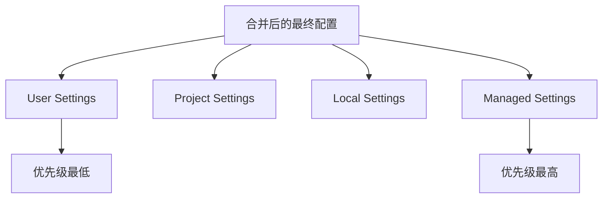

# Claude Code 会话管理

> [!info] 概述
> **Claude Code 使用 CLAUDE.md 文件管理跨会话记忆** - 通过项目级、用户级和本地级配置实现上下文持久化和记忆管理。

## 核心概念 💡

### 记忆系统架构

Claude Code 使用**文件系统**而非传统的会话文件来管理记忆：

```
┌─────────────────────────────────────────────────────────┐
│                    记忆优先级（高→低）                      │
├─────────────────────────────────────────────────────────┤
│  1. 本地记忆 (.claude/memory/)                           │
│  2. 项目记忆 (./CLAUDE.md)                               │
│  3. 用户记忆 (~/.claude/user_memory.md)                  │
│  4. 全局设置 (~/.claude/settings.json)                   │
└─────────────────────────────────────────────────────────┘
```

### 记忆类型对比

| 类型 | 存储位置 | 作用域 | 典型内容 |
|------|----------|--------|----------|
| 本地记忆 | `.claude/memory/` | 当前会话 | 临时文件、会话特定数据 |
| 项目记忆 | `./CLAUDE.md` | 当前项目 | 项目规范、架构决策 |
| 用户记忆 | `~/.claude/user_memory.md` | 所有会话 | 编码偏好、常用模式 |
| 全局设置 | `~/.claude/settings.json` | 全局配置 | 模型选择、权限设置 |

### 会话 vs 记忆

**重要区别**：
- **会话**：当前的对话上下文，可通过 `/clear` 清理，通过 `/compact` 压缩
- **记忆**：持久化的文件内容，跨会话保存，需手动编辑

```
会话（临时）                记忆（持久）
┌─────────────┐           ┌─────────────┐
│ 对话历史    │           │ CLAUDE.md   │
│ 文件上下文  │  ←→       │ settings    │
│ 临时状态    │           │ user_memory │
└─────────────┘           └─────────────┘
```

## 配置系统详解

### Settings 配置优先级



**配置文件位置**：
```bash
# 用户级配置（所有会话）
~/.claude/settings.json

# 项目级配置（当前项目）
./.claude/settings.json

# 本地配置（当前目录）
./.claude.local/settings.json

# 托管配置（优先级最高）
~/.claude/managed-settings.json
```

**示例配置结构**：
```json
{
  "model": "claude-sonnet-4-6",
  "permissions": {
    "allowedTools": ["Edit", "Read", "Bash"],
    "blockedTools": ["WebSearch"]
  },
  "env": {
    "PROJECT_NAME": "my-app"
  }
}
```

### CLAUDE.md 记忆文件

**项目记忆** - `./CLAUDE.md`：
```markdown
---
tags: [project, backend]
---

# 项目说明

## 技术栈
- 后端: Node.js + Express
- 数据库: PostgreSQL
- 缓存: Redis

## 编码规范
- 使用 TypeScript
- 遵循 ESLint 配置
- API 遵循 RESTful 规范
```

**用户记忆** - `~/.claude/user_memory.md`：
```markdown
# 我的编码偏好

## 通用偏好
- 使用驼峰命名法
- 函数需要有 JSDoc 注释
- 使用 async/await 而非 Promise

## 常用模式
- 错误处理使用统一格式
- 日志使用 winston 库
```

## 内置斜杠命令

### 会话管理命令

```bash
# 清理当前会话历史
/clear

# 压缩当前会话（保留摘要）
/compact

# 查看当前会话状态
/status

# 查看Token使用和成本
/cost
```

### 记忆管理命令

```bash
# 管理记忆文件
/memory
# 交互式编辑 CLAUDE.md 和 user_memory.md

# 查看当前所有记忆
/memory list
```

### 配置管理命令

```bash
# 编辑配置
/config
# 交互式编辑 settings.json

# 模型选择
/model
# 切换使用的 Claude 模型
```

### 完整内置命令列表

| 命令 | 功能 |
|------|------|
| `/add-dir` | 添加目录到上下文 |
| `/bug` | 报告 Bug |
| `/clear` | 清理会话历史 |
| `/compact` | 压缩会话内容 |
| `/config` | 编辑配置文件 |
| `/cost` | 查看 Token 成本 |
| `/doctor` | 诊断工具 |
| `/help` | 显示帮助信息 |
| `/init` | 初始化 Claude Code |
| `/login` | 登录账户 |
| `/logout` | 登出账户 |
| `/mcp` | 管理 MCP 服务器 |
| `/memory` | 管理记忆文件 |
| `/model` | 选择模型 |
| `/permissions` | 权限管理 |
| `/pr_comments` | PR 评论 |
| `/review` | 代码审查 |
| `/status` | 会话状态 |
| `/terminal-setup` | 终端设置 |
| `/vim` | Vim 模式配置 |

> [!warning] 重要说明
> 以下命令**不是**官方内置命令，可能是自定义命令或过时信息：
> - `/new` ❌
> - `/resume` ❌
> - `/export` ❌
> - `/sessions` ❌
> - `/context` ❌
> - `/rename` ❌

## CLI 启动选项

```bash
# 恢复上一次的会话
claude --continue
claude -c              # 简写

# 从历史记录选择会话恢复
claude --resume

# 搜索包含特定内容的会话
claude --search "关键词"

# 指定工作目录启动
claude --directory /path/to/project

# 指定模型启动
claude --model claude-opus-4-6

# 静默模式（减少输出）
claude --quiet

# 详细模式（显示更多信息）
claude --verbose
```

## 会话操作流程

### 开始新项目工作流

```bash
# 1. 初始化项目
cd /path/to/project
claude

# 2. 创建项目记忆
/memory
# 编辑 CLAUDE.md 添加项目信息

# 3. 配置项目设置
/config
# 设置项目特定配置

# 4. 开始工作
# 对话和编码...
```

### 会话清理策略

```bash
# 策略 1: 清理历史但保留记忆
/clear

# 策略 2: 压缩会话为摘要
/compact

# 策略 3: 查看当前状态再决定
/status
/cost
```

### 记忆管理最佳实践

**项目级记忆** (`./CLAUDE.md`)：
```markdown
---
tags: [project, type]
---

# 项目名称

## 架构
- 描述项目架构...

## 技术栈
- 列出技术栈...

## 规范
- 编码规范...
```

**用户级记忆** (`~/.claude/user_memory.md`)：
```markdown
# 我的偏好

## 编码风格
- 个人风格偏好...

## 常用库
- 常用的库和工具...
```

## Token 管理策略

### Token 消耗分析

| 操作 | 大约消耗 | 说明 |
|------|----------|------|
| 启动新会话 | ~100-500 tokens | 系统提示 + 配置读取 |
| 读取 CLAUDE.md | ~50-200 tokens | 取决于文件大小 |
| 读取代码文件 | ~1-10 tokens/KB | 取决于文件大小 |
| /clear 清理 | ~100 tokens | 重置为初始状态 |
| /compact 压缩 | 变量 | 保留摘要，大幅减少 |

### 优化建议

**监控 Token 使用**：
```bash
# 查看 Token 和成本
/cost

# 查看会话状态
/status
```

**保持记忆文件精简**：
```markdown
# ✅ 好的 CLAUDE.md
- 只包含稳定信息
- 简洁的规范说明
- 关键架构决策

# ❌ 避免
- 临时讨论内容
- 过于详细的历史记录
- 会变化的信息
```

**定期清理会话**：
```bash
# 完成任务后清理
/clear

# 或压缩为摘要
/compact
```

## 记忆文件管理

### 文件结构

```
~/.claude/
├── settings.json              # 全局配置
├── user_memory.md             # 用户记忆
├── memory/                    # 本地记忆目录
│   └── {session-id}/          # 会话特定记忆
└── managed-settings.json      # 托管配置

./
├── .claude/
│   └── settings.json          # 项目配置
├── .claude.local/
│   └── settings.json          # 本地配置（通常加入 .gitignore）
└── CLAUDE.md                  # 项目记忆
```

### 记忆文件操作

```bash
# 编辑记忆
/memory
# 交互式选择和编辑记忆文件

# 直接编辑项目记忆
vim ./CLAUDE.md

# 直接编辑用户记忆
vim ~/.claude/user_memory.md

# 查看当前配置
cat .claude/settings.json | jq '.'
```

### 跨项目共享记忆

```bash
# 复制项目记忆到新项目
cp /path/to/old-project/CLAUDE.md \
   /path/to/new-project/CLAUDE.md

# 复制配置
cp /path/to/old-project/.claude/settings.json \
   /path/to/new-project/.claude/settings.json
```

## 实用场景

### 场景一：新项目初始化

```bash
# 1. 创建项目目录
mkdir my-new-project
cd my-new-project

# 2. 初始化 Claude Code
claude
> /init

# 3. 创建项目记忆
/memory
> # 编辑 CLAUDE.md，添加：
> - 项目描述
> - 技术栈选择
> - 架构决策

# 4. 配置项目设置
/config
> # 设置项目特定配置
```

### 场景二：多项目切换

```bash
# 项目 A
cd ~/projects/project-a
claude
# Claude 自动读取 ./CLAUDE.md
# 工作完成后退出
exit

# 项目 B
cd ~/projects/project-b
claude
# Claude 自动读取项目 B 的 CLAUDE.md
# 完全不同的上下文
```

### 场景三：团队协作记忆

```bash
# 1. 创建共享项目记忆
cat > ./CLAUDE.md << 'EOF'
# 团队项目

## 团队规范
- 代码风格：团队约定 A
- 提交规范：Conventional Commits

## 架构
- 描述项目架构...
EOF

# 2. 提交到版本控制
git add CLAUDE.md
git commit -m "Add Claude Code memory"

# 3. 团队成员克隆后自动获得上下文
```

### 场景四：功能开发

```bash
# 1. 开发前
/memory
> # 更新 CLAUDE.md，记录功能设计

# 2. 开发中
# 对话和编码...

# 3. 完成后
/compact
> # 压缩为摘要

# 4. 更新记忆
/memory
> # 记录关键决策和实现细节
```

### 场景五：调试专用会话

```bash
# 1. 开始调试
claude

# 2. 隔离上下文
/clear
> # 清理无关历史

# 3. 专注问题
# 只加载相关文件...

# 4. 问题解决后
/compact
> # 保留问题解决方案摘要
```

## 高级技巧

### 环境变量配置

**在 settings.json 中设置**：
```json
{
  "env": {
    "PROJECT_ENV": "development",
    "DEBUG": "true",
    "API_KEY": "${API_KEY}"  // 引用系统环境变量
  }
}
```

### MCP 服务器集成

```bash
# 管理 MCP 服务器
/mcp

# 添加新的 MCP 服务器
# 在 .claude/settings.json 中配置：
{
  "mcpServers": {
    "filesystem": {
      "command": "npx",
      "args": ["-y", "@modelcontextprotocol/server-filesystem", "/path/to/allowed"]
    }
  }
}
```

### 记忆模板

**创建项目模板**：
```bash
# 1. 创建模板目录
mkdir -p ~/.claude/templates
cat > ~/.claude/templates/web-app.md << 'EOF'
---
tags: [template, web]
---

# Web 应用项目

## 技术栈
- 前端：待定
- 后端：待定
- 数据库：待定

## 初始任务
- [ ] 确定技术栈
- [ ] 搭建基础架构
- [ ] 配置开发环境
EOF

# 2. 新项目时复制模板
cp ~/.claude/templates/web-app.md ./CLAUDE.md
# 然后根据项目修改
```

### 权限管理

```bash
# 管理工具权限
/permissions

# 在 settings.json 中配置：
{
  "permissions": {
    "allowedTools": ["Read", "Edit", "Write"],
    "blockedTools": ["WebSearch", "Bash"],
    "allowedDirectories": ["/path/to/project"],
    "blockedDirectories": ["/etc", "~/secrets"]
  }
}
```

## 注意事项 ⚠️

### 常见错误

**记忆文件不生效**：
- ❌ 文件格式错误（JSON 或 Markdown）
- ❌ 文件位置不正确
- ❌ 标签格式错误

**Token 消耗过大**：
- ❌ CLAUDE.md 文件过大
- ❌ 会话历史过长
- ❌ 读取了过多文件

### 最佳实践

**记忆文件维护**：
```bash
# ✅ 推荐做法
- CLAUDE.md 只包含稳定信息
- 定期整理和更新
- 使用标签分类

# ❌ 避免
- 放置临时内容
- 记录详细历史
- 文件过大（>1KB）
```

**会话管理**：
```bash
# ✅ 推荐做法
- 任务完成后 /compact
- 切换项目前 /clear
- 定期检查 /cost

# ❌ 避免
- 会话过长不清理
- 混合多个项目讨论
- 不检查成本
```

**配置管理**：
```bash
# ✅ 推荐做法
- 敏感信息用 .claude.local/
- 项目配置提交版本控制
- 用户配置跨项目共享

# ❌ 避免
- API 密钥放入项目配置
- 重复配置相同内容
- 配置层级混乱
```

## 常见问题 ❓

**Q: 记忆文件支持格式？**

A: 记忆文件使用 Markdown 格式，支持：
- 标准Markdown语法
- YAML frontmatter（用于标签）
- 代码块和表格

**Q: settings.json 支持哪些字段？**

A: 主要字段包括：
- `model`: 模型选择
- `permissions`: 权限配置
- `env`: 环境变量
- `mcpServers`: MCP 服务器配置
- `customCommands`: 自定义命令

**Q: 如何在团队间共享配置？**

A: 推荐做法：
```bash
# 项目配置（共享）
./.claude/settings.json      # 提交到 Git
./CLAUDE.md                  # 提交到 Git

# 本地配置（不共享）
./.claude.local/settings.json  # 加入 .gitignore
```

**Q: Token 消耗太快怎么办？**

A: 优化方法：
1. 定期使用 `/compact` 压缩会话
2. 保持 CLAUDE.md 简洁
3. 使用 `/cost` 监控消耗
4. 考虑切换到更小的模型

**Q: 如何备份记忆和配置？**

A: 备份关键文件：
```bash
# 备份项目记忆
cp CLAUDE.md backup/

# 备份用户记忆
cp ~/.claude/user_memory.md backup/

# 备份配置
cp ~/.claude/settings.json backup/
```

**Q: 记忆会自动保存吗？**

A: 会话期间的对话需要通过 `/memory` 手动保存到记忆文件。配置文件修改后自动保存。

## 相关文档
- [官方文档](https://docs.anthropic.com/zh-CN/docs/claude-code/overview)
- [设置文档](https://docs.anthropic.com/zh-CN/docs/claude-code/settings)
- [记忆系统](https://docs.anthropic.com/zh-CN/docs/claude-code/memory)
- [斜杠命令](https://docs.anthropic.com/zh-CN/docs/claude-code/slash-commands)
- [[如何使用Claude code]] | [[Claude MCP 使用指南]]
