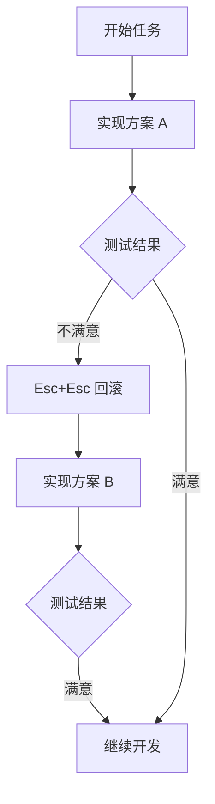

# Claude Code Checkpoints 使用指南

> [!info] 概述
> **一句话定义**：Checkpoints 是 Claude Code 的自动快照功能，让你可以随时回滚代码和对话到任意历史状态。
> **通俗比喻**：就像游戏中的"存档点"，随时可以读档重来，放心大胆地探索各种方案。

**相关文档**：[[Claude Code 插件系统使用指南]] | [[Claude Code 会话管理]] | [[如何使用Claude code]]

---

## 1. 什么是 Checkpoints

### 核心概念

**Checkpoint = 会话状态快照**

| 类比 | 说明 |
|------|------|
| **游戏存档** | 随时保存进度，失败了可以读档重来 |
| **Git Commit** | 代码版本记录，但更细粒度、自动创建 |
| **时光机** | 可以回到对话的任意时刻 |

> [!tip] 大白话
> 把 Checkpoint 想成游戏里的「存档点」或一台「时光机」：Claude 每走一步都会自动存一档，走错路随时读档重来，不用怕把代码和对话搞乱。

### Checkpoint 包含什么？

```
┌─────────────────────────────────────────────┐
│              Checkpoint 内容                │
├─────────────────────────────────────────────┤
│                                             │
│  📝 信息历史  - 所有用户和 Claude 的对话    │
│                                             │
│  📁 文件修改  - Claude 编辑过的所有文件     │
│                                             │
│  🔧 工具使用  - 调用过的工具和结果          │
│                                             │
│  🌐 会话上下文 - 当前的工作环境和状态       │
│                                             │
└─────────────────────────────────────────────┘
```

### 与 Git 的对比

| 特性 | Git | Checkpoints |
|------|-----|-------------|
| **范围** | 文件系统 | 对话 + 文件 |
| **持久性** | 永久保存 | 会话级别（30天） |
| **粒度** | 手动提交 | 每条消息自动 |
| **速度** | 相对较慢 | 即时回滚 |
| **分享** | 支持推送 | 不支持 |

**最佳实践**：两者配合使用 —— Checkpoints 用于快速实验，Git 用于正式版本控制。

---

## 2. 自动机制

### 自动创建

Claude Code 会**自动**为每次用户输入创建 checkpoint：

```
时间线：
─────────────────────────────────────────────────────►

用户输入 ──●────────●────────●────────●────────●──
           │        │        │        │        │
Checkpoint 1        2        3        4        5
```

**特点**：
- ✅ **全自动**：无需手动保存，每条消息都是一个检查点
- ✅ **跨会话持久**：Checkpoint 与会话一起保存，重启或恢复会话后仍然可以访问之前的检查点
- ✅ **自动清理**：默认 30 天后自动删除（可用 `cleanupPeriodDays` 配置），单个会话内保留最近 100 个 checkpoint 的文件快照

### 追踪的文件操作

| 追踪 ✅ | 不追踪 ❌ |
|--------|----------|
| `Write` 工具写入 | Bash `rm` 删除 |
| `Edit` 工具编辑 | Bash `mv` 移动 |
| `NotebookEdit` 编辑 | Bash `cp` 复制 |
| | 外部编辑器修改 |

> [!warning] 重要限制
> Checkpoints **不追踪** Bash 命令对文件系统的修改。如果 Claude 用 `rm file.txt` 删除了文件，这个操作无法通过 rewind 恢复。

> [!warning] 符号链接 / 硬链接文件不回滚
> `/rewind` **不会**通过符号链接或硬链接恢复或删除文件。选择 **Restore code** 或 **Restore code and conversation** 时，Claude Code 会跳过这类路径，并提示 `Restored the code, but skipped N files`，被跳过的文件保持当前内容。
> - 典型场景：被 dotfile 管理器符号链接进项目的配置文件、被 pnpm 硬链接到位的文件。
> - v2.1.216 之前 `/rewind` 会无警告地读写链接指向的路径；现版本已改为安全跳过（防逃逸）。

> [!warning] 子代理（subagent）的修改不一定能回滚
> 只有前台运行的 fork 技能（`context: fork` 且 `background: false`）的编辑会被当前会话的 checkpoint 记录并可回滚；其它后台子代理（含默认后台 fork、后台 `/code-review --fix`）的编辑不会被回滚，需要时用 Git 还原。

---

## 3. 如何使用

### 打开 Checkpoint 界面

**方式一：键盘快捷键**
```
Esc + Esc    （连按两次 Esc 键，需在输入框为空时）
```

> [!note] 输入框有文字时
> 如果输入框里有内容，连按两次 Esc 会先**清空输入**（文字会保存到输入历史，按 `↑` 可召回），不会打开 rewind 菜单。

**方式二：斜杠命令**
```bash
/rewind      # 主命令：回滚代码和/或对话，或压缩部分对话
/resume      # 跨会话：返回之前的会话（配合 /clear 后的恢复）
```

### Rewind 选项详解

打开界面后，选择一个 checkpoint，会看到 6 个选项：

```
┌─────────────────────────────────────────────────────┐
│                  Rewind 选项                        │
├─────────────────────────────────────────────────────┤
│                                                     │
│  1. 🔄 Restore code and conversation               │
│     恢复代码 + 对话（完全回到该状态）              │
│                                                     │
│  2. 💬 Restore conversation                        │
│     仅恢复对话（保留当前代码不变）                 │
│                                                     │
│  3. 📁 Restore code                                │
│     仅恢复代码（保留完整对话历史）                 │
│                                                     │
│  4. 📋 Summarize from here                         │
│     从此点开始压缩对话为摘要                       │
│                                                     │
│  5. 📋 Summarize up to here                        │
│     压缩此点之前的对话，保留之后的消息             │
│                                                     │
│  6. ❌ Never mind                                   │
│     取消操作                                        │
│                                                     │
└─────────────────────────────────────────────────────┘
```

> [!note] 选项随场景变化
> 两个恢复代码的选项（Restore code / Restore code and conversation）只在所选 checkpoint 之后**存在被追踪的文件修改**时才出现；若没有文件改动，菜单只提供 Restore conversation、两个 Summarize 和 Never mind。
>
> 选择 Restore conversation 或 Summarize from here 后，选中消息的原始 prompt 会恢复到输入框，方便重新发送或修改。

### 恢复 /clear 之前的对话

> [!tip] 大白话
> 相当于「先存档再清场」：之前那盘对话记录还留着，随时可以读回来继续。

如果你在**同一个 Claude Code 进程**里执行过 `/clear`，打开 rewind 菜单时顶部会多出一项：

```
/resume <session-id> (previous session)
```

选中它即可恢复到 `/clear` 之前的对话。该入口在退出 Claude Code 或恢复其它会话之前一直可用；需要 Claude Code **v2.1.191 或更高版本**。旧版本请改用 `/resume` 从会话列表中选择。

### 选项对比

| 选项 | 代码 | 对话 | 适用场景 |
|------|------|------|----------|
| **Restore both** | 回滚 | 回滚 | 完全重来，放弃之后所有工作 |
| **Restore conversation** | 保留 | 回滚 | 保留代码改动，重新提问 |
| **Restore code** | 回滚 | 保留 | 代码改坏了，但想保留对话上下文 |
| **Summarize from here** | 保留 | 压缩（此点之后） | 释放上下文空间，但保留关键信息 |
| **Summarize up to here** | 保留 | 压缩（此点之前） | 保留后续消息，压缩之前的长对话 |

### Summarize 详解

> [!note] 何时使用 Summarize
> 当对话变得很长，上下文窗口紧张时，可以用 Summarize 压缩中间的对话。

**工作原理（Summarize from here）**：
```
Before Summarize:
┌────────────────────────────────────────┐
│ Message 1 (完整)                       │
│ Message 2 (完整)                       │
│ ├── Selected checkpoint                │
│ Message 3 (完整)  ─┐                   │
│ Message 4 (完整)  │ 这些会被压缩      │
│ Message 5 (完整)  ─┘                   │
│ Message 6 (完整)                       │
└────────────────────────────────────────┘

After Summarize:
┌────────────────────────────────────────┐
│ Message 1 (完整)                       │
│ Message 2 (完整)                       │
│ ├── 📋 AI生成的摘要                    │
│ Message 6 (完整)                       │
└────────────────────────────────────────┘
```

- 选中点之前的消息保持完整
- 选中点及之后的消息被压缩为摘要
- **原始消息保留在会话记录中**，需要时 Claude 仍可参考

### Summarize up to here

与 Summarize from here 相反，它把选中点**之前**的对话压缩成摘要，之后的后续消息保持完整。压缩完成后光标停在对话末尾，输入框为空。

### 引导摘要

选中某个 Summarize 选项后，可以在菜单中「add context (optional)」行输入提示，引导摘要聚焦于特定内容；直接按选项数字键则不附加提示、立即压缩。

> [!note] 与 /compact 的关系
> Summarize 留在同一会话里压缩上下文，类似更精准的 `/compact`。如果想保留原会话完整并开新分支尝试别的思路，用 `/branch` 或 `claude --continue --fork-session`。

---

## 4. 典型使用场景

### 场景一：探索不同实现方案



**实际操作**：
```
User: 给 API 添加缓存层

Claude: 我来添加 Redis 缓存...
[在 Checkpoint A 做了修改]

User: 其实，试试用内存缓存吧

[用户按 Esc+Esc，回滚到 Checkpoint A]

Claude: 好的，改用内存缓存...
[在 Checkpoint B 实现新方案]

User: 两个方案都有了，我比较一下
```

### 场景二：安全重构

```
User: 重构认证模块，改用 JWT

Claude: 开始重构...
[做了大量修改]

User: 等等，OAuth 集成坏了！回滚！

[用户按 Esc+Esc，回滚到重构前]

User: 咱们换个更保守的方式
```

### 场景三：功能迭代实验

```
User: 试试用函数式风格重写这段代码

Claude: 好的，开始实验...
[做了实验性修改]

User: 测试失败了，回滚重来

[用户回滚到实验前]

Claude: 已回滚，我们试试其他方法
```

### 场景四：释放上下文空间

```
# 长对话后上下文满了
User: 对话太长了，释放点空间

[用户按 Esc+Esc，选择中间的 checkpoint]
[选择 "Summarize from here"]

Claude: 已将中间对话压缩为摘要，上下文空间已释放
```

---

## 5. 工作流模式

### 分支探索模式

```
                    ┌── 方案 A ──► 结果 A
                    │
起点 ── Checkpoint ─┼── 方案 B ──► 结果 B
                    │
                    └── 方案 C ──► 结果 C

1. 记住当前 checkpoint
2. 尝试方案 A → 评估
3. 回滚到 checkpoint
4. 尝试方案 B → 评估
5. 选择最佳方案继续
```

### 安全重构模式

```
1. 确认当前代码可工作 → Checkpoint 自动创建
2. 开始重构
3. 运行测试
4. 测试通过 → 继续
5. 测试失败 → 回滚 → 换方法
```

### 上下文管理模式

```
对话初期：完整上下文（Plan 阶段）
    │
    ▼
对话中期：考虑 Summarize（Code 阶段）
    │
    ▼
对话后期：建议 Rewind 开新会话（Dump 阶段）
```

---

## 6. 配置选项

### 开关自动 Checkpoint

Checkpoint 默认开启，随每条用户消息自动创建；单个会话内保留最近 100 个 checkpoint 的文件快照。可在 `/config` 中查看与调整。

### 清理周期

Checkpoints 默认保留 30 天，之后随会话一起自动清理。可用 `cleanupPeriodDays` 设置调整保留天数：

```json
{
  "cleanupPeriodDays": 30
}
```

---

## 7. 最佳实践

### ✅ 推荐做法

| 做法 | 说明 |
|------|------|
| **大胆尝试** | 有 checkpoint 兜底，放心实验 |
| **定期检查** | 长对话时注意上下文使用情况 |
| **配合 Git** | 确定方案后及时 commit |
| **善用 Summarize** | 长调试会话可压缩中间部分 |

### ❌ 避免做法

| 做法 | 问题 |
|------|------|
| **替代 Git** | Checkpoints 不是版本控制 |
| **忽略 Bash 限制** | Bash 修改不会被追踪 |
| **无限回滚** | 每次回滚都是新的分支，注意混乱 |

---

## 8. 常见问题

**Q: Checkpoint 会占用很多空间吗？**

A: 不会。Checkpoint 只记录差异，且 30 天后自动清理。如果空间紧张，可以手动清理旧会话。

**Q: 回滚后之前的修改还能找回吗？**

A: 可以。回滚只是切换到某个历史状态，之前的状态仍然保留在 checkpoint 列表中，可以再次回滚回去。

**Q: Bash 命令删除的文件能恢复吗？**

A: 不能。Checkpoint 不追踪 Bash 对文件系统的直接操作。重要操作前建议用 Git 或手动备份。

**Q: 执行过 `/clear` 之后，还能找回之前的对话吗？**

A: 可以。在同一个 Claude Code 进程里打开 rewind 菜单，顶部会出现 `/resume <session-id> (previous session)`，选中即可恢复到 `/clear` 之前的对话（需要 v2.1.191+）。旧版本用 `/resume` 从会话列表选择。

**Q: 符号链接或硬链接的文件能通过 rewind 恢复吗？**

A: 不能。`/rewind` 会跳过这类路径并提示 `Restored the code, but skipped N files`，文件保持当前内容。需要的话让 Claude 反向修改或自己编辑文件。

**Q: 子代理（subagent）做的修改能回滚吗？**

A: 只有前台运行的 fork 技能可以；其它后台子代理的编辑不会被 checkpoint 记录，回滚不生效，需用 Git 还原。

**Q: Checkpoint 和 Git 怎么配合？**

A:
1. 用 Checkpoints 快速实验不同方案
2. 确定方案后，用 Git commit 固化
3. 大改动前先 Git commit，再开始实验

---

## 9. 故障排除

| 问题 | 解决方案 |
|------|----------|
| **找不到期望的 checkpoint** | 检查是否被清理、确认 Checkpoint 已开启、检查磁盘空间 |
| **无法回滚** | 检查是否有未提交的冲突、尝试其他 checkpoint |
| **回滚后文件异常** | 可能是外部修改导致，检查 Git 状态 |
| **回滚后提示 skipped N files** | 说明所选 checkpoint 之后存在符号链接/硬链接文件被跳过；用 Git 或手动编辑处理 |
| **子代理修改回滚后没恢复** | 后台子代理的编辑不在 checkpoint 内，用 Git revert 还原 |

---

## 个人笔记

> [!personal] 💡 我的理解与感悟
> （此处记录个人学习心得，更新时会被保留）

---

## 相关文档

- [[Claude Code 插件系统使用指南]] - 插件系统详解
- [[Claude Code 会话管理]] - 会话管理技巧
- [[Claude Code 常用功能]] - 常用功能概览

## 参考资料

- [Checkpointing - Claude Code 官方文档](https://code.claude.com/docs/en/checkpointing)
- [Claude HowTo - Checkpoints](https://github.com/luongnv89/claude-howto/tree/main/08-checkpoints) - 可视化教程和示例
- [Rewind file changes with checkpointing - Claude API Docs](https://platform.claude.com/docs/en/agent-sdk/file-checkpointing)

---

## 更新记录

- **2026-08-10**：同步 Checkpoints / Rewind 到 2026-08 最新行为。
  - `/rewind` 现可恢复到 `/clear` 之前的对话（rewind 菜单出现 `/resume <session-id> (previous session)`，需 v2.1.191+）。
  - `/rewind` 不再通过符号链接/硬链接恢复或删除文件，改为安全跳过并提示（v2.1.216+ 防逃逸）。
  - Rewind 菜单新增 **Summarize up to here**（压缩此点之前的对话），选项由 5 个变为 6 个。
  - 补充子代理（subagent）编辑不一定能回滚、前台 fork 技能除外等限制。
  - 移除未在官方命令列表中出现的 `/checkpoint` 别名，补充 `/resume`。
  - 配置项更新：清理周期改用官方 `cleanupPeriodDays` 设置，去掉未验证的 `autoCheckpoint`。
  - 核心概念补充「大白话」解释；修复正文一个乱码字符（信息历史）。
