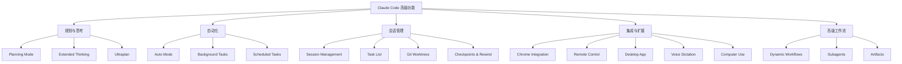

# Claude Code 高级功能

> [!info] 概述
> **Claude Code 高级功能扩展核心能力** - 包括规划模式、扩展思考、Ultraplan、自动模式、Dynamic Workflows、后台任务、远程控制、沙盒隔离、Computer Use 等，用于复杂开发任务和自动化工作流。

## 核心功能概览



---

## Planning Mode（规划模式）

> [!tip] 🎯 一句话定义
> **规划模式让 Claude 在执行前先创建详细的实施计划，供你审批后再动手。**

### 通俗理解

**🎯 比喻**：规划模式就像建筑图纸——在动工前先画好蓝图，让你检查确认后才开工，避免返工。

**📦 适用场景**：
- ✅ 复杂的多文件重构
- ✅ 新功能实现
- ✅ 架构变更
- ✅ 数据库迁移
- ❌ 简单 bug 修复
- ❌ 格式化更改
- ❌ 单文件编辑

### 激活方式

```bash
# 方式 1: 斜杠命令
/plan Implement user authentication system

# 方式 2: CLI 标志
claude --permission-mode plan

# 方式 3: 配置文件设置
{
  "permissions": {
    "defaultMode": "plan"
  }
}

# 方式 4: 键盘快捷键
Shift + Tab    # 切换权限模式（包括 plan）
Alt + M        # Windows/Linux
```

### 工作流程

```
┌─────────────────────────────────────────────────────┐
│                   规划模式工作流                      │
├─────────────────────────────────────────────────────┤
│                                                     │
│  1. 输入任务 → Claude 分析并创建详细计划             │
│       ↓                                             │
│  2. 展示计划 → 包含阶段、步骤、预估时间              │
│       ↓                                             │
│  3. 用户审批 → yes / no / modify plan               │
│       ↓                                             │
│  4. 执行计划 → Claude 按步骤实施                     │
│                                                     │
└─────────────────────────────────────────────────────┘
```

### 实际示例

```bash
User: /plan Add a real-time notification system

Claude: 我将创建实时通知系统的实施计划。

## 实施计划

### Phase 1: 基础设施
1. 安装 WebSocket 库 (socket.io)
2. 设置 WebSocket 服务器
3. 配置连接管理

### Phase 2: 后端实现
4. 创建通知服务
5. 实现通知队列
6. 添加数据库 schema
7. 创建 API 端点

### Phase 3: 前端集成
8. 设置 WebSocket 客户端
9. 创建通知 UI 组件
10. 实现状态管理
11. 添加权限管理

### Phase 4: 测试与部署
12. 编写单元测试
13. 编写集成测试
14. 更新文档
15. 部署到测试环境

预估时间: 3-4 小时
需修改文件: 12 个
需创建文件: 8 个

准备好开始了吗？(yes/no/modify plan)

User: yes

Claude: [开始按计划实施]
```

### 修改计划

```bash
User: Modify the plan - skip the queue for now, we'll add it later

Claude: 更新后的计划:
[显示修改后的计划，队列部分已移除]

User: Looks good, proceed

Claude: [实施修改后的计划]
```

### 高级配置

```bash
# 使用 Opus 进行规划，Sonnet 进行执行
claude --model opusplan "design and implement the new API"

# 在外部编辑器中编辑计划
Ctrl + G    # 打开当前计划到外部编辑器
```

### Ultraplan（云端规划）

> [!tip] 🎯 一句话定义
> **Ultraplan 在云端起草计划，在 Web 编辑器中查看和编辑，可远程运行或拉回本地。**

Ultraplan 是 2026 Q2 新增的规划增强功能：

- **云端起草**：计划在云端生成，不占用本地上下文预算
- **Web 编辑器**：在浏览器中可视化查看和编辑计划
- **灵活执行**：可远程运行，也可将计划拉回本地执行
- **适用场景**：大型项目规划、跨团队协作、复杂架构设计

```bash
# 启用 Ultraplan
claude --ultraplan "design the new microservice architecture"

# 在 Web 编辑器中查看/编辑计划
# 确认后选择远程执行或拉回本地
```

---

## Extended Thinking（扩展思考）

> [!tip] 🎯 一句话定义
> **扩展思考让 Claude 花更多时间深度推理复杂问题，提供更周全的分析。**

### 通俗理解

**🎯 比喻**：扩展思考就像考试时的草稿纸——让 Claude 在给出最终答案前，先在"脑子"里一步步推导和权衡。

### 激活方式

```bash
# 方式 1: 键盘快捷键
Option + T (macOS) / Alt + T (Windows/Linux)

# 方式 2: 设置思考 token 预算
export MAX_THINKING_TOKENS=16000

# 方式 3: 设置思考深度 (Opus 系列)
export CLAUDE_CODE_EFFORT_LEVEL=high   # standard, high, xhigh, max

# 方式 4: CLI 标志
claude --effort high "complex architectural review"

# 方式 5: 斜杠命令
/effort high

# 方式 6: 在提示词中使用关键词
"ultrathink"    # 激活深度推理模式
```

### 模型支持

| 模型 | 思考模式 |
|------|----------|
| **Opus 4.8** | 自适应推理，支持 effort 级别：`standard`, `high`, `xhigh`, `max` |
| **Opus 4.6/4.7** | 自适应推理，支持 effort 级别：`low` (○), `medium` (◐), `high` (●), `max` |
| **Sonnet 5** | 自适应推理，支持 effort 级别：`standard`, `high`, `xhigh`, `max` |
| **Sonnet 4.6** | 固定预算，最多 31,999 tokens |
| **Haiku 4.5** | 固定预算，最多 31,999 tokens |

### 查看推理过程

```bash
Ctrl + O    # 切换详细输出模式，查看推理过程
```

### 实际示例

```bash
User: Should we use microservices or a monolith for our e-commerce platform?

Claude: 让我仔细思考这个架构决策...

<extended_thinking>
## 上下文分析
- 团队规模: 5 名开发者
- 预期流量: 初始每日 1 万用户
- 需扩展至: 10 万+ 用户
- DevOps 资源: 有限
- MVP 时间: 6 个月

## 方案 1: 微服务
优点:
+ 独立扩展
+ 技术灵活性
+ 团队独立性
+ 故障隔离

缺点:
- 运维复杂性
- 网络开销
- 需要分布式追踪
- 需要 DevOps 专业知识
- 初始开发较慢

## 方案 2: 单体应用
优点:
+ 部署简单
+ 初始开发快
+ 调试容易
+ 运维开销低
+ 单一代码库

缺点:
- 后期扩展挑战
- 全量部署
- 技术锁定
- 可能紧耦合

## 决策因素
1. 团队规模 (5人) → 倾向单体
2. DevOps 资源 (有限) → 倾向单体
3. 时间线 (6个月) → 倾向单体
4. 未来规模 (10万用户) → 单体+缓存可实现
5. 复杂度预算 → 有限

## 建议
从 **模块化单体** 开始:
- 单一部署单元
- 清晰的模块边界
- 模块间干净的接口
- 为未来拆分微服务做准备
</extended_thinking>

**推荐**: 实施模块化单体，保持清晰的模块边界。
```

---

## Auto Mode（自动模式）

> [!tip] 🎯 一句话定义
> **自动模式使用后台安全分类器审查每个操作，允许 Claude 自主工作同时阻止危险操作。**

> [!note] 正式发布
> Auto Mode 于 2026 年 Q2 正式发布（GA），Pro 计划即可使用。2026 年 7 月起已支持 Bedrock、Vertex AI 和 Foundry。

### 通俗理解

**🎯 比喻**：自动模式就像自动驾驶汽车的安全系统——Claude 可以自主行驶，但遇到危险操作会自动刹车。

### 启用方式

```bash
# 方式 1: CLI 标志解锁
claude --enable-auto-mode
# 然后在 REPL 中用 Shift+Tab 切换到 auto 模式

# 方式 2: 直接启动
claude --permission-mode auto

# 方式 3: 配置文件
{
  "permissions": {
    "defaultMode": "auto"
  }
}
```

### 分类器工作原理

```
操作请求 → 检查允许/拒绝规则 → 通过?
              ↓ 是                ↓ 否
         直接执行           后台分类器评估
                                  ↓
                    ┌─────────────┼─────────────┐
                    ↓             ↓             ↓
                  允许          拒绝          不确定
                    ↓             ↓             ↓
                  执行          阻止        提示用户
```

### 默认阻止的操作

| 阻止的操作 | 示例 |
|------------|------|
| 管道安装 | `curl \| bash` |
| 发送敏感数据 | 通过网络发送 API 密钥、凭证 |
| 生产部署 | 针对生产环境的部署命令 |
| 批量删除 | 大目录的 `rm -rf` |
| IAM 更改 | 权限和角色修改 |
| 强制推送主分支 | `git push --force origin main` |

### 默认允许的操作

| 允许的操作 | 示例 |
|------------|------|
| 本地文件操作 | 读取、写入、编辑项目文件 |
| 声明的依赖安装 | 从 manifest 的 `npm install`, `pip install` |
| 只读 HTTP | 获取文档的 `curl` |
| 推送到当前分支 | `git push origin feature-branch` |

### 回退行为

分类器不确定时回退到提示用户：
- 连续 **3 次** 分类器阻止后
- 会话中总共 **20 次** 阻止后

### 无需 Team 计划的替代方案

使用 Python 脚本设置等效权限：

```bash
# 预览将要添加的规则（不写入）
python3 setup-auto-mode-permissions.py --dry-run

# 应用保守基准
python3 setup-auto-mode-permissions.py

# 按需添加更多能力
python3 setup-auto-mode-permissions.py --include-edits --include-tests
python3 setup-auto-mode-permissions.py --include-git-write --include-packages
```

---

## Background Tasks（后台任务）

> [!tip] 🎯 一句话定义
> **后台任务让长时间运行的操作异步执行，不阻塞你的对话。**

### 通俗理解

**🎯 比喻**：后台任务就像在厨房用慢炖锅——你可以去做别的事，东西好了会通知你。

### 基本用法

```bash
User: Run the full test suite in the background

Claude: Starting tests in background (task-id: bg-1234)
You can continue working while tests run.

# 管理命令
/task list              # 显示所有任务
/task status bg-1234    # 检查进度
/task show bg-1234      # 查看输出
/task cancel bg-1234    # 取消任务
```

### 实际示例

```bash
User: Run the build in the background

Claude: Starting build... (task-id: bg-5001)

User: Also run the linter in background

Claude: Starting linter... (task-id: bg-5002)

User: While those run, let's implement the new API endpoint

Claude: [实现 API 端点，同时 build 和 linter 在后台运行]

[10 分钟后]

Claude: 📢 Build completed successfully (bg-5001)
📢 Linter found 12 issues (bg-5002)

User: Show me the linter issues

Claude: [显示 bg-5002 的 linter 输出]
```

### 任务管理

```bash
User: /task list

Active background tasks:
1. [bg-1234] Running tests (50% complete, 2min remaining)
2. [bg-5001] Building Docker image (25% complete, 8min remaining)
3. [bg-5002] Deploying to staging (90% complete, 30sec remaining)
```

### 配置

```json
{
  "backgroundTasks": {
    "enabled": true,
    "maxConcurrentTasks": 5,
    "notifyOnCompletion": true,
    "autoCleanup": true,
    "logOutput": true
  }
}
```

---

## Scheduled Tasks（定时任务）

> [!tip] 🎯 一句话定义
> **定时任务按计划自动运行提示，支持周期性执行和一次性提醒。**

### `/loop` 命令

```bash
# 明确间隔
/loop 5m check if the deployment finished

# 自然语言
/loop check build status every 30 minutes

# 标准 cron 表达式
/loop "*/5 * * * *" run health check
```

### 一次性提醒

```bash
remind me at 3pm to push the release branch
in 45 minutes, run the integration tests
```

### 管理定时任务

| 工具 | 描述 |
|------|------|
| `CronCreate` | 创建新的定时任务 |
| `CronList` | 列出所有活动的定时任务 |
| `CronDelete` | 删除定时任务 |

### 限制与行为

| 方面 | 细节 |
|------|------|
| 最大任务数 | 每会话 **50 个** |
| 作用域 | 会话级别 — 会话结束时清除 |
| 周期任务过期 | **3 天**后自动过期 |
| 错过执行 | 不补发 — Claude Code 未运行时跳过 |
| 周期抖动 | 最多间隔的 10%（最多 15 分钟） |
| 单次抖动 | 在 :00/:30 边界上最多 90 秒 |

### 禁用定时任务

```bash
export CLAUDE_CODE_DISABLE_CRON=1
```

---

## Dynamic Workflows（动态工作流）

> [!tip] 🎯 一句话定义
> **Dynamic Workflows 让 Claude 自主编写多 Agent 编排脚本，运行时生成 JavaScript 编排器，并行处理大规模任务。**

> [!note] 正式发布
> Dynamic Workflows 于 2026 年 5 月 28 日 GA（正式发布）。

### 通俗理解

**🎯 比喻**：Dynamic Workflows 就像 AI 项目经理——接到大任务后，自行组建多个"助手团队"，分配任务、协调工作、汇总结果。

### 6 种编排模式

| 模式 | 描述 | 适用场景 |
|------|------|----------|
| **Classify-and-act** | 分类后分发到不同 Agent | 问题分类、路由 |
| **Fan-out-and-synthesize** | 并行处理再合成结果 | 批量代码审查、日志分析 |
| **Adversarial verification** | 双 Agent 对抗验证 | 安全审计、质量检查 |
| **Generate-and-filter** | 生成候选 → 过滤最佳 | 代码生成、测试生成 |
| **Tournament** | 多方案竞争筛选 | 架构决策、方案选型 |
| **Loop-until-done** | 循环直到条件满足 | 迭代优化、渐进式重构 |

### 真实案例

```text
Bun 迁移项目：Zig → Rust，75 万行代码
测试通过率：99.8%
完成时间：11 天
工作方式：Dynamic Workflows 并行处理数千个文件
```

### 与 Subagents 对比

| 维度 | Dynamic Workflows | Subagents |
|------|------------------|-----------|
| 编排方式 | Claude 自动生成编排脚本 | 手工定义 agent 文件 |
| 任务规模 | 大规模并行处理 | 中等规模子任务 |
| 适用场景 | 跨仓库迁移、批量重构 | 代码审查、架构评估 |
| 复杂度 | 高 | 中 |
| 引入版本 | 2026 Q2 | 内置功能 |

---

## Permission Modes（权限模式）

> [!tip] 🎯 一句话定义
> **权限模式控制 Claude 可以在不需要明确批准的情况下执行的操作。**

### 可用权限模式

| 模式 | 行为 |
|------|------|
| `default` | 只读文件；其他操作需提示确认 |
| `acceptEdits` | 自动读写编辑文件；命令需确认 |
| `plan` | 只读文件（研究模式，无编辑） |
| `auto` | 所有操作经后台安全分类器检查（正式发布 GA） |
| `bypassPermissions` | 所有操作，无权限检查（危险） |
| `dontAsk` | 只执行预批准的工具；其他全部拒绝 |

### 切换方式

```bash
# 键盘快捷键
Shift + Tab    # 循环切换所有 6 种模式

# 斜杠命令
/plan          # 进入规划模式

# CLI 标志
claude --permission-mode plan
claude --permission-mode auto

# 配置文件
{
  "permissions": {
    "defaultMode": "auto"
  }
}
```

### 使用场景

| 场景 | 推荐模式 |
|------|----------|
| 代码审查 | `plan` (只读) |
| 交互式开发 | `default` |
| 自动化工作流 | `acceptEdits` |
| 自主工作 | `auto` |
| CI/CD 集成 | `bypassPermissions` (配合沙盒) |

---

## Headless Mode（非交互模式）

> [!tip] 🎯 一句话定义
> **Print Mode (`claude -p`) 允许 Claude Code 无需交互输入运行，适合自动化和 CI/CD。**

### 基本用法

```bash
# 运行特定任务
claude -p "Run all tests"

# 处理管道内容
cat error.log | claude -p "Analyze these errors"

# 结构化输出
claude -p --output-format json "Analyze code quality"

# 限制自主轮次
claude -p --max-turns 5 "refactor this module"

# 带 schema 验证
claude -p --json-schema '{"type":"object","properties":{"issues":{"type":"array"}}}' \
  "find bugs in this code"
```

### CI/CD 集成示例

```yaml
# .github/workflows/code-review.yml
name: AI Code Review

on: [pull_request]

jobs:
  review:
    runs-on: ubuntu-latest
    steps:
      - uses: actions/checkout@v4

      - name: Install Claude Code
        run: curl -fsSL https://claude.ai/install.sh | bash

      - name: Run Claude Code Review
        env:
          ANTHROPIC_API_KEY: ${{ secrets.ANTHROPIC_API_KEY }}
        run: |
          claude -p --output-format json \
            --max-turns 3 \
            "Review this PR for:
            - Code quality issues
            - Security vulnerabilities
            - Performance concerns
            Output results as JSON" > review.json

      - name: Post Review Comment
        uses: actions/github-script@v7
        with:
          script: |
            const fs = require('fs');
            const review = JSON.parse(fs.readFileSync('review.json', 'utf8'));
            github.rest.issues.createComment({
              issue_number: context.issue.number,
              owner: context.repo.owner,
              repo: context.repo.repo,
              body: JSON.stringify(review, null, 2)
            });
```

---

## Interactive Features（交互功能）

### 键盘快捷键完整参考

| 快捷键 | 描述 |
|--------|------|
| `Ctrl+C` | 取消当前输入/生成 |
| `Ctrl+D` | 退出 Claude Code |
| `Ctrl+G` | 在外部编辑器中编辑计划 |
| `Ctrl+L` | 清屏 |
| `Ctrl+O` | 切换详细输出（查看推理） |
| `Ctrl+R` | 反向搜索历史 |
| `Ctrl+T` | 切换任务列表视图 |
| `Ctrl+B` | 后台运行中的任务 |
| `Esc+Esc` | 回滚代码/对话 |
| `Shift+Tab` / `Alt+M` | 切换权限模式 |
| `Option+P` / `Alt+P` | 切换模型 |
| `Option+T` / `Alt+T` | 切换扩展思考 |

### 行编辑快捷键

| 快捷键 | 操作 |
|--------|------|
| `Ctrl + A` | 移到行首 |
| `Ctrl + E` | 移到行尾 |
| `Ctrl + K` | 剪切到行尾 |
| `Ctrl + U` | 剪切到行首 |
| `Ctrl + W` | 向后删除单词 |
| `Ctrl + Y` | 粘贴 |
| `Tab` | 自动补全 |
| `↑ / ↓` | 命令历史 |

### 自定义键绑定

```bash
/keybindings    # 打开键绑定配置文件
```

配置示例 (`~/.claude/keybindings.json`)：

```json
{
  "$schema": "https://www.schemastore.org/claude-code-keybindings.json",
  "bindings": [
    {
      "context": "Chat",
      "bindings": {
        "ctrl+e": "chat:externalEditor",
        "ctrl+k ctrl+s": "chat:stash"
      }
    },
    {
      "context": "Confirmation",
      "bindings": {
        "ctrl+a": "confirmation:yes"
      }
    }
  ]
}
```

### Vim 模式

```bash
/vim    # 启用 Vim 键绑定
```

### Bash 模式

```bash
! npm test
! git status
! cat src/index.js
```

---

## Voice Dictation（语音输入）

> [!tip] 🎯 一句话定义
> **语音输入提供按键说话功能，支持 20 种语言的语音转文字。**

### 激活

```bash
/voice
```

### 功能

| 功能 | 描述 |
|------|------|
| 按键说话 | 按住键录音，松开发送 |
| 20 种语言 | 语音转文字支持 |
| 自定义键绑定 | 通过 `/keybindings` 配置 |
| 账户要求 | 需要 Claude.ai 账户进行 STT 处理 |

---

## Computer Use（计算机使用）

> [!tip] 🎯 一句话定义
> **Computer Use 让 Claude Code 通过 CLI 直接操作计算机界面，实现端到端自动化。**

> [!note] 研究预览
> Computer Use CLI 于 2026 Q2 以研究预览形式发布，适用于需要 GUI 交互的自动化场景。

### 功能

| 功能 | 描述 |
|------|------|
| 屏幕理解 | Claude 可读取屏幕内容并理解界面布局 |
| 键盘鼠标操作 | 模拟点击、输入等交互操作 |
| CLI 集成 | 通过命令行触发和管理 Computer Use 会话 |
| 适用场景 | GUI 测试自动化、数据录入、跨应用工作流 |

---

## Artifacts（内容工件）

> [!tip] 🎯 一句话定义
> **Artifacts 是在对话中生成的可视化内容，包括代码预览、图表渲染和交互式原型。**

Artifacts 于 2026 Q2 引入，支持在对话中直接渲染和预览：

| 类型 | 描述 |
|------|------|
| **代码预览** | 实时渲染 HTML/CSS/JavaScript 输出 |
| **图表渲染** | Mermaid、SVG 等图表即时预览 |
| **交互式原型** | 可操作的 UI 原型预览 |
| **富文档** | 带格式的文档和报告预览 |

---

## Remote Control（远程控制）

> [!tip] 🎯 一句话定义
> **远程控制让你从手机、平板或任何浏览器继续本地运行的 Claude Code 会话。**

> [!note] 可用性
> Pro, Max, Team, 和 Enterprise 计划可用 (v2.1.51+)

### 启动远程控制

```bash
# 从 CLI
claude remote-control
claude remote-control --name "Auth Refactor"

# 从会话内
/remote-control
/remote-control "Auth Refactor"
```

### 可用标志

| 标志 | 描述 |
|------|------|
| `--name "title"` | 自定义会话标题 |
| `--verbose` | 显示详细连接日志 |
| `--sandbox` | 启用文件系统和网络隔离 |
| `--no-sandbox` | 禁用沙盒（默认） |

### 连接方式

1. **会话 URL** — 启动时打印到终端；在任何浏览器中打开
2. **二维码** — 启动后按空格键显示可扫描的二维码
3. **按名称查找** — 在 claude.ai/code 或 Claude 移动应用中浏览会话

### 安全特性

- 本机**无入站端口**
- 仅**出站 HTTPS** over TLS
- **范围凭证** — 多个短期、窄范围令牌
- **会话隔离** — 每个远程会话独立

---

## Desktop App（桌面应用）

> [!tip] 🎯 一句话定义
> **桌面应用提供独立应用程序，支持可视化 diff 审查、并行会话和集成连接器。**

> [!note] 可用性
> macOS 和 Windows，Pro, Max, Team, 和 Enterprise 计划

### 核心功能

| 功能 | 描述 |
|------|------|
| **Diff 视图** | 逐文件可视化审查，带内联评论 |
| **应用预览** | 自动启动开发服务器，嵌入浏览器实时验证 |
| **PR 监控** | GitHub CLI 集成，自动修复 CI 失败 |
| **并行会话** | 侧边栏多会话，自动 Git worktree 隔离 |
| **定时任务** | 每小时、每天、工作日、每周的重复任务 |
| **富渲染** | 代码、markdown 和图表渲染，语法高亮 |

### 从 CLI 切换

```bash
/desktop    # 将当前 CLI 会话切换到桌面应用
```

### 应用预览配置

`.claude/launch.json`:

```json
{
  "command": "npm run dev",
  "port": 3000,
  "readyPattern": "ready on",
  "persistCookies": true
}
```

### 连接器

| 连接器 | 能力 |
|--------|------|
| **GitHub** | PR 监控、问题跟踪、代码审查 |
| **Slack** | 通知、频道上下文 |
| **Linear** | 问题跟踪、冲刺管理 |
| **Notion** | 文档、知识库访问 |
| **Asana** | 任务管理、项目跟踪 |
| **Calendar** | 日程感知、会议上下文 |

---

## Git Worktrees

> [!tip] 🎯 一句话定义
> **Git Worktrees 让你在隔离的工作树中启动 Claude Code，无需 stash 或切换分支即可并行工作。**

### 启动

```bash
claude --worktree
# 或
claude -w
```

### 工作树位置

```
<repo>/.claude/worktrees/<name>
```

### 单仓库稀疏检出

```json
{
  "worktree": {
    "sparsePaths": ["packages/my-package", "shared/"]
  }
}
```

### 自动清理

如果工作树中没有做任何更改，会话结束时自动清理。

---

## Sandboxing（沙盒）

> [!tip] 🎯 一句话定义
> **沙盒为 Claude Code 执行的 Bash 命令提供操作系统级别的文件系统和网络隔离。**

### 启用

```bash
# 斜杠命令
/sandbox

# CLI 标志
claude --sandbox       # 启用
claude --no-sandbox    # 禁用
```

### 配置设置

```json
{
  "sandbox": {
    "enabled": true,
    "failIfUnavailable": true,
    "filesystem": {
      "allowWrite": ["/Users/me/project"],
      "allowRead": ["/Users/me/project", "/usr/local/lib"],
      "denyRead": ["/Users/me/.ssh", "/Users/me/.aws"]
    },
    "enableWeakerNetworkIsolation": true
  }
}
```

---

## Managed Settings（托管设置）

> [!tip] 🎯 一句话定义
> **托管设置让企业管理员使用平台原生管理工具部署 Claude Code 配置。**

### 部署方法

| 平台 | 方法 | 版本 |
|------|------|------|
| macOS | 托管 plist 文件 (MDM) | v2.1.51+ |
| Windows | Windows 注册表 | v2.1.51+ |
| 跨平台 | 托管配置文件 | v2.1.51+ |
| 跨平台 | 托管 drop-ins 目录 | v2.1.83+ |

### 托管 Drop-ins

```
~/.claude/managed-settings.d/
  00-org-defaults.json
  10-team-policies.json
  20-project-overrides.json
```

### 可用托管设置

| 设置 | 描述 |
|------|------|
| `disableBypassPermissionsMode` | 阻止用户启用绕过权限 |
| `availableModels` | 限制用户可选择的模型 |
| `allowedChannelPlugins` | 控制允许的频道插件 |
| `autoMode.environment` | 为自动模式配置可信基础设施 |

---

## Configuration（配置）

### 配置文件位置

```bash
# 全局配置
~/.claude/config.json

# 项目配置
./.claude/config.json

# 用户配置
~/.config/claude-code/settings.json
```

### 完整配置示例

```json
{
  "permissions": {
    "mode": "default",
    "allowedTools": ["Bash(git log:*)", "Read"],
    "disallowedTools": ["Bash(rm -rf:*)"]
  },

  "hooks": {
    "PreToolUse": [{ "matcher": "Edit", "hooks": ["eslint --fix ${file_path}"] }],
    "PostToolUse": [{ "matcher": "Write", "hooks": ["~/.claude/hooks/security-scan.sh"] }],
    "Stop": [{ "hooks": ["~/.claude/hooks/notify.sh"] }]
  },

  "mcp": {
    "enabled": true,
    "servers": {
      "github": {
        "command": "npx",
        "args": ["-y", "@modelcontextprotocol/server-github"],
        "env": {
          "GITHUB_TOKEN": "${GITHUB_TOKEN}"
        }
      }
    }
  }
}
```

### 环境变量

```bash
# 模型选择
export ANTHROPIC_MODEL=claude-opus-4-8
export ANTHROPIC_DEFAULT_OPUS_MODEL=claude-opus-4-8

# API 配置
export ANTHROPIC_API_KEY=sk-ant-...

# 思考配置
export MAX_THINKING_TOKENS=16000
export CLAUDE_CODE_EFFORT_LEVEL=high

# 功能开关
export CLAUDE_CODE_DISABLE_AUTO_MEMORY=true
export CLAUDE_CODE_DISABLE_CRON=1
export CLAUDE_CODE_ENABLE_PROMPT_SUGGESTION=false

# MCP 配置
export MAX_MCP_OUTPUT_TOKENS=50000
export ENABLE_TOOL_SEARCH=true
```

---

## 最佳实践

### 规划模式

- ✅ 用于复杂的多步骤任务
- ✅ 批准前审查计划
- ✅ 需要时修改计划
- ❌ 不要用于简单任务

### 扩展思考

- ✅ 用于架构决策
- ✅ 用于复杂问题解决
- ❌ 不要用于简单查询

### 后台任务

- ✅ 用于长时间运行的操作
- ✅ 监控任务进度
- ✅ 优雅处理任务失败
- ❌ 不要启动太多并发任务

### 权限

- ✅ 代码审查用 `plan`（只读）
- ✅ 交互式开发用 `default`
- ✅ 自动化工作流用 `acceptEdits`
- ✅ 带安全护栏的自主工作用 `auto`
- ❌ 除非绝对必要，不要用 `bypassPermissions`

---

## Checkpoints 与 Rewind（回滚）

> [!tip] 🎯 一句话定义
> **Checkpoints 保存对话状态，Rewind 让你回到之前的检查点探索不同方案。**

### 核心概念

| 概念 | 说明 |
|------|------|
| **Checkpoint** | 对话状态的快照 |
| **Rewind** | 返回到之前的检查点 |
| **Branch Point** | 从同一检查点探索多种方案 |

### 使用方法

```bash
# Checkpoints 每次用户提示后自动创建

# 触发 Rewind
/rewind
# 或快捷键
Esc + Esc  # 连按两下
```

### 回滚选项

触发 Rewind 后，有 5 个选项：

| 选项 | 效果 |
|------|------|
| **Restore code and conversation** | 恢复代码和对话 |
| **Restore conversation** | 仅恢复对话，代码保留 |
| **Restore code** | 仅恢复代码，对话保留 |
| **Summarize from here** | 从当前位置总结 |
| **Never mind** | 取消 |

### 使用场景

- 尝试不同的实现方案
- 从错误中恢复
- 安全实验新想法
- 比较不同的解决方案
- A/B 测试不同设计

> [!info] 📚 来源
> - [claude-howto - Checkpoints](https://github.com/luongnv89/claude-howto/tree/main/08-checkpoints)

---

## Plugins（插件）

> [!tip] 🎯 一句话定义
> **Plugins 是功能捆绑包，将 Commands、Agents、MCP 和 Hooks 打包成一个可安装的单元。**

### 安装插件

```bash
/plugin install pr-review
/plugin install devops-automation
/plugin install documentation
```

### 可用插件

| 插件 | 功能 |
|------|------|
| `pr-review` | 完整的 PR 审查工作流 |
| `devops-automation` | 部署与监控 |
| `documentation` | 文档生成 |

### 插件结构

```
plugin-name/
├── commands/       # Slash Commands
├── agents/         # Subagents
├── mcp.json        # MCP 配置
├── hooks/          # Hooks 脚本
└── README.md
```

> [!info] 📚 来源
> - [claude-howto - Plugins](https://github.com/luongnv89/claude-howto/tree/main/07-plugins)

---

## 完整目录结构示例

```
project/
├── .claude/
│   ├── commands/           # Slash Commands
│   │   ├── optimize.md
│   │   └── pr.md
│   ├── agents/             # Subagents
│   │   ├── code-reviewer.md
│   │   └── test-engineer.md
│   ├── skills/             # Skills
│   │   └── code-review/
│   │       ├── SKILL.md
│   │       └── scripts/
│   ├── hooks/              # Hooks
│   │   └── pre-commit.sh
│   └── launch.json         # 桌面应用配置
├── CLAUDE.md               # 项目 Memory
├── CLAUDE.local.md         # 本地 Memory
└── .mcp.json               # MCP 配置
```

---

## 相关文档

- [[Claude Code 会话管理]] - 会话和记忆管理
- [[如何使用Claude code]] - 基础使用指南
- [[Claude MCP 使用指南]] - MCP 集成

## 参考资料

### 官方资源
- [Claude Code Official Documentation](https://docs.anthropic.com/claude-code)
- [Extend Claude with skills](https://code.claude.com/docs/en/skills)
- [How Claude remembers your project](https://code.claude.com/docs/en/memory)

### 社区资源
- [claude-howto GitHub Repository](https://github.com/luongnv89/claude-howto) - 21,800+ stars 完整学习指南
  - [09-Advanced Features](https://github.com/luongnv89/claude-howto/tree/main/09-advanced-features) - 高级功能完整指南
  - [08-Checkpoints](https://github.com/luongnv89/claude-howto/tree/main/08-checkpoints) - Checkpoints 详细说明
  - [07-Plugins](https://github.com/luongnv89/claude-howto/tree/main/07-plugins) - Plugins 完整指南
  - [config-examples.json](https://github.com/luongnv89/claude-howto/blob/main/09-advanced-features/config-examples.json) - 完整配置示例
- [Claude Code Slash Commands | Complete Guide 2026](https://maxtechera.dev/en/guides/claude-code-slash-commands)
