# Claude Code 多 Agent 流程设计

> [!info] 概述
> **一句话定义**: Claude Code 的多 Agent 流程是一种通过专门化 Subagents 协作完成复杂任务的架构模式，利用 Task Tool 的并���处理能力和 Agent Teams 的协调机制，实现高效、可扩展的 AI 工作流。
>
> **通俗比喻**: 就像一家餐厅的厨房团队 —— 有主厨（Team Lead）负责协调，有专门负责切菜的厨师、负责炒菜的厨师、负责摆盘的厨师（Subagents），每个人专注于自己的领域，通过订单系统（Task Tool）和沟通机制（消息系统）高效协作，最��完成一道复杂的菜品。

## 核心概念

### 是什么

**Subagents** 是 Claude Code 中的专门化 AI 助手，具有以下核心特征：

- **独立上下文窗口**: 每个 subagent 拥有自己的对话上下文，互不干扰
- **自定义系统提示**: 可以针对特定任务类型定制行为
- **特定工具访问权限**: 可以限制或授权特定工具的使用
- **配置持久化**: 配置可以保存并共享给团队成员

> [!note] 来源
> [Claude Code Docs - Subagents](https://code.claude.com/docs/en/sub-agents)

### 为什么需要

多 Agent 流程解决的核心问题：

1. **复杂任务分解**: 将大型复杂任务拆分为可并行处理的子任务
2. **专业化分工**: 让每个 Agent 专注于擅长的领域，提高效率和质量
3. **上下文隔离**: 避免单一 Agent 的上下文过载
4. **并行执行**: 多个 Agent 同时工作，缩短总体完成时间
5. **可扩展性**: 通过增加 Agent 数量应对更大规模的任务

### 通俗理解

> [!example] 比喻 1 - 餐厅厨房

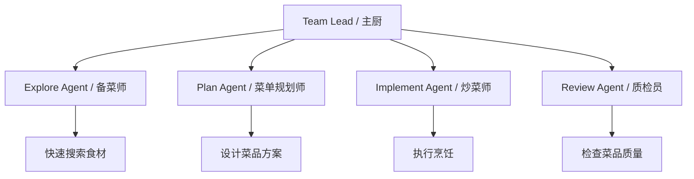

> [!example] 比喻 2 - 建筑工地

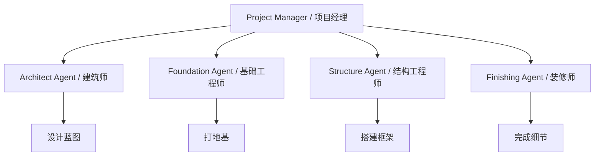

> [!tip] 示例 - 软件开发工作流

```yaml
# 6 阶段工作流示例
stages:
  - name: Planning
    agent: plan-agent
    task: 分析需求，设计技术方案

  - name: Git Setup
    agent: explore-agent
    task: 创建分支，配置环境

  - name: Implementation
    agent: general-purpose
    task: 编写代码实现功能

  - name: Testing
    agent: test-agent
    task: 编写和运行测试

  - name: Review
    agent: review-agent
    task: 代码审查和质量检查

  - name: PR Creation
    agent: pr-agent
    task: 创建 Pull Request
```

> [!note] 来源
> [The Task Tool - dev.to](https://dev.to/bhaidar/the-task-tool-claude-codes-agent-orchestration-system-4bf2)

## 技术细节

### Task Tool 与 Subagents 架构

#### 架构层次

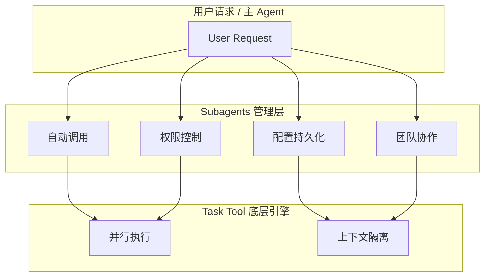

> [!note] 来源
> [Task Tool vs Subagents](https://ibuildwith.ai/blog/task-tool-vs-subagents-how-agents-work-in-claude-code/)

#### Task Tool 特性

| 特性 | 说明 |
|:-----|:-----|
| **并行执行** | 多个任务同时运行，提高效率 |
| **上下文隔离** | 每个任务有独立的执行环境 |

#### Subagent 增强特性

| 特性 | 说明 |
|:-----|:-----|
| **自动调用** | 根据任务类型自动选择合适的 subagent |
| **工具权限控制** | 精细控制每个 subagent 可用的工具 |
| **配置持久化** | 配置保存在项目中，可共享给团队 |
| **团队协作** | 支持多人协作场景 |

### 内置 Subagent 类型

| 类型 | 用途 | 特点 |
|:-----|:-----|:-----|
| **Explore** | 快速只读搜索 | 轻量级，适合代码库探索 |
| **Plan** | 规划研究 | 分析问题，制定方案 |
| **General-purpose** | 复杂多步任务 | 全功能，适合通用任务 |

### 配置字段

```json
{
  "name": "string",           // Subagent 名称
  "description": "string",    // 功能描述
  "tools": ["tool1", "tool2"], // 可用工具列表
  "model": "opus|sonnet|haiku", // 使用的模型
  "permissionMode": "auto|ask", // 权限模式
  "hooks": {},                // 钩子配置
  "skills": [],               // 技能列表
  "memory": {},               // 记忆配置
  "isolation": boolean        // 隔离模式
}
```

### 作用域优先级

> [!info] 配置加载顺序（从高到低）

| 优先级 | 作用域 | 说明 |
|:------:|:-------|:-----|
| 1 | **Managed settings** | 托管设置 |
| 2 | **CLI flag** | 命令行参数 |
| 3 | **Project** | 项目配置 |
| 4 | **User** | 用户配置 |
| 5 | **Plugin** | 插件配置 |

> [!note] 来源
> [Claude Code Docs - Subagents](https://code.claude.com/docs/en/sub-agents)

### Agent Teams 协作机制

#### 角色定义

| 角色 | 职责 |
|:-----|:-----|
| **Team Lead** | 负责协调、任务分配、结果汇总 |
| **Teammates** | 独立完成分配的子任务 |

#### 协作机制

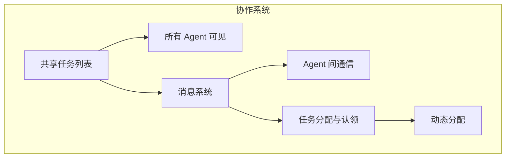

#### 显示模式

| 模式 | 说明 |
|:-----|:-----|
| **in-process** | 在当前进程中显示 |
| **split panes** | 分屏显示（需要 tmux 或 iTerm2） |

> [!note] 来源
> [Claude Code Docs - Agent Teams](https://code.claude.com/docs/en/agent-teams)

### 模型分层策略

> [!info] 在大规模多 Agent 系统中，采用三层模型策略以优化成本和性能

| Tier | 模型 | 适用场景 | 示例任务 |
|:----:|:-----|:---------|:---------|
| **Tier 1** | Opus 4.6 | 关键架构、安全、代码审查 | 架构设计、安全审计 |
| **Tier 2** | Inherit (用户选择) | 专业领域任务 | AI/ML、后端、前端开发 |
| **Tier 3** | Sonnet | 文档、测试、调试支持 | 编写文档、单元测试 |
| **Tier 4** | Haiku | 快速操作 | SEO 优化、部署、简单文档 |

> [!note] 来源
> [wshobson/agents GitHub](https://github.com/wshobson/agents)

## 设计模式

### Supervisor Pattern

> [!summary] 结构
> 中央 Agent 协调多个 subagents

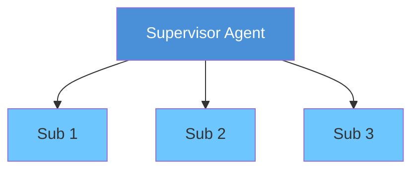

**适用场景**:
- 需要中央协调的任务
- 任务之间有依赖关系
- 需要统一决策的场景

> [!note] 来源
> [Multi-Agent Patterns - MCP Market](https://mcpmarket.com/tools/skills/multi-agent-architecture-patterns-4)

### Swarm Architecture

> [!summary] 结构
> 去中心化 Agent 协作

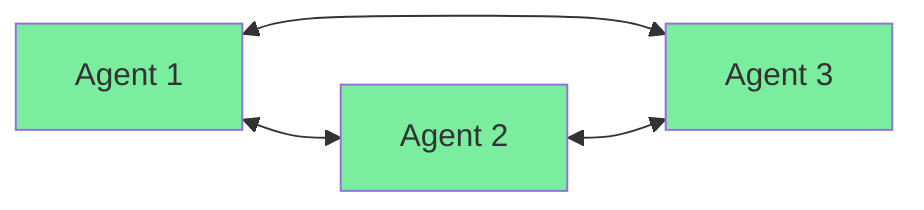

**特点**:
- 无中央控制
- Agent 之间直接通信
- 自组织协作

**适用场景**:
- 任务独立性强
- 需要灵活协作
- 容错性要求高

> [!note] 来源
> [7 Multi-Agent Patterns](https://pub.towardsai.net/7-multi-agent-patterns-every-developer-needs-in-2026-and-how-to-pick-the-right-one-e8edcd99c96a)

### Hierarchical Patterns

> [!summary] 结构
> 嵌套 Agent 结构处理复杂任务

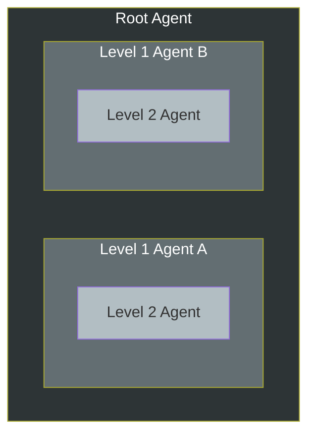

**适用场景**:
- 超大规模任务
- 需要多层抽象
- 复杂决策树

> [!note] 来源
> [Multi-Agent Patterns - MCP Market](https://mcpmarket.com/tools/skills/multi-agent-architecture-patterns-4)

### Router Pattern

> [!warning] 问题
> 解决单 Agent 的 "instruction fog" 问题

> [!tip] 解决方案
> 使用 Router 管理多个专门化 Agent

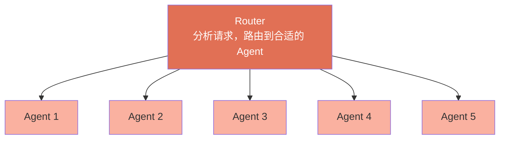

**优势**:
- 每个 Agent 的系统提示更专注
- 减少指令冲突
- 提高响应准确性

> [!note] 来源
> [7 Multi-Agent Patterns](https://pub.towardsai.net/7-multi-agent-patterns-every-developer-needs-in-2026-and-how-to-pick-the-right-one-e8edcd99c96a)

## 工作流实践

### 常见工作流模式

#### 1. Explore → Plan → Execute

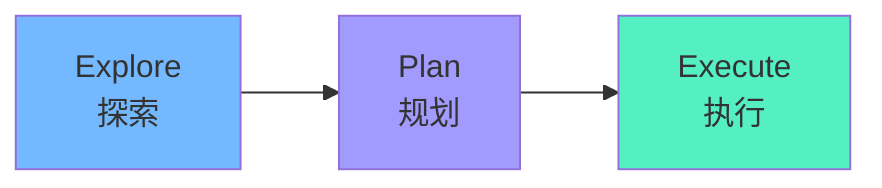

**流程**:
1. **Explore**: 快速搜索代码库，理解现有结构
2. **Plan**: 分析问题，设计解决方案
3. **Execute**: 实施方案，完成开发

> [!note] 来源
> [The Task Tool - dev.to](https://dev.to/bhaidar/the-task-tool-claude-codes-agent-orchestration-system-4bf2)

#### 2. 并行后台任务

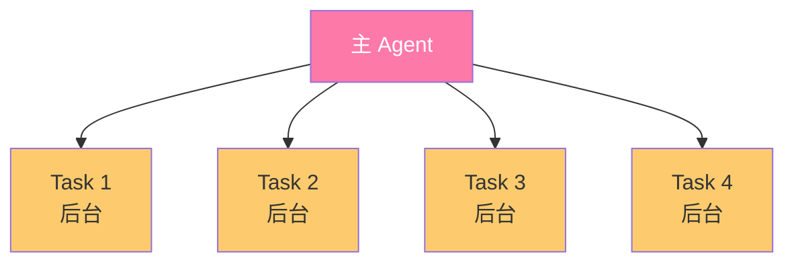

**适用场景**: 多个独立任务同时执行

> [!note] 来源
> [Claude Code Docs - Agent Teams](https://code.claude.com/docs/en/agent-teams)

#### 3. Research → Implement

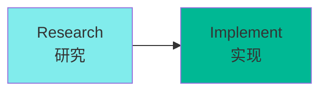

**流程**:
1. **Research**: 搜集资料，理解技术细节
2. **Implement**: 基于研究结果编写代码

> [!note] 来源
> [Building Multi-Agent Orchestrator - Mae Capozzi](https://maecapozzi.com/blog/building-a-multi-agent-orchestrator)

#### 4. Plan-Act-Reflect Loop

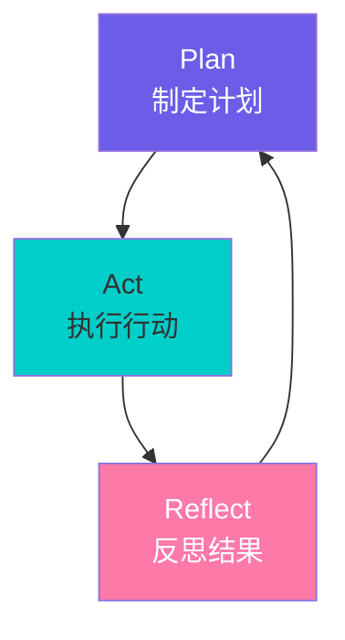

**循环迭代**:
1. **Plan**: 制定计划
2. **Act**: 执行行动
3. **Reflect**: 反思结果
4. **返回 Plan**: 根据反思调整计划

> [!note] 来源
> [Building Multi-Agent Orchestrator - Mae Capozzi](https://maecapozzi.com/blog/building-a-multi-agent-orchestrator)

### 大规模多 Agent 系统设计

#### 系统规模示例

> [!example] 一个大规模多 Agent 系统的配置

| 组件 | 数量 |
|:-----|-----:|
| 专注插件 | 75 个 |
| 专门化 Agent | 182 个 |
| Agent Skills | 147 个 |

> [!note] 来源
> [wshobson/agents GitHub](https://github.com/wshobson/agents)

#### 关键技术

> [!tip] 1. Planning Coordinator 路由
> - 中央协调器负责任务路由
> - 智能分配任务到合适的 Agent

> [!tip] 2. Git Worktree 隔离
> - 每个 Agent 在独立的 worktree 中工作
> - 避免文件冲突

> [!tip] 3. 超时控制
> - 设置任务超时限制
> - 防止长时间阻塞

> [!tip] 4. 分布式追踪
> - 跟踪任务执行路径
> - 便于调试和优化

> [!note] 来源
> [wshobson/agents GitHub](https://github.com/wshobson/agents)

## 与其他概念的关系

| 概念 | 关系 | 说明 |
|:-----|:-----|:-----|

## 最佳实践

### 团队规模与任务粒度

| 因素 | 建议 | 原因 |
|:-----|:-----|:-----|
| **团队规模** | 3-5 人最佳 | 平衡协调成本和并行效率 |
| **任务粒度** | 适中 | 过大导致阻塞，过小增加开销 |

> [!note] 来源
> [Claude Code Docs - Agent Teams](https://code.claude.com/docs/en/agent-teams)

### 文件管理

> [!warning] 注意事项
> - **避免文件冲突**: 不同 Agent 操作不同文件
> - **使用 Git Worktree**: 为每个 Agent 创建独立工作树
> - **锁定机制**: 对共享文件实现锁定

### 模型选择策略

```python
# 按任务复杂度选择模型
def select_model(task):
    if task.criticality == "high":
        return "opus-4.6"  # 关键任务
    elif task.domain in ["AI/ML", "backend", "frontend"]:
        return "inherit"   # 继承用户选择
    elif task.type in ["docs", "testing", "debug"]:
        return "sonnet"    # 中等复杂度
    else:
        return "haiku"     # 快速操作
```

### 2026 趋势

> [!quote] 行业预测
> - **多 Agent 系统取代单 Agent 工作流**: 成为主流开发模式
> - **40% 企业应用将嵌入任务专用 AI Agent**: 专用化趋势明显
> - **Agent 协作标准化**: 协作协议和模式逐渐成熟

> [!note] 来源
> [Anthropic 2026 Report](https://resources.anthropic.com/hubfs/2026%20Agentic%20Coding%20Trends%20Report.pdf)

## 常见问题

### Q1: 如何选择合适的设计模式？

| 场景 | 推荐模式 |
|:-----|:---------|
| 需要中央协调 | Supervisor Pattern |
| 任务独立性强 | Swarm Architecture |
| 超大规模任务 | Hierarchical Patterns |
| 指令冲突严重 | Router Pattern |

### Q2: Agent 之间如何通信？

> [!info] 通信方式
> - **共享任务列表**: 所有 Agent 可见的任务队列
> - **消息系统**: Agent 间的点对点通信
> - **共享内存**: 通过 memory 配置共享上下文

### Q3: 如何处理 Agent 失败？

> [!warning] 失败处理策略
> 1. **超时控制**: 设置合理的超时时间
> 2. **重试机制**: 自动重试失败的任务
> 3. **降级策略**: 失败后回退到更可靠的 Agent
> 4. **人工介入**: 标记需要人工处理的异常

### Q4: 多 Agent 系统的成本如何控制？

> [!tip] 成本优化建议
> - **模型分层**: 根据任务复杂度选择合适的模型
> - **任务合并**: 合并过小的任务减少调用次数
> - **缓存结果**: 缓存重复任务的结果
> - **并行优化**: 最大化并行度减少总时间

## 参考资料

### 官方文档

> [!book] 官方资源
> - [Claude Code Docs - Subagents](https://code.claude.com/docs/en/sub-agents)
> - [Claude Code Docs - Agent Teams](https://code.claude.com/docs/en/agent-teams)
> - [Anthropic 2026 Agentic Coding Trends Report](https://resources.anthropic.com/hubfs/2026%20Agentic%20Coding%20Trends%20Report.pdf)

### 社区资源

> [!book] 社区文章
> - [Task Tool vs Subagents - ibuildwith.ai](https://ibuildwith.ai/blog/task-tool-vs-subagents-how-agents-work-in-claude-code/)
> - [The Task Tool - dev.to](https://dev.to/bhaidar/the-task-tool-claude-codes-agent-orchestration-system-4bf2)
> - [Building Multi-Agent Orchestrator - Mae Capozzi](https://maecapozzi.com/blog/building-a-multi-agent-orchestrator)
> - [Multi-Agent Architecture Patterns - MCP Market](https://mcpmarket.com/tools/skills/multi-agent-architecture-patterns-4)
> - [7 Multi-Agent Patterns Every Developer Needs in 2026](https://pub.towardsai.net/7-multi-agent-patterns-every-developer-needs-in-2026-and-how-to-pick-the-right-one-e8edcd99c96a)
> - [wshobson/agents GitHub Repository](https://github.com/wshobson/agents)

## 个人笔记

> [!personal] 我的使用经验
> （此处记录你在实际项目中使用多 Agent 流程的经验、踩坑记录和心得体会）

> [!personal] 待探索
> - [ ] 尝试在自己的项目中实现 Supervisor Pattern
> - [ ] 研究 Git Worktree 在多 Agent 场景下的最佳实践
> - [ ] 探索如何为特定领域定制 Subagent

> [!personal] 相关笔记
> - [[01-基础概念/Agent Teams智能体团队]] - Agent Teams 基础概念
> - [[AI-Agent-协作模式对比]]
