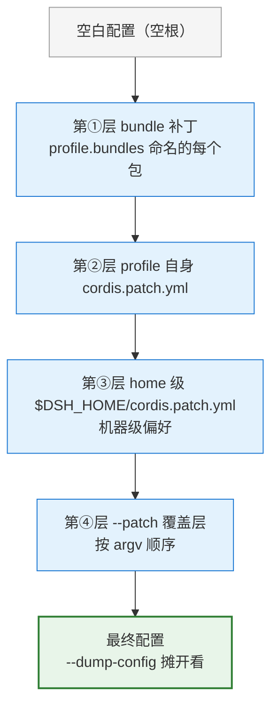

# 配置体系——补丁树、Profile 与 bundle

> [!summary] 本章导读
> 这是 [[01-插件开发核心-从apply到system-prompt|插件开发核心]] 的配套专册。dsh **没有「一份完整配置文件」**——配置是**多层 YAML 补丁**按顺序叠加的结果。本册讲清四件事：① 补丁树怎么叠加（1）；② 两级配置 Profile 与 Agent Preset（2）；③ 插件怎么声明并接收配置（3）；④ 打包发布时 bundle 与 profile 各管什么（4）。

## 1. 配置心智模型：多层 YAML 补丁树

插件不是放进某个目录就生效，而是通过 **YAML 补丁树**装配。dsh 的配置在**空根**上按顺序叠加补丁[^1]：

1. **bundle 补丁**：profile manifest 中 `dsh.profile.bundles` 列表命名的每个 bundle 补丁；
2. **profile 自身 `cordis.patch.yml`**；
3. **home 级 `$DSH_HOME/cordis.patch.yml`**（机器级偏好，所有 profile 共享）；
4. **`--patch <path>` 覆盖层**（按 argv 顺序）。



补丁语义：**"Later layers win per row"**——后层按行覆盖，**替换目标行的完整 config 值，不做深合并**，可插入新行。

> [!tip] 大白话
> 把补丁树想成一层层铺在桌上的透明纸。后铺的纸会盖住先铺的同一位置，但不会去改下面那层的其他内容——「整行替换，不做深合并」。

### 四层补丁：在哪、谁写的、管多宽

| 层                               | 文件在哪                                       | 谁写的  | 管多宽                           |
| ------------------------------- | ------------------------------------------ | ---- | ----------------------------- |
| ① bundle 补丁                     | 每个插件包内部自带一份（包声明 `dsh.bundle.patch` 指向它）    | 插件作者 | 这个包贡献的配置；profile 点名几个包就按顺序叠几份 |
| ② profile 自身 `cordis.patch.yml` | `$DSH_HOME/profiles/<名字>/cordis.patch.yml` | 你/本地 | 只对这个 profile 生效               |
| ③ home 级 `cordis.patch.yml`     | `$DSH_HOME/cordis.patch.yml`               | 你/机器 | 这台机器所有 profile 共享             |
| ④ `--patch <path>`              | 命令行临时指定的任意文件                               | 命令行  | 只影响这一次运行，优先级最高                |

> [!example] 数字走一遍
> 假设 profile `web` 点名装 `base`、`web-app` 两个包，各层都写了插件 `hello`：
>
> | 层 | 给 hello 设置的 |
> |---|---|
> | ① base 包补丁 | `greeting: 'Hello'`、`maxRetries: 3` |
> | ① web-app 包补丁 | `greeting: 'Hi'`、`maxRetries: 5` |
> | ② profile 自己的 patch | `greeting: 'Hi'`、`maxRetries: 4` |
> | ③ home 级 patch | `greeting: 'Hi'`、`maxRetries: 6` |
> | ④ `--patch` | `greeting: 'Yo'`、`maxRetries: 6` |
>
> 同一字段越晚越赢：`greeting` 被第 ④ 层压成 `'Yo'`，`maxRetries` 被第 ③/④ 层压成 `6`。只被某一层写过的插件保持那一层的值；后层也可以插入全新插件行。

> [!warning] 按行替换，不做深合并
> 补丁不是 Git 式的字段深合并：后层写**同一行**（同一插件 id）时，是拿这行的内容**整体替换**目标行，而不是逐字段拼接。拿不准某层盖出了什么，用 `--dump-config` 摊开看合成结果。

### 检查合成配置（排查利器）

```bash
pnpm dsh --profile web --dump-default-config          # 只看 bundle 层
pnpm dsh --profile web --patch ./extra.yml --dump-config  # 含 profile/home 补丁与 --patch 覆盖层
```

## 2. 两级配置：Profile 与 Agent Preset

两个正交的维度（不是同一个东西的两个名字）：

- **Profile（进程级）**：决定装哪些 bundle。`web`（base + web-app）与 `headless`（base + headless）首次使用自动从模板初始化；其他缺失 profile 需 `dsh plugin --profile <name> add <package>`[^1]。
- **Agent Preset（会话级）**：决定工具/提示词/skill/子代理。内置 4 个预设：`minimal` / `standard` / `code` / `cordis`。作用域解析：`agent → preset → global`[^1]。

| | Profile | Agent Preset |
|---|---|---|
| 级别 | 进程级 | 会话级 |
| 决定 | 装**哪些 bundle**、什么顺序 | 会话里用**哪些工具/提示词/skill/子代理** |
| 类比 Claude Code | 启用哪些插件 + 核心配置 | 某个子代理 / agent 类型的配置 |

其中 `minimal` 固定系统提示 "You are a helpful software engineer assistant."，只组合 `bash` + `str_replace_editor` 两个工具。

> [!tip] 大白话
> Profile 和 Agent Preset 不是「同一个东西的两个名字」，而是**两条独立的轴**。**Profile 像「你电脑上装了哪些 App」**——决定这次启动能干什么；**Agent Preset 像「你叫的是哪个角色的员工」**——决定他手上有哪些工具、按什么人设干活。装了什么 ≠ 用了什么，两条都要设。

### 2.1 Agent Preset 实操：选、换、造

**四个预设的真实身份**：`standard` 是唯一的全量母版，`code` 与 `cordis` 都是 `standard` 的完整副本[^4]，`minimal` 是双工具极简版：

| 预设 | 官方中文名 | 本质 | persona | 工具面 |
|---|---|---|---|---|
| `standard` | 标准模式 | 全量编码 Agent（母版） | `You are a coding agent powered by the {{model}} model...`（含 `{{cwd}}` 模板） | persona + agent-instructions + bash/pwsh + fs + fs-search + jobs + skill + goal + ask-user + todo + web + 计划/压缩/委派三组 |
| `code` | PTC 模式 | standard 完整副本 | 同 standard | 全量工具，但经 Code Mode SDK 呈现，模型用 TS 程序组合多步操作 |
| `cordis` | 创造模式 | standard 完整副本 | 同 standard | 全量 + 运行时检查 + 插件实验 + preset 创作指导 |
| `minimal` | 极简模式 | 双工具最小集 | `You are a helpful software engineer assistant.`（`complete: true`） | 持久 bash + `str_replace_editor`，仅两个模型工具 |

> [!note] `minimal` 为什么只有一句提示词
> 官方 minimal 的 persona 是 `text: "You are a helpful software engineer assistant."` + `complete: true` + `includeRuntimeContext: false`。`complete: true` = 组装后这个人设被恢复为**唯一**系统提示段，其他装配监听器插不进提示文本；`includeRuntimeContext: false` = 不注入运行时上下文快照。「极简」是靠少组装几行做出来的，不是靠关一堆开关[^4]。

**preset 就是一个目录**：内含一份 `agent.cordis.yml`（Cordis 组合：插件行列表）+ 可选 `preset.yml`（只放展示文本 name/description）[^4]：

- 内置预设（只读）：部署随附，**不要直接改**——升级会覆盖；想改就复制一份再改；
- 用户预设：`$DSH_HOME/.agent-presets/<id>/`（`$DSH_HOME` 默认 `~/.dsh`）。id 必须匹配 `[a-z0-9][a-z0-9-]*`，非法目录名会被跳过；目录发现**不缓存**，新写的 preset 立即可见。

**怎么选（切换）**：

- 会话创建时：会话选择器列出各预设摘要；`resolveSessionPreset(session)` 解析出会话**实际运行**的 preset（读的是解析结果，不是创建头）；
- 改默认：配置层写 `agent-presets: default: <id>`（默认 preset 是一项用户设置）；清空该字段即回继承组装默认值[^4]；
- 空 agent 重链：`ctx.agentPresets.recompose(agentCtx, id)` 可重链一个尚未产出任何内容的 agent；一旦产出过，网关返回 `agent-preset-locked`。

**怎么造（自定义）**：创作即复制——新 preset 是既有 preset 的整目录副本（组装、元数据、skill 目录、附带资产），落在首个用户根目录下[^4]。

```bash
# 社区通用做法：复制到用户根目录，改副本
mkdir -p ~/.dsh/.agent-presets
cp -R <官方或他人 preset 目录> ~/.dsh/.agent-presets/my-preset/
# 编辑 ~/.dsh/.agent-presets/my-preset/agent.cordis.yml
# 完全重启 dsh，在会话选择器中选用
```

规范做法用 `ctx.agentPresets.copy(from, id, name?)`（校验 id 合法性/占用、收紧权限、重写 `preset.yml`）；`cordis`（创造模式）就是干这个的——运行时检查、内存里试验插件、据此组合新 preset。

> [!tip] 大白话
> **Profile 管「装哪些 App」，Preset 管「叫哪个角色」。** 选 preset = 在员工列表里挑人：默认配置 `agent-presets: default: xxx` 决定默认叫谁，会话选择器临时改主意，造新 preset = 复制老员工的档案夹再改技能表。`minimal` 的 `complete: true` 值得记住——它让这个人设独占话筒，谁都插不进话。

## 3. 插件如何接收配置：Config schema

插件可接受 `cordis.yml` 传入的配置。导出同名 `Config` 接口 + **Schemastery** schema（不能用普通对象），默认值写在 schema 上[^1][^2]：

```ts
import Schema from '@deepseek-ai/schemastery'

export interface Config {
  greeting: string
  maxRetries: number
}
export const Config: Schema<Config> = Schema.object({
  greeting: Schema.string().default('Hello'),
  maxRetries: Schema.number().default(3),
})

export function apply(ctx: Context, config: Config) {
  console.log(config.greeting)   // 用户值或 schema 默认值
}
```

在 `cordis.yml` 里配：

```yaml
- insert:
    - id: hello
      name: './src/my-plugin.ts'
      config:
        greeting: 'Hi there'
        maxRetries: 5
```

- **原则**：两个部署可能想设不同的值，就做成配置字段（测试：`cordis.yml` 能否不改代码改值）[^1]；
- **失效即响亮失败**：无效配置让 fiber 进 FAILED，报错精确；
- **HMR**：配置编辑热替换插件，旧实例注册自动清理，不残留。

> [!tip] 大白话
> 插件像一个**新入职的员工**，`Config` schema 就是他的**岗位说明书**：上面写清楚有哪些字段、每格填什么类型、不填时用什么默认值。用说明书而不是随便一张纸，是因为说明书能做「入职审核」——填错了当场打回（响亮失败），不会糊弄过去。改完配置不用重启进程，原地换血（HMR 热替换）。

## 4. 打包与发布：bundle 与 profile

开发期用 `--patch` 加载本地插件；要给别人用时打包成 **bundle**（npm 包）[^3]。

两个概念（都由 `package.json` 描述，但 manifest 不同）：

- **bundle**：携带配置层的 npm 包，声明 `dsh.bundle.patch`——回答「这个包贡献什么」；
- **profile**：`$DSH_HOME/profiles/<name>` 目录，声明 `dsh.profile.bundles` 有序列表——回答「装哪些 bundle、什么顺序」。你从不手写 profile，`dsh plugin` 自动维护。

最小 bundle：

```json
{
  "name": "dsh-hello-plugin",
  "version": "0.1.0",
  "type": "module",
  "main": "index.js",
  "files": ["index.js", "cordis.patch.yml"],
  "dsh": { "bundle": { "patch": "./cordis.patch.yml" } }
}
```

```yaml
# cordis.patch.yml（插件行按包名引用，不用相对路径）
- insert:
    - id: hello
      name: dsh-hello-plugin
```

安装进 profile：

```bash
dsh plugin --profile demo add ./hello-plugin     # 转发 pnpm，自动追加 bundle
dsh --profile demo --dump-config                  # 验证层
dsh --profile demo
```

> [!warning] git 安装的 build 坑
> `dsh plugin add github:you/hello-plugin` 拉的是**源码不是构建产物**。作者必须提供 `prepare` 脚本（pnpm 在 git 安装后运行），用户还需在 profile 的 `pnpm-workspace.yaml` 里 `allowBuilds` 放行——这等于「授权在安装时执行该包的代码」，只放行你信任的包，并 `#<sha>` 钉住 commit[^3]。

> [!tip] 大白话
> **bundle 是「料理包」**——每个 npm 包自己声明「我贡献哪一层配置」；**profile 是「上菜顺序单」**——决定按什么顺序装哪些料理包，这单子不用你手写，`dsh plugin` 命令自动维护。git 安装那个坑再补一句：`allowBuilds` 放行 = 你亲手递给这个包一张「在我机器上跑代码」的门禁卡，只发给信任的包，还要用 `#<sha>` 把版本钉死。

---

## 本章小结

> [!summary]
> - dsh 没有「一份完整配置」，配置是**多层 YAML 补丁树**（bundle → profile → home → `--patch`）在空根上叠加的结果，后层整行替换、不做深合并；`--dump-config` 可摊开看最终配置；
> - **Profile（进程级）管装哪些 bundle；Agent Preset（会话级）管会话用什么能力**（minimal / standard / code / cordis）；
> - Agent Preset 实操：preset 即目录（`agent.cordis.yml` + 可选 `preset.yml`），用户预设放 `~/.dsh/.agent-presets/<id>/`；会话选择器选用、`agent-presets: default: <id>` 配默认、复制目录即造新预设；`minimal` 靠 persona `complete: true` 做到单句提示；
> - 插件接受配置：`Config` 接口 + Schemastery schema，默认值写 schema 上，坏配置响亮失败，HMR 热替换；
> - 发布：**bundle 贡献配置层**（`dsh.bundle.patch`）vs **profile 决定装哪些 bundle 及顺序**（`dsh.profile.bundles`）；`dsh plugin add` 安装，git 安装注意 prepare + allowBuilds。

相关：[[01-插件开发核心-从apply到system-prompt|第 3 章 插件开发核心]] → [[DeepSeek-Harness 教程/DeepSeek-Harness 与ClaudeCode对照迁移|实战：自定义工具插件]]。

---

## 更新记录

- 2026-08-15：从原《配置体系》（插件开发核心）中拆出配置专册，独立成篇；原 3.2（补丁树）/ 3.3（两级配置）/ 3.6（Config schema）/ 3.9（bundle 发布）整合为本册 1–4 节。
- 2026-08-16：补 §2.1 Agent Preset 实操（四个预设真实身份 / preset 目录结构与用户根 / 选择与切换 / 复制造新 preset），依据官方 preset 文档与内置 standard/minimal 的 `agent.cordis.yml` 核对。
- 2026-08-16：迁移入 [[DeepSeek-Harness 插件开发教程/README|插件开发教程]] 分册第 02 章，更新内部双链。

---

[^1]: 素材来源：DeepSeek Harness 官方文档「第一个插件 / 插件配置」（2026-08-15 收集）。
[^2]: 素材来源：官方 Cordis 教程 01–03/05（2026-08-15 收集）。
[^3]: 素材来源：官方「打包并安装插件」（2026-08-15 收集）。
[^4]: 素材来源：DeepSeek Harness 官方 preset 文档 `packages/preset/agent-presets/README.zh.md`、内置 `standard` / `minimal` 的 `agent.cordis.yml`、官方 Harness 页（2026-08-16 收集）。
