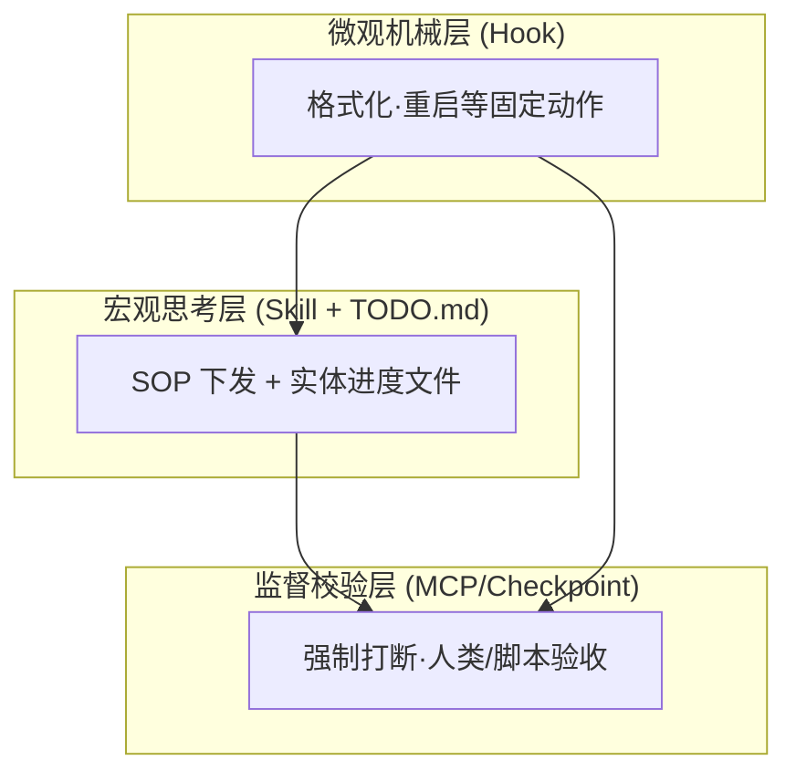

# Claude Code 防遗忘策略：如何 100% 确保工作流被执行

## 背景

在使用 Claude Code 执行长线工作流时，经常会遇到 AI "跳步骤" 的问题——不是因为能力不足，而是因为**大模型的惰性**：即便在 CLAUDE.md 或 Skill 中写明了规范，AI 仍然可能"好的了解"然后继续按自己的方式走。

常见的应对思路是用 **Hook 触发提醒**，让 AI 在关键节点去读规范。但实践证明这是一种**反模式（Anti-pattern）**。

> [!info] 相关问题
> 这是 [[Claude Code 工作流遵守问题]] 中提到的 Prompt Drift 现象的延伸讨论。

## 过程

### 核心误区：Hook 强制提醒为何无效

尝试在关键节点用 Hook 触发 "请读规范" 的提醒，看似合理，实则有三大致命问题：

| 问题 | 说明 |
|------|------|
| **触发机制错位** | Hook 基于"物理工具调用"触发，AI 的"思考完毕"没有物理触发器，无法精准拦截 |
| **Token 灾难** | 反复塞规范会撑爆 Context Window，费钱且让 AI 丧失有效注意力 |
| **大模型惰性** | 即便把规则怼到 AI 脸上，它仍可能回复"好的了解"然后跳过步骤 |

### 解决方案：三层防跳步架构

核心思路：**把抽象规范转化为具体的系统约束或文件读写动作**。

#### 防御一层：剥夺执行权（Hook 兜底机械步骤）

对于**不需要动脑的体力活**（Lint 格式化、Docker 重启等），不要指望 AI 记住，直接用系统脚本执行。

- 在 `settings.json` 配置 **PostToolUse Hook**
- 监听特定文件被写入 → 宿主机底层自动静默执行脚本
- 规范被 **100% 物理执行**，AI 无需参与

```json
// settings.json 示例
{
  "hooks": {
    "PostToolUse": [
      {
        "trigger": "Write",
        "filter": "**/*.py",
        "action": "python -m flake8 {{file}}"
      }
    ]
  }
}
```

#### 防御二层：状态机模式（TODO.md 倒逼 AI 守规矩）

把**短期记忆（Context）变成长期记忆（硬盘文件）**。大模型对"调用工具读写文件"的执行力，远高于"在脑子里记住某件事"。

在 Skill 中强制写入 SOP：

```markdown
# 强制工作流流转规则
1. 任务开始前，必须在当前目录创建 `SETUP_TODO.md`，列出所有阶段
2. 每完成一个阶段，必须调用 `Write` 工具在文件里打上 `[x]`
3. 在进入下一个阶段前，必须调用 `Read` 工具检查文件，确认上一步已完成
```

#### 防御三层：红绿灯机制（MCP/Checkpoint 验收）

在**极度危险或关键**的阶段切换时，强制打断 AI，拉起人类或脚本验收。

- 原理：伪造一个只有得到确认才能返回"通行证"的工具
- 实现：编写 `finish_stage` MCP 工具或本地校验脚本
- 规定："严禁擅自进入下一阶段。必须调用 `finish_stage`，等待绿灯后才能继续。"

## 心得

### 工作流金字塔

理想的工作流调度架构分为三层：



| 层级 | 职责 |
|------|------|
| **Skill + TODO.md** | 负责下发拆解好的小步骤，强制 AI 维护实体进度 |
| **Hook** | 接管所有收尾、格式化、重启，把 AI 从琐事中解放 |
| **MCP/Checkpoint** | 关键节点强制验收，防止 AI 擅自越步 |

> [!tip] 核心原则
> 不要让 AI "记住" 规范，而要让 AI 被规范 "驱动"——通过文件读写和工具调用来约束行为。

## 踩坑

> [!warning] Hook 强制提醒是反模式
> **现象**：用 PostToolUse Hook 在终端反复塞规范，期待 AI 按规则执行
>
> **原因**：
> 1. Hook 无法拦截 AI "思考完毕" 这个非物理事件
> 2. 重复塞规范 = Token 浪费 + 有效信息被稀释
> 3. 大模型对 "被念经" 免疫
>
> **解决**：改用三层架构，将规范转化为系统约束而非反复提醒

## 延伸

- [ ] 研究如何用 MCP 实现 `finish_stage` 工具
- [ ] 在实际项目中验证 TODO.md 状态机模式的效果
- [ ] 探索 Hook 与 Skill 的最佳协作边界

---

*来源: 个人经验*
