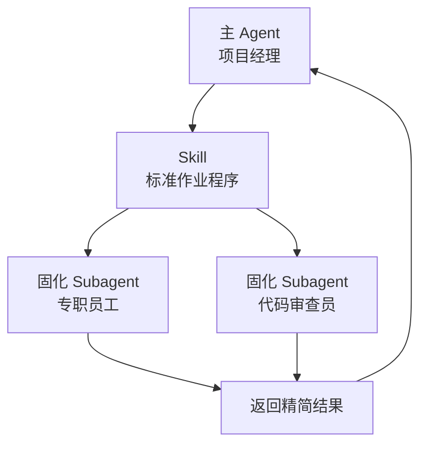

# Claude Code Subagent 与 Skill 调度机制

## 核心理念：上下文隔离 (Context Isolation)

在处理复杂项目时，大模型的「上下文窗口（Context Window）」极其宝贵。

### 痛点

长时间的纠错、阅读冗长日志、反复执行测试会产生大量「垃圾信息」，导致主 Agent 变笨、遗忘目标或产生幻觉。

### 解法：使用 Subagent

> Subagent 的核心使命是处理「脏活累活」，它的运行实例是**完全临时（阅后即焚）**的。
> 
> 任务完成后，只向主 Agent 返回精简总结，随后立刻销毁，**绝不污染主干上下文**。

---

## Subagent 的两种「身份形态」

### 形态 A：临时拉起的 Subagent（临时工）

| 属性 | 说明 |
|------|------|
| **创建方式** | 通过 `/subagent` 手动创建，或主 Agent 随时拉起 |
| **特点** | 零配置、随口即用 |
| **适用场景** | 突发性探路试错、隔离单次长日志查阅、避免打断主 Agent 连续思考 |

### 形态 B：固化的 Subagent（专职员工）

| 属性 | 说明 |
|------|------|
| **创建方式** | 在 `.claude/agents/` 或 `~/.claude/agents/` 下编写配置文件 |
| **特点** | 拥有固定职责、系统提示词和严格权限 |
| **适用场景** | 流程化、重复性高的标准化任务（代码审查、测试、安全扫描） |

---

## 核心区别对比

| 对比维度 | 形态 B：固化 Subagent | 形态 A：临时 Subagent |
|----------|----------------------|----------------------|
| **复用性** | 跨会话/跨项目永久可用 | 阅后即焚，不可复用 |
| **权限控制** | 极强：可物理级隔离（如仅 `[Read, Grep]`） | 弱：继承默认全量权限 |
| **成本/速度** | 支持：可指定便宜快速的模型（如 Haiku） | 不支持：跟随主 Agent 模型 |
| **稳定性** | 极高：严格遵循预设 System Prompt | 依赖主 Agent 传话准确度 |

---

## 高阶实践：Skill + 固化 Subagent 的操作员模式

> 将 `.claude/agents/` 视作「员工名册」，将 Skill 视作「SOP（标准作业程序）」，主 Agent 视作「项目经理」。

### 架构图



### Step 1：定义固化 Subagent

在 `.claude/agents/` 下创建组件：

```yaml
---
name: code-reviewer
description: 代码审查专家。当需要 Review 代码时调用。
model: claude-3-7-sonnet-20250219
tools: [Read, Grep, Glob]  # 限制读权限，防止误删改
---
你是一个严苛的代码审查专家。阅读主 Agent 传给你的代码，挑出逻辑漏洞，直接输出 Review 报告，不得修改代码。
```

### Step 2：在 Skill 中编排工作流

```markdown
# 自动化重构与审查工作流

执行代码重构时，请严格作为主调度员按以下步骤执行：

1. **你（主 Agent）** 负责分析架构，执行代码重写。
2. 完成后，调用 `code-reviewer` 代理，把代码路径和修改意图传给它。
3. 根据 `code-reviewer` 的意见，完成最终的代码微调。
```

---

## Best Practices

| 要点 | 说明 |
|------|------|
| **上下文传递** | 调用 Subagent 时必须把文件路径、当前报错等背景信息交代清楚 |
| **退出条件** | 防止 Subagent 陷入死循环（如「最多尝试 3 次，失败则带回报错终止」） |

---

## 关键收获

> [!SUMMARY] 核心要点
> 1. **Subagent = 临时工**：阅后即焚，保护主上下文
> 2. **固化 Subagent = 资产**：可复用、有权限、能降成本
> 3. **Skill = SOP**：编排工作流，让主 Agent 做调度而非执行
> 4. **隔离是设计原则**：不是补丁，是架构

---

*来源：个人实战经验*
