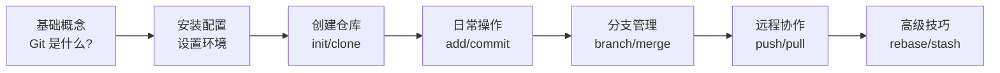

---
tags:
  - moc
  - git
  - 版本控制
cssclass:
  - moc
created: 2026-03-02
updated: 2026-07-31
---

# Git 知识体系

> 🗺️ 本页是 Git 相关笔记的索引地图

---

## 👥 适合人群

| 角色 | 你将获得 |
|------|----------|
| **Git 初学者** | 从零开始学习版本控制的完整路径 |
| **开发者** | 日常开发中 Git 使用的速查手册 |
| **团队协作者** | 分支策略、冲突解决的最佳实践 |
| **遇到问题者** | 按错误信息快速定位解决方案 |

---

## 📚 核心教程

| 文件 | 描述 | 难度 |
|------|------|------|
| [[Git 入门教程]] | Git 完整入门教程，涵盖基础概念、常用操作 | ⭐ 入门 |
| [[Git 安装配置教程]] | 双平台安装配置与基础配置闭环（Windows/macOS） | ⭐ 入门 |
| [[Git 命令速查]] | 快速命令查阅表，按场景分类 | ⭐ 速查 |
| [[Git 高级技巧]] | Rebase、Stash、.gitignore 等高级用法 | ⭐⭐ 进阶 |

| ~~Git 常见错误解决方案~~ *(已删除)* | 按错误信息分类的快速解决方案 | ⭐⭐ 实用 |
| [[分支管理最佳实践]] | 团队协作分支策略、命名规范、工作流程 | ⭐⭐⭐ 高级 |

---

## 🛤️ 学习路径



### 阶段一：基础（1-2 天）
- [[Git 入门教程#1-git-基础概念|Git 是什么？]]
- [[Git 入门教程#git-的核心思想|Git 核心思想]]
- [[Git 入门教程#2-git-配置|Git 配置]]
- [[Git 入门教程#3-创建仓库|创建仓库]]

### 阶段二： 日常使用（3-5 天）
- [[Git 入门教程#4-git-的区域与状态|Git 的 4 个区域和 4 种状态]]
- [[Git 入门教程#5-基础操作|添加和提交文件]]
- [[Git 命令速查]] - 熟悉常用命令

- [[Git 入门教程#5-基础操作|回退版本]]

### 阶段三： 协作开发（1 周）
- [[Git 入门教程#7-远程仓库与协作|远程仓库配置]]
- [[Git 入门教程#7-远程仓库与协作|SSH 配置]]
- [[Git 入门教程#6-分支管理|分支管理]]
- ~~解决合并冲突~~ *(链接目标已删除)*

### 阶段四： 进阶技巧（持续学习）
- [[Git 高级技巧#1-rebase-变基|Rebase 变基]]
- [[Git 高级技巧#3-stash-暂存|Stash 暂存]]
- [[Git 高级技巧#4-gitignore-忽略文件|.gitignore 用法]]
- [[分支管理最佳实践]] - 团队协作规范

- ~~Git 常见错误解决方案~~ *(已删除)* - 错误排查手册

---

## 🔍 按场景查找

### 我想...

| 需求 | 查看文档 | 快速定位 |
|------|----------|----------|
| 从零学习 Git | [[Git 入门教程]] | 入门教程 > 第1章 |
| 快速查找命令 | [[Git 命令速查]] | 速查表 > 常用命令 |
| 学习 Rebase | [[Git 高级技巧#1-rebase-变基]] | 高级技巧 > 第1章 |
| 使用 Stash | [[Git 高级技巧#3-stash-暂存]] | 高级技巧 > 第3章 |
| 解决冲突 | ~~Git 常见错误解决方案~~ *(已删除)* | 错误方案 > 合并冲突 |
| 推送被拒绝 | ~~Git 常见错误解决方案~~ *(已删除)* | 错误方案 > 推送问题 |
| SSH 配置 | [[Git 入门教程#7-远程仓库与协作]] | 入门教程 > 第7章 |
| 制定团队规范 | [[分支管理最佳实践]] | 分支管理全文 |
| 配置 .gitignore | [[Git 高级技巧#4-gitignore-忽略文件]] | 高级技巧 > 第4章 |

---

## 🔗 外部资源

| 资源 | 链接 | 说明 |
|------|------|------|
| Git 官方文档 | https://git-scm.com/doc | 权威文档 |
| Pro Git 中文版 | https://git-scm.com/book/zh/v2 | 免费电子书 |
| GitHub 官方教程 | https://docs.github.com/zh/get-started/getting-started-with-git | GitHub 指南 |
| Git Cheat Sheet | https://education.github.com/git-cheat-sheet-education.pdf | PDF 速查表 |

---

## 📊 知识库结构

```
Git/
├── Git MOC.md              # 📍 本文件 - 知识索引
├── Git 入门教程.md         # ⭐ 入门 - 基础概念和操作
├── Git 安装配置教程.md     # ⭐ 入门 - 安装与基础配置
├── Git 命令速查.md         # 🔍 速查 - 命令查阅表
├── Git 高级技巧.md         # ⭐⭐ 进阶 - Rebase/Stash 等
├── ~~Git 常见错误解决方案.md~~ # ❌ 已删除 - 错误排查
├── 分支管理最佳实践.md     # ⭐⭐⭐ 高级 - 团队协作
└── assets/                 # 图片资源
```

---

**最后更新**：2026-07-31
