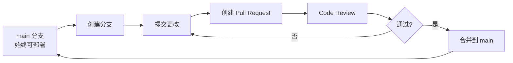
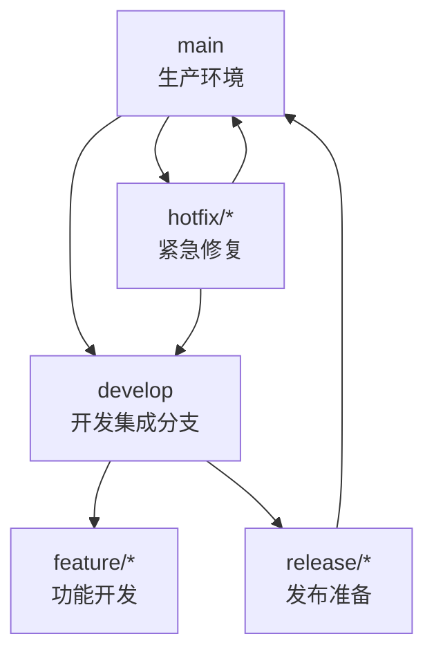

---
tags:
  - git
  - 分支管理
  - 团队协作
  - 工作流
cssclass: branch-practices
created: 2026-02-25
updated: 2026-02-25
---

# 分支管理最佳实践

> 团队协作中的 Git 分支策略和工作流程

---

# 常见分支模型

## GitHub Flow

### 流程图



### 特点

| 优点 | 缺点 | 适合场景 |
|------|------|----------|
| 简单易学 | 缺乏发布版本管理 | 持续部署的 SaaS 产品 |
| main 始终可部署 | 大型项目发布管理困难 | 小型团队、快速迭代 |
| 适合 CI/CD | - | Web 应用 |

### 工作流程

```bash
# 1. 从 main 创建功能分支
git checkout main
git pull
git checkout -b feature/user-auth

# 2. 开发并提交
git add .
git commit -m "feat: 添加用户认证功能"

# 3. 推送并创建 PR
git push -u origin feature/user-auth
# 在 GitHub 上创建 Pull Request

# 4. 审核通过后合并
# 通过 GitHub UI 合并

# 5. 删除本地分支
git checkout main
git pull
git branch -d feature/user-auth
```

---

## Git Flow

### 分支结构



### 分支说明

| 分支类型 | 命名 | 生命周期 | 说明 |
|----------|------|----------|------|
| **main** | `main` / `master` | 永久 | 生产环境代码，每个提交都是可部署的版本 |
| **develop** | `develop` | 永久 | 开发集成分支，包含下一个版本的所有功能 |
| **feature** | `feature/功能名` | 临时 | 功能开发，完成后合并到 develop |
| **release** | `release/版本号` | 临时 | 发布准备，修复 bug，更新版本号 |
| **hotfix** | `hotfix/问题描述` | 临时 | 生产环境紧急修复 |

### 工作流程

```bash
# ========== 功能开发 ==========

# 1. 从 develop 创建功能分支
git checkout develop
git pull
git checkout -b feature/user-auth

# 2. 开发完成，合并回 develop
git checkout develop
git merge feature/user-auth
git branch -d feature/user-auth

# ========== 发布版本 ==========

# 3. 从 develop 创建发布分支
git checkout develop
git checkout -b release/1.2.0

# 4. 发布分支只修复 bug，更新版本号
vim CHANGELOG.md
git commit -m "chore: bump version to 1.2.0"

# 5. 合并到 main 和 develop
git checkout main
git merge release/1.2.0
git tag -a v1.2.0 -m "Release 1.2.0"

git checkout develop
git merge release/1.2.0
git branch -d release/1.2.0

# ========== 紧急修复 ==========

# 6. 从 main 创建 hotfix 分支
git checkout main
git checkout -b hotfix/critical-bug

# 7. 修复后合并到 main 和 develop
git checkout main
git merge hotfix/critical-bug
git tag -a v1.2.1 -m "Hotfix 1.2.1"

git checkout develop
git merge hotfix/critical-bug
git branch -d hotfix/critical-bug
```

### 适合场景

| 场景 | 推荐使用 |
|------|----------|
| 有明确发布周期的项目 | Git Flow |
| 需要维护多个版本 | Git Flow |
| 大型团队、复杂项目 | Git Flow |
| 持续部署的 SaaS | GitHub Flow |

---

## Trunk-Based Development

### 核心思想

所有开发直接在主干（trunk）或短生命周期分支上进行。

### 特点

| 优点 | 缺点 | 适合场景 |
|------|------|----------|
| 最简化的分支策略 | 需要完善的 CI/CD | 大型互联网公司 |
| 避免合并冲突 | 需要频繁集成 | 有完善自动化测试的团队 |
| 快速迭代 | 对团队纪律要求高 | 微服务架构 |

### 工作流程

```bash
# 方式1：直接在主干开发（小型更改）
git checkout main
git pull
# 进行小改动
git add .
git commit -m "fix: small bug"
git push

# 方式2：短生命周期分支（大型功能）
git checkout main
git checkout -b feature-large
# 开发...
git checkout main
git merge feature-large
git branch -d feature-large
```

---

# 分支命名规范

## 推荐命名格式

| 类型 | 格式 | 示例 | 说明 |
|------|------|------|------|
| 新功能 | `feature/功能名` | `feature/user-login` | 新功能开发 |
| Bug 修复 | `bugfix/问题描述` | `bugfix/login-timeout` | 一般 bug 修复 |
| 紧急修复 | `hotfix/问题描述` | `hotfix/security-patch` | 生产环境紧急修复 |
| 重构 | `refactor/模块名` | `refactor/auth-module` | 代码重构 |
| 测试 | `test/测试内容` | `test/integration-tests` | 添加测试 |
| 文档 | `docs/内容` | `docs/api-readme` | 文档更新 |
| 性能优化 | `perf/优化内容` | `perf/database-query` | 性能优化 |
| 样式调整 | `style/调整内容` | `style/button-design` | 样式修改 |
| 构建/工具 | `chore/工具名` | `chore/update-deps` | 构建、依赖更新 |

## 命名注意事项

```bash
# 好的命名
feature/user-oauth-login
bugfix/memory-leak-in-parser
hotfix/security-vulnerability-cve-2024-12345
refactor/payment-gateway-integration

# 不好的命名
fix             # 太模糊
new-feature     # 不具体
stuff           # 无意义
update          # 不清楚更新什么
temp            # 临时分支应该有描述性名称
```

---

# 分支生命周期管理

## 创建分支

```bash
# 1. 确保从最新的起点创建
git checkout main      # 或 develop
git pull

# 2. 创建并切换到新分支
git checkout -b feature/new-feature

# 3. 或使用新命令（Git 2.23+）
git switch -c feature/new-feature

# 4. 推送远程分支
git push -u origin feature/new-feature
```

## 开发过程中的最佳实践

```bash
# 频繁提交，保持提交原子性
git add .
git commit -m "feat: add basic structure"

# 定期同步上游更改
git fetch origin main
git rebase origin/main

# 保持分支整洁
git log --oneline   # 检查提交历史
```

## 完成分支

```bash
# 1. 确保分支是最新的
git checkout feature/new-feature
git fetch
git rebase origin/main

# 2. 合并到 main（或创建 PR）
git checkout main
git pull
git merge feature/new-feature

# 3. 推送
git push

# 4. 删除本地分支
git branch -d feature/new-feature

# 5. 删除远程分支
git push origin --delete feature/new-feature

# 或使用（Git 1.7.0+）
git branch -d -r origin/feature/new-feature
```

---

# 团队协作工作流

## 日常开发流程

```bash
# ========== 每日开始 ==========
# 1. 切换到主分支并更新
git checkout main
git pull

# 2. 创建今日任务分支
git checkout -b feature/task-123

# ========== 开发过程 ==========
# 3. 频繁提交
git add .
git commit -m "feat: implement core logic"

# 4. 定期同步主分支
git fetch origin main
git rebase origin/main

# ========== 任务完成 ==========
# 5. 最后一次同步
git fetch origin main
git rebase origin/main

# 6. 推送并创建 PR/MR
git push -u origin feature/task-123
# 在 GitHub/GitLab 上创建 Pull Request

# 7. 审核通过后合并，删除分支
git checkout main
git pull
git branch -d feature/task-123
```

## Code Review 流程

### PR/MR 创建清单

- [ ] 代码已通过本地测试
- [ ] 提交信息清晰规范
- [ ] 分支已同步最新主分支
- [ ] PR 描述清晰（包含目的、更改内容、测试情况）
- [ ] 没有包含调试代码（console.log、debugger 等）
- [ ] 没有包含注释掉的代码
- [ ] 代码符合团队规范

### PR 描述模板

```markdown
## 变更类型
- [ ] 新功能
- [ ] Bug 修复
- [ ] 重构
- [ ] 文档更新
- [ ] 性能优化

## 变更说明
简要描述这次 PR 的目的和实现方式。

## 测试情况
- [ ] 本地测试通过
- [ ] 单元测试通过
- [ ] 手动测试场景

## 相关 Issue
Closes #123

## 截图（如适用）
添加截图或录屏
```

---

# 避免冲突的技巧

## 预防冲突

```bash
# 1. 小而频繁的提交
# 不要把所有改动堆在一起提交

# 2. 定期同步主分支
git fetch origin main
git rebase origin/main

# 3. 明确的模块分工
# 避免多人同时修改同一文件

# 4. 及时沟通
# 计划修改核心文件时，先在团队内同步
```

## 解决冲突

```bash
# 1. 同步时遇到冲突
git rebase origin/main
# 或
git merge origin/main

# 2. 查看冲突文件
git status

# 3. 手动解决冲突
vim <conflict-file>
# 删除 <<<<<<< ======= >>>>>>> 标记
# 保留需要的内容

# 4. 标记为已解决
git add <conflict-file>

# 5. 继续 rebase/merge
git rebase --continue
# 或
git commit

# 6. 如需放弃
git rebase --abort
# 或
git merge --abort
```

> [!tip] 冲突解决策略
> 详细步骤见 [[Git 常见错误解决方案#合并冲突问题|常见错误解决方案]]

---

# 常见问题 Q&A

## Q1: 应该使用 merge 还是 rebase？

| 场景 | 推荐 |
|------|------|
| 个人整理提交记录 | `rebase` |
| 拉取远程代码 | `rebase` |
| 功能分支合并到 main | `merge` |
| 保持历史线性 | `rebase` |
| 保留完整历史 | `merge` |

## Q2: 什么时候删除分支？

```bash
# 本地分支：合并后即可删除
git branch -d feature-name

# 远程分支：合并后删除
git push origin --delete feature-name

# 定期清理已删除的远程分支跟踪
git remote prune origin
```

## Q3: 如何处理紧急情况？

```bash
# 1. 保存当前工作
git stash

# 2. 切换到 hotfix 分支
git checkout main
git checkout -b hotfix/critical-issue

# 3. 修复并推送
git add .
git commit -m "hotfix: 修复紧急问题"
git push

# 4. 审核后合并到 main 和 develop
# 见 Git Flow 章节的 hotfix 流程

# 5. 恢复原工作
git checkout feature-name
git stash pop
```

## Q4: 多人同时修改同一文件怎么办？

1. **沟通优先**：修改前在团队内同步
2. **模块化**：尽量拆分到不同文件
3. **频繁同步**：定期拉取主分支更改
4. **使用 PR**：通过 Code Review 及时发现冲突

---

# 相关文档

- [[git教程#6-分支管理|分支管理基础]] - 教程中的分支操作
- [[Git 常见错误解决方案#合并冲突问题|合并冲突解决]] - 冲突解决详细步骤
- [[git教程#9-常见问题|常见问题]] - 其他 Git 问题

---

**最后更新**：2026-02-25
