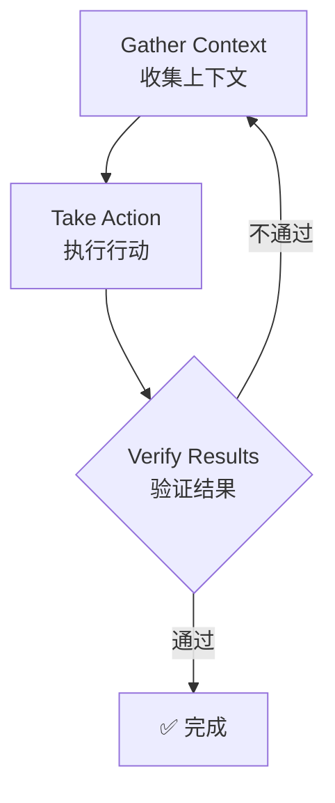

# Claude Code 高级使用技巧

> [!info] 什么是 Claude Code
> Claude Code 是一个终端中的 Agentic 编程助手，通过 Agentic Loop（收集上下文 → 执行行动 → 验证结果）帮助你完成编码任务。

## 一句话解释

Claude Code 是一个终端中的 Agentic 编程助手，通过 Agentic Loop（收集上下文 → 执行行动 → 验证结果）帮助你完成编码任务。核心约束是**上下文窗口填充越快，性能下降越明显**。

## 为什么存在？（解决什么问题）

没有 Claude Code 之前，开发者需要手动完成大量重复性编码任务（写测试、修复 bug、代码重构等），既耗时又容易出错。Claude Code 通过 Agentic Loop 自动化这些流程，让你描述想要什么，它就能自主完成。

> [!warning] 核心痛点
> **Token 消耗快**。一次复杂的调试会话可能消耗大量 Token，导致性能下降或成本飙升。

## 核心原理

### Agentic Loop

Claude 处理任务的三个阶段循环：



> [!note] 类比理解
> 就像一个高级工程师，你先告诉他目标（gather context），他制定计划并执行（take action），完成后自我检查（verify results）。不对就重来。

### 上下文窗口管理

Claude 的上下文窗口 = 对话历史 + 文件内容 + 命令输出 + CLAUDE.md + skills + 系统指令

> [!tip] 类比记忆
> 就像工作台空间。工作台越小，能放的东西越少，放多了就开始混乱。Claude Code 的优化核心就是**保持工作台整洁**。

---

## 关键要点

### 1. Token 优化是关键

| 优化手段 | 效果 |
|----------|------|
| 系统提示精简 | 18k → 10k tokens（节省 41%）|
| mgrep 替代 grep | 节省约 50% tokens |
| 后台进程外执行 | 减少输入 tokens |
| 模型按需选择 | 成本优化 |

**模型选择参考**：

- **Haiku**：重复性任务、明确指令、Worker 角色
- **Sonnet**：90% 的日常编码任务
- **Opus**：首次失败、5+ 文件任务、架构决策、安全关键代码

> [!tip] 价格参考
> Haiku vs Opus = **5 倍**价格差，Sonnet vs Opus = **1.67 倍**。日常任务用 Sonnet 即可。

### 2. 记忆持久化三层体系

| 层级 | 工具 | 何时加载 |
|------|------|----------|
| 每次会话 | [[Claude Code Memory 完整指南\|CLAUDE.md]] | 会话开始 |
| 按需 | Skills | 使用时加载 |
| 自动 | Auto Memory | 自动保存学习 |

### 3. 会话管理命令

| 命令 | 用途 |
|------|------|
| `/clear` | 重置上下文（任务切换时）|
| `/compact` | 手动压缩上下文 |
| `/rewind` | 回溯到之前状态 |
| `/btw` | 快速提问，不进入历史 |

> [!tip] 实践建议
> 在不同任务之间用 `/clear` 重置上下文，保持会话轻量。

### 4. 给 Claude 验证标准

> [!important] 单条最高杠杆的操作
> 提供测试用例、截图、预期输出，让 Claude 自我验证。

```text
❌ "实现邮箱验证"
✅ "实现 validateEmail。测试用例：user@example.com → true, invalid → false,
    user@.com → false。实现后运行测试。"
```

### 5. Subagent 是并行化的关键

- Subagent 有独立上下文，不污染主会话
- Tier 1（易用）：Subagents、Metaprompting
- Tier 2（难用）：Long-running agents、Parallel multi-agent

> [!tip] 何时用 Subagent
> 当你需要研究代码库但不想污染主会话上下文时，使用 Subagent。

详见：[[Claude Code Subagents 完整指南]]

### 6. Git Worktrees 避免冲突

```bash
# 创建隔离的工作树
git worktree add ../project-feature-a feature-a
git worktree add ../project-feature-b feature-b

# 在每个工作树中启动独立 Claude
cd ../project-feature-a && claude
```

---

## 常见误区

### 误区 1：上下文越多越好

> [!danger] 错误
> 认为给越多上下文，Claude 表现越好

**正解**：上下文越多，性能越差。在不同任务之间用 `/clear` 重置上下文。

### 误区 2：所有任务都用 Opus

> [!danger] 错误
> 认为 Opus 最强，所有任务都用它

**正解**：Haiku vs Opus 价格差 5 倍，Sonnet vs Opus 仅 1.67 倍。日常任务用 Sonnet 即可。

### 误区 3：一次性说所有需求

> [!warning] 常见问题
> 试图一次描述所有需求和约束

**正解**：迭代式沟通。Claude 第一次尝试不对，立即纠正，比一次性说清楚效果更好。

### 误区 4：CLAUDE.md 越详细越好

> [!warning] 常见问题
> 把能想到的所有规则都写入 CLAUDE.md

**正解**：只放 Claude 猜不到的内容（自定义命令、特殊规范）。越长越容易被忽略。

### 误区 5：并行终端越多越好

> [!warning] 常见问题
> 认为并行处理越多越高效

**正解**：每次专注于 3-4 个任务。超过这个数量，认知负担超过收益。

---

## 与其他概念的关系

- Claude Code 是 [[Agentic AI]] 的具体实现
- [[Claude Code Memory 完整指南|Context Window 管理]] 是所有优化的基础
- [[Claude Code Subagents 完整指南|Skills]] 是记忆持久化的实战形式
- Subagents 是并行化的技术手段

---

## 代码示例

### CLAUDE.md 示例

```markdown
# Code style
- Use ES modules (import/export), not CommonJS
- Destructure imports when possible

# Workflow
- Typecheck after making series of changes
- Run single tests, not whole suite for performance

# Testing
- Use Vitest for this project
- Run `npm test -- --watch` during development
```

### Skill 定义示例

```markdown
# .claude/skills/fix-issue/SKILL.md
---
name: fix-issue
description: Fix a GitHub issue
disable-model-invocation: true
---
Fix the GitHub issue: $ARGUMENTS.

1. Use `gh issue view` to get details
2. Search codebase for relevant files
3. Implement fix
4. Write and run tests
5. Create PR
```

### 动态系统提示注入

```bash
# 场景化上下文
alias claude-dev='claude --system-prompt "$(cat ~/.claude/contexts/dev.md)"'
alias claude-review='claude --system-prompt "$(cat ~/.claude/contexts/review.md)"'

# 使用
claude-dev
```

### 记忆持久化 Hooks

详见：[[Claude Code Hooks 使用指南]]

```json
{
  "hooks": {
    "PreCompact": [{
      "matcher": "*",
      "hooks": [{
        "type": "command",
        "command": "~/.claude/hooks/pre-compact.sh"
      }]
    }],
    "SessionStart": [{
      "matcher": "*",
      "hooks": [{
        "type": "command",
        "command": "~/.claude/hooks/session-start.sh"
      }]
    }],
    "Stop": [{
      "matcher": "*",
      "hooks": [{
        "type": "command",
        "command": "~/.claude/hooks/session-end.sh"
      }]
    }]
  }
}
```

---

## 一句话总结

> [!quote] 记忆口诀
> **保持上下文整洁，任务要验证，模型按需选，会话常清理。**

---

## 思考题

1. **上下文窗口耗尽前，你会收到什么信号？如何在日常使用中预防？**
2. **什么场景适合用 Subagent 而不是直接在主会话中处理？Subagent 的上下文隔离有什么优缺点？**
3. **Haiku 和 Opus 的价格差是 5 倍，但实际使用中你如何判断任务是否值得用 Opus？有什么具体的判断标准？**
4. **Continuous Learning（Stop Hook 自动提取知识）和手动写 Skills，哪种方式更适合你目前的工作流？为什么？**
5. **探索-计划-实现模式（Explore-Plan-Implement）什么时候值得用，什么时候是过度工程？**

---

## 来源

- [[Anthropic - Claude Code Official Docs]]
- [[@affaan - The Longform Guide to Everything Claude Code]]
- [[YK - 32 Claude Code Tips]]

[R1]: https://code.claude.com/docs/en/how-claude-code-works
[R2]: https://x.com/affaan/status/2014040193557471352
[R3]: https://agenticcoding.substack.com/p/32-claude-code-tips-from-basics-to
