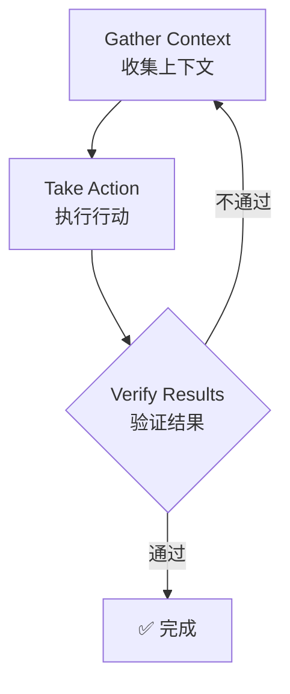
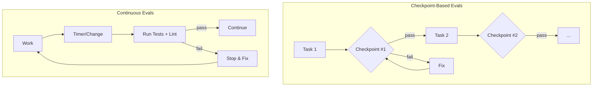
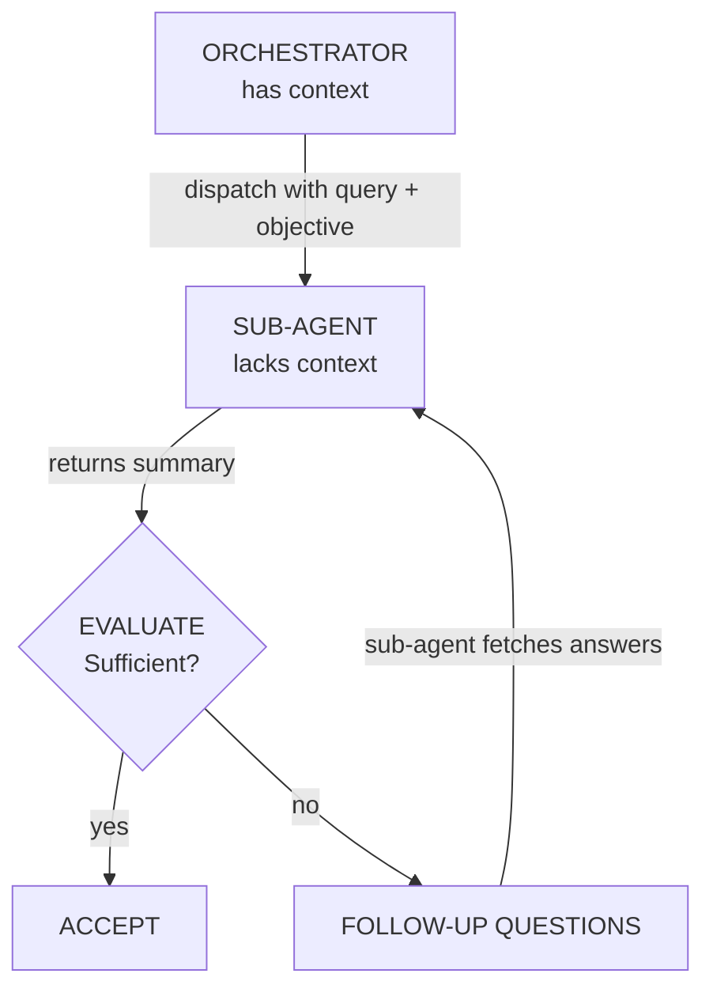

# Claude Code 高级使用技巧

> [!info] 什么是 Claude Code
> Claude Code 是一个终端中的 Agentic 编程助手，通过 Agentic Loop（收集上下文 → 执行行动 → 验证结果）帮助你完成编码任务。

## 一句话解释

Claude Code 是一个终端中的 Agentic 编程助手，通过 Agentic Loop（收集上下文 → 执行行动 → 验证结果）帮助你完成编码任务。核心约束是**上下文窗口填充越快，性能下降越明显**。

## 为什么存在？（解决什么问题）

没有 Claude Code 之前，开发者需要手动完成大量重复性编码任务（写测试、修复 bug、代码重构等），既耗时又容易出错。Claude Code 通过 Agentic Loop 自动化这些流程，让你描述想要什么，它就能自主完成。

> [!warning] 核心痛点
> **Token 消耗快**。一次复杂的调试会话可能消耗大量 Token，导致性能下降或成本飙升。

## 核心原理

### Agentic Loop

Claude 处理任务的三个阶段循环：



> [!note] 类比理解
> 就像一个高级工程师，你先告诉他目标（gather context），他制定计划并执行（take action），完成后自我检查（verify results）。不对就重来。

### 上下文窗口管理

Claude 的上下文窗口 = 对话历史 + 文件内容 + 命令输出 + CLAUDE.md + skills + 系统指令

> [!tip] 类比记忆
> 就像工作台空间。工作台越小，能放的东西越少，放多了就开始混乱。Claude Code 的优化核心就是**保持工作台整洁**。

---

## 关键要点

### 1. Token 优化是关键

#### 核心策略：Subagent 架构

Token 优化的首要手段是合理使用 Subagent 架构，将任务委托给最便宜的够用模型：

| 优化手段 | 效果 |
|----------|------|
| 系统提示精简 | 18k → 10k tokens（节省 41%）|
| mgrep 替代 grep | 节省约 50% tokens |
| 后台进程外执行 | 减少输入 tokens |
| 模型按需选择 | 成本优化 |

在 Agent 定义中显式指定 model 字段：

```yaml
---
name: quick-search
description: Fast file search
tools: Glob, Grep
model: haiku # 便宜且够用
---
```

#### 模型选择参考

| 场景 | 推荐模型 | 理由 |
|------|----------|------|
| 重复性任务、明确指令、Worker 角色 | **Haiku** | 最便宜，够用 |
| 90% 的日常编码任务 | **Sonnet** | 性价比最高 |
| 首次失败、5+ 文件、架构决策、安全关键代码 | **Opus** | 最强推理 |

> [!tip] 价格参考
> Haiku vs Opus = **5 倍**价格差，Sonnet vs Opus = **1.67 倍**。日常任务用 Sonnet 即可。

#### Benchmarking 方法（进阶）

如果你想知道哪种模型最适合你的项目，可以设置 Benchmark：

1. 准备一个有明确定义任务和计划的仓库
2. 在每个 git worktree 中，让 Subagent 使用不同模型
3. 日志记录任务完成情况
4. 对比 diff、运行统一测试套件，量化结果

如果所有模型都通过测试，说明需要增加测试复杂度或边缘用例。

#### 后台进程优化

在 Claude 之外运行后台进程（如用 tmux），避免 Claude 处理完整输出流。终端输出只取摘要或所需部分即可，**输入 Token 才是主要成本来源**（Opus 4.5 输入 $5/百万 tokens vs 输出 $25/百万 tokens）。

#### 模块化代码库

代码库越模块化（每个文件几百行而不是几千行），Claude 越容易一次性正确完成任务。长文件需要多次工具调用才能读完，中途可能丢失信息，且反复读取消耗额外 Token。

```
root/
├── src/
│   ├── modules/
│   │   ├── ordering/      # 自包含模块
│   │   │   ├── domain/
│   │   │   ├── use-cases/
│   │   │   └── tests/
│   │   └── catalog/
│   └── shared/
├── scripts/
└── docs/
```

> [!tip] 清理死代码
> 用 Skills 持续清理死代码和重复代码。代码库越精简，Token 成本越低。

### 2. 记忆持久化三层体系

| 层级 | 工具 | 何时加载 |
|------|------|----------|
| 每次会话 | [[Claude Code Memory 完整指南\|CLAUDE.md]] | 会话开始 |
| 按需 | Skills | 使用时加载 |
| 自动 | Auto Memory / Hooks | 会话生命周期事件 |

#### Session Log 模式

跨会话记忆的最佳实践是用 Skill 或命令在 `.tmp` 文件中保存会话状态。每天创建新文件，避免旧上下文污染新工作：

```
~/.claude/sessions/YYYY-MM-DD-topic.tmp
```

文件中应包含：
- **什么方法可行**（附可验证的证据）
- **尝试过但不奏效的方法**
- **尚未尝试的方法和剩余任务**

新会话开始时提供文件路径即可继续。

#### 持久化 Hooks 配置

利用 Claude Code 的 Hook 系统实现自动记忆持久化：

```json
{
  "hooks": {
    "PreCompact": [{
      "matcher": "*",
      "hooks": [{
        "type": "command",
        "command": "~/.claude/hooks/memory-persistence/pre-compact.sh"
      }]
    }],
    "SessionStart": [{
      "matcher": "*",
      "hooks": [{
        "type": "command",
        "command": "~/.claude/hooks/memory-persistence/session-start.sh"
      }]
    }],
    "Stop": [{
      "matcher": "*",
      "hooks": [{
        "type": "command",
        "command": "~/.claude/hooks/memory-persistence/session-end.sh"
      }]
    }]
  }
}
```

各 Hook 职责：
- **PreCompact**：压缩前保存重要状态、记录压缩时间戳
- **SessionStart**：检查最近会话文件（7 天内），通知可用上下文
- **Stop**：会话结束时创建/更新每日会话文件，记录起止时间

#### Continuous Learning（持续学习）

**Stop Hook 自动提取**：在 Stop Hook 上绑定 evaluate-session 脚本，会话结束时自动分析会话中值得提取的模式（错误解决方案、调试技巧、项目特定模式等），保存为可复用的 Skill。

```bash
# 安装 continuous-learning skill
mkdir -p ~/.claude/skills/continuous-learning
curl -sL https://raw.githubusercontent.com/affaan-m/everything-claude-code/main/skills/continuous-learning/evaluate-session.sh > ~/.claude/skills/continuous-learning/evaluate-session.sh
chmod +x ~/.claude/skills/continuous-learning/evaluate-session.sh
```

> [!info] 为什么用 Stop Hook 而不是 UserPromptSubmit
> UserPromptSubmit 每条消息都触发——开销大、延迟高。Stop 只在会话结束时运行一次——轻量、不中断工作流，且评估完整会话。

**`/learn` 手动提取**：不等到会话结束，刚解决一个非平凡问题时可以运行 `/learn` 命令，立即提取模式并草拟 Skill 文件，确认后保存。

**其他自我改进模式**：
- **[@RLanceMartin](https://x.com/@RLanceMartin) 的会话反思**：每个会话后用反射 Agent 提取"什么做得好、什么失败、你纠正了什么"，更新记忆文件供后续会话加载
- **[@alexhillman](https://x.com/@alexhillman) 的主动建议**：系统每 15 分钟主动建议记忆更新，你批准或拒绝，长期学习你的审批模式

### 3. 会话管理命令

| 命令 | 用途 |
|------|------|
| `/clear` | 重置上下文（任务切换时）|
| `/compact` | 手动压缩上下文 |
| `/rewind` | 回溯到之前状态 |
| `/btw` | 快速提问，不进入历史 |
| `/rename` | 命名当前会话（多会话时区分用途）|

> [!tip] 实践建议
> 在不同任务之间用 `/clear` 重置上下文，保持会话轻量。

#### 战略 Compact（进阶）

自动 Compact 可能在任务中途的任意时间点触发，打乱工作流。禁用自动 Compact，改为在逻辑间隔手动触发：

- **探索完成后、执行开始前** — 清理探索上下文
- **完成一个里程碑后、开始下一个之前**
- 或创建一个 Skill 根据预定条件建议 Compact

**战略 Compact Hook 示例**（绑定到 PreToolUse，在 Edit/Write 操作达阈值时提醒）：

```bash
#!/bin/bash
# Strategic Compact Suggester
# 阈值后建议 /compact

COUNTER_FILE="/tmp/claude-tool-count-$$"
THRESHOLD=${COMPACT_THRESHOLD:-50}

if [ -f "$COUNTER_FILE" ]; then
  count=$(cat "$COUNTER_FILE")
  count=$((count + 1))
  echo "$count" > "$COUNTER_FILE"
else
  echo "1" > "$COUNTER_FILE"
  count=1
fi

if [ "$count" -eq "$THRESHOLD" ]; then
  echo "[StrategicCompact] $THRESHOLD tool calls reached — 考虑 /compact" >&2
fi
```

### 4. Evals 与验证循环

> [!important] 单条最高杠杆的操作
> 提供测试用例、截图、预期输出，让 Claude 自我验证。

```text
❌ "实现邮箱验证"
✅ "实现 validateEmail。测试用例：user@example.com → true, invalid → false,
    user@.com → false。实现后运行测试。"
```

#### Eval 模式类型



- **Checkpoint-Based**：在工作流中设置显式检查点，在每个检查点验证标准，未通过则修复后才继续。适合有清晰阶段的线性工作流
- **Continuous**：每 N 分钟或重大变更后运行完整测试+ lint，立即报告回归问题。适合探索性重构或维护

#### Grader 类型

| 类型 | 优点 | 缺点 |
|------|------|------|
| **Code-Based**（字符串匹配、二进制测试、静态分析） | 快速、便宜、客观 | 对有效变体脆性 |
| **Model-Based**（评分标准、自然语言断言、成对比较） | 灵活、处理细微差别 | 非确定性、更贵 |
| **Human**（专家评审、众包判断、抽样检查） | 黄金标准质量 | 昂贵、慢 |

#### 关键指标

```
pass@k: 至少一次成功         pass^k: 全部必须成功
k=1: 70%  k=3: 91%  k=5: 97%   k=1: 70%  k=3: 34%  k=5: 17%
只需一次成功 → pass@k          需确定一致性 → pass^k
```

#### 构建 Eval Roadmap

1. **尽早开始** — 从真实失败的 20-50 个简单任务开始
2. **用户汇报的失败 → 测试用例**
3. **写 unambiguous 任务** — 两个专家应得出相同结论
4. **平衡问题集** — 测试应发生和不应发生的行为
5. **健壮测试环境** — 每次试验从干净环境开始
6. **评估产出，而非路径**
7. **多个试验后阅读 transcripts**
8. **监控饱和** — 100% 通过率意味着需要加更多测试

### 5. Subagent 是并行化的关键

- Subagent 有独立上下文，不污染主会话
- **关键规则**：每个 Agent 一个清晰输入 → 一个清晰输出，输出成为下一阶段的输入
- 中间产物存入文件（而非仅内存），用 `/clear` 保持上下文新鲜

#### Sub-Agent Context Problem

Subagent 通过返回摘要来节省上下文，但 Orchestrator 拥有 Subagent 缺乏的语义上下文（目的/推理）。Subagent 只知道字面查询，不知道背后的**为什么**。

> [!tip] 传递目标上下文，而非仅查询
> 派遣 Subagent 时，同时提供具体查询和更广泛的目标。帮助 Subagent 优先考虑摘要中应包含的内容。

**解法：迭代检索模式**



Orchestrator 应评估每次 Subagent 返回，如不够就追问（最多 3 轮循环）。

#### Orchestrator 顺序阶段模式

```markdown
Phase 1: RESEARCH   → research-summary.md
Phase 2: PLAN       → plan.md
Phase 3: IMPLEMENT  → code changes
Phase 4: REVIEW     → review-comments.md
Phase 5: VERIFY     → done or loop back
```

#### Agent 抽象层级 Tierlist

| 层级 | 模式 | 说明 |
|------|------|------|
| **Tier 1（易用）** | Subagents | 防止上下文腐烂的直接增益 |
| | Metaprompting | "花 3 分钟提示 20 分钟任务" |
| | 前期多问用户 | Plan 模式中的前期提问 |
| **Tier 2（难用）** | Long-running agents | 需理解任务形状和权衡 |
| | Parallel multi-agent | 仅在高度复杂或可良好分割的任务中有用 |
| | Role-based multi-agent | 模型进化太快，硬编码启发式难以保持 |
| | Computer use agents | 非常早期的范式，需要大量调教 |

> [!tip] 从 Tier 1 开始
> 先掌握 Tier 1 模式，有真正需求后再升级到 Tier 2。

详见：[[Claude Code Subagents 完整指南]]

### 6. Git Worktrees 避免冲突

```bash
# 创建隔离的工作树
git worktree add ../project-feature-a feature-a
git worktree add ../project-feature-b feature-b

# 在每个工作树中启动独立 Claude
cd ../project-feature-a && claude
```

#### Cascade Method（级联模式）

运行多个 Claude Code 实例时，用级联模式组织：

- 新任务在右侧新标签页打开
- 从左到右扫描，从旧到新
- 维护一致的方向流
- **每次专注 3-4 个任务** — 超过这个数量，认知负担超过收益

> [!warning] 不要设置任意终端数目
> 每增加一个终端/实例应出于真实需求。如果能用脚本完成，就用脚本。大多数情况下，2-3 个 Claude 实例就足够了。

#### 多实例最佳实践

- 复用会话的 **Scope 必须明确定义**，尽量减少代码变更的重叠
- 选择**正交的任务**以防止干扰可能
- 推荐模式：主会话做代码变更，分叉会话用于研究和问答
- 用 `/rename` 命名所有会话，以免混淆每个 Git Worktree 的用途

### 7. 项目初始化 Groundwork

#### Two-Instance Kickoff Pattern

启动新项目时，同时开 2 个 Claude 实例：

**Instance 1: Scaffolding Agent**
- 铺设项目脚手架和基础结构
- 创建项目结构，设置配置（CLAUDE.md、rules、agents）
- 建立约定，搭好骨架

**Instance 2: Deep Research Agent**
- 连接服务、网页搜索
- 创建详细 PRD
- 绘制架构 Mermaid 图
- 编译参考资料（含实际文档片段）

#### llms.txt 模式

很多文档站点在 `/llms.txt` 提供 LLM 优化版本文档，可直接喂给 Claude：

```
https://example.com/docs/llms.txt
```

#### 构建可复用模式（Compound Effects）

> "早期花时间构建可复用工作流/模式。构建过程繁琐，但随着模型和 Agent 工具的改进，这产生了惊人的复利效应。" — [@omarsar0](https://x.com/@omarsar0)

**值得投入的领域：** Subagents、Skills、Commands、规划模式、MCP 工具、上下文工程模式

> [!note] 模式的复利
> 这些工作流可迁移到其他 Agent（如 Codex）。投资在模式上 > 投资在特定模型技巧上。模式随模型升级而持续有效。

### 8. MCP 优化策略

#### CLI/Skills 替代 MCP

对 GitHub、Supabase、Vercel 等服务，这些平台已有健壮的 CLI。MCP 是方便但消耗上下文窗口的包装层。

**策略**：将 MCP 暴露的功能打包成 Skill 和 Command，直接用 CLI 操作：

```
/gh-pr   → 包装 gh pr create（替代 GitHub MCP）
/db-query → 直接使用 Supabase CLI（替代 Supabase MCP）
```

> [!info] Lazy Loading 更新
> Claude Code 团队已实现 MCP **Lazy Loading**，MCP 不再在启动时就吃掉上下文窗口。但 Token 消耗问题未同步解决。CLI + Skills 方案仍然是有效的 Token 优化方法，特别适合数据库查询或部署等重型 MCP 操作。

---

## 常见误区

### 误区 1：上下文越多越好

> [!danger] 错误
> 认为给越多上下文，Claude 表现越好

**正解**：上下文越多，性能越差。在不同任务之间用 `/clear` 重置上下文。

### 误区 2：所有任务都用 Opus

> [!danger] 错误
> 认为 Opus 最强，所有任务都用它

**正解**：Haiku vs Opus 价格差 5 倍，Sonnet vs Opus 仅 1.67 倍。日常任务用 Sonnet 即可。

### 误区 3：一次性说所有需求

> [!warning] 常见问题
> 试图一次描述所有需求和约束

**正解**：迭代式沟通。Claude 第一次尝试不对，立即纠正，比一次性说清楚效果更好。

### 误区 4：CLAUDE.md 越详细越好

> [!warning] 常见问题
> 把能想到的所有规则都写入 CLAUDE.md

**正解**：只放 Claude 猜不到的内容（自定义命令、特殊规范）。越长越容易被忽略。

### 误区 5：并行终端越多越好

> [!warning] 常见问题
> 认为并行处理越多越高效

**正解**：每次专注于 3-4 个任务。超过这个数量，认知负担超过收益。

---

## 与其他概念的关系

- Claude Code 是 [[Agentic AI]] 的具体实现
- [[Claude Code Memory 完整指南|Context Window 管理]] 是所有优化的基础
- [[Claude Code Subagents 完整指南|Skills]] 是记忆持久化的实战形式
- Subagents 是并行化的技术手段

---

## 代码示例

### CLAUDE.md 示例

```markdown
# Code style
- Use ES modules (import/export), not CommonJS
- Destructure imports when possible

# Workflow
- Typecheck after making series of changes
- Run single tests, not whole suite for performance

# Testing
- Use Vitest for this project
- Run `npm test -- --watch` during development
```

### Skill 定义示例

```markdown
# .claude/skills/fix-issue/SKILL.md
---
name: fix-issue
description: Fix a GitHub issue
disable-model-invocation: true
---
Fix the GitHub issue: $ARGUMENTS.

1. Use `gh issue view` to get details
2. Search codebase for relevant files
3. Implement fix
4. Write and run tests
5. Create PR
```

### 动态系统提示注入

```bash
# 场景化上下文
alias claude-dev='claude --system-prompt "$(cat ~/.claude/contexts/dev.md)"'
alias claude-review='claude --system-prompt "$(cat ~/.claude/contexts/review.md)"'
alias claude-research='claude --system-prompt "$(cat ~/.claude/contexts/research.md)"'

# 使用
claude-dev
```

> [!info] System Prompt Injection vs @file 引用
> 用 `@memory.md` 或 `.claude/rules/` 时，Claude 通过 Read 工具在对话中读取——作为工具输出进入上下文。用 `--system-prompt` 时，内容注入到实际的系统提示中，在对话开始前就已就位。
>
> 区别在于**指令层级**：系统提示 > 用户消息 > 工具结果。对于严格行为规则、项目特定约束或必须优先处理的上下文——System Prompt Injection 确保被适当加权。

**实用设置**：用 `.claude/rules/` 存放基线项目规则，用 CLI alias 切换场景特定上下文。

```
~/.claude/contexts/
├── dev.md       # 侧重实现
├── review.md    # 侧重代码质量/安全
└── research.md  # 侧重先探索再行动
```

### 记忆持久化 Hooks

详见：[[Claude Code Hooks 使用指南]]

```json
{
  "hooks": {
    "PreCompact": [{
      "matcher": "*",
      "hooks": [{
        "type": "command",
        "command": "~/.claude/hooks/pre-compact.sh"
      }]
    }],
    "SessionStart": [{
      "matcher": "*",
      "hooks": [{
        "type": "command",
        "command": "~/.claude/hooks/session-start.sh"
      }]
    }],
    "Stop": [{
      "matcher": "*",
      "hooks": [{
        "type": "command",
        "command": "~/.claude/hooks/session-end.sh"
      }]
    }]
  }
}
```

---

## 一句话总结

> [!quote] 记忆口诀
> **保持上下文整洁，任务要验证，模型按需选，会话常清理。**

---

## 思考题

1. **上下文窗口耗尽前，你会收到什么信号？如何在日常使用中预防？**
2. **什么场景适合用 Subagent 而不是直接在主会话中处理？Subagent 的上下文隔离有什么优缺点？**
3. **Haiku 和 Opus 的价格差是 5 倍，但实际使用中你如何判断任务是否值得用 Opus？有什么具体的判断标准？**
4. **Continuous Learning（Stop Hook 自动提取知识）和手动写 Skills，哪种方式更适合你目前的工作流？为什么？**
5. **探索-计划-实现模式（Explore-Plan-Implement）什么时候值得用，什么时候是过度工程？**
6. **Checkpoint-Based Evals 和 Continuous Evals 分别适合什么类型的项目？你的项目适合哪一种？**
7. **如果 MCP 已经支持 Lazy Loading，用 CLI/Skills 替代 MCP 还有必要吗？Token 优化和便利性如何权衡？**

---

## 来源

- [[Anthropic - Claude Code Official Docs]]
- [[@affaan - The Longform Guide to Everything Claude Code]]
- [[YK - 32 Claude Code Tips]]

### 参考链接

- [Claude Code Best Practices](https://code.claude.com/docs/en/best-practices)
- [@affaan - The Longform Guide](https://x.com/affaan/status/2014040193557471352)
- [YK - 32 Claude Code Tips](https://agenticcoding.substack.com/p/32-claude-code-tips-from-basics-to)
- [Anthropic: Demystifying Evals for AI Agents](https://www.anthropic.com/engineering/demystifying-evals-for-ai-agents)
- [everything-claude-code (GitHub)](https://github.com/affaan-m/everything-claude-code)
- [mgrep - Mixedbread AI](https://github.com/mixedbread-ai/mgrep)

### 参考人物/资源

- [@affaan](https://x.com/affaan) — Claude Code 长篇指南原作者
- [@bcherny](https://x.com/@bcherny) — Claude Code 创建者
- [@omarsar0](https://x.com/@omarsar0) — 可复用模式复利效应
- [@menhguin](https://x.com/@menhguin) — Agent 抽象层级 Tierlist
- [@RLanceMartin](https://x.com/@RLanceMartin) — 会话反思模式
- [@alexhillman](https://x.com/@alexhillman) — 自我改进记忆系统

[R1]: https://code.claude.com/docs/en/how-claude-code-works
[R2]: https://x.com/affaan/status/2014040193557471352
[R3]: https://agenticcoding.substack.com/p/32-claude-code-tips-from-basics-to
