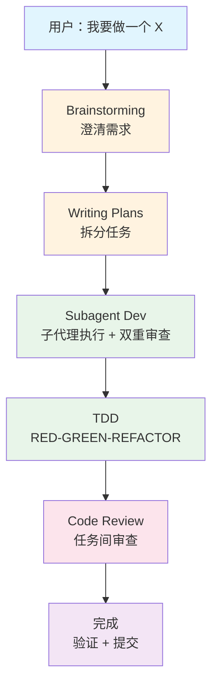
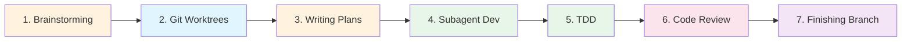
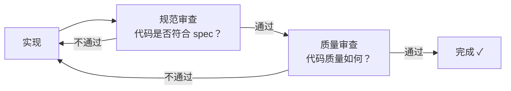
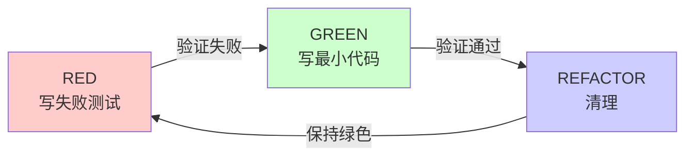

# Superpowers

> [!info] 项目信息
> **作者**：Jesse Vincent (obra) · **组织**：Prime Radiant
> **License**：MIT · **仓库**：[obra/superpowers](https://github.com/obra/superpowers)

## 一句话解释

Superpowers 是一套面向 AI 编码代理的完整软件开发方法论，通过自动触发的可组合 Skills 库，让 AI 代理在写代码之前先澄清需求、设计方案、制定计划，再用子代理驱动的 TDD 流程执行实现。

## 为什么存在？

> [!question] 核心问题
> 当你告诉 AI 代理"帮我做一个功能"时，它会直接跳进写代码。没有需求澄清、没有设计审查、没有实现计划。

### 没有 Superpowers 之前

- 写出来的东西不是你想要的
- 代码质量参差不齐
- 没有测试，出了 bug 靠猜
- 代理在复杂任务中迷失方向

### 有了 Superpowers 之后

代理在收到指令后**自动触发**一套完整的开发流程：



> [!tip] 核心转变
> 从"代理直接写代码"变为"**代理按方法论开发软件**"。

## 核心原理

### 1. Skill 自动触发系统

Superpowers 的核心是一个 **Skill 库**——每个 Skill 是一个 Markdown 文件（`SKILL.md`），包含：

- **YAML Frontmatter**：`name` 和 `description`（触发条件）
- **正文**：操作流程、检查清单、红旗表、反合理化机制

```yaml
---
name: brainstorming
description: "You MUST use this before any creative work..."
---
```

> [!warning] 触发规则
> 代理在每次收到消息时，检查是否有 Skill 适用。**即使只有 1% 的可能性，也必须调用。**
> 这不是可选的。不能合理化跳过。

**指令优先级**：

```
用户显式指令（CLAUDE.md） > Superpowers Skills > 默认系统提示
```

### 2. 七步核心工作流



| 步骤 | Skill | 做什么 | 为什么重要 |
|------|-------|--------|-----------|
| 1 | `brainstorming` | Socratic 对话澄清需求 | 防止写错东西 |
| 2 | `using-git-worktrees` | 创建隔离工作区 | 安全实验不影响主线 |
| 3 | `writing-plans` | 拆分为 2-5 分钟任务 | 让执行可追踪 |
| 4 | `subagent-driven-dev` | 每任务新子代理 + 双重审查 | 保持代码质量 |
| 5 | `test-driven-development` | RED-GREEN-REFACTOR | 确保代码正确 |
| 6 | `requesting-code-review` | 任务间审查 | 及时发现问题 |
| 7 | `finishing-branch` | 验证/合并/PR | 安全交付 |

### 3. 反合理化机制

> [!abstract] Superpowers 最独特的设计
> 每个纪律性 Skill 都包含防止代理"找借口跳过流程"的机制。

| 组件 | 作用 |
|------|------|
| **铁律**（Iron Law） | 不可违反的核心规则 |
| **红旗表**（Red Flags） | 代理发现自己在想什么时必须停下来 |
| **反合理化表** | 代理可能找的借口和对应的现实 |
| **"精神 vs 字面"封堵** | "违反字面规则就是违反精神规则" |

> [!example] TDD 的铁律
> ```
> 没有失败测试就不能写生产代码
> 先写了代码再写测试？删除。重来。
> 没有例外：不能保留为"参考"，不能"改编"
> 删除就是删除。
> ```

## 关键要点

### 要点 1：Brainstorming 是强制的

> [!danger] HARD-GATE
> 设计未批准前，**禁止**写代码、搭建项目、做任何实施动作。

- 一次只问一个问题，优先选择题
- 提出 2-3 种方案并给出推荐
- 分段展示设计，每段获得批准
- **YAGNI 无情砍**：删除不必要的功能

> [!caution] Anti-Pattern
> "这个太简单不需要设计" → **错。** 所有项目都要走这个流程。"简单"项目是未检验假设造成最多返工的地方。

### 要点 2：Writing Plans 零占位符

计划的粒度是 **2-5 分钟**，每个步骤包含完整代码、精确文件路径、验证命令。

> [!fail] 计划失败的标志
> - "TBD"、"TODO"、"稍后实现"
> - "添加适当的错误处理"
> - "类似 Task N"（执行者可能乱序阅读）
> - 描述做什么但没展示怎么做

### 要点 3：Subagent 双重审查

每完成一个任务，经历两轮审查：



- 每个任务用**新子代理**（防止上下文污染）
- 控制器为每个子代理**精确构造上下文**（不继承历史）
- **连续执行**：不在任务间停下来问"要继续吗？"

### 要点 4：TDD 是铁律



> [!quote] 核心区别
> - 后写测试 = "这代码**做**什么？"（验证已知）
> - 先写测试 = "这代码**应该**做什么？"（发现未知）

### 要点 5：3 次失败规则

> [!warning] Systematic Debugging
> ```
> 修复次数 < 3 → 回到阶段 1，用新信息重新分析
> 修复次数 ≥ 3 → 停止！质疑架构本身
> ```
> 3 次修复失败说明不是 bug 的问题，是**架构的问题**。

### 要点 6：Writing Skills = TDD 应用于过程文档

| TDD 概念 | Skill 创建 |
|----------|-----------|
| 测试用例 | 压力场景 + 子代理 |
| 测试失败 (RED) | 代理在没有 Skill 时违反规则 |
| 测试通过 (GREEN) | 代理在有 Skill 时遵守规则 |
| 重构 | 发现新的合理化借口 → 堵住 |

> [!tip] CSO（Claude Search Optimization）
> Description 只写触发条件（"Use when..."），**不写流程**。
> 因为测试发现，description 总结流程会导致代理跳过完整 Skill 内容。

## 常见误区

| 误区 | 正解 |
|------|------|
| "Superpowers 只是提示词模板" | 它是结构化的方法论 + 自动触发系统 + 反合理化机制 |
| "Skills 可以手动选择性使用" | 代理看到 1% 适用性就必须调用，不可跳过 |
| "Brainstorming 对简单项目是浪费时间" | "简单"项目是未检验假设造成最多返工的地方 |
| "后写测试和先写测试效果一样" | 后写 = "做什么" 先写 = "应该做什么" |
| "TDD 太教条，应该灵活" | TDD 才是务实的：更快发现 bug、防止回归、支持重构 |
| "3 次修复失败再试一次" | 3 次 = 架构问题。必须质疑根本设计 |

## 与其他概念的关系

- **Claude Code** — Superpowers 最早/最完整的平台实现，通过 Plugin 市场安装
- **TDD** — Superpowers 的核心实践之一，贯穿编码和 Skill 编写
- **Sub-Agent** — Superpowers 的执行引擎，每任务新子代理 + 双重审查
- **Prompt Engineering** — Skill 本质是结构化的 prompt，但有触发机制和反合理化设计
- **YAGNI** — Superpowers 的设计原则之一：不写当前不需要的功能

## 14 个 Skills 速查

### 测试

| Skill | 触发时机 | 核心规则 |
|-------|---------|---------|
| `test-driven-development` | 实现任何功能/修 bug 前 | 没有失败测试就不能写生产代码 |

### 调试

| Skill | 触发时机 | 核心规则 |
|-------|---------|---------|
| `systematic-debugging` | 遇到任何 bug/测试失败/异常行为 | 没有根因调查就不能尝试修复 |
| `verification-before-completion` | 完成任务前 | 验证真的修好了 |

### 协作

| Skill | 触发时机 | 核心规则 |
|-------|---------|---------|
| `brainstorming` | 任何创造性工作前 | 设计未批准前禁止写代码 |
| `writing-plans` | 有 spec/需求后的多步任务 | 2-5 分钟粒度，零占位符 |
| `executing-plans` | 有实现计划时（并行会话） | 分批执行 + 检查点 |
| `subagent-driven-dev` | 有实现计划时（同会话） | 每任务新子代理 + 双重审查 |
| `dispatching-parallel-agents` | 可并行的任务 | 并发子代理工作流 |
| `requesting-code-review` | 任务间 | 审查清单 |
| `receiving-code-review` | 收到审查反馈时 | 响应反馈 |
| `using-git-worktrees` | 设计批准后 | 创建隔离工作区 |
| `finishing-branch` | 所有任务完成后 | 验证测试/合并/PR |

### 元技能

| Skill | 触发时机 | 核心规则 |
|-------|---------|---------|
| `writing-skills` | 创建/编辑 Skill 时 | 用 TDD 方法编写 Skills |
| `using-superpowers` | 会话开始时 | 技能发现和调用入口 |

## 一句话总结

> [!summary]
> **Superpowers 让 AI 代理从"直接写代码的工具"变为"按方法论开发软件的工程师"——通过自动触发的 Skills、反合理化机制和 TDD 铁律确保质量。**

## 思考题

1. Superpowers 的"反合理化机制"为什么有效？它利用了 AI 代理的什么特性？
2. 如果你要为一个全新的 AI 编码代理平台设计类似的 Skills 系统，你会保留哪些核心设计，修改哪些？
3. TDD 的"铁律"在实际项目中真的可行吗？什么时候你可能会选择"破例"？Superpowers 对此有什么回应？
