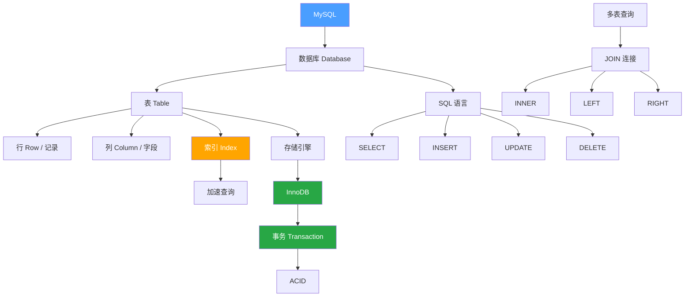

---
tags:
  - mysql
  - 数据库
  - 后端
created: 2026-02-28
updated: 2026-02-28
---

# MySQL 核心概念

> [!info] 版本信息（2026）
> - **MySQL 8.4 LTS**：当前推荐的生产版本（支持至 2030+）
> - **MySQL 9.0 Innovation**：创新版，支持 AI/VECTOR 类型
> - **MySQL 8.0**：将于 2026年4月 停止支持

> [!info] 概述
> **一句话定义**：MySQL 是一个关系型数据库管理系统（RDBMS），用于存储、管理和查询结构化数据。
> **通俗比喻**：MySQL 就像一个**超级电子表格系统**，一个数据库 = 一个 Excel 文件，一张表 = 一个 Sheet，SQL = 操作指令。

## 核心概念速览

| 概念 | 一句话 | 比喻 |
|------|--------|------|
| 关系型数据库 | 表格存储 + 表间关系 | Excel 多个 Sheet 关联 |
| SQL | 操作数据库的语言 | Excel 的公式和宏 |
| 索引 | 查询加速器 | 书的目录 |
| 事务 | 要么全成功，要么全失败 | 银行转账 |
| 存储引擎 | 底层数据处理方式 | 汽车的发动机 |
| 连接查询 | 把多张表关联起来查 | VLOOKUP 函数 |

---

## 1. 关系型数据库（Relational Database）

### 是什么

数据以**表格（Table）**形式存储，表与表之间通过**关系**（外键）连接。

### 为什么需要"关系"

> [!example] 电商系统示例

**❌ 不用关系（所有数据塞一张表）**：

| 订单ID | 用户名 | 用户地址 | 商品名 | 商品价格 |
|--------|--------|----------|--------|----------|
| 1 | 张三 | 北京 | 手机 | 5000 |
| 2 | 张三 | 北京 | 电脑 | 8000 |

→ 用户信息**重复存储**，浪费空间且难以维护

**✅ 用关系（拆分成多张表）**：

用户表 `users`：
| ID | 名字 | 地址 |
|----|------|------|
| 1 | 张三 | 北京 |

订单表 `orders`：
| ID | 用户ID | 商品ID |
|----|--------|--------|
| 1 | 1 | 1 |
| 2 | 1 | 2 |

商品表 `products`：
| ID | 名称 | 价格 |
|----|------|------|
| 1 | 手机 | 5000 |
| 2 | 电脑 | 8000 |

### 好处

- **减少重复**：每条信息只存一次
- **保持一致性**：修改一处，处处生效
- **方便维护**：结构清晰，易于扩展

---

## 2. SQL（Structured Query Language）

### 是什么

和数据库沟通的语言，用于增删改查数据。

### 四大操作（CRUD）

| 操作 | SQL 关键字 | 作用 | 示例 |
|------|-----------|------|------|
| **C**reate | `INSERT` | 插入数据 | `INSERT INTO users VALUES (1, '张三')` |
| **R**ead | `SELECT` | 查询数据 | `SELECT * FROM users WHERE id = 1` |
| **U**pdate | `UPDATE` | 更新数据 | `UPDATE users SET name = '李四' WHERE id = 1` |
| **D**elete | `DELETE` | 删除数据 | `DELETE FROM users WHERE id = 1` |

> [!tip] 记忆技巧
> CRUD = Create, Read, Update, Delete，这是所有数据系统的核心操作。

---

## 3. 索引（Index）

### 是什么

索引是一种**数据结构**，用于加速查询。

> [!tip] 比喻
> 索引就像书的**目录**。
> - 没有目录 → 从第一页翻到最后一页（全表扫描）
> - 有了目录 → 直接定位到页码（索引查找）

### 常见索引类型

| 类型 | 说明 | 示例 |
|------|------|------|
| **主键索引** | 自动创建，唯一标识每一行 | `id` |
| **普通索引** | 加速查询，值可重复 | `name` |
| **唯一索引** | 值不能重复 | `email`, `phone` |
| **联合索引** | 多列组合索引 | `(city, age)` |

### 权衡

> [!warning] 索引的代价
> - ✅ **查询变快**：读取性能大幅提升
> - ❌ **写入变慢**：每次插入/更新都要维护索引
> - ❌ **占用空间**：索引需要额外存储

### 何时建索引

- 经常出现在 `WHERE` 条件中的列
- 经常用于 `JOIN` 的列
- 经常用于 `ORDER BY` 的列

---

## 4. 事务（Transaction）

### 是什么

事务是把一组操作**打包**，要么全部成功，要么全部失败。

> [!example] 银行转账示例
> ```
> 转账 100 元：A → B
> 1. A 账户减 100 元
> 2. B 账户加 100 元
> ```
>
> 如果第 2 步失败了：
> - **没有事务**：A 少了钱，B 没收到 → 数据不一致！
> - **有事务**：自动回滚，A 的钱恢复 → 数据一致 ✓

### ACID 四大特性

| 特性 | 英文 | 含义 | 通俗解释 |
|------|------|------|----------|
| **原子性** | Atomicity | 不可分割 | 要么全成功，要么全失败 |
| **一致性** | Consistency | 状态合法 | 事务前后数据符合规则 |
| **隔离性** | Isolation | 互不干扰 | 多个事务同时执行不冲突 |
| **持久性** | Durability | 永久保存 | 提交后即使断电也不丢失 |

### 事务控制语句

```sql
START TRANSACTION;  -- 开始事务
-- 执行多条 SQL...
COMMIT;             -- 提交（保存更改）
-- 或
ROLLBACK;           -- 回滚（撤销更改）
```

---

## 5. 存储引擎（Storage Engine）

### 是什么

存储引擎是 MySQL 处理数据的**底层实现**，决定了数据如何存储、索引如何工作、事务是否支持等。

### 常见引擎对比

| 特性 | InnoDB | MyISAM |
|------|--------|--------|
| 事务支持 | ✅ 支持 | ❌ 不支持 |
| 外键 | ✅ 支持 | ❌ 不支持 |
| 崩溃恢复 | ✅ 自动恢复 | ❌ 可能丢数据 |
| 行级锁 | ✅ 支持 | ❌ 只有表锁 |
| 全文索引 | ✅ 5.6+ 支持 | ✅ 支持 |

> [!success] 结论
> **绝大多数情况用 InnoDB**，它是 MySQL 5.5+ 的默认引擎。

---

## 7. 最新版本特性（2026）

### MySQL 8.4 LTS 变化

**安全增强**：
- `mysql_native_password` 默认禁用，强制使用 `caching_sha2_password`
- 新增 WebAuthn 认证插件（企业版）

**InnoDB 默认参数调整**（提升性能）：
```sql
-- 以下参数默认值已变更
innodb_io_capacity: 200 → 1000
innodb_flush_method: fsync → O_DIRECT (Linux)
innodb_adaptive_hash_index: ON → OFF
innodb_log_buffer_size: 16MB → 64MB
```

**组复制（MGR）增强**：
- 默认一致性级别：EVENTUAL → BEFORE_ON_PRIMARY_FAILOVER
- 支持预判式垃圾回收

### MySQL 9.0 Innovation 特性

**VECTOR 数据类型**（AI/ML 支持）：
```sql
-- 创建向量列（最多 16383 个元素）
CREATE TABLE embeddings (
  id INT PRIMARY KEY,
  embedding VECTOR(512)  -- 512维向量
);

-- 向量操作
SELECT STRING_TO_VECTOR('[0.1, 0.2, 0.3]');
SELECT VECTOR_DIM(embedding) FROM embeddings;
```

**完全移除 mysql_native_password**：
- SHA-1 彻底弃用，强制使用 SHA-256

**扩展 Prepared Statements**：
- 现在支持 DDL 操作（CREATE EVENT、ALTER EVENT 等）

**新特性**：
- `EXPLAIN FOR SCHEMA` - schema 级别执行计划
- `TABLESAMPLE` 子句 - 采样查询
- JavaScript 存储过程（企业版）

> [!tip] 版本选择建议
> | 场景 | 推荐版本 |
> |------|----------|
> | 新项目生产环境 | MySQL 8.4 LTS |
> | AI/ML 应用 | MySQL 9.0 Innovation |
> | 遗留系统 | MySQL 8.0（直至 2026年4月） |

---

## 6. 连接查询（JOIN）

### 是什么

当数据分散在多张表时，需要通过**连接**把它们关联起来查询。

### 连接类型

| 类型 | 说明 | 结果 |
|------|------|------|
| `INNER JOIN` | 内连接 | 只返回两表都匹配的行 |
| `LEFT JOIN` | 左连接 | 返回左表所有行 + 右表匹配行 |
| `RIGHT JOIN` | 右连接 | 返回右表所有行 + 左表匹配行 |

### 示例

```sql
-- 用户表 users          订单表 orders
-- | id | name |        | id | user_id | amount |
-- |----|------|        |----|---------|--------|
-- | 1  | 张三 |        | 1  | 1       | 100    |
-- | 2  | 李四 |        | 2  | 1       | 200    |

SELECT users.name, orders.amount
FROM users
INNER JOIN orders ON users.id = orders.user_id;

-- 结果：
-- | name | amount |
-- |------|--------|
-- | 张三 | 100    |
-- | 张三 | 200    |
```

---

## 概念关系图



---

## 常见问题

### 为什么要用数据库而不是文件存储？

> [!note]
> - **并发控制**：多用户同时访问
> - **数据一致性**：事务保证
> - **查询效率**：索引加速
> - **安全性**：权限管理

### 主键和唯一索引的区别？

| 区别 | 主键 | 唯一索引 |
|------|------|----------|
| 数量 | 每表只能有一个 | 可以有多个 |
| 空值 | 不允许 NULL | 允许 NULL（但只能一个） |
| 用途 | 标识唯一行 | 保证列值唯一 |

### 什么时候用事务？

> [!tip]
> 当一个业务操作涉及**多条 SQL**，且需要保证**数据一致性**时使用。
> - 银行转账
> - 订单创建 + 库存扣减
> - 用户注册 + 初始化数据

---

## 个人笔记

> [!personal] 💡 我的理解与感悟
> （此处记录个人学习心得）

---

## 相关文档

- [[数据库设计原则]]
- [[SQL优化技巧]]

---

## 参考资料

### 官方文档
- [MySQL 8.4 官方文档](https://dev.mysql.com/doc/refman/8.4/en/)
- [MySQL 9.0 官方文档](https://dev.mysql.com/doc/refman/9.0/en/)
- [MySQL 8.0 官方文档](https://dev.mysql.com/doc/refman/8.0/en/)

### 学习资源
- [MySQL 教程 - 菜鸟教程](https://www.runoob.com/mysql/mysql-tutorial.html)
- [MySQL 8.4 LTS 发布说明](https://dev.mysql.com/doc/relnotes/mysql/8.4/en/)
- [MySQL 9.0 Innovation 发布说明](https://dev.mysql.com/doc/relnotes/mysql/9.0/en/)
