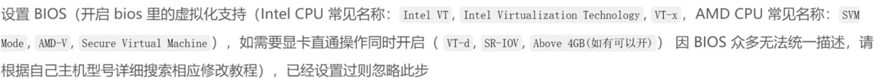

---
tags:
  - pve
---


# 1.下载PVE系统及写盘软件
## 1.1 下载pve镜像
```http
https://www.proxmox.com/en/downloads
```
下载好镜像
## 1.2 下载写盘工具
我这里使用的是ventoy，这里可以看[写盘工具](写盘工具.md)的内容进行选择，因为我们需要用用到[[WinPE]]进行写盘。
# 2. 下载相应的WinPE
## 2.2 那 PVE 安装时为什么“需要”WinPE？

严格说一句实话：

> ❗ **PVE 官方安装器「不需要」WinPE**  
> ✅ **但现实中「经常需要」**

原因是：

### 2.2.1 PVE 安装器特点

>- 是 Linux 安装器
>- 对磁盘“历史遗留问题”很敏感
>- 不像 Windows 那么“能忍”

所以当出现👇这些情况时：

>- PVE 安装界面 **看不到硬盘**
>- 选择硬盘后报错
>- ZFS / LVM 创建失败
>- 装完无法启动


👉 **99% 的老玩家第一反应：进 WinPE，清盘**
我这里选择的是==**FirPE**== 。你可以在下面链接进行下载。

```http
https://www.firpe.cn
```
> [!warning]

> ⚠️我们这里需要的是==**iso**==格式的文件。

#  3.进入BIOS系统
我们一直按==delete==、==F10==等按键进入BIOS系统。我们把u盘启动改成最高优先级

然后我们重启就可以进入ventoy页面，先选择FirPE对磁盘进行相应的格式化和分区。

# 1.进入配置pve
我们进入后配置重要的是配置这里的网络信息。
如果配置错误或我们把主机放到了别的网段，看[[修改PVE的网络信息]]的教程进行修改。
