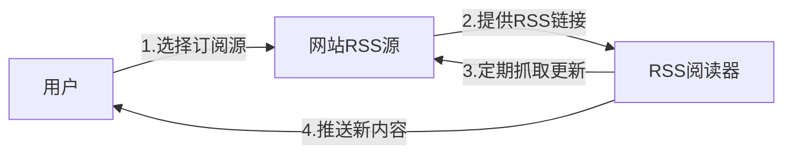

# RSS 使用指南

> [!info] 概述
> **一句话定义**：RSS（Really Simple Syndication）是一种基于 XML 的内容订阅协议，让用户可以"订阅"网站更新，就像订阅报纸一样，内容会主动送到你面前。
>
> **通俗比喻**：想象 RSS 就像是你的"私人报刊配送员"——你告诉它你想要哪些"报纸"（网站），它每天定时把最新的"报纸"送到你家（RSS阅读器），你不需要一个个去报摊（网站）查找。

## 核心概念

### 是什么

**RSS** 的全称是 **Really Simple Syndication**（真正简单的聚合），是一种 Web 内容同步标准。

**技术定义**：
- RSS 是 XML 的一种具体应用形态
- 基于 XML 1.0 规范
- 最新版本为 RSS 2.0.11（2009年发布）
- 使用固定结构：`<rss>` → `<channel>` → `<item>`

### 为什么需要

| 问题 | 传统方式 | RSS 方式 |
|------|----------|----------|
| 信息获取 | 逐个访问网站，耗时 | 统一聚合，自动更新 |
| 算法干扰 | 推荐算法决定看什么 | 完全自主选择订阅源 |
| 内容遗漏 | 容易错过更新 | 实时推送所有更新 |
| 广告干扰 | 页面充满广告和弹窗 | 纯净内容，无广告 |

### 通俗理解

**🎯 比喻**：RSS 就像"订阅报刊"

```
传统方式（没报纸卖的时候）：
每天早上跑遍全城报摊 → 查看有没有新报纸 → 买回来 → 阅读

RSS 方式（有订阅服务）：
订阅报刊 → 配送员每天自动送到 → 直接阅读
```

**📦 示例**：RSS 订阅流程



## 技术细节

### 1. RSS 文档结构

> [!info] 来源
> - [RSS 2.0 官方规范](https://www.rssboard.org/rss-specification)
> - [RSS 参考手册](https://m.blog.csdn.net/lly202406/article/details/153751987) - CSDN

**RSS 2.0 基本结构**：
```xml
<?xml version="1.0" encoding="UTF-8"?>
<rss version="2.0">
  <channel>
    <!-- 频道级别元素（必需） -->
    <title>网站名称</title>
    <link>https://example.com/</link>
    <description>网站描述</description>

    <!-- 频道级别元素（可选） -->
    <language>zh-cn</language>
    <pubDate>Mon, 06 Mar 2026 10:00:00 GMT</pubDate>
    <lastBuildDate>Mon, 06 Mar 2026 10:00:00 GMT</lastBuildDate>

    <!-- 文章条目 -->
    <item>
      <title>文章标题</title>
      <link>https://example.com/article1</link>
      <description>文章摘要</description>
      <pubDate>Mon, 06 Mar 2026 09:00:00 GMT</pubDate>
      <guid>https://example.com/article1</guid>
    </item>
  </channel>
</rss>
```

### 2. 必需元素与可选元素

**Channel 级别必需元素**：
| 元素 | 说明 | 示例 |
|------|------|------|
| `title` | 频道名称 | `技术博客` |
| `link` | 频道对应的网站 URL | `https://blog.example.com` |
| `description` | 频道描述 | `分享技术文章和教程` |

**Item 级别常用元素**：
| 元素 | 说明 | 是否必需 |
|------|------|----------|
| `title` | 文章标题 | 与 description 二选一 |
| `link` | 文章链接 | 可选 |
| `description` | 文章摘要 | 与 title 二选一 |
| `pubDate` | 发布时间 | 可选 |
| `guid` | 全局唯一标识符 | 可选（推荐） |
| `category` | 分类标签 | 可选 |
| `author` | 作者邮箱 | 可选 |

### 3. RSS 版本对比

> [!info] 来源
> - [RSS协议版本差异](https://m.php.cn/faq/1504050.html)
> - [RSS和Atom的区别](https://m.php.cn/faq/1815362.html)

| 版本 | 发布时间 | 特点 | 应用情况 |
|------|----------|------|----------|
| **RSS 0.91/0.92** | 2000-2001 | 结构简单，元素有限 | 已淘汰 |
| **RSS 2.0** | 2002 | 简洁易用，扩展性强 | **最广泛使用** |
| **RSS 1.0** | 2000 | 基于 RDF，语义化 | 少量使用 |
| **Atom 1.0** | 2005 | IETF 标准，规范严谨 | 现代平台常用 |

**RSS vs Atom 核心区别**：
```yaml
RSS:
  - 优点: 简单、广泛支持、历史久
  - 缺点: 版本混乱、规范不严谨
  - 适用: 个人博客、简单站点

Atom:
  - 优点: IETF标准、规范严谨、支持国际化
  - 缺点: 相对复杂
  - 适用: 企业平台、现代应用
```

## 如何使用 RSS

### 1. 选择 RSS 阅读器

> [!info] 来源
> - [RSS 阅读器全面解析](https://m.blog.csdn.net/csbysj2020/article/details/156773316) - CSDN
> - [Feedly 使用指南](https://m.php.cn/faq/1743555.html)

**主流 RSS 阅读器对比**：

| 阅读器 | 平台 | 特点 | 价格 |
|--------|------|------|------|
| **Feedly** | Web/全平台 | 界面简洁，多端同步 | 免费+付费 |
| **Inoreader** | Web/全平台 | 功能强大，支持全文抓取 | 免费+付费 |
| **NetNewsWire** | macOS/iOS | 开源免费，原生体验 | 完全免费 |
| **FreshRSS** | 自托管 | 开源，数据完全掌控 | 免费 |
| **Fluent Reader** | 桌面多平台 | 现代化界面，开源 | 免费 |

**推荐方案**：
- **新手入门**：Feedly（网页版，注册即用）
- **苹果用户**：NetNewsWire（免费、流畅）
- **数据掌控**：FreshRSS（自托管部署）
- **Windows 用户**：Fluent Reader

### 2. 获取 RSS 订阅源

**方法一：网站原生 RSS**

1. 查找网站上的 **RSS 图标**（📶 或 📢）
2. 常见位置：
   - 网页底部
   - 导航栏
   - 侧边栏
3. URL 特征：
   ```
   https://example.com/rss
   https://example.com/feed
   https://example.com/rss.xml
   ```

**方法二：使用 RSSHub 生成**

> [!info] 来源
> - [RSSHub 官方文档](https://docs.rsshub.app/)
> - [RSSHub 实战教程](https://m.blog.csdn.net/rnn9storyteller/article/details/155008473) - CSDN

**RSSHub** 是开源的 RSS 生成器，可以为不提供原生 RSS 的网站生成订阅源。

**使用方法**：
```
公共实例：https://rsshub.app
路由格式：https://rsshub.app/{路由路径}

示例：
# B站UP主动态
https://rsshub.app/bilibili/user/dynamic/{UID}

# 微博热搜
https://rsshub.app/weibo/search/hot

# 知乎热榜
https://rsshub.app/zhihu/hotlist

# 微信公众号（需认证）
https://rsshub.app/wechat/mp/{公众号ID}
```

**常用 RSSHub 路由**：

| 目标 | 路由示例 |
|------|----------|
| B站UP主 | `/bilibili/user/dynamic/{UID}` |
| 微博用户 | `/weibo/user/{uid}` |
| 知乎用户 | `/zhihu/people/activities/{id}` |
| Twitter | `/twitter/user/{id}` |
| YouTube | `/youtube/user/{id}` |
| 公众号 | `/wechat/mp/account/{biz}` |

### 3. 添加订阅到阅读器

**以 Feedly 为例**：


**步骤**：
1. 复制 RSS 链接
2. 打开阅读器
3. 选择"添加订阅"或"Subscribe"
4. 粘贴 RSS 链接
5. 确认订阅

### 4. 管理订阅源

> [!info] 来源
> - [RSS订阅源清单整理](https://juejin.cn/post/7596993862534316032) - 掘金

**最佳实践**：
- **分类管理**：按主题创建文件夹（技术、新闻、娱乐）
- **定期清理**：取消长期不更新的源
- **避免信息过载**：订阅源数量建议 50-100 个
- **使用过滤规则**：过滤不感兴趣的内容

**推荐分类结构**：
```
📁 技术开发
  ├── 阮一峰的网络日志
  ├── 酷壳 - CoolShell
  └── 少数派

📁 行业资讯
  ├── 36氪
  ├── 虎嗅网
  └── 晚点LatePost

📁 个人成长
  ├── 机器之心
  ├── 知乎周刊
  └── RSSHub 社区
```

### 5. 自建 RSS 服务

> [!info] 来源
> - [手把手教你用 Vercel 部署 RSSHub](https://developer.aliyun.com/article/1703684) - 阿里云
> - [我的 RSS 自建实验](https://juejin.cn/post/7569044107392008227) - 掘金

**方案一：使用 RSSHub 公共实例**
```bash
# 直接使用（有限流）
https://rsshub.app/{路由}
```

**方案二：自建 RSSHub（推荐）**

**Docker 部署**：
```bash
docker run -d \
  --name rsshub \
  -p 1200:1200 \
  diygod/rsshub:latest
```

**Docker Compose 部署**：
```yaml
version: '3'
services:
  rsshub:
    image: diygod/rsshub:latest
    container_name: rsshub
    ports:
      - "1200:1200"
    environment:
      - NODE_ENV=production
      - CACHE_TYPE=redis
      - REDIS_URL=redis://redis:6379
    depends_on:
      - redis

  redis:
    image: redis:alpine
    container_name: redis
```

**Vercel 部署（免费）**：
1. Fork [RSSHub 仓库](https://github.com/DIYgod/RSSHub)
2. 注册 Vercel 账号
3. 导入项目
4. 一键部署

## 与其他概念的关系

| 概念 | 关系 |
|------|------|
| [[N8N定时抓取热点资讯指南]] | RSS 是 N8N 自动化抓取资讯的主要数据源 |
| [[Agent智能体]] | RSS 可作为 Agent 的信息输入源 |
| [[RAG技术入门指南]] | RSS 内容可用于构建 RAG 知识库 |

## 最佳实践

### 1. RSS 源选择
- 优先选择**原生 RSS**（更新及时、格式标准）
- 备用 **RSSHub**（覆盖广但可能有延迟）
- 避免订阅**高频更新源**（如新闻网站）

### 2. 阅读习惯
- 每天固定时间阅读（如早晨、通勤）
- 使用"稍后读"功能收藏重要文章
- 定期归档已读内容

### 3. 信息过滤
```yaml
使用阅读器的过滤功能：
  - 关键词过滤：过滤不感兴趣的内容
  - 作者过滤：只关注特定作者
  - 标签过滤：按分类阅读
```

### 4. 隐私与安全
- 优先使用**自托管阅读器**（FreshRSS）
- 避免在公共 RSS 服务中订阅敏感内容
- 定期备份订阅列表（OPML 格式）

## 常见问题

**Q: 网站没有 RSS 怎么办？**
A: 使用 RSSHub 为该网站生成订阅源，或使用浏览器插件如 RSSHub Radar

**Q: RSS 更新不及时？**
A: 检查 RSS 源的 `ttl` 设置，或使用支持主动推送的阅读器

**Q: 订阅太多看不过来？**
A: 定期清理订阅源，使用文件夹分类，设置优先级

**Q: 手机上有什么好的 RSS 阅读器？**
A: iOS 推荐 NetNewsWire 或 Reeder，Android 推荐 Read You

**Q: 如何备份订阅列表？**
A: 导出为 OPML 格式，大多数阅读器都支持导入导出

## 相关文档
- [[AI学习/00-索引/MOC|AI学习索引]]

## 参考资料

### 官方资源
- [RSS 2.0 规范](https://www.rssboard.org/rss-specification) - 官方标准文档
- [RSS Advisory Board](https://www.rssboard.org/) - RSS 标准组织
- [Atom 1.0 RFC 4287](https://datatracker.ietf.org/doc/html/rfc4287) - IETF 标准

### 社区资源
- [RSS 教程：从入门到实战](https://m.blog.csdn.net/m0_57545130/article/details/155560496) - CSDN
- [何谓 RSS：从零到一理解](https://m.blog.csdn.net/m0_46179147/article/details/153833417) - CSDN
- [终极 RSS 指南：从入门到高级应用](https://m.php.cn/faq/1681424.html) - PHP中文网
- [RSS 阅读器全面解析](https://m.blog.csdn.net/csbysj2020/article/details/156773316) - CSDN

### RSSHub 相关
- [RSSHub 官方文档](https://docs.rsshub.app/) - 完整路由文档
- [RSSHub GitHub](https://github.com/DIYgod/RSSHub) - 源代码
- [RSSHub 实战：5分钟教程](https://m.blog.csdn.net/rnn9storyteller/article/details/155008473) - CSDN
- [手把手用 Vercel 部署 RSSHub](https://developer.aliyun.com/article/1703684) - 阿里云
- [RSSHub 订阅源清单](https://juejin.cn/post/7596993862534316032) - 掘金

### 阅读器
- [Feedly 官网](https://feedly.com/) - 最流行的在线阅读器
- [Inoreader 官网](https://www.inoreader.com/) - 功能强大的阅读器
- [NetNewsWire GitHub](https://github.com/Ranchero-Software/NetNewsWire) - 开源免费阅读器
- [FreshRSS GitHub](https://github.com/FreshRSS/FreshRSS) - 自托管阅读器
- [Fluent Reader GitHub](https://github.com/yang991178/fluent-reader) - 跨平台阅读器
