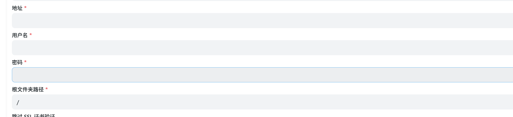

# 第 3 章 开出 WebDAV 服务

> 🧭 分册导航 ｜ 上一册：[[OpenList网盘挂载-02-网盘聚合]] ｜ 目录：[[OpenList网盘挂载-00-总目录]] ｜ 下一册：[[OpenList网盘挂载-04-Rclone挂载]]

第 1 章把 OpenList 用 Docker 跑了起来，第 2 章把网盘作为存储挂了进去。但到目前为止，能访问这些内容的还只有浏览器里的 OpenList 网页。要让 OpenList 之外的程序——文件管理器、rclone、下游容器——也能读到同一批文件，就需要把 WebDAV 服务"开出来"。本章只做服务侧：给哪个用户开、开哪些权限、客户端该填什么参数（§3.6 反过来讲 OpenList 自己当客户端的情形，作为方向对照，不改变本章的服务侧定位）。真正的挂载动作留到第 4 章。

## 3.1 先弄清 WebDAV 在这里是什么

WebDAV 不是一套全新的传输协议，而是 HTTP 的扩展集。官方原文：

> WebDAV (Web Distributed Authoring and Versioning) is a set of extensions to the Hypertext Transfer Protocol (HTTP) that enables users to collaboratively create, edit, and manage files directly on a web server.[^c3-s02]

紧接着的一句才是关键——OpenList 自己就能当这台 WebDAV 服务器：

> OpenList can be served as a WebDAV server, allowing users to access and modify files through a web interface.[^c3-s02]

这意味着你不需要额外装 Nginx、Apache 或任何 WebDAV 服务端。第 1 章那个 5244 端口的进程，除了给浏览器看网页，同时也能说 WebDAV 协议。

> [!tip] 大白话
> 把 WebDAV 想成 HTTP 的一门"方言"：浏览器说的是网页这门话，文件管理器 / rclone 说的是 WebDAV 这门话。OpenList 两种都会说，所以同一个端口，既能开网页，也能接 WebDAV 客户端。

## 3.2 核心认知：这里没有"全局开关"

新手的第一个动作通常是翻后台设置，找"启用 WebDAV"的开关。找不到——因为不存在这样一个开关。

官方对"怎么启用"只给了一条路径：在 `用户 => 权限` 设置里，为特定用户开启相应的权限项。

> 要使特定用户能够使用 WebDAV，需在 `用户 => 权限` 设置中为其开启以下权限：[^c3-s02]

换句话说，WebDAV 能不能用，取决于**登录的那个用户**有没有被授权，而不是服务端有没有一个总闸。

> [!warning] 待核实（Q1）
> 是否存在**全局**的"开启 WebDAV"开关？S02 通篇只讲用户权限项，没有出现任何全局开关字段；第 2 章见过的是**每个存储各自的** `Webdav policy` 字段（那是针对单个存储的传输策略，不是全局开关）。因此倾向"没有全局开关"，但这一点未经官方文档明确证实，标为**未证实**。

> [!tip] 大白话
> 不是"打开总闸"，而是"给某张门禁卡单独开权限"。能不能走 WebDAV，看的是这张卡（这个用户）被批了什么，跟服务端有没有一个总开关无关。

## 3.3 权限两件套，外加一条官方警告

导航到后台的用户列表，编辑目标用户，找到"权限"区块。需要开的权限分成职责完全不同的三类：

| 权限项 | 作用 | 什么时候必须开 |
|---|---|---|
| `WebDAV 读取` | 查看和读取 WebDAV 中的文件和目录 | 想看到内容就必须开；**只读 / 只看 / 只播放，开这一项就够** |
| `WebDAV 管理` | 进行写入操作（创建、修改、删除等） | 需要写入时才开 |
| 具体文件系统权限 | `创建目录或上传` / `重命名` / `移动` / `复制` / `删除` 等[^c3-s03] | 计划做哪一类写操作，就必须**同时**开对应那一项 |

两条官方原文，分别对应前两个权限项：

> 必须开启此权限才能**查看和读取** WebDAV 中的文件和目录。[^c3-s02]

> 如果用户**仅需查看或播放文件**，开启此权限即可。[^c3-s02]

> 必须开启此权限才能进行**写入操作**（创建、修改、删除等）。[^c3-s02]

然后是本章最容易被忽略的一句：

> **仅开启`WebDAV 管理` 还不够！** 需要同时开启 `WebDAV 管理` **以及** 其计划执行操作所需的具体文件系统权限（如 `重命名`、`删除`、`复制`、`创建目录或上传` 等）。[^c3-s02]

"管理"只是一个资格门槛，它不会把底层的重命名 / 删除 / 复制等具体权限自动一起给你。想删文件，还得单独开 `删除`；想上传，还得单独开 `创建目录或上传`。权限是一对一开出来的，不是开一个大类就全有。

上游 AList 文档（⚠️ **这是上游 AList 的口径，2022-09-07 发布、未标注更新日期，只能当旁证，不能当 OpenList 官方结论**）说的是同一件事：

> ≥ v3.42.0 The above versions need to open the two permissions of `Webdav Read` and `Webdav Manage` in User => Permissions[^c3-s04]

> since v3.42.0, writing to WebDAV not only requires the `Webdav Manage` permission but also basic permissions such as `rename`, `delete`, and `copy`.[^c3-s04]

两边对"读 / 写两件套 + 写操作还需具体权限"的说法一致，可互相印证。

> [!tip] 大白话
> `WebDAV 读取` 像"进馆阅览证"，`WebDAV 管理` 像"可以动手改东西的许可"。但光有后者还不够——你得说清楚要动哪一类东西：改名的许可、删除的许可、上传的许可，都是一项一项单独批的。

## 3.4 连接参数表（本章交付物）

权限开好后，客户端只需要下面这几个参数。官方"基础连接配置"给出的字段如下[^c3-s02]：

| 配置项          | 值                          | 说明                                          |
| ------------ | -------------------------- | ------------------------------------------- |
| **Url**      | `http[s]://<域名>:<端口>/dav/` | 官方写作 `http[s]://your-domain:port/dav/`      |
| **Host**     | 你的域名                       | 官方示例 `openlist.example.com`；自建环境填宿主机 IP 或域名 |
| **Path**     | `dav`                      | 客户端若提供单独"路径"字段，就填 `dav`                     |
| **Protocol** | `http` 或 `https`           | 官方**强烈建议 https**                            |
| **Port**     | 与网页端**完全一致**               | 第 1 章映射的是 `5244`，这里就填 `5244`                |
| **Username** | 网页端登录用户名                   | 即你登录 OpenList 后台用的用户名                       |
| **Password** | 网页端登录密码                    | 即你登录 OpenList 后台用的密码                        |
“地址”确实就是填写**外部 WebDAV 服务器**的访问地址（比如坚果云、自建群晖 NAS、或者其他人架设的 WebDAV 服务）。

需要注意的一个细节是：这里的“地址”通常需要填写**完整的 URL**（包含 `http://` 或 `https://` 协议头、端口以及 WebDAV 路径），而不仅是一个裸 IP。

端口不要另开一个，也别在客户端里随手改成 80/443——网页端用哪个端口，WebDAV 就用哪个。账号密码就是你登录后台的那一套，不需要单独建 WebDAV 账号。

**常见填写格式示例：**

- **坚果云：** `[https://dav.jianguoyun.com/dav/](https://dav.jianguoyun.com/dav/)`
- **群晖 NAS：** `[http://192.168.1.100:5005](http://192.168.1.100:5005)`（开启 HTTPS 则为 `[https://192.168.1.100:5006](https://192.168.1.100:5006)`）
- **另一台 AList / OpenList：** `[http://192.168.1.50:5244/dav](http://192.168.1.50:5244/dav)`
**把逻辑串联起来就是：**

- **在当前页面添加存储（客户端角色）：** OpenList 作为“访问者”，去读取别人服务器上的文件，展示在你的 OpenList 网页中。如果你有坚果云或群晖，就在这里填它们的地址和密码

> [!tip] 大白话
> 把 `/dav/` 想成这栋楼的"后门入口"：正门是浏览器访问的网页，后门专供 WebDAV 客户端进出；但门牌号（端口）和门禁卡（账号密码）跟正门是同一套。

## 3.5 官方推荐客户端

官方按平台列了推荐客户端，其中与本链路直接相关的是[^c3-s02]：

| 平台 | 官方推荐 | 官方说明原文 |
|---|---|---|
| Linux | `rclone` | Recommended, feature-rich / 推荐, 功能强大 |
| Linux | `davfs2` | System-level mounting, requires configuration / 系统级挂载, 需配置 |
| Windows | RaiDrive | Recommended for mounting / 推荐挂载 |

Linux 这条线上，官方把 rclone 排在推荐位，正好接上第 4 章——我们就是用它把 WebDAV 挂成本地目录，并顺便完成本章欠下的端点验证。

## 3.6 反向对照：OpenList 也能当 WebDAV 客户端

前面五节讲的都是"把服务开出去"——让 OpenList 之外的程序来读你的文件。但 OpenList 自己也能反过来：去读**别人**的 WebDAV 服务，把它当成一条普通存储挂进来。两个方向用的是同一个词"WebDAV"，这是本册最容易搞混的一处，所以单独拎出来对照一次。

| 对比项 | 服务端（本章主线，§3.1–§3.5） | 客户端（本节） |
|---|---|---|
| OpenList 的角色 | 提供服务、被访问的一方 | 主动访问、消费服务的一方 |
| 连接由谁发起 | 文件管理器 / rclone / 下游容器 → OpenList | OpenList → 对方服务器 |
| 在哪配置 | 后台 → 用户 → 权限 | 后台 → 存储 → 添加 → 驱动选 `WebDav` |
| 要不要填地址 | 不用。别人来连你，地址填在别人那边 | 要。填**对方**的 WebDAV 根地址 |
| 用谁的账号密码 | 你自己 OpenList 的账号（§3.3、§3.4） | **对方**的账号密码 |
| 产物是什么 | 一份连接参数表（§3.4） | 一条新存储，出现在你网页端的根目录下 |
| 机制归属 | 本章 | 第 2 册「添加存储」的同一套机制 |

> [!warning] 最容易踩的一处混淆
> 「添加存储」页里那三个必填项——`地址` / `用户名` / `密码`——填的**全是对方服务器的**。把自己 OpenList 的地址和账号填进去，那是"自己挂自己"，不是本节讲的事（见本节末尾）。

### 界面字段逐个对

添加存储时选 `WebDav` 驱动，界面上依次是下面这些字段。下表把界面名、英文名 / 配置键、官方说明三样对齐[^c3-s19]：

| 界面字段 | 英文名 / 配置键 | 官方说明 | 备注 |
|---|---|---|---|
| （驱动列表里的）`WebDav` | 驱动名 `WebDav` | — | 添加存储时先选驱动 |
| `Vendor` | `vendor` | 官方只在 OneDrive/SharePoint 一节提到："选择 vendor 为 sharepoint，支持国际版/世纪互联" | 只有挂 OneDrive / SharePoint 才需要改，其余保持默认 |
| `地址` | `Address` / `address` | "WebDAV 根地址"（`WebDAV root address`） | **必须带 `http://` 或 `https://`**，理由见下 |
| `用户名` | `Username` / `username` | "用户名"（`username`） | 对方服务器的账号 |
| `密码` | `Password` / `password` | "密码"（`password`） | 坚果云这类要"应用密码"，不是登录密码 |
| `根文件夹路径` | `Root folder path` / `root_folder_path` | "要挂载的文件夹路径，与加入地址相同" | 默认 `/`；**只填子目录**，根地址已经在"地址"里 |
| `跳过 SSL 证书验证` | `Tls insecure skip verify` / `tls_insecure_skip_verify` | "是否跳过 SSL 证书验证。如果你的 WebDAV 服务器使用自签名证书，可能需要启用此选项。启用后会降低安全性，请谨慎使用。" | 默认关闭；自建 / 群晖自签证书才开 |
| `支持 302 重定向` | 存储通用字段 | 见第 2 册 §2.5 | 与 `Webdav policy` / `Web proxy` 同属传输策略，不是本驱动独有 |

三条需要展开的：

**1. 地址为什么必须带协议头。** 官方对这一项的说明只有"WebDAV 根地址"一句，**没有**写必须带协议头——但源码层是硬要求：WebDAV 驱动把地址原样交给内部的 WebDAV 客户端（`gowebdav.NewClient(d.Address, ...)`），而客户端对地址只做一件事——补末尾的 `/`（`FixSlash`），**不会**替你补 `http://`。所以只写 `dav.jianguoyun.com/dav/` 会构造出一个没有协议的 URL，直接失败[^c3-s20]。

**2. "地址"和"根文件夹路径"是拼接关系。** 官方对后者的说明是"要挂载的文件夹路径，与加入地址相同"——也就是它**接在地址后面**。所以：

- 要挂对方 WebDAV 的整个根 → `地址` 填根地址，`根文件夹路径` 保持默认 `/`
- 只想挂根下面的某个子目录 → `地址` 仍填根地址，`根文件夹路径` 填那一段（如 `/work`）

> [!warning] 别把同一段路径填两遍
> 既然两者是拼接关系，就不要把 `/work` 同时写进"地址"末尾**又**填进"根文件夹路径"，那样会拼出 `.../dav/work/work`。这一条是**由官方"拼接"语义推出的推断**——官方页面没有给重复拼接的示例，标为**未证实**。

**3. "跳过 SSL 证书验证"是给自建场景准备的。** 官方原文已经点明它针对**自签名证书**。你自己架的 WebDAV（NAS、自建服务）十有八九用的是自签证书，默认状态下会连不上；这时才勾它。官方同时提醒"启用后会降低安全性"——**只在能确认对方就是那台自建服务器时才勾**。

### 三个真实例子

| 对方是什么 | `地址` 填 | `用户名` 填 | `密码` 填 |
|---|---|---|---|
| 坚果云 | `https://dav.jianguoyun.com/dav/` | 注册坚果云用的**邮箱** | **应用密码**（不是登录密码） |
| 群晖 NAS（WebDAV Server 套件） | `http://<NAS地址>:5005/`（HTTPS 为 `:5006/`） | DSM 账号 | DSM 密码 |
| 另一台 OpenList / AList | `http://<对方地址>:5244/dav` | 那台的登录账号 | 那台的登录密码 |

第三行正好接回本章：`http://<对方地址>:5244/dav` 这个地址形状，就是 §3.4 那张参数表里的 Url。

> [!warning] 坚果云填登录密码一定失败
> 坚果云 WebDAV 走的是"第三方应用授权"：先在网页端 **账户信息 → 安全选项 → 第三方应用管理 → 添加应用密码**，输入一个名称（如 `openlist`）、生成密码，再把这串密码填进 OpenList 的"密码"。生成的密码**只显示一次**，当场复制。填登录密码会直接失败[^c3-s21]。
>
> 坚果云对 WebDAV 还有额度限制（官方帮助中心：免费版每 30 分钟不超过 600 次请求，付费版不超过 1500 次；单次请求返回的文件 + 文件夹数上限 750 个）。OpenList 是"按目录列文件"的工具，挂大目录时会撞上这条[^c3-s21]。

> [!note] 群晖端口的口径
> `5005`（HTTP）/ `5006`（HTTPS）是群晖 WebDAV Server 的默认端口，出自群晖官方知识中心的 WebDAV Server 帮助页[^c3-s22]。该页为 JS 渲染，本次只核到端口这一**事实**、未能逐字抓取原文，故按事实而非引文呈现；实际以你 NAS 上 WebDAV Server 套件里显示的为准（群晖允许自定义端口）。

### 一个必然会被问到的场景：两台 OpenList 互挂

因为同一个程序既能当服务端又能当客户端，最顺手的一种玩法就是把 **A 的 `/dav` 挂进 B 的存储列表**：地址填 `http://<A>:5244/dav`，账号填 A 的后台账号。这也是验证本章最好的办法——两端都捏在你自己手里，参数填错时能同时看两边的日志，比拿第三方网盘试错快得多。

> [!warning] 但别把一台实例的地址填回它自己
> 那会形成自引用路径。官方文档没有讨论这种情况，本笔记也不给结论——**要验证就用第二台实例**。

> [!tip] 大白话
> 本章上半场你在给**自家**装门禁、发门卡：别人来读你（服务端）。这一节你是拿着**别人家的门牌和门卡**去别人家取东西：你去读别人（客户端）。同一个词"WebDAV"，一次是"我开的门"，一次是"我去开别人的门"。填之前先问一句——**这个地址和账号，是谁家的？**

## 3.7 章末可跑产出

1. **权限开齐**：为目标用户开启 `WebDAV 读取`；需要写入时，再加 `WebDAV 管理` **以及**计划操作对应的具体权限（如 `创建目录或上传`、`重命名`、`删除`、`复制`、`移动`）。
2. **参数表填好**：按 §3.4 的表，把 Url / Host / Path / Protocol / Port / Username / Password 填进 WebDAV 客户端。
3. **能登入并看到内容**：用一个 WebDAV 客户端登录成功，并看到第 2 章挂载进来的那个存储的内容（正式挂载与命令行验证见第 4 章）。
4. **（可选）反向验证**：按 §3.6，在后台新增一条 `WebDav` 驱动存储，把**另一台** OpenList（或坚果云）挂进来，确认网页端能浏览到对方的内容。

## 本章小结

- WebDAV 是 HTTP 的扩展集；OpenList 自身即可充当 WebDAV 服务器，无需另装服务端。
- 启用 WebDAV 不是打开某个全局开关，而是在 `用户 => 权限` 里给特定用户开权限项。
- `WebDAV 读取` 管查看 / 读取 / 播放；`WebDAV 管理` 管写入；但**只开"管理"不够**，计划做的写操作对应的具体权限（重命名 / 删除 / 复制 / 创建目录或上传 / 移动）也必须一并开启。
- 连接参数：Url `http[s]://<域名>:<端口>/dav/`、Path `dav`、端口必须与网页端完全一致、凭证即网页端登录账号密码、官方强烈建议 https。
- "WebDAV"在本册里有两个方向：本章主线是**服务端**（OpenList 当服务器，别人来读）；§3.6 补的是**客户端**（OpenList 去挂别人的 WebDAV）。两处填的地址与账号属于**不同一方**，填之前先确认"这是谁家的"。
- 当客户端时：`地址` 必须带 `http://` / `https://`（源码层不会替你补协议）、`根文件夹路径` 是**接在地址之后**的子目录、坚果云要用**应用密码**、只有自建服务器的自签证书才勾 `跳过 SSL 证书验证`。
- 已知限制：不支持"复制时重命名"；官方"存储支持"章节仍是 WIP。本章不含可跑验证命令，端点实测留到第 4 章。

## 相关笔记

- [[网络协议详解-WebDAV_Samba_FTP_iSCSI]] —— WebDAV 与 Samba / FTP / iSCSI 的横向对比，本章协议背景的展开
- [[域名完全上手]] —— 本章提到的「反向代理前缀」场景

[^c3-s02]: OpenList Docs — WebDAV（OpenList 官方），https://doc.oplist.org/guide/advanced/webdav
[^c3-s03]: OpenList Docs — User / 用户与权限（OpenList 官方），https://doc.oplist.org/guide/advanced/user
[^c3-s04]: AList Docs — WebDav（**上游 AList 口径**，页面标注 2022-09-07 发布且未标注更新日期），https://alistgo.com/guide/webdav.html
[^c3-s19]: OpenList Docs — WebDav 驱动（OpenList 官方），https://doc.oplist.org/guide/drivers/webdav
[^c3-s20]: OpenList 源码（T1 源码级）：`drivers/webdav/util.go`（`gowebdav.NewClient(d.Address, ...)`，地址原样传入）、`drivers/webdav/meta.go`（`Address` / `Username` / `Password` 必填，`TlsInsecureSkipVerify` 默认 false）、`internal/driver/item.go`（`RootPath` → `root_folder_path`）、`pkg/gowebdav/utils.go`（`FixSlash` 只补末尾 `/`，不补协议头），https://github.com/OpenListTeam/OpenList
[^c3-s21]: 坚果云帮助中心 — 坚果云第三方应用授权 WebDAV 开启方法（坚果云官方），https://help.jianguoyun.com/?p=2064
[^c3-s22]: Synology 知识中心 — WebDAV Server 帮助（群晖官方；页面为 JS 渲染，端口号经检索核对，**未逐字抓取原文**），https://kb.synology.com/zh-cn/DSM/help/WebDAVServer/webdav_server?version=7

---

> 🧭 分册导航 ｜ 上一册：[[OpenList网盘挂载-02-网盘聚合]] ｜ 目录：[[OpenList网盘挂载-00-总目录]] ｜ 下一册：[[OpenList网盘挂载-04-Rclone挂载]]
