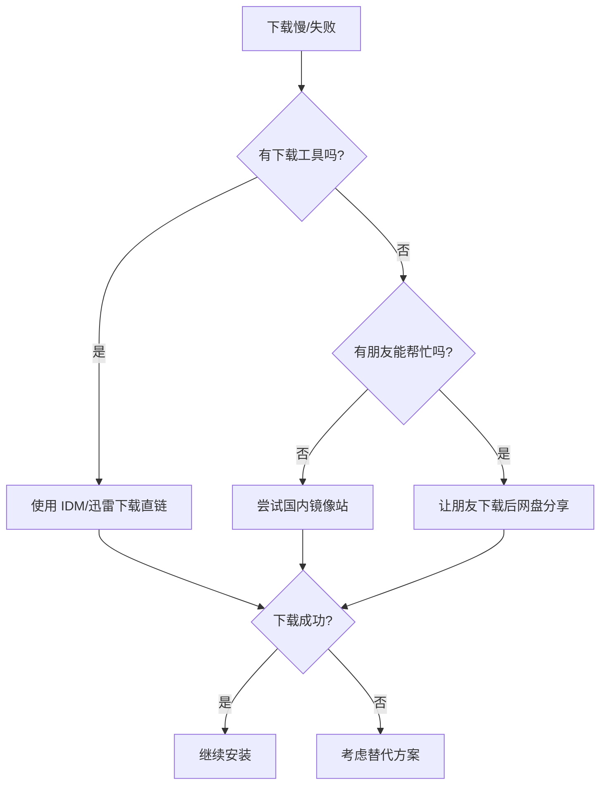

# Windows Docker Desktop 安装指南（国内网络版）

> [!info] 概述
> **一份专门为国内网络环境设计的 Docker Desktop 安装指南**，解决无代理环境下的下载、安装、镜像拉取等问题。

---

## 快速导航

| 我想...        | 跳转章节                             |
| ------------ | -------------------------------- |
| 检查系统是否满足要求 | [[#一、安装前准备]]                     |
| 下载安装包（国内加速）  | [[#二、下载 Docker Desktop（国内加速方案）]] |
| 了解安装步骤       | [[#三、安装步骤]]                      |
| 配置镜像加速器      | [[#四、安装后配置（关键步骤）]]               |
| 解决安装失败问题     | [[#五、常见网络问题及解决方案]]               |
| 解决使用中的问题     | [[#六、使用中的常见问题]]                  |

---

## 一、安装前准备

### 1.1 系统要求

| 要求项 | 最低配置 | 推荐配置 |
|--------|---------|---------|
| **Windows 版本** | Windows 10 64位 (19044+) | Windows 11 |
| **系统类型** | Pro/Enterprise/Education | Pro/Enterprise |
| **内存** | 4GB | 8GB+ |
| **硬盘空间** | 20GB | 64GB+ (SSD) |
| **CPU 虚拟化** | 必须启用 | 必须启用 |

> [!tip] 检查 Windows 版本
> 按 `Win + R`，输入 `winver`，查看版本号

### 1.2 启用必要功能

#### 步骤 1：启用 WSL2

**🎯 比喻**：WSL2 就像是在 Windows 里装了一个「迷你 Linux 系统」，Docker 需要它来运行容器。

```powershell
# 以管理员身份运行 PowerShell

# 1. 启用 WSL
wsl --install

# 2. 更新 WSL 到最新版本
wsl --update

# 3. 设置 WSL2 为默认版本
wsl --set-default-version 2
```

**重启电脑后继续下一步。**

> [!info] 📚 来源
> - [WSL 安装文档 | Microsoft](https://learn.microsoft.com/zh-cn/windows/wsl/install) - 微软官方

#### 步骤 2：启用虚拟机平台

```powershell
# 以管理员身份运行 PowerShell
dism.exe /online /enable-feature /featurename:VirtualMachinePlatform /all /norestart
```

#### 步骤 3：检查 BIOS 虚拟化

**🎯 比喻**：CPU 虚拟化就像给你的处理器开了「分身术」，让它能同时扮演多个电脑。

| CPU 品牌 | BIOS 选项名称 |
|----------|--------------|
| Intel | VT-x / Intel VT-x / Intel Virtualization Technology |
| AMD | AMD-V / SVM Mode / AMD Virtualization |

**操作步骤**：
1. 重启电脑，按 `Del` 或 `F2` 进入 BIOS
2. 找到 `Advanced` → `CPU Configuration` → 虚拟化选项
3. 设置为 `Enabled`
4. 保存并退出

> [!warning] 注意
> 不同主板 BIOS 界面不同，请根据实际情况查找

#### 步骤 4：验证准备工作

```powershell
# 检查 WSL 版本
wsl --list --verbose

# 预期输出：VERSION 列应显示 2
#  NAME            STATE           VERSION
#  Ubuntu          Running         2
```

---

## 二、下载 Docker Desktop（国内加速方案）

### 2.1 问题：官方下载太慢或失败

由于 Docker 官方服务器在国外，国内直接下载经常：
- 下载速度极慢（几 KB/s）
- 下载中断
- 完全无法连接

### 2.2 解决方案 A：直接下载链接（推荐）

**使用下载工具加速**：将以下链接复制到 IDM、FDM 或迅雷中下载

| 版本 | 下载链接 |
|------|---------|
| **Windows (x86_64)** | `https://desktop.docker.com/win/main/amd64/Docker%20Desktop%20Installer.exe` |
| **Mac (Intel)** | `https://desktop.docker.com/mac/main/amd64/Docker.dmg` |
| **Mac (Apple Silicon)** | `https://desktop.docker.com/mac/main/arm64/Docker.dmg` |

### 2.3 解决方案 B：国内镜像下载

| 来源 | 说明 |
|------|------|
| [阿里云镜像站](https://mirrors.aliyun.com/docker-toolbox/) | 可能需要登录 |
| [清华大学开源镜像站](https://mirrors.tuna.tsinghua.edu.cn/) | 搜索 Docker |
| [华为云镜像站](https://mirrors.huaweicloud.com/) | 搜索 Docker |

> [!tip] 推荐做法
> 1. 先尝试直接链接 + 下载工具
> 2. 如果不行，找朋友帮忙下载后通过网盘分享

### 2.4 解决方案 C：GitHub Release

从 Docker Desktop 的 GitHub Release 页面下载：
- [Docker Desktop Releases](https://github.com/docker/docker-desktop/releases)

---

## 三、安装步骤

### 3.1 安装流程图

```
┌─────────────────────────────────────────────────────────────┐
│                   Docker Desktop 安装流程                     │
├─────────────────────────────────────────────────────────────┤
│                                                             │
│  ┌─────────────┐     ┌─────────────┐     ┌─────────────┐   │
│  │ 运行安装程序 │ ──→ │ 勾选 WSL2   │ ──→ │ 等待安装   │   │
│  └─────────────┘     └─────────────┘     └─────────────┘   │
│                                                   │         │
│                                                   ▼         │
│  ┌─────────────┐     ┌─────────────┐     ┌─────────────┐   │
│  │ 开始使用    │ ←── │ 完成配置    │ ←── │ 重启电脑    │   │
│  └─────────────┘     └─────────────┘     └─────────────┘   │
│                                                             │
└─────────────────────────────────────────────────────────────┘
```

### 3.2 详细安装步骤

#### 步骤 1：运行安装程序

1. 双击下载的 `Docker Desktop Installer.exe`
2. 如果 UAC 弹窗，点击「是」

#### 步骤 2：配置安装选项

```
┌─────────────────────────────────────────────────────────────┐
│  Configuration                                              │
├─────────────────────────────────────────────────────────────┤
│                                                             │
│  ☑ Install required Windows components for WSL 2           │
│    （必须勾选！安装 WSL2 所需组件）                          │
│                                                             │
│  ☑ Add shortcut to desktop                                 │
│    （可选，添加桌面快捷方式）                                │
│                                                             │
│  ☐ Use WSL 2 instead of Hyper-V                            │
│    （Windows 11 默认使用 WSL2，此项可能不显示）              │
│                                                             │
│                    [Ok]        [Cancel]                     │
└─────────────────────────────────────────────────────────────┘
```

> [!warning] 重要
> **必须勾选**「Install required Windows components for WSL 2」，否则 Docker 无法正常运行！

#### 步骤 3：等待安装

安装过程可能需要 5-15 分钟，期间会：
- 下载 WSL2 Linux 内核更新包
- 安装 Docker 组件
- 配置系统服务

#### 步骤 4：重启电脑

安装完成后，点击「Close and restart」重启电脑。

#### 步骤 5：完成初始配置

1. 重启后，Docker Desktop 会自动启动
2. 接受服务协议
3. 跳过登录（点击「Continue without signing in」）
4. 完成初始向导

### 3.3 验证安装

```powershell
# 检查 Docker 版本
docker --version

# 运行测试容器
docker run hello-world

# 预期输出：
# Hello from Docker!
# This message shows that your installation appears to be working correctly.
```

> [!info] 📚 来源
> - [Install Docker Desktop on Windows | Docker Docs](https://docs.docker.com/desktop/install/windows-install/) - Docker 官方

---

## 四、安装后配置（关键步骤）

### 4.1 配置镜像加速器（必须！）

**🎯 为什么需要**：国内访问 Docker Hub 速度极慢，甚至完全无法访问。配置镜像加速器后，拉取镜像会从国内服务器获取。

#### 方法一：GUI 配置（推荐新手）

```
┌─────────────────────────────────────────────────────────────┐
│  Docker Desktop → Settings → Docker Engine                  │
├─────────────────────────────────────────────────────────────┤
│                                                             │
│  {                                                          │
│    "builder": { ... },                                      │
│    "experimental": false,                                   │
│    "registry-mirrors": [                                    │
│      "https://docker.1panel.live",                          │
│      "https://docker.xuanyuan.me",                          │
│      "https://docker.m.daocloud.io"                         │
│    ]                                                        │
│  }                                                          │
│                                                             │
│                              [Apply & Restart]               │
└─────────────────────────────────────────────────────────────┘
```

#### 方法二：命令行配置

```powershell
# 创建/编辑配置文件
notepad %USERPROFILE%\.docker\daemon.json
```

写入以下内容：
```json
{
  "registry-mirrors": [
    "https://docker.1panel.live",
    "https://docker.xuanyuan.me",
    "https://docker.m.daocloud.io",
    "https://docker.mirrors.ustc.edu.cn"
  ]
}
```

#### 验证配置

```powershell
# 检查镜像加速器是否生效
docker info | Select-String "Registry Mirrors" -Context 0,5

# 预期输出：
# Registry Mirrors:
#  https://docker.1panel.live/
#  https://docker.xuanyuan.me/
```

> [!info] 📚 来源
> - [2025年12月最新Docker镜像源加速列表](https://post.smzdm.com/p/a655x5wz) - 什么值得买
> - [Docker镜像加速器配置](https://juejin.cn/post/7476410894355185718) - 掘金

### 4.2 可用镜像源列表（2026年3月更新）

| 镜像源 | 地址 | 状态 |
|--------|------|------|
| **1Panel** | `https://docker.1panel.live` | ✅ 可用 |
| **XuanYuan** | `https://docker.xuanyuan.me` | ✅ 可用 |
| **DaoCloud** | `https://docker.m.daocloud.io` | ✅ 可用 |
| **中科大** | `https://docker.mirrors.ustc.edu.cn` | ⚠️ 时好时坏 |
| **南京大学** | `https://docker.nju.edu.cn` | ⚠️ 需验证 |

> [!warning] 注意
> 镜像源可用性会变化！如果某个源不可用，请：
> 1. 尝试其他源
> 2. 搜索「Docker 镜像加速器 2026」获取最新可用源
> 3. 参考 [[DockerDesktop镜像加速器配置]] 获取更新

### 4.3 资源配置（可选）

根据你的电脑配置调整 Docker 资源：

```
Settings → Resources
├── Memory: 4-8GB（根据内存大小调整）
├── CPU: 2-4 核
├── Disk image location: 建议改到非系统盘
└── Swap: 2GB
```

---

## 五、常见网络问题及解决方案

### 5.1 问题分类速查表

| 问题类型 | 具体表现 | 解决方案 |
|---------|---------|---------|
| **安装包下载** | 下载慢/中断 | [[#5.2 安装包下载问题]] |
| **安装失败** | 安装过程中报错 | [[#5.3 安装失败问题]] |
| **启动失败** | Docker Engine stopped | [[#5.4 启动失败问题]] |
| **拉取镜像失败** | timeout / connection refused | [[#5.5 镜像拉取失败问题]] |

### 5.2 安装包下载问题

#### 问题：下载速度极慢或中断

**解决方案**：



**替代方案**：
- [Podman Desktop](https://podman-desktop.io/) - 开源免费
- [Rancher Desktop](https://rancherdesktop.io/) - 开源免费

### 5.3 安装失败问题

#### 问题 1：WSL2 安装失败

**错误信息**：
```
WSL 2 installation is incomplete
```

**解决方案**：
```powershell
# 1. 手动安装 WSL2 内核更新包
# 下载地址：https://aka.ms/wsl2kernel

# 2. 或通过命令更新
wsl --update

# 3. 重启电脑
```

> [!info] 📚 来源
> - [WSL2 内核更新包 | Microsoft](https://aka.ms/wsl2kernel) - 微软官方

#### 问题 2：Hyper-V 未启用

**错误信息**：
```
Hardware assisted virtualization and data execution protection must be enabled in the BIOS
```

**解决方案**：
```powershell
# 启用 Hyper-V（管理员 PowerShell）
Enable-WindowsOptionalFeature -Online -FeatureName Microsoft-Hyper-V -All

# 重启电脑
```

#### 问题 3：安装卡在「Installing」

**可能原因**：
- 正在下载 WSL2 内核（网络慢）
- 杀毒软件拦截
- 系统服务冲突

**解决方案**：
1. **耐心等待**：首次安装可能需要 15-30 分钟
2. **暂时关闭杀毒软件**
3. **检查网络连接**
4. **以管理员身份运行安装程序**

### 5.4 启动失败问题

#### 问题 1：Docker Engine stopped

**表现**：Docker Desktop 启动后左下角显示红色「Engine stopped」

**解决方案**：

```powershell
# 步骤 1：检查 WSL 状态
wsl --list --verbose

# 步骤 2：重启 WSL
wsl --shutdown
# 等待 10 秒后重新启动 Docker Desktop

# 步骤 3：重置 Docker（如果上述方法无效）
# Docker Desktop → Troubleshoot → Reset to factory defaults
```

> [!info] 📚 来源
> - [Docker踩坑与解决 | 掘金](https://juejin.cn/post/7478507102039572532)

#### 问题 2：WSL2 相关错误

**错误信息**：
```
The WSL 2 Linux kernel is not installed
```

**解决方案**：
```powershell
# 安装 WSL2 内核
wsl --update

# 或手动下载安装
# https://aka.ms/wsl2kernel
```

#### 问题 3：网络连接错误

**错误信息**：
```
Error: context deadline exceeded
Network failed to connect
```

**解决方案**：

```powershell
# 1. 重置网络
netsh winsock reset
netsh int ip reset

# 2. 重启电脑

# 3. 检查防火墙设置
# 确保 Docker Desktop 被允许通过防火墙
```

### 5.5 镜像拉取失败问题

#### 问题 1：timeout / connection refused

**错误信息**：
```
Error: pull access denied
timeout after 10m0s
net/http: request canceled
```

**原因**：无法连接到 Docker Hub

**解决方案**：

```powershell
# 1. 确认已配置镜像加速器
docker info | Select-String "Registry Mirrors"

# 2. 如果没有配置，参考第四章配置镜像加速器

# 3. 测试拉取
docker pull alpine:latest
```

#### 问题 2：镜像加速器不生效

**排查步骤**：

```powershell
# 1. 检查配置文件格式
# 打开配置文件
notepad %USERPROFILE%\.docker\daemon.json

# 2. 验证 JSON 格式（使用在线工具或 PowerShell）
Get-Content %USERPROFILE%\.docker\daemon.json | ConvertFrom-Json

# 3. 确保重启了 Docker Desktop
```

**常见配置错误**：

```json
// ❌ 错误：缺少逗号
{
  "registry-mirrors": [
    "https://docker.1panel.live"
    "https://docker.xuanyuan.me"  // 缺少逗号！
  ]
}

// ✅ 正确
{
  "registry-mirrors": [
    "https://docker.1panel.live",
    "https://docker.xuanyuan.me"
  ]
}
```

#### 问题 3：特定镜像拉取失败

**原因**：镜像加速器可能没有该镜像

**解决方案**：

```powershell
# 方案 1：尝试其他镜像源（修改配置文件中的顺序）

# 方案 2：使用完整镜像地址
docker pull docker.m.daocloud.io/library/nginx:latest

# 方案 3：使用代理（如果有）
# 参考 [[docker进行代理]]
```

---

## 六、使用中的常见问题

### 6.1 磁盘空间不足

**问题**：Docker 数据占用大量磁盘空间

**解决方案**：

```powershell
# 1. 查看磁盘占用
docker system df

# 2. 清理未使用的资源
docker system prune -a

# 3. 迁移数据目录
# Settings → Resources → Advanced → Disk image location
# 改到非系统盘（如 D:\DockerData）
```

### 6.2 容器内无法访问外网

**问题**：容器内 curl/wget 访问外网失败

**原因**：镜像加速器只影响 `docker pull`，不影响容器内网络

**解决方案**：配置容器代理

```yaml
# docker-compose.yml
services:
  app:
    image: nginx
    environment:
      - HTTP_PROXY=http://宿主机IP:7890
      - HTTPS_PROXY=http://宿主机IP:7890
```

> [!tip] 详细说明
> 参考 [[镜像加速器vs代理-概念对比]] 了解镜像加速器和代理的区别

### 6.3 Docker Desktop 占用内存过高

**解决方案**：

```
Settings → Resources
├── Memory: 降低到 2-4GB
└── Swap: 增加到 4GB
```

---

## 七、完整问题排查流程

```
┌─────────────────────────────────────────────────────────────┐
│                    Docker 问题排查流程                        │
├─────────────────────────────────────────────────────────────┤
│                                                             │
│  问题发生                                                    │
│      │                                                      │
│      ▼                                                      │
│  ┌─────────────────┐                                        │
│  │ 1. 查看错误信息  │ ← Docker Desktop 左下角状态/日志        │
│  └────────┬────────┘                                        │
│           ▼                                                 │
│  ┌─────────────────┐    是    ┌─────────────────┐          │
│  │ 2. 是网络问题？  │ ──────→ │ 检查镜像加速器   │          │
│  └────────┬────────┘         └─────────────────┘          │
│           │ 否                                               │
│           ▼                                                 │
│  ┌─────────────────┐    是    ┌─────────────────┐          │
│  │ 3. 是WSL问题？   │ ──────→ │ wsl --shutdown   │          │
│  └────────┬────────┘         │ wsl --update     │          │
│           │ 否               └─────────────────┘          │
│           ▼                                                 │
│  ┌─────────────────┐    是    ┌─────────────────┐          │
│  │ 4. 是配置问题？  │ ──────→ │ 检查 daemon.json │          │
│  └────────┬────────┘         │ 重置出厂设置     │          │
│           │ 否               └─────────────────┘          │
│           ▼                                                 │
│  ┌─────────────────┐                                        │
│  │ 5. 查看日志文件  │                                        │
│  │ %APPDATA%\Docker\log.txt                                │
│  └─────────────────┘                                        │
│                                                             │
└─────────────────────────────────────────────────────────────┘
```

---

## 八、与现有知识的关系

| 概念 | 关系 |
|------|------|
| [[镜像加速器vs代理-概念对比]] | 了解镜像加速器和代理的区别 |
| [[DockerDesktop镜像加速器配置]] | Mac 版镜像加速器配置 |
| [[Docker网络结构详解]] | Docker 网络原理和配置 |
| [[docker进行代理]] | Docker 容器代理详细配置 |
| [[docker容器如何更新]] | Docker 容器更新方法 |

---

## 个人笔记

> [!personal] 💡 我的理解与感悟
>
> （此处记录个人学习心得，更新时会被保留）

---

## 参考资料

### 官方资源
- [Install Docker Desktop on Windows | Docker Docs](https://docs.docker.com/desktop/install/windows-install/) - Docker 官方安装文档
- [WSL 安装文档 | Microsoft](https://learn.microsoft.com/zh-cn/windows/wsl/install) - 微软官方
- [WSL2 内核更新包 | Microsoft](https://aka.ms/wsl2kernel) - 微软官方

### 社区资源
- [Docker安装避坑指南2025](https://eastondev.com/blog/zh/posts/dev/20251217-docker-install-guide/) - 完整安装教程
- [Windows上安装Docker并管理WSL2 Ubuntu指南](https://zhuanlan.zhihu.com/p/1950647732948697924) - 知乎专栏
- [Docker踩坑与解决 | 掘金](https://juejin.cn/post/7478507102039572532) - 常见问题解决
- [2025年12月最新Docker镜像源加速列表](https://post.smzdm.com/p/a655x5wz) - 什么值得买

### 视频教程
- [2025.07 亲测有效 配置Docker镜像加速](https://www.bilibili.com/video/BV1N53qzZEhi/) - Bilibili

---

**最后更新**：2026-03-29
