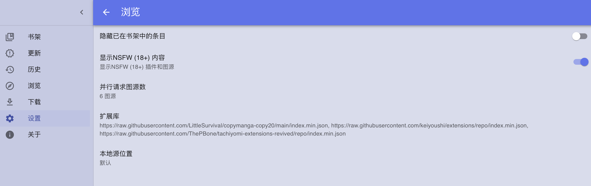

我们使用的是Suwayomi 这个工具。
# 1. 使用docker进行搭建

用这里的连接自己进行搭建：
```http
https://github.com/Suwayomi/Suwayomi-Server-docker
```
但是我们搭建后是没有漫画的。
# 2. 添加漫画扩展库


我们在==设置->浏览->扩展库==中去添加扩展库。
## 2.1 扩展库链接

在下面的仓库中可以找到链接：
```http
https://github.com/LittleSurvival/copymanga-copy20
```
```http
https://github.com/keiyoushi/extensions
```
比如这扩展库链接：
```http
https://raw.githubusercontent.com/LittleSurvival/copymanga-copy20/repo/index.min.json
```
这种链接的含义可以看[[github文件直链方式]]
# 3. android安装包
用下面的链接找：
```
https://github.com/Suwayomi/Tachidesk-Sorayomi
```
