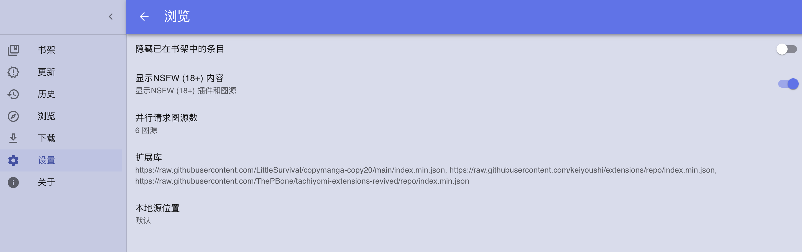

我们使用的是 Suwayomi 这个工具。

> [!info] 相关文档
> - [[Docker MOC]] - Docker 知识索引
> - [[github文件直链方式]] - GitHub raw 链接说明

# 1. 使用 Docker 进行搭建

> [!summary] 一句话看懂
> Suwayomi 是一个**自托管的漫画阅读服务器**：你用 Docker 把它跑在自己的电脑或 NAS 上，它开一个网页界面，你就能在浏览器里搜漫画、看漫画、下载漫画。
> 它自己**不含任何漫画内容**，漫画要靠「扩展库」去各个漫画网站现抓——所以**这一章只负责把它跑起来**，跑起来后里面是空的，这是正常的，加漫画在第 2 章。
>
> 全程 3 步：**建目录 → 写一份 compose → 一条命令启动**。

## 1.1 动手前的两个前提

1. 电脑上已经装好 **Docker** 和 **Docker Compose**。
   - Linux / Windows 安装见 [[Linux-Docker与DockerCompose安装指南-国内网络版]]、[[Windows-DockerDesktop安装指南-国内网络版]]。
2. 能拉到 `ghcr.io` 上的镜像。国内网络这一步**最容易卡住**，先看 1.7 的坑，别等到一半才发现拉不动。

## 1.2 先认识 2 条「固定管路」

Suwayomi 的 docker 镜像里，有几个位置是**作者定死的**，你只能改左边、改不了右边。先看懂这张图，后面就不会写错：

```text
你这边（宿主机 / NAS）         容器内部（suwayomi）
./data    ──── 挂载 ────►   /home/suwayomi/.local/share/Tachidesk
                              ├─ 配置 / 数据库 / 书架
                              └─ downloads/   ← 下载的漫画也在这里面
4567（可改） ──── 端口 ────►   4567（网页界面）
```

| 位置 | 写法示例 | 谁说了算 | 能不能改 | 改错的后果 |
| --- | --- | --- | --- | --- |
| 宿主机路径（冒号左边） | `./data` | 你 | 随便改，指向你自己的目录 | 指向空目录 → 换容器后配置全丢 |
| 容器内路径（冒号右边） | `/home/suwayomi/.local/share/Tachidesk` | 镜像作者 | **不可改** | 改了就找不到数据，等于没挂 |
| 宿主机端口（`-p` 左边） | `4567` | 你 | 可改，端口冲突就换 | 记错端口 → 浏览器打不开 |
| 容器内端口（`-p` 右边） | `4567` | 镜像作者 | **不可改** | 改了就连不上服务 |

> [!tip] 大白话
> 把容器想象成一套**随时能拆掉重盖的样板房**，`./data` 是你给它租的**储物间**。程序本身（容器）拆了不要紧——账号、书架、下载的漫画都在储物间里，重新盖上房接着用。但你要是把 `./data` 删了，等于把储物间清空，再启动就是一个全新的空 Suwayomi。

## 1.3 第 1 步：建目录

```bash
mkdir -p ~/suwayomi/data
cd ~/suwayomi
```

- `~/suwayomi`：整个项目放这里，随便换路径。
- `data/`：对应上面的「储物间」，后面容器会自动在里面建 `downloads` 子目录。

## 1.4 第 2 步：写 docker-compose.yml

在 `~/suwayomi` 里新建一个 `docker-compose.yml`，内容如下：

```yaml
services:
  suwayomi:
    image: ghcr.io/suwayomi/suwayomi-server:preview
    container_name: suwayomi
    user: 1000:1000
    environment:
      - TZ=Asia/Shanghai
      # 下面两条配合文件末尾的 flaresolverr 服务使用；不用它就把这两条一起删掉
      - FLARESOLVERR_ENABLED=true
      - FLARESOLVERR_URL=http://flaresolverr:8191
    volumes:
      - ./data:/home/suwayomi/.local/share/Tachidesk
    ports:
      - "4567:4567"
    restart: unless-stopped

  # 可选的反爬服务：让带 Cloudflare 验证的网站也能被正常抓取。
  # 不需要就整段删掉，并把上面两条 FLARESOLVERR_* 也删掉。
  flaresolverr:
    image: ghcr.io/thephaseless/byparr:latest
    container_name: flaresolverr
    environment:
      - TZ=Asia/Shanghai
    restart: unless-stopped
```

每一行是什么意思：

| 这一行 | 作用 | 要改吗 |
| --- | --- | --- |
| `image: ...:stable` | 用官方**稳定版**镜像 | 不用改。想要最新界面 / 功能可换 `:preview` |
| `container_name: suwayomi` | 给容器起固定名字，方便 `docker logs suwayomi` | 可改可不改 |
| `user: 1000:1000` | 指定容器以 UID / GID `1000` 运行（镜像默认也是它，写明便于排查权限） | 一般不改 |
| `TZ=Asia/Shanghai` | 时区，影响日志时间和自动更新 | 建议保留 |
| `FLARESOLVERR_*` | 启用反爬服务，配合末尾的 `flaresolverr` | 不用反爬就删 |
| `./data:.../Tachidesk` | 把数据存到当前目录的 `data` 文件夹 | 想换位置就改左边 |
| `"4567:4567"` | 左边是你访问用的端口 | 端口被占用就改左边，如 `"8080:4567"` |
| `restart: unless-stopped` | 开机 / 崩溃后自动拉起 | 官方示例是 `on-failure:3`，见下方说明 |

> [!tip] 两处和官方示例不同，都是有意为之
> - **`restart: unless-stopped`**：官方 compose 用的是 `on-failure:3`，意思是「只在失败时最多重启 3 次」，而且**重启机器后不会自动拉起**。自建服务一般希望重启机器后自动恢复，所以用 `unless-stopped`。想完全照官方就换回去。
> - **`:stable` 还是 `:preview`**：官方仓库 master 上的示例用的是 `:preview`（预览版，更早用上新界面和新扩展 API）。稳定优先就用 `:stable`。
>
> 另外，`flaresolverr` 这一整段在官方 compose 里是默认存在的（官方用 `ghcr.io/thephaseless/byparr:latest` 这个镜像，与 FlareSolverr 接口兼容）。不需要它可以整段删掉。

## 1.5 第 3 步：启动

```bash
docker compose up -d
```

第一次会从网上下载镜像，耐心等一会儿。看到类似下面的输出就算成功：

```text
Container suwayomi  Started
```

## 1.6 验证：能打开网页就搭好了

浏览器打开：

```http
http://localhost:4567
```

如果装在 NAS 或别的服务器上，把 `localhost` 换成那台机器的 IP，例如 `http://192.168.1.10:4567`。

想确认运行状态：

```bash
docker compose ps          # 看容器是不是 Up
docker compose logs -f suwayomi   # 实时看日志，Ctrl+C 退出
```

> [!success] 判断标准
> 能看到 Suwayomi 的网页界面 = 搭建完成。
> **此时里面没有漫画是正常的**——Suwayomi 只是个「阅读器」，书得靠扩展库去抓，见第 2 章。

## 1.7 常见的 5 个坑

> [!warning] 坑 1：国内网络拉不动 `ghcr.io` 镜像
> 报错多为超时 / `connection refused`。两个办法：给 Docker 配镜像加速器（见 [[DockerDesktop镜像加速器配置]]），或让 Docker 走代理（见 [[docker进行代理]]）。

> [!warning] 坑 2：目录权限报错（Permission denied）
> 容器以 UID / GID `1000`、名为 `suwayomi` 的用户运行，它会去写 `./data`。日志里出现 `Permission denied` 时，把目录交给这个用户：
> ```bash
> sudo chown -R 1000:1000 ~/suwayomi/data
> ```
> 原理见 [[docker里的GID和UID]]。

> [!warning] 坑 3：端口被占用
> 报错 `port is already allocated` → 改 compose 里**左边**的端口，比如 `"4568:4567"`，再跑一次 `docker compose up -d`。

> [!warning] 坑 4：改了配置没生效
> 容器启动时传的环境变量会**覆盖**网页界面里的设置。所以要么全在 compose 里配，要么全在网页里配，别两边打架。

> [!warning] 坑 5：删了 `flaresolverr` 服务，日志却一直报错
> 如果删掉了末尾的 `flaresolverr` 段，却忘了删上面那两条 `FLARESOLVERR_*`，Suwayomi 会一直连不上那个地址。两处要**一起删**（或一起留）。

> [!tip] 官方文档
> 本章只覆盖「能跑起来」的最小配置。认证登录、换数据库、自动备份等完整参数见官方仓库：
> ```http
> https://github.com/Suwayomi/Suwayomi-Server-docker
> ```

但是我们搭建后是没有漫画的。

# 2. 添加漫画扩展库

> [!summary] 一句话看懂
> 第 1 章搭好的 Suwayomi 只是个**空书架**——它自己一页漫画都没有。漫画要靠「扩展」去各个漫画网站现抓。
> 本章 3 步：**加扩展库 → 装扩展 → 去图源搜漫画**。

## 2.1 先分清 3 个词：扩展库 / 扩展 / 图源

把 Suwayomi 想象成一个**刚开业、还没进货的书店**：

- **扩展库** = 书店的**进货名录**：一份清单，告诉你市面上有哪些货源。你把它整个加进来，Suwayomi 才知道去哪儿找书。
- **扩展** = 名录里的**某一个货源**：比如「拷贝漫画」就是一个扩展，对应一个漫画网站。
- **图源** = 扩展装好后，在「浏览」里出现的**可搜索入口**：点进去才能搜书、加书架。

| 名词 | 英文 | 到底是什么 | 在哪操作 |
| --- | --- | --- | --- |
| 扩展库 | Extension repository / store | 一份货源清单（一个链接，指向一个 `json` 文件） | 设置 → 浏览 → 扩展库 |
| 扩展 | Extension | 针对某个漫画网站的抓取插件（本质上是个 apk） | 浏览 → 扩展 |
| 图源 | Source | 装好扩展后出现的、可搜索的入口 | 浏览 → 图源 |

> [!note] 为什么第 1 章搭完里面是空的
> Suwayomi 已经**不再自带任何扩展**，必须你自己加扩展库。所以「搭好了但一本漫画都没有」不是搭错了，是本来就这样。

## 2.2 第 1 步：添加扩展库

打开 Suwayomi 网页界面，走这条路径：

```text
设置 → 浏览 → 扩展库
```

> [!note] 名字的小差异
> 这一项在界面上叫「扩展库」；较新版本可能显示为「扩展商店 / Extension stores」。位置和用法一样，指的是同一处。

点「添加（+）」，把下面的地址粘进去，保存。



常用的扩展库地址（两个都加，覆盖面最广）：

| 扩展库 | 地址 | 里面有什么 |
| --- | --- | --- |
| Keiyoushi（社区主库） | `https://raw.githubusercontent.com/keiyoushi/extensions/repo/index.min.json` | 扩展数量最多、最全，以英文/多语源为主 |
| LittleSurvival（中文源） | `https://raw.githubusercontent.com/LittleSurvival/copymanga-copy20/repo/index.min.json` | 中文资源：拷贝漫画、漫蛙、包子漫画等 |

这两个地址对应的仓库（想看详情点这里）：

```http
https://github.com/keiyoushi/extensions
```
```http
https://github.com/LittleSurvival/copymanga-copy20
```

### 这个链接为什么长这样

`index.min.json` 就是那份「货源清单」本身——一个普通的文本文件，里面列着这个仓库里有哪些扩展、每个扩展的下载地址。它放在 GitHub 上，上面那种 `raw.githubusercontent.com` 的链接就是**直接下载这个文件**的直链。含义可以看 [[github文件直链方式]]。

拆开看，每一段都有意义：

```text
https://raw.githubusercontent.com/LittleSurvival/copymanga-copy20/repo/index.min.json
└──────── raw 直链 ────────┘└── 用户名 ──┘└──── 仓库名 ────┘└分支┘└── 清单文件 ──┘
```

> [!tip] 在线加库失败怎么办
> 如果加完扩展库、刷新后列表还是空的，可以改成**手动安装**：去扩展站 `https://keiyoushi.github.io/extensions/` 下载对应的 `.apk`，再到「浏览 → 扩展」页面右上角点「+」本地安装。

## 2.3 第 2 步：安装扩展

1. 扩展库加好后，切到 **浏览 → 扩展**。
2. 点一下**刷新**，会列出扩展库里的全部扩展。
3. 找到想要的（比如「拷贝漫画」），点**安装**。

> [!warning] 扩展列表是空的？九成是语言过滤
> Suwayomi 默认只显示 **English** 和 **Local** 两类语言的源，中文扩展会被直接藏起来。
> 解决：在**扩展 / 图源页面**的**筛选（漏斗图标）**里，把语言改成「全部 / All」，或者手动勾上中文，扩展才会冒出来。
> 注意：「All」和「Other」是**语言分类**，不是通配符，得自己主动选。

## 2.4 第 3 步：去图源里搜漫画

扩展装好后，**浏览 → 图源** 里就会出现对应的入口。点进去即可搜漫画、加入书架、在线阅读和下载。

> [!tip] 两个搜索框别搞混
> - **浏览 → 图源**：搜**网上的新漫画**。想找新书来这儿。
> - **书架**里的搜索框：只搜**你已经收藏**的漫画。
>
> 在书架上搜不到新书是正常的，不是坏了。

## 2.5 常见坑

> [!warning] 坑 1：扩展列表 / 图源列表一直是空的
> 按顺序排查：① 扩展库地址有没有加对、加完有没有刷新；② **语言过滤**是不是只勾了 English（见 2.3）；③ 服务器能不能访问 GitHub（国内网络常见，见第 1 章的镜像 / 代理）；④ 重启一下容器 `docker compose restart suwayomi` 再刷新。

> [!warning] 坑 2：扩展装上了，图源里却找不到
> 多半还是**语言过滤**——扩展列表和图源列表的筛选是**各自独立**的，两边都要放开语言才会显示。

> [!warning] 坑 3：某个扩展装不上
> 个别扩展会失效或下架。可以在扩展页用「+」**本地安装 apk** 兜底，或换一个同类扩展。

> [!tip] 下载的漫画在哪
> 就在第 1 章映射的 `./data` 里面（容器内路径为 `/home/suwayomi/.local/share/Tachidesk/downloads`）。想存成 CBZ 压缩包，可以设 `DOWNLOAD_AS_CBZ=true`。

> [!danger] 安全提醒
> Suwayomi 本身不提供任何漫画资源，所有内容都来自第三方扩展。扩展库和扩展都是第三方维护的，能不能用、安不安全，需要自己判断。

## 2.6 可选：用环境变量固化扩展库（进阶，新手可跳过）

第 1 章提过：**容器启动时传的环境变量会覆盖网页界面里的设置**。所以你也可以把扩展库直接写进 `docker-compose.yml`，这样重建容器后扩展库自动带上，不用再手动加：

```yaml
    environment:
      - TZ=Asia/Shanghai
      - EXTENSION_STORES=["https://raw.githubusercontent.com/keiyoushi/extensions/repo/index.min.json","https://raw.githubusercontent.com/LittleSurvival/copymanga-copy20/repo/index.min.json"]
```

改完执行 `docker compose up -d` 重建容器即可生效。注意两点：

- 变量名就是官方 README 里的 **`EXTENSION_STORES`**（旧版 / 老教程里可能写作 `EXTENSION_REPOS`，新版会把旧的自动迁移）。
- 一旦用环境变量写死，之后在网页里改扩展库就不会生效了——两边二选一。

# 3. android安装包
用下面的链接找：
```
https://github.com/Suwayomi/Tachidesk-Sorayomi
```
