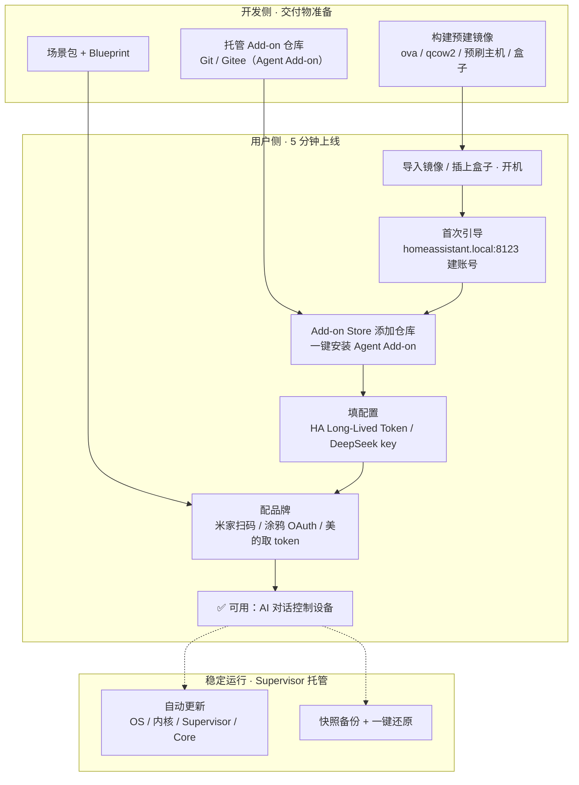

# HAOS 交付流程图：预建镜像 → 开机引导 → Add-on 装 Agent → 配品牌

> 面向**完全非技术用户**的 HAOS「家电式」交付链路。开发侧准备三样东西（预建镜像 / Add-on 仓库 / 场景包），用户侧按流程开机 → 装 Agent → 配品牌即可用；后续由 Supervisor 保证稳定。细节见 [[基于 Home Assistant 的跨品牌 AI 智能家居一键部署系统]]。

## 交付流程总览



## 步骤拆解

| 步骤 | 用户动作 | 背后的开发侧准备 | 对应章节 |
|------|---------|-----------------|---------|
| ① 交付 | 导入 ova / 插上预刷盒子 | 构建预建镜像（UEFI 虚拟机 / 刷机） | [[03_一键部署install脚本与docker编排\|第 3 章 3.1-3.2]] |
| ② 开机引导 | 浏览器打开 `homeassistant.local:8123` 建账号 | 可走 onboarding API 自动化 | [[04_无头onboarding自动化\|第 4 章 4.1-4.2]] |
| ③ 装 Agent | Add-on Store 添加仓库 → 一键装 | 托管 Agent Add-on（config.json + Dockerfile + run.sh） | [[03_一键部署install脚本与docker编排\|第 3 章 3.3]] |
| ④ 填配置 | 填 HA token / DeepSeek key | `.env` 模板与配置注入 | [[06_AI智能体FastAPI与DeepSeek\|第 6 章]] |
| ⑤ 配品牌 | 米家扫码 / 涂鸦 OAuth / 美的取 token | 预置 custom_components（无 HACS） | [[05_跨品牌接入矩阵\|第 5 章]] |
| ⑥ 稳定运行 | 无感 | Supervisor 自动更新 + 快照 | [[08_产品化复制与时效性风险\|第 8 章]] |

## 5 分钟承诺的时间线

```text
0:00  导入镜像 / 插盒子开机
0:30  首次引导（onboarding 自动化 / 建账号）
1:30  Add-on Store 装 Agent + 填配置
3:00  配品牌（token 类可后台注入；OAuth 类扫码）
5:00  ✅ 说一句「把客厅灯调暗」→ 灯亮
```

> [!note] 5 分钟承诺的边界
> ①-④ 全后台 / 半后台，可进 5 分钟；⑤ 中 OAuth 类（官方米家、涂鸦扫码）依赖用户品牌账号授权，属于「必须人工」档，产品上承诺「被引导完成」而不是「无人值守」。⑥ 之后由自动更新 + 快照负责长期稳定，不改变承诺范围。

## 相关笔记

- [[基于 Home Assistant 的跨品牌 AI 智能家居一键部署系统]] - 完整实战构建指南（8 章）
- [[系统架构图]] - 四层架构 + 数据流时序图
- [[Home Assistant MOC]] - Home Assistant 目录
