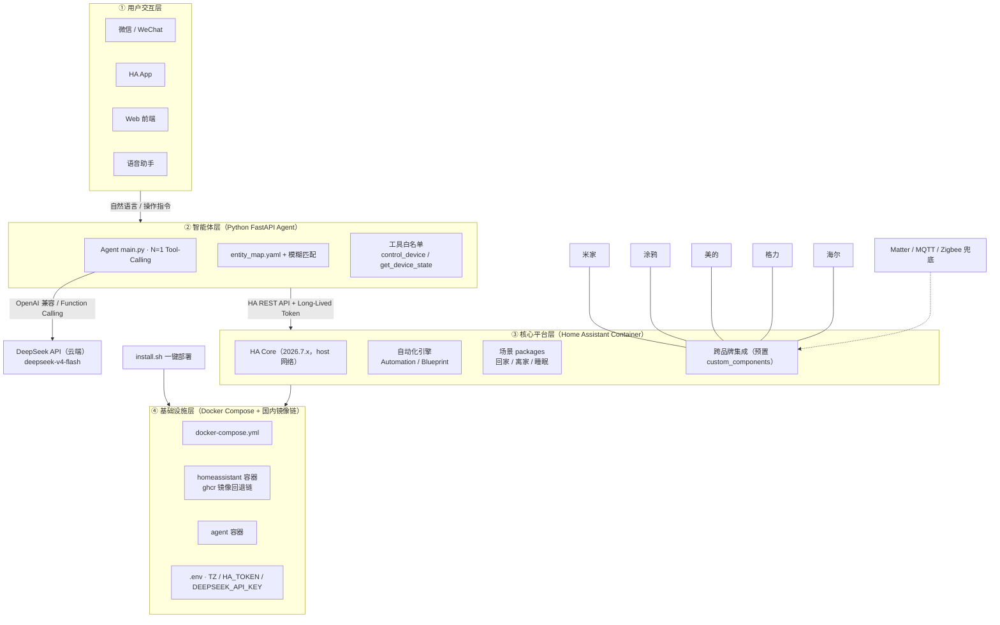
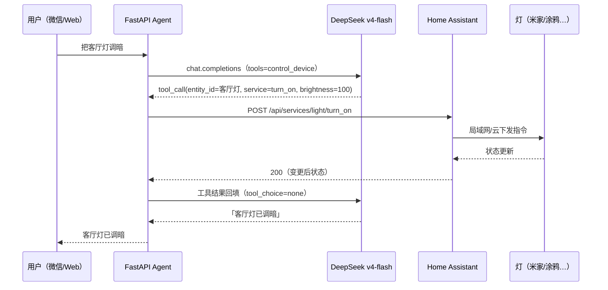

# 系统架构图：跨品牌 AI 智能家居一键部署系统

> 四层架构：**用户交互层 → 智能体层 → 核心平台层 → 基础设施层**，配合云端 LLM 与跨品牌设备接入。完整构建细节见 [[基于 Home Assistant 的跨品牌 AI 智能家居一键部署系统]]。

## 架构总览

## 数据流示例：「把客厅灯调暗」

## 分层说明

| 层 | 职责 | 关键组件 | 备注 |
|----|------|----------|------|
| ① 用户交互层 | 多入口触达 | 微信 / HA App / Web / 语音 | MVP 用微信 + Web，不做语音硬件 |
| ② 智能体层 | 自然语言 → 设备控制 | FastAPI + DeepSeek Function Calling、entity_map、工具白名单 | 单轮 N=1，不套 LangChain/编程 Agent |
| ③ 核心平台层 | 设备管控 + 自动化 | HA Core、Automation/Blueprint、场景 packages、跨品牌集成 | Container 官方路径，Supervised 已弃用 |
| ④ 基础设施层 | 编排与部署 | docker-compose、ghcr 回退链、.env | host 网络 + TZ=Asia/Shanghai |

## 相关笔记

- [[基于 Home Assistant 的跨品牌 AI 智能家居一键部署系统]] - 完整实战构建指南（8 章）
- [[Home Assistant 三种部署方式对比与选型]] - 部署方式选型结论
- [[Home Assistant MOC]] - Home Assistant 目录
