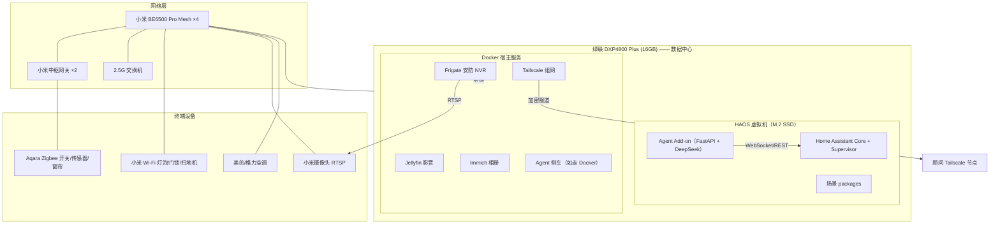

# 客户A · 部署架构与决策记录

> 对内文档：最终拓扑 + 关键决策（ADR 风格）。所有决策都记录「为什么」，避免半年后不知道为什么这么装。

## 1. 最终拓扑

## 2. 决策记录（ADR）

### ADR-001 · NAS 选型：绿联 DXP4800 Plus（16GB）

- **决策**：绿联 DXP4800 Plus，16GB 版，M.2 SSD 跑 HAOS VM，HDD 做存储。
- **理由**：
  - 必须能跑 **HAOS VM**（x86_64 + **UEFI** 是硬前提），UGOS Pro 虚拟机支持 UEFI，社区有 HAOS 教程
  - Pentium 8505 + Intel iGPU（QSV）：Jellyfin 转码、Frigate OpenVINO 检测都能硬件加速
  - 8→64GB 内存余量，四职责 + 虚拟机不打架；10GbE 网口
  - ~¥2.0k，主流性价比
- **被否决候选**：
  - **飞牛 fnOS**：HAOS VM 可行（Q35+UEFI），但厂商 2023 成立、无融资、2026.1–2 出过 0day+RCE、存储无 SHR、升级无回滚、社区「只适合爱折腾的人」→ 与小白+长期维护冲突
  - **极空间 Z4Pro 性能版**：最稳但 Docker 受限/封闭生态，Frigate/Tailscale/Agent 侧车部署受限
  - **群晖 DS923+**：无 iGPU，Jellyfin 转码废；Surveillance Station 强但我们走 Frigate
  - 群晖 DS423+（6GB 封顶）、威联通 TS-464（16GB 封顶 + USB 重插）排除
- **部署要点**：宿主 BIOS 开 VT-x；VM Q35+UEFI（建后不可改）；HAOS VM 放 M.2 SSD，别放机械盘。

### ADR-002 · HA 部署：HAOS VM on NAS（非 Container）

- **决策**：HAOS 虚拟机（全托管），不用 Docker Container。
- **理由**：Container 需要手动备份/反代/更新，与「全包+长期维护」承诺冲突；HAOS 有 Supervisor/Add-on/快照/OTA。Supervised 已弃用（2025.12）。见 [[Home Assistant 三种部署方式对比与选型]]。

### ADR-003 · Zigbee 网关：小米中枢网关（非 USB 协调器）

- **决策**：Zigbee/Thread 设备统一接入小米中枢网关，HA 经 `xiaomi_home` 集成接入。
- **理由**：HAOS VM 在 NAS 上，USB 直通受限且维护量大；中枢网关方案无 USB、全小米生态一致、离线本地可控。不走 ZHA/Z2M USB dongle。

### ADR-004 · 安防 NVR：Frigate（Docker） + 小米摄像头 RTSP

- **决策**：小米摄像头开 RTSP，Frigate 跑在 NAS Docker，录像存 NAS。
- **理由**：小米摄像头默认录 TF/米家云，要存 NAS 必须走 RTSP+Frigate；Frigate 是 HA 标准 NVR 方案，支持人形检测（OpenVINO on iGPU）。HA 内 `frigate` 集成出事件/抓拍。
- **注意**：确认摄像头型号支持 RTSP（小米大部分支持，需开启）。

### ADR-005 · 3D 户型图：Sweet Home 3D + 自研 Three.js 面板

- **决策**：3D 模型用 Sweet Home 3D 制作（导出 glTF/OBJ），HA 前端用自研 Three.js 面板 + WebSocket 实时状态。
- **理由**：HA 生态无成熟 3D 户型图插件；自研面板可控、可离线、可深度定制。本期交付技术方案 + 代码骨架，模型待客户户型图。
- **替代**：2D floorplan 卡片（成熟）作为兜底，若 3D 工期/预算受限先上 2D。

### ADR-006 · 语音：小爱音箱 + 明确分工（不硬接 HA）

- **决策**：小爱原生控小米设备；跨品牌/复杂指令走 AI Agent 对话。不做小爱→HA 硬桥接。
- **理由**：小爱无官方 HA 集成，社区桥接脆弱、依赖维护；分工后稳定可靠。HomePod+HomeKit 是唯一「语音直达 HA 全屋」的稳定路径但超预算，仅客户强烈要求时评估。

### ADR-007 · 智能体：复用自研 FastAPI+DeepSeek Agent

- **决策**：复用 [[基于 Home Assistant 的跨品牌 AI 智能家居一键部署系统]] 中已设计的 FastAPI+DeepSeek Agent（N=1 工具调用 + 白名单 + entity_map），HA App/Web 为前端。
- **理由**：架构与安全设计已验证（见笔记 ch6）；HA 原生 Assist+DeepSeek 白名单/安全可控性不足。DeepSeek `deepseek-v4-flash`，`tool_choice="auto"`，关 thinking。

## 3. 配置清单（客户无关，可提交）

| 资源 | 内容 |
|------|------|
| image-recipe | HAOS 镜像构建、预置 `custom_components`（xiaomi_home/tuya/localtuya/midea_ac_lan/gree） |
| agent-addon | Agent Add-on 仓库（config.json + Dockerfile + run.sh） |
| scene-packages | 离家/回家/睡眠 packages + Blueprint |
| 3d-panel | 3D 面板源码（前端面板 + WebSocket 客户端） |
| compose | Jellyfin / Frigate / Tailscale / Immich 编排（host 侧） |

> [!warning] 客户隔离
> 客户敏感信息（`.env`、`entity_map.yaml`、token、local_key、米家/DeepSeek 账号）一律 gitignore，只放 `customers/客户A/` 本地，绝不入库。三层分离：模板层（可共享）/客户层（密钥）/运行时层（Supervisor）。见笔记 ch8。

## 4. 风险清单（本期）

| 风险 | 等级 | 缓解 |
|------|------|------|
| UGOS 虚拟机 UEFI 建错 | 中 | runbook 明确 Q35+UEFI，建后不可改；先建后装 |
| `xiaomi_home` v0.4.7 与 HA 2026.8 兼容 | 中 | 部署时锁定版本，季度复查（ch8.4 #2） |
| 小米摄像头 RTSP 支持 | 中 | 采购前确认型号支持 RTSP |
| 客户暖通未确认 | 低 | 方案分叉，报价两档 |
| DeepSeek API 变更 | 低 | 模型名/参数季度复查（ch8.4 机制） |
