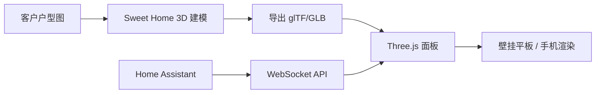

# 客户A · 3D 面板方案与代码骨架

> HA 生态**没有成熟 3D 户型图插件**，本方案自研：**Sweet Home 3D 建模 → glTF 导出 → Three.js 面板 + HA WebSocket 实时状态**。本期交付技术方案 + 可运行的代码骨架（静态页 + 模拟数据），模型待客户户型图。

## 1. 架构



- **模型静态**：户型几何（墙/地板/门窗/家具）一次性建模，导出为 GLB
- **状态动态**：设备状态走 HA WebSocket，实时驱动 3D 对象颜色/动画/显隐
- **纯前端**：面板是静态页面 + JS，无后端依赖，部署在 NAS 或作为 HA 面板资源

## 2. 目录结构

```text
3d-panel/
├── index.html          # 入口（本骨架）
├── js/
│   ├── main.js         # 场景初始化 + 渲染循环
│   ├── ha-ws.js        # HA WebSocket 客户端
│   ├── mock.js         # 模拟数据（无 HA 时可演示）
│   └── rooms.json      # 房间/设备绑定配置（替代正式模型阶段）
├── model/
│   └── home.glb        # Sweet Home 3D 导出的户型模型（待建模）
└── README.md
```

## 3. 代码骨架（可运行）

> 📦 **源码文件**：`3d-panel/index.html`（同目录，可独立运行）。无 HA 时用**模拟数据**演示：`index.html?mock=1`。接入 HA 后自动切 WebSocket 实时更新。以下为源码全文（与文件一致）：

```html
<!-- index.html -->
<!DOCTYPE html>
<html lang="zh-CN">
<head>
<meta charset="UTF-8">
<meta name="viewport" content="width=device-width, initial-scale=1.0">
<title>全屋 3D 户型图</title>
<style>
  html,body{margin:0;height:100%;overflow:hidden;background:#0f1115;color:#e6e6e6;font-family:system-ui,sans-serif;}
  #scene{width:100%;height:100%;}
  #legend{position:fixed;left:16px;top:16px;background:rgba(15,17,21,.85);padding:12px 16px;border-radius:10px;font-size:13px;z-index:10;}
  #legend b{display:block;margin-bottom:6px;}
  .dot{display:inline-block;width:10px;height:10px;border-radius:50%;margin-right:6px;}
  .on{background:#ffd54a;box-shadow:0 0 8px #ffd54a;}
  .off{background:#3a3f4a;}
  #status{position:fixed;right:16px;top:16px;font-size:12px;color:#888;z-index:10;}
  #roombar{position:fixed;bottom:16px;left:50%;transform:translateX(-50%);display:flex;gap:8px;z-index:10;}
  #roombar button{background:#1b1f29;color:#ccc;border:1px solid #333;border-radius:8px;padding:8px 14px;cursor:pointer;}
  #roombar button.active{background:#2b3;color:#061;border-color:#2b3;font-weight:700;}
</style>
</head>
<body>
<div id="legend"><b>全屋状态</b><span class="dot on"></span> 开 &nbsp;<span class="dot off"></span> 关</div>
<div id="status">未连接 HA · 模拟数据</div>
<div id="roombar"></div>
<div id="scene"></div>

<script type="importmap">
{ "imports": {
    "three": "https://unpkg.com/three@0.160.0/build/three.module.js",
    "three/addons/": "https://unpkg.com/three@0.160.0/examples/jsm/"
}}
</script>
<script type="module">
import * as THREE from 'three';
import { OrbitControls } from 'three/addons/controls/OrbitControls.js';
import { GLTFLoader } from 'three/addons/loaders/GLTFLoader.js';

// ---------- 配置：房间 + 设备绑定 ----------
// 正式阶段：换成 Sweet Home 3D 导出的 GLB + 用 HA 实体映射到模型节点
const ROOMS = [
  { id:'living', name:'客厅', center:[-4,0,0], size:[4.5,0.1,3.5], color:0x2b3b52,
    devices:[ {id:'light.living_room_ceiling', type:'light', pos:[-4,0.55,0]},
              {id:'cover.living_room_curtain_l', type:'cover', pos:[-2,0.3,-1.7]},
              {id:'climate.living_room_ac', type:'climate', pos:[-6,0.35,1.5]} ] },
  { id:'master', name:'主卧', center:[3.5,0,0], size:[4,0.1,3], color:0x4a3a52,
    devices:[ {id:'light.master_bed_bedside_l', type:'light', pos:[3.5,0.5,1.4]},
              {id:'cover.master_bed_curtain_l', type:'cover', pos:[3.5,0.3,-1.5]} ] },
  { id:'entry',  name:'玄关', center:[0,0,3.2], size:[2.5,0.1,1.8], color:0x3a4a3a,
    devices:[ {id:'light.entry_ceiling', type:'light', pos:[0,0.5,3.2]},
              {id:'lock.entry_main', type:'lock', pos:[1.1,0.3,4.1]} ] }
];

// ---------- Mock 数据（无 HA 演示） ----------
const mock = {
  'light.living_room_ceiling': 'on', 'light.master_bed_bedside_l': 'on', 'light.entry_ceiling': 'on',
  'cover.living_room_curtain_l': 'open', 'cover.master_bed_curtain_l': 'closed',
  'climate.living_room_ac': 'on', 'lock.entry_main': 'locked'
};

// ---------- 场景 ----------
const scene = new THREE.Scene();
scene.background = new THREE.Color(0x0f1115);
const camera = new THREE.PerspectiveCamera(50, innerWidth/innerHeight, 0.1, 100);
camera.position.set(0, 8, 10);
const renderer = new THREE.WebGLRenderer({ antialias:true });
renderer.setSize(innerWidth, innerHeight);
renderer.shadowMap.enabled = true;
document.getElementById('scene').appendChild(renderer.domElement);

new THREE.HemisphereLight(0xffffff, 0x223344, 1.0);
const dir = new THREE.DirectionalLight(0xffffff, 1.2); dir.position.set(5,10,5); scene.add(dir);
scene.add(new THREE.AmbientLight(0xffffff, 0.4));

const controls = new OrbitControls(camera, renderer.domElement);
controls.target.set(0,0,0);

// 地面网格
const grid = new THREE.GridHelper(20, 20, 0x333b48, 0x232833); grid.position.y = -0.05; scene.add(grid);

// 房间 + 设备对象表
const deviceMeshes = {};
function makeRoom(r){
  const geo = new THREE.BoxGeometry(r.size[0], r.size[1], r.size[2]);
  const mesh = new THREE.Mesh(geo, new THREE.MeshStandardMaterial({ color:r.color, transparent:true, opacity:0.55 }));
  mesh.position.set(r.center[0], r.center[1], r.center[2]); scene.add(mesh);
  r.devices.forEach(d => {
    const g = d.type==='light' ? new THREE.SphereGeometry(0.22, 16, 16)
         : d.type==='cover' ? new THREE.BoxGeometry(1.6, 0.06, 0.08)
         : new THREE.BoxGeometry(0.4, 0.5, 0.2);
    const m = new THREE.Mesh(g, new THREE.MeshStandardMaterial({ color:0x3a3f4a, emissive:0x000000 }));
    m.position.set(d.pos[0], d.pos[1], d.pos[2]); scene.add(m);
    deviceMeshes[d.id] = { mesh:m, device:d };
  });
}
ROOMS.forEach(makeRoom);

// ---------- 状态驱动 ----------
function applyState(entityId, state){
  const e = deviceMeshes[entityId]; if(!e) return;
  const isOn = state === 'on' || state === 'open' || state === 'locked';
  if (e.device.type === 'light'){
    e.mesh.material.emissive.setHex(isOn ? 0xffd54a : 0x000000);
    if (isOn){ e.mesh.material.color.setHex(0xffd54a); }
  } else if (e.device.type === 'cover'){
    e.mesh.rotation.z = state==='open' ? 0 : Math.PI/2;
  } else if (e.device.type === 'climate'){
    e.mesh.material.emissive.setHex(isOn ? 0x4fc3f7 : 0x000000);
  } else if (e.device.type === 'lock'){
    e.mesh.material.emissive.setHex(state==='unlocked' ? 0xff6f3a : 0x2e7d32);
  }
}

// ---------- 房间栏 ----------
const bar = document.getElementById('roombar');
ROOMS.forEach(r => {
  const b = document.createElement('button'); b.textContent = r.name;
  b.onclick = () => { controls.target.set(r.center[0], 0, r.center[2]); };
  bar.appendChild(b);
});

// ---------- HA WebSocket 客户端 ----------
function connectHA(token){
  const scheme = location.protocol === 'https:' ? 'wss' : 'ws';
  const ws = new WebSocket(`${scheme}://${location.hostname}:8123/api/websocket`);
  ws.onopen = () => ws.send(JSON.stringify({ type:'auth', access_token:token }));
  ws.onmessage = ev => {
    const msg = JSON.parse(ev.data);
    if (msg.type === 'auth_ok'){
      document.getElementById('status').textContent = '已连接 HA';
      // 订阅所有状态变化
      ws.send(JSON.stringify({ id:1, type:'subscribe_events', event_type:'state_changed' }));
      // 拉取全量状态
      ws.send(JSON.stringify({ id:2, type:'get_states' }));
    } else if (msg.id === 2){
      msg.result.forEach(s => applyState(s.entity_id, s.state));
    } else if (msg.type === 'event'){
      const e = msg.event.data;
      applyState(e.entity_id, e.new_state.state);
    }
  };
  ws.onerror = () => document.getElementById('status').textContent = 'HA 连接失败（请确认地址/令牌）';
  ws.onclose = () => document.getElementById('status').textContent = '连接已断开';
}

// ---------- Mock 模式 ----------
if (new URLSearchParams(location.search).get('mock') !== null){
  Object.entries(mock).forEach(([id,state]) => applyState(id, state));
  document.getElementById('status').textContent = '模拟数据模式';
} else {
  const token = localStorage.getItem('ha_token') || prompt('输入 HA 长生命周期令牌：');
  if (token){ localStorage.setItem('ha_token', token); connectHA(token); }
}

// ---------- 渲染循环 ----------
(function animate(){
  requestAnimationFrame(animate);
  controls.update();
  renderer.render(scene, camera);
})();
window.addEventListener('resize', () => {
  camera.aspect = innerWidth/innerHeight; camera.updateProjectionMatrix();
  renderer.setSize(innerWidth, innerHeight);
});
</script>
</body>
</html>
```

## 4. 接入步骤

> ⚠️ **国内网络注意**：骨架从 unpkg.com 加载 Three.js，国内可能慢或不通。上线时改成国内镜像（如 `registry.npmmirror.com`）或把 three.module.js / addons 下载到本地 `vendor/` 同源引用。

1. **跑骨架**：把 `index.html` 放任一静态服务器（NAS 上 nginx/python，或本地打开），`?mock=1` 看模拟效果
2. **连 HA**：浏览器访问，输入 HA 长生命周期令牌（存入 localStorage），WebSocket 自动订阅全屋状态
3. **建模型**：户型图到手 → Sweet Home 3D 建模 → 导出 GLB → 用 `GLTFLoader` 替换 `makeRoom` 的房间盒
4. **绑定实体**：在 GLB 中给每个设备加命名节点（如 `light_living_room`），`applyState` 改为按节点名匹配实体
5. **上平板**：壁挂平板用 Fully Kiosk Browser（安卓）打开页面，全屏 + 常亮；令牌用 URL 参数或本地存储，避免暴露

## 5. 部署到 HA 的两种方式

| 方式 | 做法 | 适用 |
|------|------|------|
| **A. 独立页面（推荐 v1）** | 静态页跑在 NAS 一个小容器（nginx），平板 kiosk 直接开 | 最快落地，平板专用 |
| **B. HA 自定义面板** | `configuration.yaml` 里 `panel_custom` + 前端资源，登录态复用 | 更原生，无需单独令牌；维护成本高一点 |

> ⚠️ 令牌安全：令牌只存平板本地 / localStorage，页面勿外链；换平板时重发令牌。摄像头画面走 HA 内嵌（如有），不外链 RTSP 明文。

## 6. 建模流程（Sweet Home 3D）

1. 导入户型图图片（客户提供）为背景底图，按比例缩放
2. 画墙、门窗、家具（内置库足够）
3. 命名每个房间与设备占位（对应实体命名）
4. 导出 → 3D 视图 → 导出为 **OBJ 或 GLB**（Sweet Home 3D 需插件/Blender 转 GLB）
5. Blender 清理 + 按节点命名 → 导出 GLB → 交给面板

> 若客户要 2D 兜底：用 HACS 的 **floorplan** 卡片（SVG 户型图），成熟稳定，作为 3D 未交付前的过渡。

## 7. 交付验收

- [ ] 3D 页面在壁挂平板全屏运行，无 HA 令牌也走 mock 可演示
- [ ] 连 HA 后房间灯/窗帘/空调/门锁状态实时联动（≤1s）
- [ ] 点击房间相机聚焦，拖动/缩放流畅
- [ ] 夜间模式 / 布防状态在 3D 上有可视化反馈（本期骨架已含状态驱动，动画增强二期）
