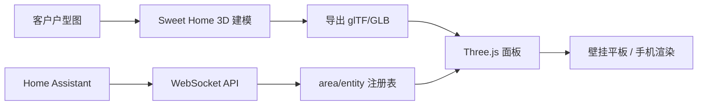

# 客户A · 3D 面板方案与代码骨架

> HA 生态**没有成熟 3D 户型图插件**，本方案自研：**Sweet Home 3D 建模 → glTF 导出 → Three.js 面板 + HA WebSocket 实时状态**。本期交付技术方案 + 可运行的代码骨架（静态页 + 模拟数据），模型待客户户型图。

> [!summary] 本版核心结论（2026-08-08 更新）
> 1. **界面分层**：3D 户型图定位「总览亮点页」，不是日常操作主力——日常控制靠 Dashboard 卡片，「使用/统计」看 HA 能耗仪表盘。
> 2. **可复用策略**：引擎层（代码）100% 复用、模型层每户天然定制、绑定层数据化。**设备绑定从「手写 ROOMS 数组」改为「HA 区域注册表驱动自动绑定」**，这是让多客户复制成立的关键。
> 3. **小白友好**：部署期一次性配置 → 日常全自动 → 加设备走 3 步图形向导（中期），全程不碰配置文件。
> 4. **客户分级**：标配「Dashboard + 2D floorplan」，旗舰客户（客户 A）叠加 3D 亮点。

## 1. 架构



- **模型静态**：户型几何（墙/地板/门窗/家具）一次性建模，导出为 GLB
- **状态动态**：设备状态走 HA WebSocket，实时驱动 3D 对象颜色/动画/显隐
- **绑定自动**：房间节点按 **area_id** 命名，设备归属从 HA 注册表解析，新增设备自动入房
- **纯前端**：面板是静态页面 + JS，无后端依赖，部署在 NAS 或作为 HA 面板资源

## 2. 目录结构

```text
3d-panel/
├── index.html          # 入口（面板引擎：场景 + 状态驱动 + 区域驱动自动绑定）
├── js/
│   ├── main.js         # 场景初始化 + 渲染循环
│   ├── ha-ws.js        # HA WebSocket 客户端（含注册表拉取）
│   ├── mock.js         # 模拟数据（无 HA 时可演示）
│   └── rooms.json      # 房间几何配置（兜底，不再是设备绑定真相源）
├── model/
│   └── home.glb        # Sweet Home 3D 导出的户型模型（待建模）
└── README.md
```

> 设备绑定真相源从 `rooms.json` 移到 **HA 自身注册表**，`rooms.json` 只保留房间几何 + mock 兜底。

## 3. 代码骨架（可运行）

> 📦 **源码文件**：`3d-panel/index.html`（同目录，可独立运行）。无 HA 时用**模拟数据**演示：`index.html?mock=1`。接入 HA 后自动切 WebSocket 实时更新。以下只摘录新增的**区域驱动数据层**关键片段，完整源码以文件为准。

### 3.1 设备域映射（可复用，所有客户共享）

设备类型 → 几何 + 颜色 + 悬挂高度，一张表决定"长什么样"，新增域只需加一行：

```js
const DOMAIN_META = {
  light:         { kind:'sphere', size:null,      y:0.55, on:0xffd54a },
  cover:         { kind:'cover',  size:[1.6,0.06,0.08], y:0.3,  on:0x9ccc65 },
  climate:       { kind:'cube',   size:[0.4,0.5,0.2],   y:0.35, on:0x4fc3f7 },
  lock:          { kind:'cube',   size:[0.4,0.5,0.2],   y:0.3,  on:0x2e7d32 },
  fan:           { kind:'cube',   size:[0.35,0.12,0.35],y:0.55, on:0x80cbc4 },
  media_player:  { kind:'cube',   size:[0.7,0.25,0.12],  y:0.45, on:0xce93d8 },
  sensor:        { kind:'cube',   size:[0.1,0.1,0.1],    y:0.35, on:0x90a4ae },
  // ... 默认 unknown 域落到 DEFAULT_META 灰方块
};
```

### 3.2 区域驱动自动绑定（核心改造）

连接 HA 后依次拉取 `area_registry/list` → `device_registry/list` → `entity_registry/list`，按设备归属建场景：

```js
function resolveEntityArea(ent){
  // 事实源：entity.area_id，若为空回退到其所属 device 的 area_id
  if (ent.area_id) return ent.area_id;
  if (ent.device_id && deviceAreaMap[ent.device_id]) return deviceAreaMap[ent.device_id];
  return null;
}

function buildFromHA(areas, entities, deviceAreaMap){
  const entityArea = {};
  const unassigned = [];
  entities.forEach(ent => {
    const aid = resolveEntityArea(ent);
    entityArea[ent.entity_id] = aid;
    if (!aid) unassigned.push(ent);          // 没划房间的 → 提示"新设备"
  });
  const byArea = {};
  entities.forEach(ent => {
    const aid = entityArea[ent.entity_id];
    if (aid) (byArea[aid] = byArea[aid] || []).push(ent);
  });

  const rooms = [];
  ROOMS.forEach(r => {                        // 优先复用配置几何
    const list = byArea[r.area_id] || [];
    rooms.push({ ...r, devices: list.map(ent => ({ entity_id:ent.entity_id, type:domainOf(ent) })) });
  });
  areas.forEach(a => {                        // 其余 HA 区域自动网格布局
    const list = byArea[a.area_id] || [];
    if (rooms.some(r => r.area_id === a.area_id) || !list.length) return;
    rooms.push({ id:a.area_id, area_id:a.area_id, name:a.name, center:/*网格坐标*/,
                 devices: list.map(ent => ({ entity_id:ent.entity_id, type:domainOf(ent) })) });
  });

  rooms.forEach(r => arrangeDevices(r, r.devices));   // 房间内默认网格位置
  clearScene();
  rooms.forEach(makeRoom);
  buildRoombar(rooms);
  // 未分配设备 → 显示"发现 N 个新设备"横幅
}
```

要点：

- **房间节点 = HA 的 area_id**。`rooms.json` 里 `area_id` 与 HA 区域 id 对齐；其余区域自动生成房间盒。
- **新增设备零代码**：品牌 App 配对 → HA 出现实体 → 划到区域 → 面板自动显示。
- **默认位置**：按房间长宽比排网格，灯挂高、窗帘靠墙、门锁近门，先保证"能看能用"，精细摆位后拖拽调整（中期）。

## 4. 复用与分层策略

沿用 [[homeassistant/ai-smart-home-system/08_产品化复制与时效性风险.md|产品化复制·三层分离]]，面板只是可视化层，复用边界不变：

| 层 | 内容 | 是否入库 | 改动频率 |
|----|------|----------|----------|
| 引擎层（模板） | Three.js 场景 / WS 客户端 / 状态驱动 / 域映射表 | 是，所有客户共享 | 产品升级时 |
| 客户层 | `home.glb` 户型模型 + `rooms.json` 几何（含 `area_id` 对齐） | 每户一份，不入库 | 每户部署时 |
| 运行时层 | HA 的 area/device/entity 注册表 | 否（HA 内部状态） | 客户日常加设备自动更新 |

**复制给下一个客户 = 建模型 + 对齐区域，代码零改动。** 这是对"每个客户都要定制很麻烦"的答案。

## 5. 用户添加设备（小白 3 步，中期）

小白永远不碰配置文件，流程收敛成：

```text
① 品牌 App 配对设备（用户本来就会）
   → HA 自动出现新实体
② 面板弹「发现 N 个未分配房间的新设备」→ 点开
   → 每个设备选个房间（下拉框：客厅 / 主卧 / ...）
③ 面板调用 config/entity_registry/update 把 area_id 写回 HA
   → 设备自动出现在 3D 对应房间（默认位置）
```

- 房间归属**存进 HA 自己**（entity_registry），不是浏览器 localStorage——换平板、换手机都同步。
- 位置微调（可选）：拖拽模式，覆盖存 HA helper / registry options；**部署时摆一次，日常用户不用管**。
- 当前骨架已完成 ①② 的"检测"，③ 的写回向导为中期迭代项（代码里已留 `newdevices` 横幅入口）。

## 6. 客户交付分级

| 客户级别 | 界面交付 | 成本 | 适用 |
|----------|----------|------|------|
| 标配 | Dashboard 卡片 + 2D floorplan 总览 | 低，HACS 成熟方案 | 大多数客户，快速交付 |
| 旗舰（客户 A） | 标配 + 3D 户型图亮点页 | 高，每户建模 1–2 周 | 预算够、要演示效果 |

> 3D 是"溢价功能"，不是每户都做；标配先用 2D 兜底（HACS floorplan 卡片，成熟稳定），3D 按需求升级。

## 7. 接入步骤

> ⚠️ **国内网络注意**：骨架从 unpkg.com 加载 Three.js，国内可能慢或不通。上线时改成国内镜像（如 `registry.npmmirror.com`）或把 three.module.js / addons 下载到本地 `vendor/` 同源引用。

1. **跑骨架**：把 `index.html` 放任一静态服务器（NAS 上 nginx/python，或本地打开），`?mock=1` 看模拟效果
2. **连 HA**：浏览器访问，输入 HA 长生命周期令牌（存入 localStorage），WebSocket 自动拉区域/实体并建场景
3. **对齐区域**：在 HA 设置里把设备划到对应区域（房间），面板自动归位；未分配设备顶部横幅提示
4. **建模型**：户型图到手 → Sweet Home 3D 建模 → 导出 GLB → 用 `GLTFLoader` 替换 `makeRoom` 的房间盒
5. **绑定实体**：在 GLB 中给每个房间/设备加命名节点（节点名 = area_id / entity_id），`applyState` 按节点名匹配
6. **上平板**：壁挂平板用 Fully Kiosk Browser（安卓）打开页面，全屏 + 常亮；令牌用 URL 参数或本地存储，避免暴露

## 8. 部署到 HA 的两种方式

| 方式 | 做法 | 适用 |
|------|------|------|
| **A. 独立页面（推荐 v1）** | 静态页跑在 NAS 一个小容器（nginx），平板 kiosk 直接开 | 最快落地，平板专用 |
| **B. HA 自定义面板** | `configuration.yaml` 里 `panel_custom` + 前端资源，登录态复用 | 更原生，无需单独令牌；维护成本高一点 |

> ⚠️ 令牌安全：令牌只存平板本地 / localStorage，页面勿外链；换平板时重发令牌。摄像头画面走 HA 内嵌（如有），不外链 RTSP 明文。

## 9. 建模流程（Sweet Home 3D）

1. 导入户型图图片（客户提供）为背景底图，按比例缩放
2. 画墙、门窗、家具（内置库足够）
3. **房间命名 = HA area_id**，设备占位命名 = 实体命名
4. 导出 → 3D 视图 → 导出为 **OBJ 或 GLB**（Sweet Home 3D 需插件/Blender 转 GLB）
5. Blender 清理 + 按节点命名 → 导出 GLB → 交给面板

> 若客户要 2D 兜底：用 HACS 的 **floorplan** 卡片（SVG 户型图），成熟稳定，作为 3D 未交付前的过渡。

## 10. 交付验收

- [ ] 3D 页面在壁挂平板全屏运行，无 HA 令牌也走 mock 可演示
- [ ] 连 HA 后按注册表自动建场景：区域/设备正确入房，房间栏可切换
- [ ] 房间灯/窗帘/空调/门锁状态实时联动（≤1s）
- [ ] 新增设备划到区域后，无需改面板代码即自动显示
- [ ] 未分配设备显示"发现新设备"横幅（中期升级为写回向导）
- [ ] 夜间模式 / 布防状态在 3D 上有可视化反馈（动画增强二期）
