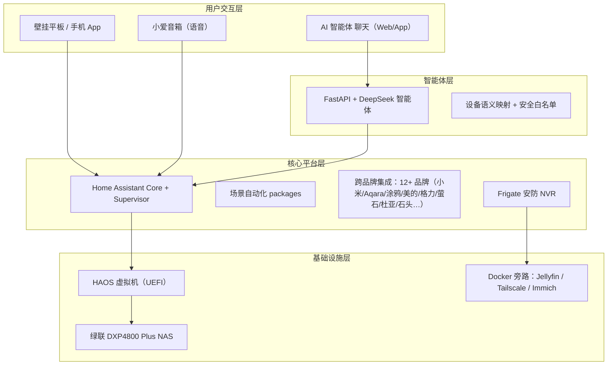

# 客户A · 智能家居方案总览

> **一句话卖点**：一台「数据中心 NAS」+ 一个 Home Assistant 平台，把全屋 **12+ 个品牌**（易来/Aqara/杜亚/德施曼/萤石/美的/格力/海尔/石头/涂鸦/飞利浦/小米）统一管理——一个 App、一句话语音、一个 AI 助手，全屋联动、出门放心。

> [!note] 样板房定位
> 本住宅兼作样板房：设备矩阵刻意**全面打散多品牌**，让访客现场体验「互不相识的品牌在一个平台协同工作」。这是本方案区别于「XX 全家桶」的核心卖点。

## 你的需求 → 方案

| 客户需求 | 方案落点 |
|---------|---------|
| ① 有 NAS 作为数据中心 | **绿联 DXP4800 Plus**：照片/文件备份 + 影音媒体库 + 安防录像 + 智能家居中枢，一机承载 |
| ② 用 Home Assistant + 国内源适配 + 小白可维护 | **Home Assistant OS 虚拟机**（跑在 NAS 内），国内镜像加速，装完即用、每月顾问远程维护 |
| ③ 常用设备智能化 + 品牌推荐 | 详见 [[02_设备清单|设备清单]]：**全面打散多品牌**——每品类不同品牌，12+ 品牌一个平台统一控制 |
| ④ 好看好用的界面 + 3D 户型图 | [[03_界面设计|界面设计]]：客厅壁挂平板 + 手机 App + **3D 可视化户型图**总览页 |
| ⑤ 智能体操控 + 智能音箱控制 | [[04_语音与智能体|语音与智能体]]：小爱音箱控制小米设备 + **AI 智能体**自然语言控制全屋 |
| ⑥ 常用自动化 | [[05_自动化清单|自动化清单]]：离家回家、安防联动、灯光感应、温控窗帘，共四大类 |

## 系统架构

## 交付范围（全包）

1. **设备采购**：NAS、网络、灯光、开关、窗帘、传感器、门锁、摄像头、音箱、壁挂平板等（见 [[02_设备清单|设备清单]]）
2. **设计与施工**：点位规划、设备安装、网络改造（小米 BE Mesh）、调试
3. **系统配置**：Home Assistant 部署、国内镜像适配、品牌接入、自动化编写、3D 户型图
4. **持续维护**：每月远程维护窗口 + 季度巡检 + 备份管理（见 [[06_维护与质保|维护与质保]]）

## 两档报价（初步估算）

> 价格为 2026-08 估算，采购前复核。不含：中央空调/地暖主机、大家电（如客户已有）、家具软装。

| 档位 | 覆盖 | 设备+施工+首年维护（估算） |
|------|------|--------------------------|
| **A 档 · 主流覆盖** | 全屋智能化 + 舒适层 + 安防 + 3D 户型图（多品牌完整展示） | **¥12–16 万** |
| **B 档 · 精简核心** | 客厅/主卧/入户重点房间 + 安防 + 基础自动化（多品牌不减） | **¥6–8 万** |

- 暖通情况确认后细化报价（中央空调需加 VRF 控制模块，费用另计）
- 户型图确认后输出精确点位与 3D 建模工时
- 设备清单与单价见 [[02_设备清单|设备清单]]

## 工期（预估）

| 阶段 | 时长 |
|------|------|
| 方案确认 + 采购 | 1–2 周 |
| 现场施工 + 网络改造 | 3–5 天 |
| 系统配置 + 设备接入 | 3–5 天 |
| 自动化 + 界面 + 3D 户型图 | 1–2 周 |
| 验收 + 培训 | 1 天 |

## 维护承诺

- 每月远程维护窗口（更新/检查/备份验证），按约定时间执行
- 快速响应：紧急故障优先处理
- 全部重要数据自动备份到 NAS 并异地同步一份
- 详见 [[06_维护与质保|维护与质保]]
