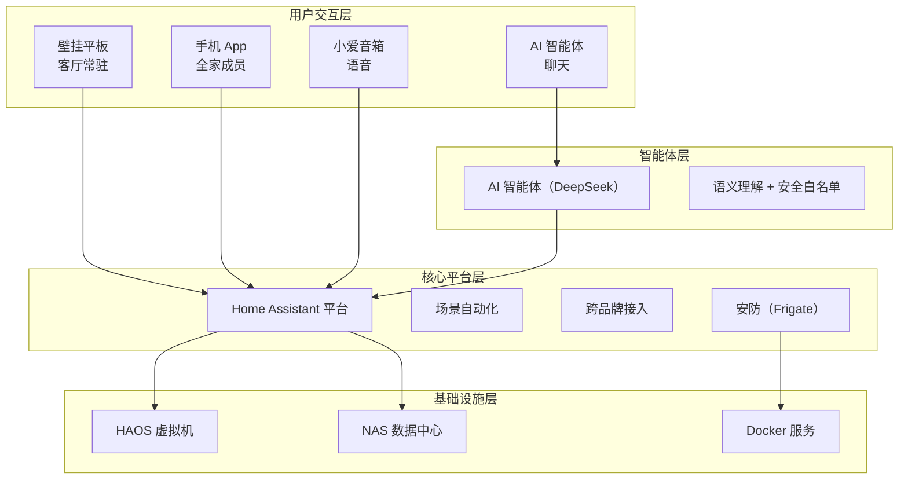
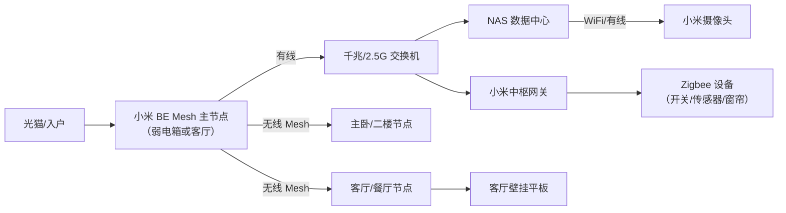

# 客户A · 系统架构

> 面向客户的中文说明：整套系统怎么分层、数据放哪、设备怎么连。技术细节见内部实施文档 [[../实施/00_部署架构|部署架构]]。

## 1. 分层架构

系统分四层，每层只管自己该管的事：

- **交互层**：你日常接触的一切——平板、手机、音箱、聊天
- **智能体层**：听懂「把客厅灯调暗」这种自然语言，翻译成设备动作
- **核心平台层**：Home Assistant，统一管理和调度所有品牌设备
- **基础设施层**：NAS 数据中心，承载平台和所有数据

## 2. NAS 数据中心（绿联 DXP4800 Plus）

一台 NAS 承担四件事，全部集中管理：

| 职责 | 说明 | 服务 |
|------|------|------|
| **智能家居中枢** | Home Assistant 跑在 NAS 内的虚拟机里，7×24 稳定运行 | HAOS VM |
| **照片/文件备份** | 全家手机相册自动备份、电脑文件同步 | 系统相册 + Immich |
| **影音媒体库** | 电影/电视剧/家庭录像统一管理，平板电视随时看 | Jellyfin |
| **安防录像** | 摄像头录像集中存储，本地存储不外传 | Frigate |

> [!tip] 为什么用 NAS 当数据中心
> 智能家居只是「数据中心」的一个职责。照片备份、影音库、安防录像和智能家居共用一台常开设备，省一台机器、统一管理、统一备份。

## 3. 网络拓扑

大平层/别墅全覆盖，采用小米 BE 系列 Mesh 组网：

- 网络改造纳入交付：Mesh 节点摆放、弱电箱整理、走线规划
- 中枢网关为 Zigbee 设备提供稳定网络，不受 Wi-Fi 拥塞影响

## 4. 设备接入方式

| 类型 | 接入方式 | 品牌示例 |
|------|---------|---------|
| Wi-Fi 设备 | 直连小米 Mesh，米家 App 绑定后接入平台 | 小米灯泡、扫地机、门锁 |
| Zigbee 设备 | 接入小米中枢网关，网关统一桥接 | Aqara 开关/传感器/窗帘 |
| 空调 | 通过局域网协议直接控制 | 美的、格力 |
| 摄像头 | RTSP 视频流接入安防系统，录像存 NAS | 小米摄像头 |

## 5. 一个典型操作的全流程

**说一句「把客厅灯调暗一点」**：

1. 你对着小爱音箱说，或用手机对 AI 智能体说
2. AI 智能体理解意图 → 找到「客厅灯」这台设备
3. 平台安全校验后执行「调暗到 60%」
4. 客厅灯变暗，整个过程 1–2 秒

> [!note] 跨品牌统一
> 不管是小米、Aqara 还是美的的电器，装好之后都在同一个界面里，不需要切换任何 App。
