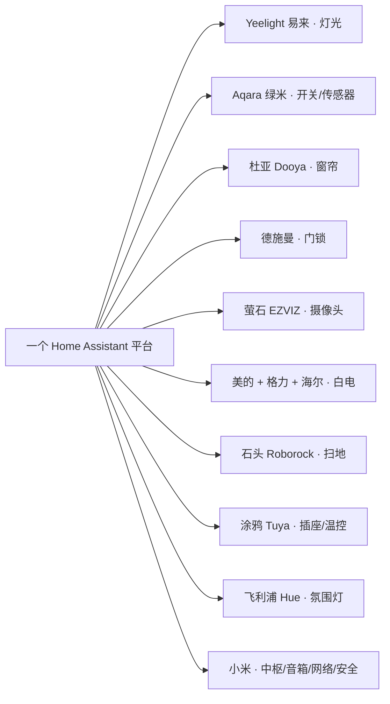

# 客户A · 设备清单与品牌推荐

> **本住宅兼作样板房**：设备刻意**全面打散多品牌**——每个品类用不同品牌，访客一眼看到「**全屋 12+ 个品牌，一个 App 全控制**」。这是本方案最大的卖点，也是区别于「XX 全家桶」的关键。

## 0. 品牌展示策略

> **一句话讲给访客**：灯是易来的、开关是绿米的、窗帘是杜亚的、门锁是德施曼的、摄像头是萤石的、空调是美的格力的、扫地是石头的、插座是涂鸦的——**它们互不相识，但在这个平台上协同工作。**

**档位说明**：
- **B 档 · 精简核心**：只做入户 + 客厅 + 主卧 + 安防，但**每个品类仍保留独立品牌**（多品牌展示不缩水，只缩点位）
- **A 档 · 主流覆盖**：全屋 + 舒适层 + 安防 + 3D 户型图（样板房完整展示）

> 价格为 **2026-08 估算**，采购前以当日报价复核。集成方式列的「接入说明」见内部文档 [[../实施/00_部署架构|部署架构]]。

---

## 1. 数据中心（绿联）※ 不参与品牌展示

| 设备 | 型号 | 数量 | 参考单价 | 小计 | 说明 |
|------|------|------|---------|------|------|
| NAS 主机 | 绿联 DXP4800 Plus（16GB） | 1 | 2,800 | 2,800 | 数据中心核心，跑 HAOS 虚拟机 + Docker |
| 硬盘 | 希捷酷狼 4TB ×3 | 3 | 600 | 1,800 | RAID 保护 |
| 系统盘 | M.2 NVMe SSD 1TB | 1 | 400 | 400 | HAOS 虚拟机专用 |
| 异地备份盘 | 移动硬盘 2TB | 1 | 350 | 350 | 每周异地备份 |

## 2. 网络（小米）※ 基础层，不参与品牌展示

| 设备 | 型号 | A档 | B档 | 单价 | 说明 |
|------|------|-----|-----|------|------|
| Mesh 路由器 | 小米 BE6500 Pro | 4 | 2 | 550 | 全屋覆盖 |
| 交换机 | 2.5G 8 口 | 1 | 1 | 400 | 有线接入 |
| 布线 | 网线/面板/弱电整理 | 1套 | 1套 | 500 | 现场施工 |

## 3. 中枢与语音（小米）※ 架构核心

| 设备 | 型号 | A档 | B档 | 单价 | 说明 |
|------|------|-----|-----|------|------|
| Zigbee 网关 | 小米中枢网关 | 2 | 1 | 400 | 绿米/杜亚 Zigbee 设备统一接入 |
| 智能音箱 | 小爱音箱 Pro | 3 | 1 | 300 | 语音控制（仅小爱，见 [[04_语音与智能体|语音与智能体]]） |

## 4. 灯光 —— **Yeelight 易来**（独立品牌）

| 设备 | 型号 | A档 | B档 | 单价 | 说明 |
|------|------|-----|-----|------|------|
| 智能灯泡 | Yeelight 智能灯泡 E27 | 40 | 12 | 50 | 可调光调色 |
| 筒灯 | Yeelight 智能筒灯 | 20 | 6 | 50 | 客餐厅/主卧 |
| 灯带 | Yeelight 智能灯带 | 3 | 1 | 150 | 电视墙/床头 |

> **展示点**：易来是独立品牌（有自己的 App），通过局域网协议接入平台——证明「非小米品牌的灯一样能控」。

## 5. 氛围灯 —— **飞利浦 Hue**（国际品牌，可选亮点）

| 设备 | 型号 | A档 | B档 | 单价 | 说明 |
|------|------|-----|-----|------|------|
| 灯带/灯泡 | Philips Hue + Hue Bridge | 1套 | 0 | 1,500 | 国际品牌，Hue Bridge 桥接接入 |

> **展示点**：飞利浦（国际大牌）生态也能接入，一句话「客厅灯带调成氛围色」即可。

## 6. 开关 —— **Aqara 绿米**（Zigbee → 中枢网关）

| 设备 | 型号 | A档 | B档 | 单价 | 说明 |
|------|------|-----|-----|------|------|
| 智能墙壁开关 | Aqara 零火/单火 | 30 | 10 | 150 | 保留物理按键 + 语音/App/自动化 |

> **展示点**：绿米 Aqara 是专业智能家居品牌，Zigbee 协议经中枢网关接入，离线也能本地执行。

## 7. 窗帘 —— **杜亚 Dooya**（涂鸦生态）

| 设备 | 型号 | A档 | B档 | 单价 | 说明 |
|------|------|-----|-----|------|------|
| 智能窗帘电机 | 杜亚 智能窗帘电机 + 轨道 | 12 | 4 | 550 | 客厅/卧室/阳台 |

> **展示点**：杜亚是国内主流窗帘电机品牌，走涂鸦协议接入——「窗帘龙头品牌也兼容」。

## 8. 门锁 —— **德施曼 DESSMANN**（米家版）

| 设备 | 型号 | A档 | B档 | 单价 | 说明 |
|------|------|-----|-----|------|------|
| 智能门锁 | 德施曼 Q5M Pro（米家版） | 1 | 1 | 2,000 | 指纹/密码/手机开锁，触发回家模式 |

> **展示点**：专业锁品牌德施曼（而非小米门锁），证明「专业安防锁品牌也能接入全屋联动」。

## 9. 安防摄像头 —— **萤石 EZVIZ**（海康威视系）

| 设备 | 型号 | A档 | B档 | 单价 | 说明 |
|------|------|-----|-----|------|------|
| 室外摄像机 | 萤石 C8W 4MP | 6 | 4 | 350 | 门口/院子/车库，RTSP → Frigate 录像存 NAS |
| 室内摄像机 | 萤石 C6 2K 云台 | 2 | 1 | 200 | 客厅/儿童房 |
| 可视门铃 | 萤石 可视门铃（可选） | 1 | 0 | 500 | 门口可视化 + 安防联动 |

> **展示点**：萤石是海康威视旗下专业安防品牌——「专业监控系统也能接入一个平台，录像存本地 NAS」。

## 10. 空调 —— **美的 + 格力**（白电双品牌）

| 设备 | 型号 | A档 | B档 | 单价 | 说明 |
|------|------|-----|-----|------|------|
| 空调（美的） | 美的 新一级 1.5匹 | 2–3 | 1 | 3,000 | 局域网协议直控（midea_ac_lan） |
| 空调（格力） | 格力 新一级 1.5匹 | 1–2 | 0 | 3,500 | 局域网协议直控（gree） |
| VRF 网关（如中央空调） | 小超人/KOOLOX | 1套 | 0 | 1,500–3,000 | 中央空调接入 |

> **展示点**：白电双品牌（美的 + 格力）同时接入——「不用为了智能放弃喜欢的空调品牌」。

## 11. 海尔白电（进阶展示，可选）

| 设备 | 型号 | A档 | B档 | 单价 | 说明 |
|------|------|-----|-----|------|------|
| 冰箱/洗衣机 | 海尔 智慧系列（如新购） | 1–2 | 0 | 4,000–8,000 | hon 云接入，展示「白电三巨头都能接」 |

> ⚠️ 海尔云 API 相对脆弱，作为进阶展示项，不作为核心依赖。

## 12. 扫地机 —— **石头 Roborock**（独立品牌）

| 设备 | 型号 | A档 | B档 | 单价 | 说明 |
|------|------|-----|-----|------|------|
| 扫地机器人 | 石头 P10 Pro | 1 | 1 | 2,800 | 离家模式自动清扫 |

> **展示点**：石头是从小米孵化的独立品牌——「连石头这种生态链品牌也能单独接入」。

## 13. 传感器 —— **Aqara + 涂鸦**（双协议展示）

| 设备 | 型号 | A档 | B档 | 单价 | 说明 |
|------|------|-----|-----|------|------|
| 人体存在传感器 | Aqara FP2 / FP1E | 6 + 2 | 2 + 1 | 80 / 380 | 人到灯亮、人走灯灭 |
| 门窗传感器 | Aqara 门窗磁 | 12 | 6 | 60 | 开窗/开门状态、安防触发 |
| 温湿度计 | 涂鸦 温湿度计 | 8 | 4 | 40 | 联动空调/加湿 |

## 14. 智能插座 —— **涂鸦 Tuya**

| 设备 | 型号 | A档 | B档 | 单价 | 说明 |
|------|------|-----|-----|------|------|
| 智能插座/排插 | 公牛/欧瑞博 Tuya 版 | 8 | 4 | 60 | 台灯/饮水机/风扇智能化 |

> **展示点**：涂鸦是最大的第三方 IoT 平台，公牛排插等「杂牌也智能」——覆盖面最广的兼容能力。

## 15. 安全 —— 米家（稳定优先）

| 设备 | 型号 | A档 | B档 | 单价 | 说明 |
|------|------|-----|-----|------|------|
| 烟雾报警器 | 米家烟雾报警器 | 2 | 2 | 100 | 厨房/客厅 |
| 燃气报警器 | 米家燃气报警器 | 1 | 1 | 150 | 厨房 |
| 水浸传感器 | 米家水浸卫士 | 4 | 2 | 50 | 阳台/卫生间/厨房 |

## 16. 中控界面（小米平板）

| 设备 | 型号 | A档 | B档 | 单价 | 说明 |
|------|------|-----|-----|------|------|
| 壁挂平板 | 小米平板 6 + 壁挂支架 | 1 | 1 | 1,700 | 客厅常驻 Dashboard + 3D 户型图 |

## 17. 生活电器（可选）

| 设备 | 型号 | A档 | B档 | 单价 | 说明 |
|------|------|-----|-----|------|------|
| 电动晾衣架 | 好太太 智能晾衣架（涂鸦版） | 1 | 0 | 800 | 再添一个「国民品牌」接入点 |
| 加湿/净化器 | 米家空气净化器 | 1–2 | 1 | 800 | 联动空气传感器 |

---

## 品牌矩阵速览（12+ 品牌）

| 生态/品牌 | 覆盖品类 | 接入方式 |
|-----------|---------|---------|
| **小米** | 中枢网关 / 音箱 / Mesh / 烟雾燃气 / 水浸 / 平板 | xiaomi_home + Wi-Fi |
| **Yeelight 易来** | 灯泡 / 筒灯 / 灯带 | 官方 `yeelight`（LAN） |
| **飞利浦 Hue** | 氛围灯（可选） | Hue Bridge + `hue` 集成 |
| **Aqara 绿米** | 开关 / 人体 / 门窗磁 | Zigbee → 中枢网关 → xiaomi_home |
| **杜亚 Dooya** | 窗帘电机 | 涂鸦（localtuya） |
| **德施曼** | 门锁 | 米家版 → xiaomi_home |
| **萤石 EZVIZ** | 摄像头 / 门铃 | RTSP/ONVIF → Frigate |
| **美的** | 空调 | `midea_ac_lan`（LAN） |
| **格力** | 空调 | `gree`（LAN） |
| **海尔** | 白电（可选） | `hon-revived` |
| **石头 Roborock** | 扫地机 | `roborock` 集成 |
| **涂鸦 Tuya** | 温湿度 / 插座 / 晾衣架 | `tuya` + `localtuya` |

## 两档预算汇总

| 项目 | B 档 · 精简核心 | A 档 · 主流覆盖 |
|------|----------------|----------------|
| 数据中心（NAS） | 5,350 | 5,350 |
| 网络 | 1,500 | 3,100 |
| 中枢 + 语音 | 700 | 1,700 |
| 灯光 Yeelight | 750 | 2,450 |
| 氛围 Hue | — | 1,500 |
| 开关 Aqara | 1,500 | 4,500 |
| 窗帘 杜亚 | 2,200 | 6,600 |
| 门锁 德施曼 | 2,000 | 2,000 |
| 摄像头 萤石 | 1,600 | 3,000 |
| 空调 美的/格力 | 3,000 | 9,000–15,000 |
| 海尔（可选） | — | +4,000–8,000 |
| 扫地 石头 | 2,800 | 2,800 |
| 传感器 Aqara+涂鸦 | 1,000 | 2,600 |
| 插座 涂鸦 | 240 | 480 |
| 安全 米家 | 450 | 550 |
| 中控平板 | 1,700 | 1,700 |
| 生活电器 | 800 | 1,600 |
| **设备小计（估算）** | **≈ ¥25k** | **≈ ¥40–55k** |
| **全包参考价（含施工+3D+首年维护）** | **¥6–8 万** | **¥12–16 万** |

> [!warning] 预算说明
> 以上为初步估算。样板房场景可申请开发商/品牌方**样机支持或陈列补贴**（展示多品牌对厂商是免费广告）。最终报价在户型图与暖通确认后精确化。

## 采购说明

- 样板房展示用途，建议优先走**品牌样机/陈列合作**，降低硬件成本
- 空调/冰箱等大家电若客户已有，用协议接入，不重复购买
- 质保：设备厂家质保 + 施工质保，详见 [[06_维护与质保|维护与质保]]
